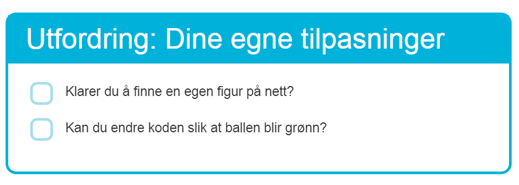
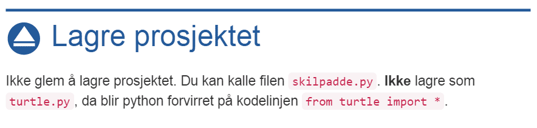

[](https://travis-ci.org/kodeklubben/oppgaver)
# Kodeklubbens oppgavesett

Her finnes kilden til kodeklubbens oppgaver. Oppgavene er skrevet i formatet
markdown, og det er en [bygger](https://github.com/arve0/codeclub_lesson_builder) som konverterer
oppgavene til [websider](http://kodeklubben.github.io/). For å komme i gang,
følg [anvisningene under](#komme-i-gang).

## Fiks og rapporter enkle feil
[](http://youtu.be/v9CS62-MED4)

For småfeil og ideer kan du bruke webgrensesnittet til github. Da slipper du
installasjon av programvare på din egen maskin. [Videoen over](http://youtu.be/v9CS62-MED4)
demonstrerer hvordan dette gjøres.

Dersom du ønsker å oversette eller lage nye oppgaver anbefaler vi at leser videre
for et oppsett som laster ned oppgavene til din egen maskin slik at du kan jobbe
lokalt. (Det er ikke noe galt i å kun bruke githubs websider, men det er litt
vanskeligere å få alt riktig når man selv ikke ser resultatet.)

## Komme i gang
[](http://youtu.be/GtXxBGsAXOs)

Enkleste vei for å komme i gang er å [se videoen](http://youtu.be/GtXxBGsAXOs)
som forklarer hvordan man setter opp og arbeider med oppgavene. Videoen er laget
for windows-brukere, men det vil være tilsvarende for Linux og Mac-brukere.
Dersom du er en *tekst-type* og foretrekker terminalen, les videre.

For å bygge oppgavene lokalt trenger du [git](//help.github.com/articles/set-up-git/)
og [node](//nodejs.org) (>=4.0). Når du har installert git og node, kan du følge
anvisningene under. Anvisningene er kommandoer som må skrives inn i en konsoll.

#### Ubuntu-brukere merk dette!
For å installere node trenger man både *nodejs-legacy* og *npm*:

```sh
sudo apt-get install nodejs-legacy npm git
```

#### Laste ned oppgavene
```
git clone --recursive https://github.com/kodeklubben/oppgaver
cd oppgaver
```
*Du kan også laste ned oppgavene med [github for windows](//windows.github.com)
eller [github for mac](//mac.github.com).*  

#### Sette opp
```
./setup
```

#### Start
```
./gulp
```
Dette steget vil bygge websider av oppgavene og åpne de i nettleseren din. Hver
gang en oppgave endres bygges websidene om igjen og nettleseren oppdaterer
nettsiden. For brukere av windows, finnes også `gulp.bat` som kan åpnes direkte
fra filbehandleren.


## Problemer og support
[](https://gitter.im/kodeklubben/oppgaver)

Prøv først dette:

- Åpne terminalen
- Gå til oppgaver-repoet med `cd`, eks: `cd Downloads/oppgaver`
- Skriv inn `./setup`

Dersom du fortsatt har problemer, hjelper vi deg gjerne over en [chat på
gitter](https://gitter.im/kodeklubben/oppgaver).


## Filstruktur og formatering
Alle oppgavene finnes i katalogen [src](src). Hver mappe i `src`
representerer et programmeringsspråk eller kurs. Filer som heter `README.md`
blir ekskludert, men vises på github (slik som denne teksten du leser nå).
Derfor egner `README.md` seg for merknader til lærere og lignende.

Oppgavene skrives i markdown og har en YAML-header i toppen. Formatet er
beskrevet i [FORMAT.md](//github.com/arve0/codeclub_lesson_builder/blob/master/FORMAT.md),
men vi tar det viktigste her.

Først et eksempel:
```
---
title: Superhus
level: 1
---

# Introduksjon {.intro}
Dette er introen.
```

YAML-headeren er alt som befinner seg mellom `---` i toppen, som blir
gjort tilgjengelig som variabler i malen. Det er bare `title` og
`level` som er påkrevd, men man kan også definere `author`,
`translator` og `license` (standard lisens er
[CC-BY 4.0](//creativecommons.org/licenses/by/4.0/deed.no)).

For å lære mer om markdown, kan du gå gjennom
[denne interaktive guiden](http://eherrera.net/markdowntutorial/).

#### Bygging
Ved *bygging* blir alle markdown-filer (.md) omgjort til HTML og bilder eller
andre filer blir kopiert. Dersom en oppgave skal inkludere filer eller bilder,
skal oppgaven ligge i en egen mappe med filene. I motsatt tilfelle, dersom en
oppgave ikke inkluderer bilder eller filer, så kan den strengt tatt ligge i
roten av sitt kurs/programmeringsspråk (feks ligger scratch-oppgavene
[her](src/scratch)).

Byggeren lager en forside som viser alle oppgavene. Forsiden er sortert
etter nivå (`level` i YAML) og deretter filnavnet til oppgavene. Så dersom en
spesiell rekkefølge er ønsket kan man bruke prefiks i filnavnene, som eksempel
`01-felix_og_herbert`, `02-spokelsesjakten`, osv.

Det er også mulig å lage spillelister, som er nyttig for å kombinere oppgaver i
en spesiell rekkefølge for et kurs eller lignende. Les mer om spillelister
og se eksempler [her](/src/scratch/playlists).

Hvis en oppgave bare skal vises i sin spilleliste, kan `indexed: false` legges
til i YAML-header. Hvis oppgaven ikke finnes i noen spilleliste, vil det ikke
lenkes til oppgaven fra noe sted og den er da gjemt.

#### Å skrive oppgaver
Vi bruker markdown-varianten [CommonMark] med [noen tillegg]. En rask måte å
komme i gang er ved å gå gjennom [den offisielle guiden] eller ved å bruke en
[live editor].

[CommonMark]: http://commonmark.org/
[noen tillegg]: https://github.com/arve0/codeclub_lesson_builder/blob/master/markdown.js
[den offisielle guiden]: http://eherrera.net/markdowntutorial/
[live editor]: http://markdown-it.github.io/

- Tekst skrives rett fram.
- *Uthevet skrift* skrives `*Uthevet skrift*`, bruk uthevet skrift på
  konsepter som *løkker*, *array*, osv.
- **Fet skrift** skrives `**Fet skrift**`, fet skrift brukes for knapper i
  brukergrensesnittet og viktige høydepunkt i teksten.
- `Kode()` og inputt skrives `` `Kode()` ``.
- Eller i kodeblokker, legg merge til at programmeringsspråket *python* er spesifisert bak
<code>```</code>:

  <pre>
  ```python
  for i in range(10):
      print(i)
  ```
  </pre>

- For kodeblokker i scratch, [les her](src/scratch).
- Bilder skrives slik som dette ``. Dersom du
  ønsker bildet for seg selv, legg en tom linje før og etter bildet:

  ```

  

  ```

  Alternativ billedtekst legges mellom `[bildetekst]` for bilder som er en del
  av teksten, og mellom `"bildetekst"` for frittstående bilder. Dette for at
  bildene skal gi mening for synshemmede.

#### Den gode oppgaven

En god oppgave er bygd opp slik at den er lett å følge. Vi etterstreber å ha
noenlunde lik struktur i oppgavene.

Oppgaven begynner med en kort introduksjon med et bilde eller animasjon som
viser sluttresultatet:

```
# Introduksjon {.intro}

I denne oppgaven skal vi lage spillet Hangman. I animasjonen under ser du
hvordan spillet blir seende ut.


```


Deretter er oppgaven bygd opp av steg. Stegene er satt sammen av en kort intro
og en sjekkliste. Punktene i sjekklisten burde være korte og presise, slik at
misforståelser unngås.

<pre>
# Steg 1: Tegne vinduet {.activity}

Vi begynner med å lage et vindu som er stort nok til å holde spillet.

## Sjekkliste {.check}
- Åpne editoren **Idle**.
- Skriv inn denne koden:

  ```python
  WIDTH=640
  HEIGHT=480
  ```

- Trykk på **F5**-knappen for å kjøre koden.
</pre>


For å sprite opp stegene, sjekk gjerne at konseptet er forstått:

```
**Spørsmål: Hvor mange linjer ble skrevet ut?**
<input type="text" placeholder="Svar.." for="test-0" answer="10">

# Steg 2: Neste steg {.test-0}
```


Eller inkluder en utfordring:

```
## Utfordring: Dine egne tilpasninger {.challenge}
- Klarer du å finne en egen figur på nett?
- Kan du endre koden slik at ballen blir grønn?
```




Eller et tips:

```
## Tips {.protip}
Med `input("spørsmål ")` kan du spørre om tekst fra brukeren av programmet.
```


Eller et skjult tips:

```
<toggle>
  **Hint**
  <hide>Tekst med kode `code();`.</hide>
</toggle>
```


Eller ting som kan prøves ut:

```
## Ting å prøve {.try}
Klarer du å fly helt til månen?
```


Eller test prosjektet:

```
## Test prosjektet {.flag}
Nå er det smart å teste at programmet fungerer som det skal.
- Stopper programmet når du kræsjer i veggen?
- Får du poeng når du hopper over hinderne?
```


Eller lagre:

```
## Lagre prosjektet {.save}
Ikke glem å lagre prosjektet. Du kan kalle filen `skilpadde.py`. **Ikke** lagre
som `turtle.py`, da blir python forvirret på kodelinjen `from turtle import *`.
```




#### Nivå og PR
Gjør deg noen tanker på **nivået** (`level`) til oppgaven når du skriver den.
Her er noen beskrivelser som kan hjelpe.

- `level: 1` **introduksjonsoppgave**: Alle uten programmeringskunnskap burde ha
  mulighet til å følge oppgaven. Oppgaven burde være selvstendig, slik at man
  ikke trenger å sjekke opp andre ressurser for tilleggsinformasjon. Oppgaven
  kan gjerne ha kodeblokker som det ikke er meningen at eleven skal forstå, men
  som viser hva som er mulig i programmeringsspråket. Kodeblokker kan gjerne
  være fullstendige, slik at kopier/lim-inn er tilstrekkelig for å komme seg
  gjennom oppgaven.
- `level: 2` **nybegynner**: Det anntas at eleven kan bruke editoren og vet
  hvordan koden kjøres. Bygg opp meget enkle utfordringer med nesten identiske
  eksempler, slik at eleven ikke setter seg fast, samt at man unngår passiv
  kopier/lim-inn.
- `level: 3` **erfaren**: Eleven kan lage program og kjøre de. Eleven kan løse
  enkle problem på egen hånd. Hjelp eleven å løse middels vanskelige problem
  med lignende eksempler. Link gjerne til eksterne ressurser som API i
  `## Utfordring {.challenge}`, slik at eleven blir flink til å utforske.
- `level: 4` **ekspert**: Eleven kan løse middels vanskelige problem på
  egen hånd. Hjelp eleven til å løse vanskelige problem ved å foreslå søkeord og
  linke til offisielle API-ressurser. Ikke gi kode som løser oppgaven uten
  redigering.

Når du har en oppgave du er passelig fornøyd med, send en [PR] mot dette repoet
så vil noen lese gjennom oppgaven og gi deg tilbakemelding.

[PR]: https://github.com/kodeklubben/oppgaver/compare?expand=1


## Lisens
Som standard settes lisensen på alle oppgaver til [CC BY-SA 4.0]. Dersom du ønsker
å dele en oppgave med en annen lisens må du legge `license` i YAML-headeren:

```
---
title: Din tittel
license: Din lisens
---
```

Er ikke dette gjort, godtar du at oppgaven din deles med vilkårene i [CC BY-SA 4.0].

[CC BY-SA 4.0]: http://creativecommons.org/licenses/by-sa/4.0/deed.no

## Bidra
Dersom du finner feil eller har lyst å forbedre noe, vent ikke med å sende en
[issue](//github.com/kodeklubben/oppgaver/issues). Vi trenger din hjelp!
