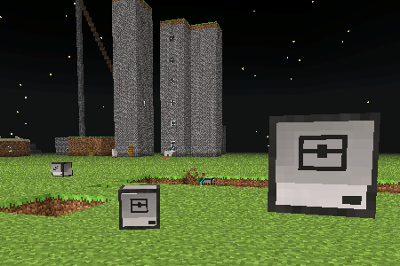
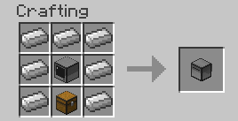
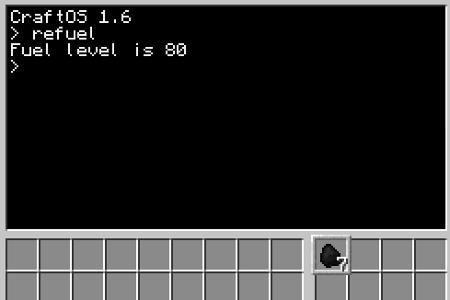

---
title: Robotinvasjon
level: 1.2
language: nb-NO
embeds: ["*.png", "../../bilder/*.png"]
...

# Introduksjon {.intro}

Vi har sett enkle datamaskiner. Nå skal vi leke oss med roboter, og
finne ut hvordan vi kan få dem til å gjøre forskjellige ting for oss.

# Steg 1: Vår første robot {.activity}

*Vi skal nå bli kjent med roboter og alt de kan brukes til.*

En robot er en datamaskin som kan bevege seg. I ComputerCraft kan vi
også gi robotene forskjellige verktøy slik at de kan for eksempel
grave, bygge, slåss og så videre.

Vi begynner likevel med en helt enkel robot:

## Sjekkliste {.check}

+ Åpne inventory'et ditt ved å trykke 'E'. Finn frem 7 __asdf__, 1
__ssas__ og 1 __Computer__.

+ Start et __Crafting table__, og lag en robot slik:

    
	
+ Legg den nye roboten i hånden din. Lukk inventory'et og lag en
robot.

I *Creative Mode* finner du også robotene ved å trykke `E`, deretter
`>` og til slutt velge fanen med datamaskinsymbolet. Robotene heter
__Turtle__ i ComputerCraft.

### Turtles {.protip}

Navnet __Turtle__ betyr *skilpadde* på norsk. Grunnen til at disse
robotene kalles skilpadder er historisk. For nesten 70 år siden bygde
William Grey Walter et par roboter som kunne bevege seg rundt. Disse
beveget seg ganske sakte, og var lave og skallformet. De fikk derfor
etterhvert kallenavnet skilpadder.

Senere ble måten disse skilpaddene beveget seg på (vi skal se hvordan
snart) tatt inn i forskjellige programmeringsspråk, spesielt som en
måte å tegne på. Språket *Logo* er nok det som er mest kjent for slik
skilpaddegrafikk, men nesten alle programmeringsspråk støtter dette i
dag, inkludert for eksempel *Scratch* og *Python*.

## Sjekkliste {.check}

På samme måte som med datamaskiner starter du roboter ved å
høyreklikke på dem. Dette vil starte kommandolinjen til roboten.

+ Start en robot. Skriv `programs` og trykk enter.

    Dette viser hvilke programmer denne roboten kjenner til. Hvis du
    sammenligner med programmene en datamaskin kjenner til vil du se
    at det er mange av de samme programmene, men at roboten også kan
    noen ting som datamaskinen ikke kan.
	
+ Kjør programmet `dance`.

    Roboten begynner nå å danse! Trykk *Esc*-knappen for å stenge
    kommandolinjen, slik at du ser roboten. Blir du imponert?
	
+ Hvis du vil at roboten skal slutte å danse kan du høyreklikke på den
igjen. I kommandolinjen står det nå en liten tekst som sier at du kan
få roboten til å slutte å danse ved å trykke en knapp på tastaturet.

    Hvis du vil kan du også la roboten fortsette å danse. Lag da en ny
    robot som du kan bruke i de neste oppgavene.

# Steg 2: Roboter og skilpadder {.activity}

*Vi vil nå se hvordan vi kan få robotene våre til å bevege seg rundt*

Som nevnt i boksen *Turtles* ovenfor beveger vi robotene våre på en
måte som ligner slik noen spesielle skilpadderoboter ble kontrollert
for nesten 70 år siden. Vi begynner med å bruke to programmer `go` og
`turn` for å bevege robotene rundt.

## Sjekkliste {.check}

+ Kjør programmet `go forward` i kommandolinjen til en robot.

+ Roboten sier at den er `Out of fuel`. 

    Roboter bruker *fuel* for å bevege seg. De kan bruke stort sett
    samme materiale som en __Furnace__ som fuel, for eksempel er
    __Coal__ eller __asdf__ fine å bruke.
	
+ Finn litt __Coal__ i inventory'et ditt. Høyreklikk på roboten. Legg
merke til at det er et inventory med 16 plasser (4 ganger 4) på høyre
side. Dette er robotens inventory. Flytt kullet over til roboten.

    

+ Skriv `refuel` i kommandolinjen og trykk enter.

    Legg merke til at en kull blir borte fra robotens
    inventory. Roboten svarer også ved å fortelle om sin *fuel
    level*. Dette tallet forteller hvor langt roboten kan bevege seg
    før den går tom for fuel igjen.
	
+ Gi roboten litt mer __Coal__ og skriv `refuel all`.

    Roboten vil nå spise opp alt kullet, og deretter rapportere at den
    er klar til å gå ganske så langt!
	
+ Da prøver vi igjen: Kjør programmet `go forward`.

    Flytter roboten din seg? Det kan være litt vanskelig å se hva som
    er fram og bak på en robot. Et triks kan være å tenke på den
    lange, smale sprekken som øynene til roboten. Altså at den siden
    med sprekken er foran.
	
+ Vi kan få roboten til å flytte seg tilbake ved å skrive `go back`.

### Finne hjelp {.protip}

## Sjekkliste {.check}

+ For å få vite mer om hvordan roboten kan flytte seg kan vi skrive
`help go`.

    Dette viser oss at vi kan bruke `go forward`, `go back` ... for å
    flytte roboten rundt. I tillegg ser vi at vi kan bruke tall for at
    roboten skal flytte seg flere steg.
	
+ Prøv `go up 2`, `go forward 10`, `go down` og lignende kommandoer.

    Hvordan kan vi få roboten til å bevege seg sidelengs?
	
+ Det finnes ingen kommando som får roboten til å bevege seg
sidelengs. I stedet må vi først snu roboten med en `turn`-kommando, og
deretter bruke for eksempel `go forward`. Skriv `turn left` og `go
forward 3`.

    Lek litt mer med `go` og `turn`-programmene til du skjønner
    hvordan du flytter roboten rundt omkring i verden. Hva skjer
    dersom du ber roboten gå gjennom bakken eller gjennom en vegg?

# Steg 3: Gruverobot {.activity}

*Hvis vi gir roboter de riktige verktøyene kan de grave, bygge og
 slåss for oss.*

Vi skal nå bruke en gruverobot som kan grave for oss.

## Sjekkliste {.check}

+ Finn en gruverobot i inventory'et ditt, ved å gå til datamaskinfanen
og plukk ut en __Mining Turtle__. Lag og start en gruverobot.

+ Gi roboten litt __Coal__ og kjør `refuel all`.

+ Vi skal nå bruke et program som heter `excavate`, dette betyr *grav
ut*. og vil be roboten om å grave ut et hull i bakken.

    Skriv `excavate 3` og trykk enter.
	
	Ta et steg tilbake og se på mens roboten graver. Roboten vil
	fortsette å grave til den går tom for fuel eller kommer til
	grunnfjellet, __Bedrock__.

+ Hva tror du tallet `3` i kommandoen vi skrev over betyr? Skriv `help
excavate` for å se om du har rett.

+ Høyreklikk på roboten slik at du ser inventory'et den har. Legg
merke til at den tar vare på alt den graver ut.

    Når roboten er ferdig å grave kommer den tilbake dit den
    startet. Der gir den fra seg alt materialet den har gravd ut slik
    at du kan plukke det opp om du vil.

+ Lag flere gruveroboter som kan grave større eller mindre hull.

# Steg 4: Up, up, up, and away ... {.activity}

*Vi skal nå lære hvordan vi kan kontrollere roboter i våre egne
 programmer.*

+ Vis frem turtle-apiet
+ Lag en for-løkke inne i Lua-tolkeren som bygger et kjempehøyt
tårn. Hvordan få tak i roboten igjen?

# Steg 5: Bygg en trapp {.activity}

*Kan vi skrive et program som kan hjelpe oss til å hente ned den
 forsvunne roboten?*

+ Lag en robot som kan lage en trapp opp for å hente den andre roboten
