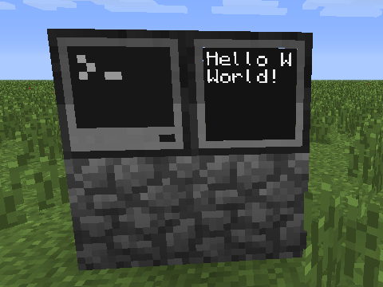
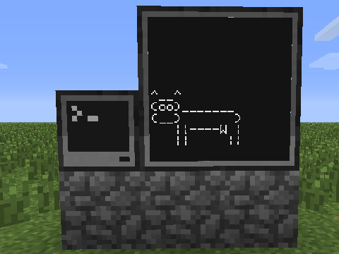

---
title: Sprettball
level: 1.5
language: nb-NO
embeds: ["*.png", "../../bilder/*.png"]
...

# Introduksjon {.intro}

Nå skal vi lære hvordan vi kan koble en skjerm til datamaskinen. Med
en ekstra skjerm kan vi bruke datamaskinen til å kommunisere med
verden rundt oss. Kanskje Minecraft-verden blir fyllt med store
reklamebannere?

# Steg 1: Koble en skjerm til datamaskinen {.activity}

La oss som vanlig begynne helt enkelt. La oss koble en skjerm til en
datamaskin og se om vi får til å skrive noe på skjermen.

## Sjekkliste {.check}

+ Bygg en **Computer**. Du kan også bruke en **Advanced Computer** om
  du foretrekker det.

+ Bygg så en **Monitor** inntil datamaskinen du nettopp bygget,
  omtrent som på bildet.

    

+ Start datamaskinen. Den enkleste måten å skrive noe til skjermen er
  ved hjelp av programmet `monitor`. Om du skriver `help monitor` vil
  du kunne lese at `monitor` kan kjøre andre programmer på en
  tilkoblet skjerm.

    La oss for eksempel prøve programmet `hello`. Dette er et enkelt
    program som vi såvidt har sett litt på tidligere. Det skriver bare
    teksten *Hello World!*. Kjør først programmet på datamaskinen:

    ```
	> hello
	Hello World!
	```

    Nå kan vi prøve å få dette til å kjøre på skjermen. Med skjermen
    koblet til på høyre (*right*) side av datamaskinen (som på bildet
    over) skriver vi bare

    ```
	> monitor right hello
	```

	Du kan nå trykke `Esc` for å gå ut av datamaskinen og se på
    skjermen. Står det *Hello World!*?

	

+ Kult! Da er vi igang med skjermene! Men - det ble jo veldig dårlig
  plass på den skjermen! Det er det heldigvis lett å gjøre noe med. Om
  du setter en **Monitor** ved siden av den du allerede har vil de to
  skjermene smelte sammen til en større skjerm. På denne måten kan du
  lage en stor skjerm! Prøv å kjør `hello`-programmet på den store
  skjermen.

    

+ Trikset med `monitor` fungerer selvsagt også med programmer vi
  skriver selv. La oss lage et enkelt program som vi kaller `ku`:

    ```lua
	print("^__^")
	print("(oo)_______")
	print("(__)       )")
	print("   ||----W |")
	print("   ||     ||")
	```

    Det er ikke så farlig om din ku ikke ser ut akkurat som her. Du
    kan også gjerne tegne noe helt annet. Vi vil bare teste at også
    vårt eget program kan skrives på skjemen.

+ Nå kan vi kjøre programmet: `monitor right ku`.

    

## Cowsay {.protip}

Denne kuen er basert på et morsomt lite program som heter **Cowsay**,
og som ble laget av Tony Monroe på slutten av 1990-tallet. En
web-variant av programmet finnes nå på
[http://cowsay.morecode.org/](http://cowsay.morecode.org/).

# Steg 2: En annen metode {.activity}

I stedet for at vi bruker `monitor`-programmet for å skrive til
skjermen kan vi skrive direkte til skjermen i programmer vi selv
lager. Dette er ganske enkelt med et bibliotek som heter `peripheral`
(*peripheral* betyr i denne sammenhengen *tillegg*, altså skjermen er
et tillegg til datamaskinen).

## Sjekkliste {.check}

+ Lag et enkelt program som heter `skjerm` og ser slik ut:

	```lua
	skjerm = peripheral.wrap("right")
	skjerm.write("Heisann!")
	```

	Som vanlig kan du bytte ut *right* med for eksempel *left* eller
    *top* om du har plassert skjermen annerledes.

+ Kjør programmet ditt ved å skrive `skjerm`. Selv uten `monitor` skal
  programmet skrive til skjermen ved siden av datamaskinen.

+ I stedet for `peripheral.wrap` kan vi bruke `peripheral.find`. Da
  trenger vi ikke å spesifisere hvilken side av datamaskinen skjermen
  er på. Endre programmet ditt som følger:

	```lua
	local skjerm = peripheral.find("monitor")     -- endret linje
	skjerm.write("Heisann!")
	```

+ Vi kan også sjekke om det er noen skjerm koblet til. Dette gjør vi
  enkelt i en *if*-test:

	```lua
	local skjerm = peripheral.find("monitor")

	if skjerm then                                -- ny linje
		skjerm.write("Heisann!")
	else                                          -- ny linje
		print("Ingen skjerm er koblet til")       -- ny linje
	end                                           -- ny linje
	```

    Prøv å kjør dette nye programmet. Det kan hende du vil gjøre
    `monitor right clear` innimellom for å tømme skjermen. Prøv også å
    koble fra (ødelegge) skjermen. Får du melding om at ingen skjerm
    er koblet til når du prøver å kjøre programmet ditt?

# Steg 3: En ball faller over skjermen {.activity}

Vi skal nå begynne på en enkel animasjon som vi kan kjøre på skjermen.

## Sjekkliste {.check}

+ Lag et nytt program som heter `sprettball`. Det begynner ganske likt
  programmet vi jobbet med tidligere, så om du vil kan du kopiere det
  ved å skrive `copy skjerm sprettball`. Programmet `sprettball` skal
  se ut som følger:

	```lua
	local skjerm = peripheral.find("monitor")

	if skjerm then
	    skjerm.clear()
		skjerm.write("O")
	else
		print("Ingen skjerm er koblet til")
	end
	```

	Dette skal tegne en ball øverst på skjermen.

+ Vi kan nå bruke en enkel *for*-løkke til å animere ballen. Endre
  koden din:

	```lua
	local skjerm = peripheral.find("monitor")

	if skjerm then
		for rad = 1, 10 do                        -- ny linje
			skjerm.clear()
			skjerm.setCursorPos(3, rad)           -- ny linje
			skjerm.write("O")
			sleep(1)                              -- ny linje
		end                                       -- ny linje
	else
		print("Ingen skjerm er koblet til")
	end
	```

	For at vi skal rekke å se at ballen flytter seg har vi lagt inn en
    `sleep`-kommando som bare venter litt (1-tallet betyr 1 sekund)
    mellom hver gang ballen flyttes.

+ Dette er ikke så spennende enda, men før vi lager noe mer avansert
  vil vi gjøre en liten omstrukturering av koden, som gjør det enklere
  for oss å holde oversikten senere. Vi flytter alt som har med
  animering av ballen inn i en egen funksjon `tegnBall`. Flytt
  kodelinjene rundt slik at de blir som dette:

	```lua
	function tegnBall(skjerm)                     -- ny linje
		for rad = 1, 10 do                        -- flyttet linje
			skjerm.clear()                        -- flyttet linje
			skjerm.setCursorPos(3, rad)           -- flyttet linje
			skjerm.write("O")                     -- flyttet linje
			sleep(1)                              -- flyttet linje
		end                                       -- flyttet linje
	end                                           -- ny linje

	skjerm = peripheral.find("monitor")

	if skjerm then
		tegnBall(skjerm)                          -- ny linje
	else
		print("Ingen skjerm er koblet til")
	end
	```


# Steg 4: Hvor stor er skjermen {.activity}

En liten utfordring med skjermer er at de kan ha forskjellig
størrelse. Hvis du for eksempel setter tre skjermer oppå hverandre
slik at du får en veldig høy skjerm vil ikke ballen i
`sprettball`-programmet ditt falle helt til bunnen av skjermen. Dette
kan vi løse ved å bruke funksjonen `getSize`.

## Sjekkliste {.check}

+ Funksjonen `getSize` forteller oss hvor bred og hvor høy skjermen
  er. Endre funksjonen `tegnBall` slik at ballen faller over hele
  skjermen:

	```lua
	function tegnBall(skjerm)
		local bredde, hoyde = skjerm.getSize()    -- ny linje
		for rad = 1, hoyde do                     -- endret linje
			skjerm.clear()
			skjerm.setCursorPos(3, rad)
			skjerm.write("O")
			sleep(1)
		end
	end
	```

+ Prøv å lag skjermen høyere eller lavere. Faller ballen hele veien
  ned når du kjører programmet ditt?

+ Klarer du å sentrere ballen, slik at den faller nedover midt på
  skjermen uansett hvor stor skjermen er? Prøv selv!

# Steg 5: Sprettball {.activity}

Nå vil vi få ballen til å oppføre seg mer som en sprettball. For å få
til dette vil vi innføre noen nye variabler. Vi vil la `X` og `Y`
betegne hvor ballen er, mens `fartX` og `fartY` forteller hvor fort
ballen flytter på seg.

## Sjekkliste {.check}

+ I tillegg til de nye variablene bytter vi ut *for*-løkken med en
  *while*-løkke. Denne gjør at ballen skal sprette for alltid. Husk at
  du bruker `Ctrl-T` for å avslutte programmet.

	```lua
	function tegnBall(skjerm)
		local bredde, hoyde = skjerm.getSize()
		local X, Y = 1, 2                         -- ny linje
		local fartX, fartY = 1, 1                 -- ny linje
		
		while true do                             -- endret linje
			skjerm.clear()
			skjerm.setCursorPos(X, Y)             -- endret linje
			skjerm.write("O")
			sleep(1)

		    X = X + fartX                         -- ny linje
			Y = Y + fartY                         -- ny linje
		end
	end
	```

	Ballen vil nå bevege seg på skrå over skjermen. Ser du hvorfor?

+ Vi vil nå la ballen sprette når den treffer kanten. Dette gjør vi
  ved å "snu farten" når vi beveger oss ut av skjermen. Legg til et
  par tester nederst i funksjonen din:

	```lua
	function tegnBall(skjerm)
		local bredde, hoyde = skjerm.getSize()
		local X, Y = 1, 2
		local fartX, fartY = 1, 1
		
		while true do
			skjerm.clear()
			skjerm.setCursorPos(X, Y)
			skjerm.write("O")
			sleep(1)

		    X = X + fartX
			Y = Y + fartY

		    if X <= 1 or X >= bredde then         -- ny linje
				fartX = -fartX                    -- ny linje
			end                                   -- ny linje
			if Y <= 1 or Y >= hoyde then          -- ny linje
				fartY = -fartY                    -- ny linje
			end                                   -- ny linje
		end
	end
	```

	Spretter ballen tilbake når den treffer kanten av skjermen? Lag
    gjerne en ganske stor skjerm. Du kan også endre pausen mellom hver
    gang ballen flytter seg. For eksempel bytt ut `sleep(1)` med
    `sleep(0.1)`.

+ Tilslutt kan vi lage en mer naturlig sprettball-bevegelse ved å ta
  med en variabel for gravitasjon. Vi kan tenke at gravitasjonen gjør
  at ballen faller stadig raskere ned mot bakken, altså den øker
  `fartY`.


	```lua
	function tegnBall(skjerm)
		local bredde, hoyde = skjerm.getSize()
		local X, Y = 1, 2
		local fartX, fartY = 1, 0                 -- endret linje
		local gravitasjon = 0.2                   -- ny linje

		while true do
			skjerm.clear()
			skjerm.setCursorPos(X, Y)
			skjerm.write("O")
			sleep(0.1)

		    fartY = fartY + gravitasjon           -- ny linje
		    X = X + fartX
			Y = Y + fartY

		    if X <= 1 or X >= bredde then
				fartX = -fartX
			end
			if Y >= hoyde then                    -- endret linje
				fartY = -(fartY + gravitasjon)    -- endret linje
			end
		end
	end
	```

	Vi endret også litt i sjekken om `Y` er slik at ballen skal
    sprette, siden gravitasjonen gjør at vi ikke trenger å sprette i
    taket lengre.

# Steg 6: Reklamebanner {.activity}

# Steg 7: En skikkelig ticker! {.activity}

# Steg 8: Whack-a-ball {.activity}
