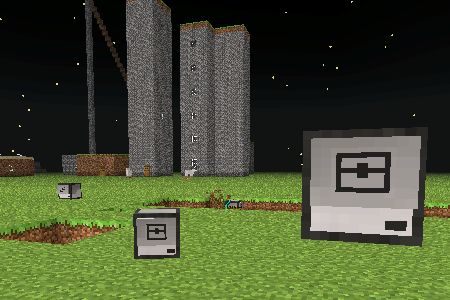
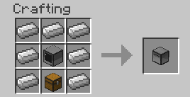
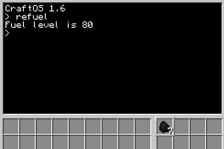
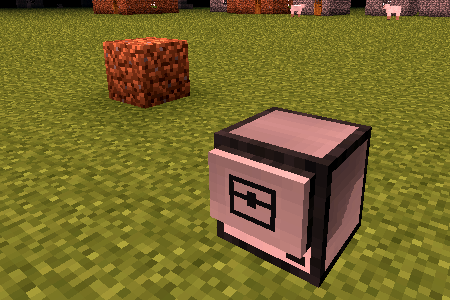
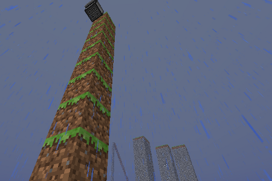
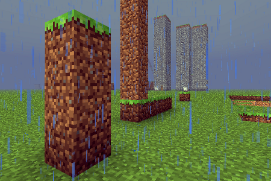
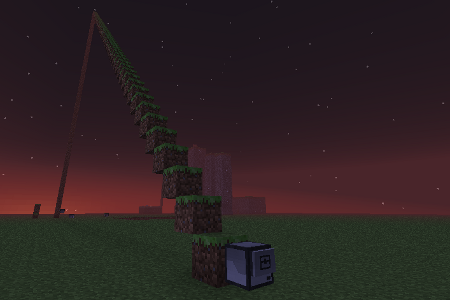

# Introduksjon {.intro}

Vi har sett enkle datamaskiner. Nå skal vi leke oss med roboter, og
finne ut hvordan vi kan få dem til å gjøre forskjellige ting for oss.



# Steg 1: Vår første robot {.activity}

*Vi skal nå bli kjent med roboter og se noe av det de kan brukes til.*

En robot er en datamaskin som kan bevege seg. I ComputerCraft kan vi
også gi robotene forskjellige verktøy slik at de for eksempel kan
grave, bygge, slåss og så videre.

Vi begynner likevel med en helt enkel robot:

## Sjekkliste {.check}

+ Åpne inventory'et ditt ved å trykke 'E'. Finn frem 7 __Iron Ingot__, 1
__Chest__ og 1 __Computer__.

+ Start et __Crafting table__, og lag en robot slik:

    

+ Legg den nye roboten i hånden din. Lukk inventory'et og lag en
robot.

I *Creative Mode* finner du også robotene ved å trykke `E`, deretter
`>` og til slutt velge fanen med datamaskinsymbolet. Robotene heter
__Turtle__ i ComputerCraft.

### Turtles {.protip}

Navnet __Turtle__ betyr *skilpadde* på norsk. Grunnen til at disse
robotene kalles skilpadder er historisk. For nesten 70 år siden bygde
William Grey Walter et par roboter som kunne bevege seg rundt. Disse
beveget seg ganske sakte, og var lave og skallformet. De fikk derfor
etterhvert kallenavnet skilpadder.

Senere ble måten disse skilpaddene beveget seg på (vi skal se hvordan
snart) tatt inn i forskjellige programmeringsspråk, spesielt som en
måte å tegne på. Språket *Logo* er nok det som er mest kjent for slik
skilpaddegrafikk, men nesten alle programmeringsspråk støtter dette i
dag, inkludert for eksempel *Scratch*, *Python* og *ComputerCraft*.

## Sjekkliste {.check}

På samme måte som med datamaskiner starter du roboter ved å
høyreklikke på dem. Dette vil starte kommandolinjen til roboten.

+ Start en robot. Skriv `programs` og trykk enter.

    Dette viser hvilke programmer denne roboten kjenner til. Hvis du
    sammenligner med programmene en datamaskin kjenner til vil du se
    at det er mange av de samme programmene, men at roboten også kan
    noen ting som datamaskinen ikke kan.

+ Kjør programmet `dance`.

    Roboten begynner nå å danse! Trykk *Esc*-knappen for å stenge
    kommandolinjen, slik at du ser roboten. Blir du imponert?

+ Hvis du vil at roboten skal slutte å danse kan du høyreklikke på den
igjen. I kommandolinjen står det nå en liten tekst som sier at du kan
få roboten til å slutte å danse ved å trykke en knapp på tastaturet.

    Hvis du vil kan du også la roboten fortsette å danse. Lag da en ny
    robot som du kan bruke i de neste oppgavene.

# Steg 2: Roboter og skilpadder {.activity}

*Vi vil nå se hvordan vi kan få robotene våre til å bevege seg rundt.*

Som nevnt i boksen *Turtles* ovenfor beveger vi robotene våre på en
måte som ligner slik noen spesielle skilpadderoboter ble kontrollert
for nesten 70 år siden. Dette gjør vi ved å bruke programmet `go` for
å bevege robotene rundt.

## Sjekkliste {.check}

+ Kjør programmet `go forward` i kommandolinjen til en robot.

+ Roboten sier at den er `Out of fuel`.

    Roboter bruker *fuel* for å bevege seg. De kan bruke stort sett
    samme materiale som en __Furnace__ som fuel, for eksempel er
    __Coal__ eller __Blaze Rod__ fine å bruke.

+ Finn litt __Coal__ i inventory'et ditt. Høyreklikk på roboten. Legg
merke til at det er et inventory med 16 plasser (4 ganger 4) på høyre
side. Dette er robotens inventory. Flytt kullet over til roboten.

    

+ Skriv `refuel` i kommandolinjen og trykk enter.

    Legg merke til at en kull blir borte fra robotens
    inventory. Roboten svarer også ved å fortelle om sin *fuel
    level*. Dette tallet forteller hvor langt roboten kan bevege seg
    før den går tom for fuel igjen.

+ Gi roboten litt mer __Coal__ og skriv `refuel all`.

    Roboten vil nå spise opp alt kullet, og deretter rapportere at den
    er klar til å gå ganske så langt!

+ Da prøver vi igjen: Kjør programmet `go forward`.

    Flytter roboten din seg? Det kan være litt vanskelig å se hva som
    er fram og bak på en robot. Et triks kan være å tenke på den
    lange, smale sprekken som øynene til roboten. Altså at den siden
    med sprekken er foran.

+ Vi kan få roboten til å flytte seg tilbake ved å skrive `go back`.

### Finne hjelp {.protip}

Datamaskiner og roboter har et innebygd hjelpesystem. For å se hvordan
det virker kan du skrive `help` og trykke enter. Dette gir deg en rask
introduksjon til nyttige hjelpekommandoer. Legg merke til at du kan
skrive `help <program>` for å få hjelp om et spesielt program. Da må
du bytte ut `<program>` med navnet på programmet. For eksempel kan du
skrive `help go` for å se hjelp om `go`-programmet.

Det finnes selvsagt også en del hjelp på Internett. Et bra sted å
starte er ComputerCraft Wiki'en: <http://computercraft.info/wiki/>.

## Sjekkliste {.check}

+ For å få vite mer om hvordan roboten kan flytte seg kan vi skrive
`help go`.

    Dette viser oss at vi kan bruke `go forward`, `go back`, `go up`,
    `go down`, `go left` og `go right` for å flytte roboten rundt. I
    tillegg ser vi at vi kan bruke tall for at roboten skal flytte seg
    flere steg.

+ Prøv `go up 2`, `go forward 10`, `go down` og lignende kommandoer.

    Hvordan kan vi få roboten til å bevege seg sidelengs?

+ Det finnes ingen kommando som får roboten til å bevege seg
sidelengs. Kommandoene `go left` og `go right` bare snur roboten. For
å få roboten til å gå sidelengs må vi derfor først snu roboten, og
deretter bruke for eksempel `go forward`. Skriv `go left` og deretter
`go forward 3`.

+ Lek litt mer med `go`-programmet til du skjønner hvordan du flytter
roboten rundt omkring. Dersom du synes `go left` og `go right` er litt
forvirrende siden roboten ikke går noe sted, kan du bruke `turn left`
og `turn right` i stedet.

    Hva skjer dersom du ber roboten gå gjennom bakken, gjennom en
    vegg, eller om du står i veien for roboten?

# Steg 3: Gruverobot {.activity}

*Hvis vi gir roboter de riktige verktøyene kan de grave, bygge og
 slåss for oss.*

Vi skal nå bruke en gruverobot som kan grave for oss.

## Sjekkliste {.check}

+ Finn en gruverobot i inventory'et ditt ved å gå til datamaskinfanen
og plukke ut en __Mining Turtle__. Lag og start en gruverobot.

+ Gi roboten litt __Coal__ og kjør `refuel all`.

+ Vi skal nå bruke et program som heter `excavate`, dette betyr *grav
ut*. og vil be roboten om å grave ut et hull i bakken.

    Skriv `excavate 3` og trykk enter.

    Ta et steg tilbake og se på mens roboten graver. Roboten vil
    fortsette å grave til den går tom for fuel eller kommer til
    grunnfjellet, __Bedrock__.

+ Hva tror du tallet `3` i kommandoen vi skrev over betyr? Skriv `help
excavate` for å se om du har rett.

+ Høyreklikk på roboten slik at du ser inventory'et den har. Legg
merke til at den tar vare på alt den graver ut.

    Når roboten er ferdig å grave kommer den tilbake dit den
    startet. Der gir den fra seg alt materialet den har gravd ut slik
    at du kan plukke det opp om du vil.

+ Lag flere gruveroboter som kan grave større eller mindre hull.

# Steg 4: Robotprogrammer {.activity}

*Vi skal nå lære hvordan vi kan kontrollere roboter i våre egne
 programmer.*

Når vi skriver egne programmer som styrer robotene bruker vi
kommandoer fra `turtle`-biblioteket.

## Sjekkliste {.check}

+ Start en ny robot. Pass på at den har fått litt kull og blitt
`refuel`et.

+ Vi begynner med å prøve å finne litt mer informasjon om
`turtle`-biblioteket. Skriv `help turtle`.

    Du får nå se en ganske lang liste med kommandoer som vi kan
    bruke. Vi vil vise frem noen av disse. Du burde teste alle sammen
    på egen hånd, og se om du skjønner hvordan alle sammen virker.

+ For å gjøre enkle tester vil vi skrive kommandoene direkte i
Lua-tolkeren til å begynne med. Skriv `lua` og trykk enter. Husk at du
skriver `exit()` for å gå ut av Lua-tolkeren og tilbake til
kommandolinjen.

+ Vi begynner med de enkle flytte-kommandoene. Skriv
`turtle.forward()` og trykk enter. Flytter roboten seg forover?

    Husk at du kan trykke *Esc*-knappen for enklere å se hva roboten
    gjør. Høyreklikk på roboten for å komme tilbake til
    Lua-tolkeren.

+ Prøv også de følgende kommandoene. Til sammen gir de oss muligheten
til å flytte roboten dit vi vil ha den:

    `turtle.forward()`, `turtle.back()`, `turtle.turnLeft()`,
    `turtle.turnRight()`, `turtle.up()`, `turtle.down()`.

### Prøv selv {.try}

Lag en liten kloss litt unna roboten din, omtrent som på bildet
under. Klarer du å bruke `turtle`-kommandoene over til å plassere
roboten på toppen av klossen?



# Steg 5: Up, up, up, and away ... {.activity}

*Kan vi klare å få roboten til å bygge for oss?*

Et av poengene med roboter er at de kan gjøre arbeid for oss. I
Minecraft betyr det at vi vil at robotene skal kunne for eksempel
grave eller bygge.

## Sjekkliste {.check}

+ Start en ny robot. Gi den fuel (og kjør `refuel`). Legg også noe
byggemateriale, for eksempel __Grass__, i den øverste venstre boksen i
robotens inventory.

+ Pass på at det ikke er noe foran roboten, og skriv `turtle.place()`
inne i Lua-tolkeren.

    Bygde roboten en gresskloss foran seg? Da har du gjort alt
    riktig. Hvis dette ikke skjedde kan du sjekke

    __1__: at du har startet `lua`,

    __2__: at roboten har fuel,

    __3__: at roboten har byggemateriale,

    __4__: at det ikke står noe foran roboten (husk at den smale
    sprekken er øynene til roboten), og

    __5__: at boksen med byggemateriale i robotens inventory er
    merket, det vil si at den har en litt tykkere ramme rundt seg enn
    de andre boksene.

+ Roboten kan også sjekke om den har noe foran seg: Skriv
`turtle.detect()`.

    Du skal få svaret `true` som betyr at roboten ser at den har noe
    foran seg.

+ Prøv så `turtle.back()` etterfulgt av `turtle.detect()`.

    Siden roboten nå ikke har noe rett foran seg får du svaret
    `false`.

I Steg 6 skal vi se hvordan vi kan bruke `place()` og `detect()`
sammen for å lage en ganske smart byggerobot.

Men først, en ting vi så når vi brukte `go` var at hvis vi ville at
roboten skulle gå flere steg kunne vi bare skrive et tall, for
eksempel `go forward 3`. Det samme fungerer ikke med
`turtle`-biblioteket. I stedet må vi bruke løkker.

## Sjekkliste {.check}

+ En enkel måte å gjøre noe et bestemt antall ganger er å bruke
`for`-løkker.

    Skriv `for i = 1, 5 do turtle.back(); end` i Lua-tolkeren.

    Flytter roboten din seg 5 steg bakover?

+ Hvis vi vil kombinere flere kommandoer inne i en løkke i
Lua-tolkeren bruker vi semikolon, `;`.

    Prøv `for i = 1, 5 do turtle.back(); turtle.place(); end`.

+ Pass på at roboten din har mye byggemateriale, for eksempel 64
__Grass__, i den merkede boksen i inventory'et sitt.

+ La oss bygge et høyt tårn!

    Skriv `for i = 1, 60 do turtle.up(); turtle.place(); end`.

    

Men oops! Vi glemte å fortelle roboten at den skulle komme ned når den
blir ferdig med å bygge. Hvordan skal vi få tak i den igjen?

# Steg 6: Bygg en trapp {.activity}

*Kan vi skrive et program som kan hjelpe oss til å hente ned den
 forsvunne roboten?*

Når vi skal gjøre ting som er litt kompliserte er det som regel
enklere å skrive et program, i stedet for å bare gi enkeltkommandoer i
Lua-tolkeren. La oss prøve å lage et program som kan bygge en trapp
opp til toppen av det høye tårnet.

Før vi begynner på utfordringen det er å bygge en kjempehøy trapp, la
oss øve oss, og teste programmet på et mindre tårn.

## Sjekkliste {.check}

+ Bygg et tårn som er tre klosser høyt. Dette kan du bygge enten med
en robot eller bare på egen hånd.

    

+ Lag en ny robot inntil det lille tårnet du nettopp bygde. Gi den
fuel og byggematerialer.

+ Begynn å skriv et nytt program ved å skrive `edit byggtrapp`. Skriv
inn følgende:

    ```lua
    turtle.detect()
    ```

    Lagre og avslutt ved å bruke *Ctrl*-tasten.

+ Kjør programmet ved å skrive `byggtrapp`. Dette programmet bygger
ingen trapp enda, det virker faktisk som om det ikke gjør noe som
helst. Det eneste som skjer er at roboten merker at den har en kloss
foran seg. Men vi har ikke fortalt den hva den skal gjøre etterpå.

    Vi kan bruke `detect` til å finne toppen av tårnet.

+ Endre på programmet ditt ved å skrive `edit byggtrapp` igjen. Vi
lager nå en løkke hvor roboten klatrer oppover så lenge den merker at
tårnet er høyere.

    ```lua
    while turtle.detect() do
        turtle.up()
    done
    ```

    Lagre og kjør programmet ditt. Klatrer roboten til toppen av det
    lille tårnet?

+ Vi har lært av feilen vi gjorde tidligere, så nå vil vi passe på at
roboten kommer ned igjen. La oss legge til en ny løkke i programmet,
slik at roboten klatrer ned. Denne gangen bruker vi kommandoen
`detectDown()`. Denne gjør det samme som `detect()`, bortsett fra at
den merker om roboten har en kloss under seg i stedet for foran seg.

    Utvid programmet ditt slik:

    ```lua
    while turtle.detect() do
        turtle.up()
    done

    while not turtle.detectDown() do
        turtle.down()
    done
    ```

    Vi sier at så lenge roboten *ikke* har en kloss under seg kan den
    ta et steg ned. Kommer roboten ned igjen når du kjører programmet?

+ Nå er vi klar til å la roboten bygge selve trappen. Det gjør vi ved
å ta et steg tilbake i den andre løkken, og plassere ut en kloss.

    ```lua
    while turtle.detect() do
        turtle.up()
    done

    while not turtle.detectDown do
        turtle.down()
        turtle.back()
        turtle.place()
    done
    ```

    Virker det? Lager roboten en trapp?

+ Nå er vi klare for den store testen. Klarer vi å sende
trappebyggeroboten vår opp det høye tårnet?

    Pass på at roboten fortsatt har nok fuel, og fyll opp med
    byggemateriale. Kjør den bort til det høye tårnet, og la den `byggtrapp`!

    

Gratulerer! Du har nå programmert en robot! Legg merke til at siden
`byggtrapp`-programmet vårt bruker `detect`-kommandoer kan det bygge
trapper opp alle slags tårn og bratte fjellsider!
