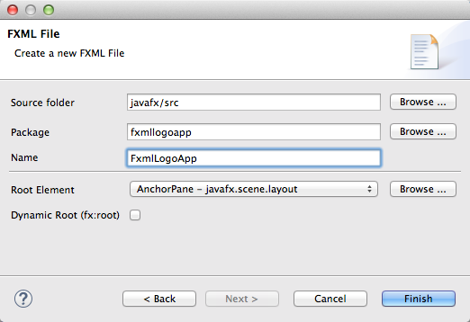

# Introduksjon {.intro}

Formålet til denne leksjonen er å lære hvordan du kan bruke **FXML** for å lage skjerminnhold, og **to måter** å lage slikt innhold. I tillegg skal du lære hvordan du får app-en til å last inn og vise frem innholdet i FXML-filer.

I leksjonen [Hello world](../helloworld/helloworld.html) lærte du om hvordan du kan lage en app som viste et vindu med et tekst-objekt (av type **Text**). Da skrev du Java-kode som _laget_ tekst-objektet, _satte grafiske egenskaper_ for tekst.objektet og _la det til_ app-vinduet. Slik kode kan fort bli lang og uoversiktlig, og det kan være vanskelig å skrive kode som har ønsker effekt og se for seg hvordan skjerminnholdet vil bli seende ut.

For å gjøre arbeidet med skjerminnhold enklere, så finnes det en egen kode-type kalt FXML for å lage skjerminnhold. FXML ligner på HTML ved at det bruker XML-elementer, f.eks. `<Text ...> ... </Text>` og attributter, f.eks. `fill="blue"` for å beskrive innholdet. Når en skal lage FXML-filer, kan en enten redigere FXML som tekst i en egen FXML-editor eller bruke en egen tegne-app som leser og skriver FXML-filer. Vi skal se på begge disse teknikkene i denne leksjonen.

# Steg 1: Opprette app-pakke, app-klasse og FXML-fil {.activity}

+ Lag først en ny app-pakke og app-klasse som forklart i [Hello world-leksjonen](../helloworld/helloworld.html). Bruk **fxmllogo** som navn på pakken og **FxmlLogoApp** som navn på app-klassen.

+ Høyreklikk på fxmllogo-pakken og velg `New > Other...` så du får opp en liste med såkalte _veivisere_ (eng: _wizards_). Vi skal bruke den som heter **FXML Document**. Det enkleste er å skrive inn 'fx' i søkefeltet, for å snevre inn utvalget:

	
	
	Trykk `Next` for å velge veiviseren. Du vil da få opp følgende skjema:

	

	Fyll inn `FxmlLogoApp` og trykk `Finish`. Du vil da få opp en FXML-editor med den nye FXML-fila:

	

+ Rediger teksten slik at den blir som følger:

	```xml
<AnchorPane xmlns:fx="http://javafx.com/fxml/1" prefWidth="500" prefHeight="400">
	<Rectangle layoutX="100" layoutY="20" width="80" height="80" fill="blue"
		arcWidth="25" arcHeight="25"/>
	<Circle layoutX="150" layoutY="150" radius="40" fill="blue"/>
	<Text layoutX="10" layoutY="120" text="NTNU">
		<font>
			<Font name="Arial" size="36"/>
		</font>
	</Text>
</AnchorPane>
```

	FXML-editoren har samme type kode-komplettering som Java-editoren. Når du f.eks. har skrevet inn `<Rect`, kan du trykk ctrl-mellomrom og editoren vil både fylle ut resten av **Rectangle**-navnet og legge til en import-setning øverst i fila (tilsvarende import-setningen i Java):

	`<?import javafx.scene.shape.Rectangle?>`

	(Hvis du ikke bruker kode-kompletteringsfunksjonen, så må du skrive inn import-setningen selv.) Tilsvarende kan du bruke kode-komplettering på attributt-navnene **layoutX**, **layoutY**, **width**, **height**, **fill** osv. 

+ Mens du redigerer FXML-koden, så kan det være kjekt å se hvordan innholdet vil bli seende ut, når det lastes inn og vises frem. Eclipse har et eget panel kalt **JavaFX preview** som hele tiden laster inn FXML-koden du redigerer og viser frem innholdet. Dette åpnes ved å velge `Window > Show View...` og så finne panelet i lista. Bruk søkefeltet for å filtrere lista (skriv ', så panelet blir enklere å finne.

	

## Litt om FXML

Du har kanskje kjent igjen mange av ordene i FXML-fila fra Java-koden du skrev i [Hello world-leksjonen](../helloworld/helloworld.html), og det er ikke tilfeldig. Enkelt sagt så tilsvarer elementnavnene i FXML-koden (ordet etter '<' og '</'), f.eks. **Text** og **Rectangle** Java-klasser, og attributtnavnene tilsvarer egenskaper, f.eks. **layoutX**, **width** og **fill**. Det er også noen elementnavn som tilsvarer egenskaper, f.eks. **font**. Når FXML-koden blir lest inn, så vil hvert element som tilsvarer en Java-klasse bli til en instans (et Java-objekt) av den klassen, og hvert attributt bli brukt til å sette en egenskap, som om en brukt tilsvarende **set**-metode. 

# Hva har du lært?

