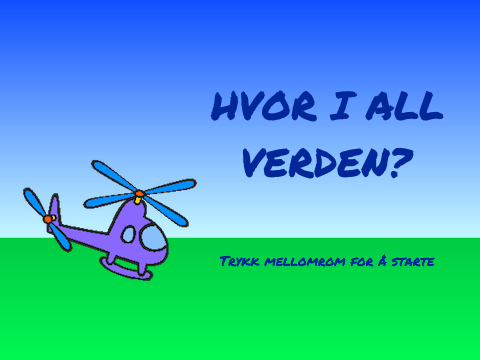
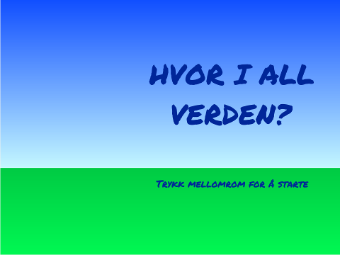
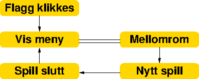

# Introduksjon {.intro}

Hvor i All Verden? er et reise- og geografispill hvor man raskest
mulig skal fly innom reisemål spredt rundt i Europa. Dette er den
siste av tre leksjoner. I denne delen skal vi se på lister og hvordan
vi kan bruke dem til å velge reisemål tilfeldig. Vi vil avslutte med å
lage en skikkelig intro til spillet.



# Steg 0: Forrige gang {.activity}

*Vi fortsetter nå med det programmet vi laget i del 1 og del 2.*

## Sjekkliste {.check}

Sjekk spesielt at

+ du har et helikopter som du kan styre over en rullende bakgrunn med
  piltastene,

+ du har en stedfigur som kan bli funnet av helikopteret,

+ du har laget en ny kloss (funksjon) som heter `Reis
  til`{.blockmoreblocks}.

# Steg 1: Lag lister {.activity}

*Vi skal nå flytte reisemålene våre over i lister. Dette vil gjøre det
 enklere både å legge til flere reisemål, og å velge reisemål
 tilfeldig.*

## Sjekkliste {.check}

+ Velg sted-figuren, og klikk på `Data`{.blockdata}-kategorien. Lag
  en liste som du kaller `steder` og lar gjelde bare for denne
  figuren.

+ Det dukker nå opp en grå boks på scenen som heter `Sted: steder`. Vi
  kan la denne ligge på scenen inntil videre. Du vil også se at det
  har kommet noen nye klosser som gjør ting med lister. Skjønner du
  hva noen av disse klossene gjør?

+ La oss fylle opp listen! Vi starter med en ny melding, og
  deretter kan vi legge til ting i listen.

    ```blocks
        når jeg mottar [Lag lister v]
        legg [London] til [steder v]
        legg [Oslo] til [steder v]
        legg [Barcelona] til [steder v]
    ```

    Bruk gjerne de samme reisemålene som du allerede har.

+ Klikk på blokken du laget over slik at den kjører. Blir den grå
  boksen på scenen fyllt med steder? Hva skjer om du klikker flere
  ganger?

+ Vi kan sikre oss at hvert sted bare ligger en gang i listen ved å
  tømme listen før vi fyller den opp. Legg til

    ```blocks
        slett (alle v) i [steder v]
    ```

    i koden før du legger til det første reisemålet.

En liten utfordring med lister er at de bare inneholder en type
verdier. For eksempel stedsnavn i dette tilfellet. Men for reisemålene
må vi holde styr på tre ting: Stedsnavnet og de to koordinatene som
sier hvor stedet ligger. En måte å gjøre dette på er å bruke tre lister.

+ Lag to nye lister, `stederX` og `stederY` som også gjelder kun for
  stedfiguren.

+ Vi vil nå utvide `Lag lister`-blokken slik at vi fyller opp alle tre
  listene. Bruk dine egne reisemål og koordinater her om du vil:

    ```blocks
        når jeg mottar [Lag lister v]
        slett (alle v) i [steder v]
        slett (alle v) i [stederX v]
        slett (alle v) i [stederY v]
        legg [London] til [steder v]
        legg [-135] til [stederX v]
        legg [-30] til [stederY v]
        legg [Oslo] til [steder v]
        legg [-30] til [stederX v]
        legg [75] til [stederY v]
        legg [Barcelona] til [steder v]
        legg [-135] til [stederX v]
        legg [-175] til [stederY v]
    ```

    Pass på at de tre listene er samkjørte slik at det er verdier for
    samme reisemål som står for eksempel øverst i hver liste.

# Steg 2: Velg et reisemål tilfeldig {.activity}

*La oss begynne å bruke listene våre til å velge steder å reise til
 tilfeldig.*

## Sjekkliste {.check}

+ Først vil vi lage listene våre når spillet begynner.  Endre på koden
  for `Nytt spill`{.blockevents} slik,

    ```blocks
        når jeg mottar [Nytt spill v]
        send melding [Lag lister v]
        vis
        send melding [Nytt sted v] og vent
    ```

+ Lag en ny variabel som heter `sted`{.blockdata} og som gjelder kun
  for sted-figuren. Denne variabelen vil være et tall som
  identifiserer hvilken posisjon i listene det gjeldende reisemålet
  har.

+ Koden for `Nytt sted`{.blockevents} blir helt ny. Nå skal vi bruke
  både listene våre og den nye `Reis til`{.blockmoreblocks}-klossen vi
  lagde forrige gang.

    ```blocks
        definer Reis til (sted) (x) (y)

        når jeg mottar [Nytt sted v]
        sett [sted v] til (tilfeldig tall fra (1) til (lengden av [steder v]))
        Reis til (element (sted) av [steder v]) (element (sted) av [stederX v]) (element (sted) av [stederY v])
    ```

+ Prøv å kjør spillet flere ganger. Virker det som om reisemålet blir
  valgt tilfeldig?

+ For å få flere reiseoppgaver i hvert spill kan vi bare legge en
  `gjenta _ ganger`{.blockcontrol}-løkke rundt sendingen av meldingen
  `Nytt sted` i `Nytt spill`{.blockevents}-blokken. Hvor mange ganger
  vil du gjenta meldingen?

# Steg 3: Fjern reisemål fra listen {.activity}

*I spillet vårt hender det at samme reisemål blir tilfeldig valgt
 flere ganger etter hverandre. Dette kan vi enkelt unngå ved å fjerne
 reisemål fra listene etterhvert som vi finner dem.*

## Sjekkliste {.check}

+ For å unngå å bli spurt om å reise til samme sted flere ganger på
  rad vil vi slette reisemål fra listene etterhvert som vi finner dem.
  Legg til slettekommandoer helt nederst i `Nytt
  sted`{.blockevents}-blokken,

    ```blocks
        slett (sted) i [steder v]
        slett (sted) i [stederX v]
        slett (sted) i [stederY v]
    ```

+ Hva skjer om du prøver å gi flere oppgaver enn det er reisemål? Prøv
  selv!

    Den enkleste måten å unngå dette problemet på er å gi færre
    oppgaver eller legge inn flere reisemål i listene!

    Alternativt kan du øverst i `Nytt sted`-blokken legge inn en
    `hvis`{.blockcontrol}-test som sjekker om lengden av `steder`
    er 0. Hvis den er det kan du sende en ny `Lag lister`-melding for
    å bygge listen på nytt.

# Steg 4: En introduksjon {.activity}

*Vi er nå nesten ferdige med spillet vårt. Men vi vil forbedre det som
 kalles programflyten slik at vi får en startmeny, og slik at vi kan
 spille flere ganger.*

## Sjekkliste {.check}

+ Lag en ny bakgrunn som kan brukes på startskjermen. Vi har tegnet en
  ny bakgrunn selv ved å bruke vektorgrafikk, sette sammen to store
  firkanter og fylle dem med fargeoverganger. Deretter skrev vi litt
  tekst på denne bakgrunnen.

    

    Kall denne bakgrunnen for `meny`.

Vi skal nå sende flere meldinger som definerer programflyten. Vi vil
at menyen vises når vi klikker på det grønne flagget. Fra menyen vil
vi at et nytt spill starter når vi trykker mellomrom-tasten. Når
spillet er slutt vil vi at menyen skal vises igjen. Vi kan tegne
programflyten omtrent som dette:



+ For å lage denne programflyten kan vi stort sett bruke skript på
  scenen. Lag de følgende enkle skriptene:

    ```blocks
        når grønt flagg klikkes
        send melding [Vis meny v]

        når jeg mottar [Vis meny v]
        bytt bakgrunn til [meny v]

        når [mellomrom v] trykkes
        hvis ((bakgrunnsnavn) = [meny])
            send melding [Nytt spill v]
        slutt

        når jeg mottar [Nytt spill v]
        bytt bakgrunn til [spill v]

        når jeg mottar [Spill slutt v]
        send melding [Vis meny v]
    ```

    Sammenlign disse skriptene med programflyten over. Ser du hvordan
    de henger sammen?

+ Vi må sende melding når spillet er slutt. Hvordan vet vi at spillet
  er slutt?

    Spillet slutter etter at vi har besøkt reisemålene. Det betyr at
    vi må sende en melding `Spill slutt` etter
    `gjenta`{.blockcontrol}-blokken på sted-figuren.

    Legg til denne meldingen og prøv spillet ditt. Virker
    programflyten? Starter spillet når du trykker mellomrom? Kommer du
    tilbake til menyen når spillet er slutt?

+ Et problem er at helikopteret, stedet og kartet blir liggende over
  menyen når spillet er slutt. Vi må passe på at disse skjules. Legg
  følgende kode på alle de tre figurene:

    ```blocks
        når jeg mottar [Spill slutt v]
        skjul
        stopp [andre skript i figuren v]
    ```

    Med `stopp`{.blockcontrol}-klossen passer vi på at alle skriptene
    stopper når spillet er slutt.

## Test prosjektet {.flag}

__Klikk på det grønne flagget.__

+ Fungerer programflyten som den skal? Starter spillet når du trykker
  på mellomrom-tasten? Kommer du tilbake til menyen når spillet er
  slutt?

+ Skjules og vises alle figurene når de skal?

# Steg 5: Ta tiden {.activity}

*For å gjøre spillet litt mer spennende avslutter vi med å gi
 spilleren begrenset tid til å finne reisemålene.*

## Sjekkliste {.check}

+ Lag en ny variabel, `Tid`{.blockdata}, som gjelder for alle
  figurer. Det ser ganske bra ut om du høyreklikker på
  `Tid`{.blockgrey}-boksen på scenen og velger `stor`.

+ På scenen, sett `Tid`{.blockdata} til for eksempel 30 (sekunder)
  etter `Nytt spill`{.blockevents} mottas. Lag så en løkke som gjentas
  til `Tid`{.blockdata} er 0. Inne i løkken kan du endre
  `Tid`{.blockdata} med -1, og deretter vente 1 sekund. Avslutt med å
  sende ut meldingen `Spill slutt` etter løkken.

+ Kanskje du kan gi spilleren litt ekstra tid hver gang han finner et
  sted?

+ Til slutt må du legge på en `stopp`{.blockcontrol}-kloss også på
  scenen når spillet er slutt for at tiden skal stoppe når spilleren
  har funnet alle reisemålene.

## Test prosjektet {.flag}

__Klikk på det grønne flagget.__

+ Fungerer tidtakingen? Telles tiden nedover mot 0?

+ Avsluttes spillet når du har funnet alle reisemålene? Avsluttes
  spillet når tiden går ut?

## Legg ut prosjektet {.save}

Nå er vi ferdige med spillet! Veldig bra! Vi håper du har lært mye
spennende gjennom disse leksjonene.  Du kan dele spillet med familie
og venner ved å trykke `Legg ut` øverst til høyre på skjermen.

## Prøv selv {.try}

+ Selv om leksjonene er ferdige betyr ikke det at du ikke kan
  videreutvikle spillet ditt. En enkel utvidelse er å legge på flere
  reisemål. Her er for eksempel to steder du kan legge til,

    ```blocks
        legg [Reykjavik] til [steder v]
        legg [-215] til [stederX v]
        legg [210] til [stederY v]
        legg [Roma] til [steder v]
        legg [-30] til [stederX v]
        legg [-180] til [stederY v]
    ```

    men det er enda bedre om du finner på dine egne reisemål. Husk det
    trenger ikke bare være byer, det kan også være fjell, sjøer eller
    kanskje land!

+ En måte å gjøre spillet ganske forskjellig på, og samtidig ganske
  likt, er å bytte ut kartet over Europa med et kart over et annet
  område. Det finnes mange kart på nettet. Prøv deg fram!

+ Om spillet kjennes litt vanskelig kan man gi spilleren et hint ved å
  la den sirkelen sakte komme til syne mens han leter etter
  reisemålet. Om du lager en løkke som starter når `Nytt
  spill`{.blockevents} mottas, og som sakte endrer den gjennomsiktige
  effekten ned mot 0 vil spilleren enklere kunne finne de vanskelige
  reisemålene.

+ Du kan også lage flere nivåer, for eksempel lett og vanskelig, ved å
  lage forskjellige lister avhengig av hvilket nivå spilleren velger
  (for eksempel ved å trykke `1` eller `2` i stedet for mellomrom når
  spillet starter).

Helt til slutt, husk at dette er ditt spill som du har laget! Du
bestemmer selv hvordan du vil at spillet skal fungere!
