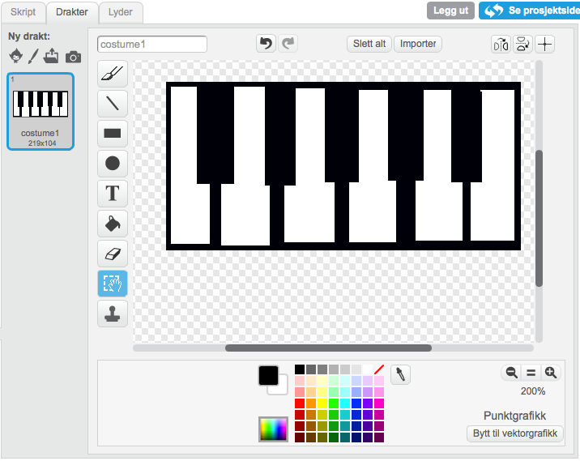
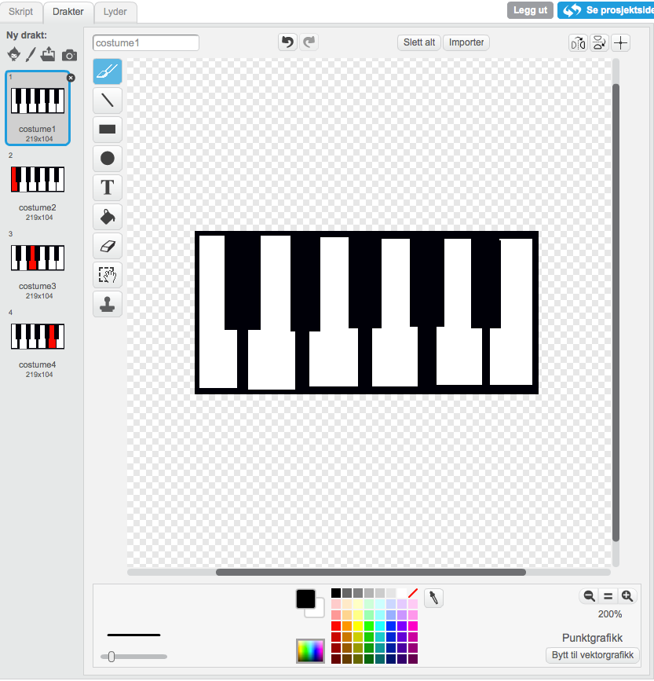

## Sjekkliste { .check}

+ Tegn et piano ved å lage svarte og hvite rektangler.
  

+ Lag et skript som spiller en note når a trykkes.

```blocks
når [a v] trykkes
send melding [piano-1 v]

når jeg mottar [piano-1 v]
spill tone (60 v) i (0.5) takter
---
+ Lag to noter til for når man trykker "s" eller "d" på tastaturet.

```blocks
når [a v] trykkes
send melding [piano-1 v]

når [s v] trykkes
send melding [piano-2 v]

når [d v] trykkes
send melding [piano-3 v]

når jeg mottar [piano-1 v]
spill tone (60 v) i (0.5) takter

når jeg mottar [piano-2 v]
spill tone (64 v) i (0.5) takter

når jeg mottar [piano-3 v]
spill tone (67 v) i (0.5) takter

---

+ Kopier drakten 3 ganger og fyll ulike tangenter.

  
  

+ Sørg for at hver note bytter til en annen drakt og tilbake til `drakt1`{.blockblue} slik at det ser ut som tangenten blir trykket på.

```blocks
når jeg mottar [piano-1 v]
bytt drakt til [costume2 v]
spill tone (60 v) i (0.5) takter
bytt drakt til [costume1 v]

når jeg mottar [piano-2 v]
bytt drakt til [costume3 v]
spill tone (60 v) i (0.5) takter
bytt drakt til [costume1 v]

når jeg mottar [piano-3 v]
bytt drakt til [costume4 v]
spill tone (60 v) i (0.5) takter
bytt drakt til [costume1 v]
---

# Utfordring {.challenge} 
En måte å endre hvilket instrument som spilles.

```blocks
når [pil opp v] trykkes
velg instrument (tilfeldig tall fra (1) til (99))
---

