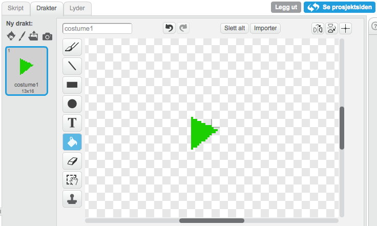

## Sjekkliste {.check}

+ Lag to nye lister (for alle figurer). Kall en av dem `instrument`{.blockred} og den andre `timing`{.blockred}.

+ Lag en ny variabel (for alle figurer) som heter `opptak`{.blockorange}

+ For hvert av instrumentene (tromme, piano, hver lyd etc.), må du
  legge til følgende i `når jeg mottar`{.blockbrown} klossen.
```blocks
hvis <(opptak) = (1)>
  legg (timer) til [timing v]
  legg (cat) til [instrument v]
---
  Endre ordet “cat” in `legg [cat] til [instrument v]`{.blockred} slik at det stemmer med
  navnet til meldingen som brukes for å spille denne lyden.
```blocks
når jeg mottar [drum v]
trommeslag (48 v) som varer (0.2) takter
hvis <(opptak) = (1)>
  legg (timer) til [timing v]
  legg (cat) til [instrument v]
slutt
sett størrelse til (110) %
vent (0.1) sekunder
sett størrelse til (100) %
---

+ Tegn en ny figur og gi den en rød sirkeldrakt. Gi denne figuren navnet “Opptak”.
  

+ Lag et skript som setter `opptak`{.blockorange} til 1 og sletter alle
  `instrument`{.blockred} og `timing`{.blockred} når man trykker på det.

## Test prosjektet {.flag}
  Prøv å trykk på opptaksknappen. Hva skjer når du spiller på instrumentene?

+ Lag en ny figur og lag en drakt som ser ut som en grønn pil.
  Kall denne “Spill av”.
  

+ Lag en ny variabel som du kaller `index`{.blockorange}.

+ Nå må vi få avspillingen til å gjøre noe. Legg dette skriptet til
  "Spill av"
```blocks
når denne figuren klikkes
sett [recording v] til (0)
sett [index v] til (1)
nullstill klokka
for alltid
  hvis <(element (index) av [timing v]) < (timer)>
    send melding (element (index) av [instrument v])
    endre [index v] med (1)
    hvis <(index) > (lengden av [timing v])>
      stopp [dette skriptet]
    slutt 
  slutt 
slutt
---

## Test prosjektet {.flag}
Trykk på den grønne play knappen. Hva skjer?

Trykk på den røde knappen og spill på noen intrumenter. Etter at du er ferdig,
trykk på den grønne play knappen igjen. Hva skjer?

Spill på flere instrumenter uten å trykke på record. Trykk så på den grønne play
knappen igjen. Hva skjer?

