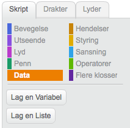

## Sjekkliste { .check}

1.  Klar!
    
    Trykk Lag en Variabel for å lage en index variabel
    
    


2.  Prøv denne koden
    
    Få figuren til å følge stien som ble tatt opp.

    ```scratch 
    når jeg mottar [replay v]
        sett [index v] til [1]
        gjenta (length of [xs v]) ganger
            sett x til (element (index) av [xs v])
            sett y til (element (index) av [ys v])
            endre [index v] med (1)
            vent (0.1) sekunder
       slutt
    
    ```
