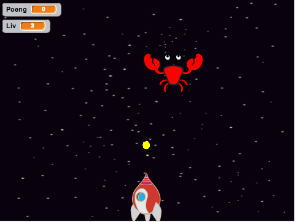
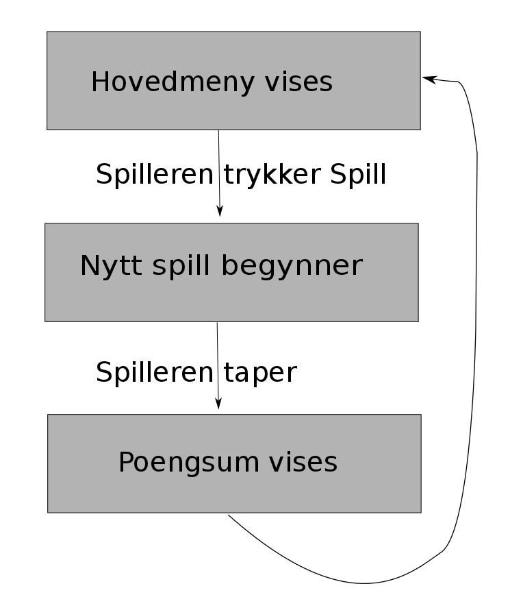

---
title: Krabbeangrep!
level: 1.3
language: nb-NO
stylesheet: scratch
embeds: ["*.png", "../../bilder/*.png"]
note: "README.md"
...

# Introduksjon {.intro}
*Denne uken skal vi gjøre noe litt annerledes. I stedet for å lage et spill fra bunnen av skal vi remikse et eksisterende spill. Vi skal lære hvordan vi kan gjøre et spill mer komplett ved å blant annet legge til en meny som styrer spillflyten, og som lar oss spille flere ganger. Spillet vi skal remikse heter Krabbeangrep! og det går ut på at spilleren styrer en kanon som skal forsvare jorden mot et intergalaktisk krabbeangrep! Kanonen skyter kuler som tar knekken på krabbene og får poeng når den treffer.*

# Steg 1: Bli kjent med spillet {.activity}
_Før vi begynner å kode noe som helst skal vi bli litt kjent med spillet som det er_

## Sjekkliste {.check}
+ Gå inn på http://scratch.mit.edu/users/gubbisduff/ og klikk på prosjektet Krabbeangrep!
+ Trykk på knappen der det står `Remiks` øverst i høyre hjørne. Nå har du en kopi av spillet på din egen bruker som du kan gjøre hva du vil med uten å gjøre endringer på originalen. 
+ Bruk noen minutter på å se igjennom alle skriptene i prosjektet. Les igjennom alle kommentarene og vær helt sikker på at du har forstått hvordan spillet fungerer før du går videre; spør gjerne om hjelp!

## Test prosjektet {.flag}
_Prøv et spill eller to for å bli bedre kjent med spillet_

# Steg 2: Vi lager en meny {.activity}
_Nå skal vi lage en meny som dukker opp når spillet starter og når spillet er slutt. Menyen skal i første omgang være veldig enkel, alt som skal være der er en startknapp._ 

Se nøye på skissen under før du går videre. Her ser du hvordan flyten i spillet skal være. Flyten i spillet skal styres gjennom beskjeder som sendes mellom figurene. Hver gang noe nytt skal skje, som for eksempel et nytt spill skal startes, eller at menyen skal vises etter spillet er tapt skal det sendes en beskjed. 

## Sjekkliste {.check}
+ 
+

## Test prosjektet {.flag}

# Steg 3: Spillet tar form {.activity}

## Sjekkliste {.check}

## Test prosjektet {.flag}

## Lagre prosjektet {.save}
	
## Utfordring: Lag flere typer angripere {.challenge}

ting jeg kan ha bruk for:
*Vi lager en katt som kan gå rundt i Antarktis på egen hånd.*
__Klikk på det grønne flagget.__
### Antarktis {.protip}
