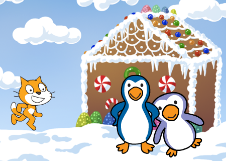

---
title: Bursdag i Antarktis
level: 1.3
language: nb-NO
stylesheet: scratch
embeds: ["*.png", "../../bilder/*.png"]
note: "README.md"
...

# Introduksjon {.intro}

Bursdag i Antarktis er en interaktiv animasjon som forteller
historien om en liten katt som har gått seg bort på bursdagen
sin. Heldigvis treffer han noen hyggelige pingviner han kan feire
sammen med.



# Steg 1: En katt på villspor {.activity}

*Vi lager en katt som kan gå rundt i Antarktis på egen hånd.*

Vi skal etterhvert fortelle en ganske spennende historie om katten som
møter dansende pingviner på bursdagen sin. Men som alltid er det greit
å begynne med noe ganske enkelt, for deretter å bygge videre på det.

## Sjekkliste {.check}

+ Start et nytt prosjekt. Gi kattefiguren navnet `Felix`, og sett
rotasjonsmåten hans til .
+ Lag en ny bakgrunn ved å klikke
 nede til venstre på
skjermen. Velg `Utendørs/winter`.
+ Legg også til bakgrunnen `Alt/winter-lights`.
+ Vi begynner med et skript på scenen, som passer på at vi viser
`winter`-bakgrunnen når animasjonen starter. Gå til
`Skript`{.blocklightgrey}-fanen og legg til

    ```blocks
        når grønt flagg klikkes
        bytt bakgrunn til [winter v]
    ```

+ Da kan vi få katten til å flytte på seg. Klikk på `Felix` og gi ham
dette skriptet:

    ```blocks
        når grønt flagg klikkes
        gå til x: (-100) y: (-50)
    ```
    
    Her kan du eksperimentere litt med tallene for `x` og `y` til du
    finner noe som du synes ser bra ut.
    
+ La oss nå få Felix til å bevege seg over skjermen. Vi skifter mellom
de to draktene hans for at det skal se ut som om han går. Utvid
skriptet til Felix på denne måten:

    ```blocks
        når grønt flagg klikkes
        gå til x: (-100) y: (-50)
        pek i retning (100 v)
        gjenta til ((x-posisjon) > (240))
            gå (10) steg
            neste drakt
            vent (0.1) sekunder
    ```
	
	Tallet 100 i `pek i retning`{.blockblue}-klossen gjør at Felix går
	litt nedover mens han går over skjermen. Prøv gjerne med noen
	andre tall for å se effekten av dem.

## Test prosjektet {.flag}

__Klikk på det grønne flagget.__

+ Vandrer Felix over skjermen?
+ Stopper han når kommer til kanten på skjermen?
+ Starter han på nytt på venstre side av skjermen om du klikker på det
grønne flagget igjen?

### Antarktis {.protip}

Antarktis er navnet på området der Sydpolen ligger. Selv om det ikke
bor verken mennesker eller katter fast på Antarktis finnes det veldig
mange pingviner der.

## Sjekkliste {.check}

Vi vil nå få bakgrunnen til å endre seg når katten kommer til enden av
skjermen. Vi begynner med noe enkelt, men som ikke fungerer så veldig
bra.

+ Lag et nytt skript på Scenen.

    ```blocks
        når grønt flagg klikkes
        vent (3) sekunder
        bytt bakgrunn til [winter-lights v]
    ```

+ Legg også til en kloss som flytter Felix inn på veien etter at
bakgrunnen er byttet.

    ```blocks
        når grønt flagg klikkes
        gå til x: (-100) y: (-50)
        pek i retning (100 v)
        gjenta til ((x-posisjon) > (240))
            gå (10) steg
            neste drakt
            vent (0.1) sekunder
        slutt
		gå til x: (-20) y: (-100)
    ```

## Test prosjektet {.flag}

__Klikk på det grønne flagget.__

+ Skifter bakgrunnen når Felix kommer til enden av skjermen?
+ Klarer du å endre tallet i klossen `vent 3 sekunder`{.blockyellow}
slik at det ser bedre ut?

# Steg 2: Det blir enklere med meldinger {.activity}

*Vi skal nå begynne å bruke meldinger for å få ting til å skje på
 samme tid.*

Vi har sett at vi kan klare å få ting til å skje samtidig ved å bruke
`vent`{.blockyellow}-klosser. Men det er vanskelig å finne ut akkurat
hvor lenge vi bør vente, og det er kjedelig å måtte endre på denne
tiden om vi forandrer for eksempel hvor fort Felix går.

Vi skal derfor i stedet bruke __meldinger__. Slike meldinger er noe
figurene kan sende til hverandre eller til scenen uten at de er
synlige for oss som ser på.

## Sjekkliste {.check}

+ La katten sende en melding når han når kanten av skjermen.

    ```blocks
        når grønt flagg klikkes
        gå til x: (-100) y: (-50)
        pek i retning (100 v)
        gjenta til ((x-posisjon) > (240))
            gå (10) steg
            neste drakt
            vent (0.1) sekunder
        slutt
		send melding [scene 2 v]
    ```

+ Vi kan nå slette det gamle skriptet på scenen som byttet bakgrunn
til `winter-lights`, og heller bruke dette:

    ```blocks
        når jeg mottar [scene 2 v]
        bytt bakgrunn til [winter-lights v]
    ```
	
+ Felix kan også motta meldinger han sender selv. Vi kan bruke dette
til å flytte han inn på veien samtidig som vi bytter bakgrunn. Legg
til følgende som et nytt skript på Felix:

    ```blocks
	    når jeg mottar [scene 2 v]
		gå til x: (-20) y: (-100)
    ```

## Test prosjektet {.flag}

__Klikk på det grønne flagget.__

+ Går Felix fortsatt over skjermen?
+ Hva skjer når han kommer til kanten av skjermen? Vi har laget to
skript som sier at bakgrunnen skal endre seg og katten skal flytte til
midten av skjermen. Skjer dette?

# Steg 3: Felix introduserer seg selv {.activity}

# Steg 4: Gå opp mot husene {.activity}

# Steg 5: Si hei til pingvinene {.activity}

# Steg 6: Pingvinene danser {.activity}

## Test prosjektet {.flag}

__Klikk på det grønne flagget.__

+ blah blah

## Lagre prosjektet {.save}

*Nå har vi begynt på historien om katten som feirer bursdagsen sin i
 Antarktis. Men kanskje du kan fortelle mer om hva som skjer videre?*

Eller om du heller vil vise fram historien din til familie og venner
kan du velge `Legg ut` på toppen av skjermen.

## Utfordring: Historien fortsetter {.challenge}

Kan du fortsette på historien? Hva skjer videre?

Kanskje du kan introdusere flere figurer, eller flere bakgrunner? For
eksempel kan det hende at pingvinene inviterer katten med seg inn i
huset? Eller kanskje de sammen går videre på leting etter en båt som
katten kan bruke for å komme seg hjem til Norge?

Husk at du kan også blande animasjonen med et lite spill, og så gå
tilbake til mer animasjon! Det er helt opp til deg!
