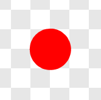
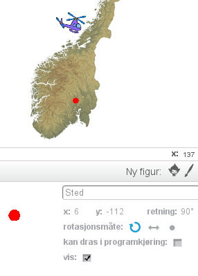

---
title: Norgestur
level: 1.4
language: nb-NO
stylesheet: scratch
embeds: ["*.png", "../../bilder/*.png"]
note: "README.md"
...

# Introduksjon {.intro}

Bli med på en rundreise i Norge! Vi skal lage et spill hvor du styrer
et helikopter rundt omkring et kart over Norge, mens du prøver å
raskest mulig finne steder og byer du blir bedt om å besøke.


# Steg 1: Et norgeskart {.activity}

*Vi legger først inn et norgeskart som en bakgrunn. Dette vil vi
 senere bruke helikopteret til å besøke.*

## Sjekkliste {.check}

+ Vi må først laste ned filen som inneholder kartet fra nettet. Hvis
du allerede har fått denne filen på datamaskinen din kan du hoppe over
det neste punktet.

+ Åpne en ny fane i nettleseren din og skriv inn adressen
<http://kodeklubben.github.io/nb-NO/scratch.1/04/norgeskart.png>.
Dette vil åpne et bilde av et norgeskart. Høyreklikk på bildet, og
velg `Lagre bildet som` eller noe som ligner. Lagre bildet et sted du
finner det igjen, for eksempel på Skrivebordet.

+ Start et nytt Scratch-prosjekt. Slett kattefiguren, for eksempel ved
å høyreklikke på den og velge `slett`.

+ Legg inn norgeskartet som bakgrunn ved å velge
 under `Ny bakgrunn`
helt til venstre på skjermen. Velg filen `norgeskart.png` du lastet
ned tidligere.

### Norgeskart {.protip}

Det finnes mengder av kart man kan finne på internett. Det kartet vi
bruker i denne oppgaven er laget av Kartverket og delt slik at alle
kan bruke det til hva de ønsker. Bakerst i denne oppgaven beskrives
hvordan du kan bruke andre kart.

# Steg 2: Styr helikopteret {.activity}

*Vi skal nå lage et helikopter som vi kan styre rundt over kartet. Vi
 begynner med å programmere et skript som lar oss kontrollere
 helikopteret med piltastene.*

## Sjekkliste {.check}
 
+ Legg til en ny figur ved å klikke
 under
`Figurer`. Vi har brukt `Transport/Helicopter`, men du kan eventuelt
bruke en annen figur du vil reise rundt med.

+ Klikk `i`{.blockblue} og skift navn på figuren til
`Helikopter`. Sett også rotasjonsmåten til
 for å unngå at helikopteret
flyr opp-ned.

+ Vi begynner med å gjøre helikopteret mindre, samt sikre oss at det
alltid starter på samme sted. Lag dette skriptet:

    ```blocks
	    når grønt flagg klikkes
		sett størrelse til (25) %
		gå til x: (0) y: (0)
	```
	
+ Vi skal nå programmere at helikopteret kontrolleres med
piltastene. Vi gjør dette ved å starte en løkke som vi gjentar for
alltid. Inne i denne evige løkken tester vi om piltastene er trykket
og i så fall flytter vi helikopteret. Først lager vi koden som flytter
helikopteret oppover:

    ```blocks
	    når grønt flagg klikkes
		sett størrelse til (25) %
		gå til x: (0) y: (0)
        for alltid
		    hvis (tast [pil opp v] trykket?)
			    pek i retning (0 v)
				gå (2) steg
			slutt
		slutt
	```

## Test prosjektet {.flag}

__Klikk på det grønne flagget.__

+ Starter en liten utgave av helikopteret omtrent midt på skjermen
(litt nordvest for Trondheim)?
+ Flytter helikopteret seg oppover når du trykker pil opp-tasten?
+ Skjer det noe når du trykker de andre piltastene?

## Sjekkliste {.check}

Vi skal nå programmere de andre piltastene også.

+ Koden for å flytte helikopteret med de andre piltastene er veldig
lik koden som flytter helikopteret oppover. Vi kan derfor kopiere
denne! Høyreklikk på klossen `hvis `{.blockyellow}`tast pil opp
trykket?`{.blocklightblue}, og velg `lag en kopi`. Slipp disse
klossene inn i `for alltid`{.blockyellow}-løkken. Gjenta til du har
fire `hvis`{.blockyellow}-klosser. Endre på skriptet ditt slik at det
ser ut som følger:

    ```blocks
	    når grønt flagg klikkes
		sett størrelse til (25) %
		gå til x: (0) y: (0)
        for alltid
		    hvis (tast [pil opp v] trykket?)
			    pek i retning (0 v)
				gå (2) steg
			slutt
		    hvis (tast [pil høyre v] trykket?)
			    pek i retning (90 v)
				gå (2) steg
			slutt
		    hvis (tast [pil ned v] trykket?)
			    pek i retning (180 v)
				gå (2) steg
			slutt
		    hvis (tast [pil venstre v] trykket?)
			    pek i retning (-90 v)
				gå (2) steg
			slutt
		slutt
	```

## Test prosjektet {.flag}

__Klikk på det grønne flagget.__

+ Kan du bruke alle fire piltastene til å flytte helikopteret?
+ Hva er det som bestemmer hvor fort helikopteret beveger seg? Prøv å
forandre på skriptet ditt slik at helikopteret flyr raskere eller
saktere.

## Utfordring: Hastighetsvariabel {.challenge}

Hvis du ser i skriptet så har vi gjentatt tallet 2 hele fire
ganger. Dette gjør det vanskeligere for oss om vil endre hvor fort
helikopteret beveger seg.

Hvis du vil kan du prøve å lage en ny variabel som heter
`hastighet`. Deretter kan du sette denne variabelen lik 2 etter at det
grønne flagget klikkes. Til slutt kan du bytte ut `gå 2
steg`{.blockblue}-klossene med `gå
`{.blockblue}`hastighet`{.blockorange}` steg`{.blockblue}-klosser.

# Steg 3: Legg til et reisemål {.activity}

*Nå som helikopteret kan fly rundt omkring i Norge kan vi gi spilleren
 et mål med reisen.*
 
## Sjekkliste {.check}

+ Vi skal nå tegne vår egen figur som vi vil bruke til å markere et
sted på kartet. Klikk  under `Figurer`.

+ Vi trenger bare en ganske liten sirkel. Velg en passende farge, for
eksempel vil rød synes ganske godt på kartet. Velg deretter
sirkelverktøyet, og marker den fyllte sirkelen (ellipsen) til venstre
under tegnevinduet.

+ Før vi begynner å tegne kan du forstørre tegningen din ved å trykke
på forstørrelsesglasset nederst til høyre. For eksempel vil 800%
forstørrelse passe bra. Hold inne `skift`-knappen mens du drar ut en
sirkel som er omtrent fire ruter stor. `skift`-knappen hjelper deg til
å lage en helt rund sirkel.

    

+ Klikk på `i`{.blockblue} og gi denne nye figuren navnet `Sted`.

+ Dra denne nye sted-figuren til et sted på kartet du vil at skal være
første reisemål. Vi har brukt `Hønefoss` som første reisemål, men du
kan velge et annet sted om du vil.

+ Vi trenger nå koordinatene til reisemålet vårt. Disse finner vi ved
se på figurinformasjonen etter tallene som står bak `x` og `y`. I
eksempelet under er koordinatene `x: 6` og `y: -112`. Disse forteller
hvor på kartet vi har lagt reisemålet.

    

+ Klikk på `Skript`{.blocklightgrey}-fanen. Vi skal nå lage koden som
legger `Sted`-figuren på riktig sted, og senere oppdager om
helikopteret reiser dit.

    ```blocks
	    når grønt flagg klikkes
	    send melding [Sted: Hønefoss v]

        når jeg mottar [Sted: Hønefoss v]
		gå til x: (6) y: (-112)
		vent til (berører [Helikopter v]?)
		si [Fant Hønefoss!] i (2) sekunder
    ```
	
	Legg merke til at i `gå til`{.blockblue}-klossen bruker vi samme
	koordinater som de vi fant ovenfor. Det betyr at om du bruker ditt
	eget reisemål må du bytte disse tallene med de du fant.

## Test prosjektet {.flag}

__Klikk på det grønne flagget.__

+ Er `Sted`-figuren der den skal være på kartet?
+ Sier den `Fant Hønefoss!` (eller ditt reisemål) når helikopteret
flyr til reisemålet?

# Steg 4: Et nytt reisemål {.activity}

*La oss legge til et nytt reisemål vi kan reise til etter å ha besøkt
 det første!*

## Sjekkliste {.check}

+ Flytt `Sted`-figuren til et nytt sted på kartet. Vi bruker
`Tromsø`. Finn koordinatene til dette nye stedet på samme måte som
sist.

+ Legg til en melding nederst i `Hønefoss`-skriptet som kaller et nytt
reisemål. Lag deretter et nytt skript for det nye stedet. Dette nye
skriptet er veldig likt det første, så du bør høyreklikke på `når jeg
mottar Sted: Hønefoss`{.blockgrey}-klossen og velge `lag en kopi`.

    ```blocks
        når jeg mottar [Sted: Hønefoss v]
		gå til x: (6) y: (-112)
		vent til (berører [Helikopter v]?)
		si [Fant Hønefoss!] i (2) sekunder
		send melding [Sted: Tromsø v]

        når jeg mottar [Sted: Tromsø v]
		gå til x: (103) y: (121)
		vent til (berører [Helikopter v]?)
		si [Fant Tromsø!] i (2) sekunder
    ```
	
	Bruk dine egne koordinater (og navn) også for det andre
	reisemålet.

## Test prosjektet {.flag}

__Klikk på det grønne flagget.__

+ Flytter reisemålet seg etter at du har funnet det første?
+ Oppdager også det andre reisemålet at du finner det?

# Steg 5: Skjul reisemålene {.activity}

*Foreløbig er ikke spillet veldig vanskelig: Alt du behøver å gjøre er
 å styre helikopteret til den røde sirkelen. For å lage et skikkelig
 spill vil vi skjule den røde sirkelen, og heller bare fortelle
 spilleren til hvilket sted hun skal fly!*

## Sjekkliste {.check}

Vi vil først fortelle spilleren hvor han skal fly. Dette kan for
eksempel gjøres ved at vi lager en ny figur (kanskje `Dyr/Monkey2`?),
som kan si `Reis til Hønefoss` når den mottar meldingen `Sted:
Hønefoss` og så videre. I punktene under viser vi et annet alternativ,
men prøv gjerne å lage en slik figur selv!

+ Lag en ny variabel, ved å klikke på `Data`{.blockorange} og deretter
`Lag en variabel`{.blocklightgrey}. Kall variabelen `Reis til` og velg
at den skal gjelde `For alle figurer`.

+ Legg merke til at det dukket opp en boks på kartet, `Reis til
`{.blocklightgrey}` 0 `{.blockorange}. Flytt denne boksen til et
passende sted slik at den er lett å lese.

+ Nå kan vi oppdatere koden til `Sted` slik at den setter denne `Reis
til`-variabelen. Endre først `Hønefoss`-skriptet som følger:

    ```blocks
        når jeg mottar [Sted: Hønefoss v]
		gå til x: (6) y: (-112)
        sett [Reis til v] til [Hønefoss]
        vent til (berører [Helikopter v]?)
		si [Fant Hønefoss!] i (2) sekunder
		send melding [Sted: Tromsø v]
    ```

+ Endre også det andre reisemål-skriptet på samme måte:

    ```blocks
        når jeg mottar [Sted: Tromsø v]
		gå til x: (103) y: (121)
        sett [Reis til v] til [Tromsø]
        vent til (berører [Helikopter v]?)
		si [Fant Tromsø!] i (2) sekunder
    ```

## Test prosjektet {.flag}

__Klikk på det grønne flagget.__

+ Fungerer fortsatt spillet som tidligere?
+ Oppdaterer `Reis til`-variabelen seg slik du forventet?

## Sjekkliste {.check}

Vi er nå klare til å skjule den røde sirkelen. Vi prøver først det
enkleste og mest opplagte:

+ Legg til en `skjul`{.blockpurple}-kloss i oppstartskriptet på
`Sted`-figuren.

    ```blocks
	    når grønt flagg klikkes
        skjul
        send melding [Sted: Hønefoss v]
    ```

## Test prosjektet {.flag}

__Klikk på det grønne flagget.__

+ Blir den røde sirkelen borte?
+ Hva skjer om du reiser til Hønefoss?

Hmm ... spillet oppdager ikke lengre at vi reiser til
Hønefoss. Problemet er at siden vi skjuler sirkelen vil den ikke
lengre berøre `Helikopter`-figuren. Vi må finne en annen måte å gjøre
sirkelen usynlig på!

## Sjekkliste {.check}

+ I stedet for å skjule sirkelen helt vil vi heller gjøre den
gjennomsiktig! Bytt ut `skjul`{.blockpurple}-klossen med en `sett
effekt`{.blockpurple}-kloss.

    ```blocks
	    når grønt flagg klikkes
        vis
		sett [gjennomsiktig v] effekt til (100)
        send melding [Sted: Hønefoss v]
    ```

    Vi har også lagt til en `vis`{.blockpurple}-kloss for å være på
    den sikre siden (vi har jo oppdaget at spillet ikke virker om
    `Sted`-figuren er skjult).

## Test prosjektet {.flag}

__Klikk på det grønne flagget.__

+ Er fortsatt den røde sirkelen usynlig?
+ Hva skjer nå om du reiser til Hønefoss?

# Steg 6: Vis reisemålet når det blir funnet {.activity}

*Det vil være kult å vise spilleren hvor reisemålet faktisk er etter
 at hun har funnet det!*
 
## Sjekkliste {.check}

+ La oss lage en ny melding, `Fant sted`, som vi kan sende hver gang
spilleren finner et reisemål. Denne meldingen kan vi så bruke til å
kjøre et skript hver gang vi finner et reisemål. Endre
`Sted`-skriptene som følger:

    ```blocks
        når jeg mottar [Sted: Hønefoss v]
		gå til x: (6) y: (-112)
        sett [Reis til v] til [Hønefoss]
        vent til (berører [Helikopter v]?)
		send melding [Fant sted v] og vent
		send melding [Sted: Tromsø v]

        når jeg mottar [Sted: Tromsø v]
		gå til x: (103) y: (121)
        sett [Reis til v] til [Tromsø]
        vent til (berører [Helikopter v]?)
		send melding [Fant sted v] og vent
    ```
	
+ Når vi mottar `Fant sted`-meldingen vil vi vise hvor reisemålet
faktisk ligger. Siden sirkelen snart flyttes videre kan vi ikke bare
gjøre figuren synlig, vi må også `stemple avtrykk`{.blockgreen} av
figuren på bakgrunnen. Legg til dette skriptet:

    ```blocks
	    når jeg mottar [Fant sted v]
		sett [gjennomsiktig v] effekt til (0)
		stemple avtrykk
		sett [gjennomsiktig v] effekt til (100)
    ```

## Test prosjektet {.flag}

__Klikk på det grønne flagget.__

+ Dukker den røde sirkelen opp etterhvert som du finner reisemålene?
+ Hva skjer om du starter spillet på nytt etter å ha funnet reisemålene?

## Sjekkliste {.check}

+ For å være sikker på at avtrykkene (de røde sirklene) blir borte når
vi starter spillet på nytt kan vi bruke
`slett`{.blockgreen}-klossen. Legg til en kloss på oppstart-skripet:

    ```blocks
	    når grønt flagg klikkes
        vis
		sett [gjennomsiktig v] effekt til (100)
        slett
        send melding [Sted: Hønefoss v]
    ```

+ La oss også legge på en enkel lydeffekt når spilleren finner et
reisemål. Siden vi har meldingen `Fant sted` er dette enkelt. Klikk
først på `Lyder`{.blocklightgrey}-fanen og velg en ny lyd fra
biblioteket. Vi bruker `Effekter/rattle`, men du kan gjerne bruke en
annen lyd.

+ Spill lyden når et sted blir funnet. Klikk
`Skript`{.blocklightgrey}-fanen og legg til en `spill
lyden`{.blockpink}-kloss.

    ```blocks
	    når jeg mottar [Fant sted v]
		spill lyden [rattle v]
		sett [gjennomsiktig v] effekt til (0)
		stemple avtrykk
		sett [gjennomsiktig v] effekt til (100)
    ```

## Test prosjektet {.flag}

__Klikk på det grønne flagget.__

+ Blir de røde sirklene slettet når du starter spillet på nytt?
+ Spilles det av en liten lyd når du finner et reisemål?

# Steg 7: Tiden går {.activity}

*Vi skal nå gjøre spillet enda mere utfordrende, ved å legge på en
 tidsbegrensning.*
 
## Sjekkliste {.check}

# Steg 8: Flere steder å besøke {.activity}

# Hvordan lage egne kart {.activity}

