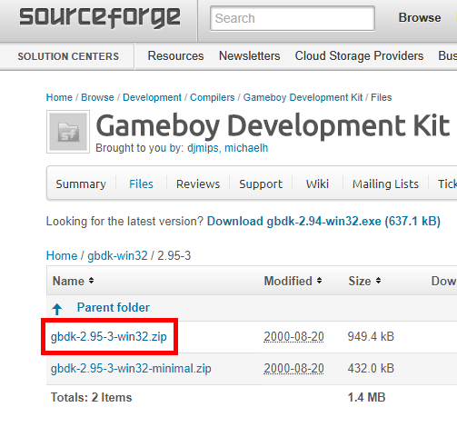
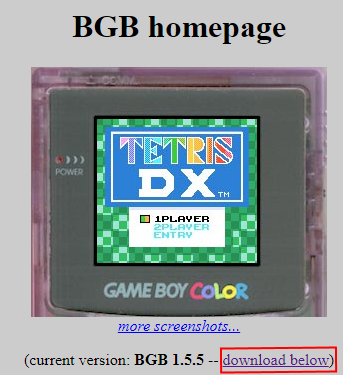
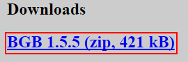

# Installasjon av GBDK og Bgb {.intro}

"Gameboy" var den første konsollen til Nintendo, som du kunne bytte spillet ut med et annet, ved bruk av kassetter.

Her kan du se hvordan du setter opp utviklerområdet på en Windows pc.

# Installering av GBDK {.activity}

GBDK er en oversetter, som oversetter kode som mennesker kan lese, til kode som
Gameboy-en kan lese.

# Sjekkliste {.check}

- [ ] Gå til [GBDK lastest release side på sourceforge-nettsiden](https://sourceforge.net/projects/gbdk/files/gbdk-win32/2.95-3/)

- [ ] Last ned gbdk-x.xx.x-win32.zip

- [ ] Pakk ut til en plass på datamarskinen (Husk hvor du legger den!)

- [ ] Last ned [denne filen](ByggKode.bat)

- [ ] Legg ByggKode.bat -filen inn i bin -mappen, i GBDK -mappen.

Du har nå installert GBDK!

# Installering av Bgb {.activity}

Ved å bruke GBDK, får du kode som en ekte Gameboy kan lese. Men det er en liten
sjanse for at du har en Gameboy og et flashkort liggende. Derfor bruker vi Bgb,
en emulator.

Dette programmet, later som om den er en ekte Gameboy, slik at du får
testet ut koden din.

# Sjekkliste {.check}

- [ ] Gå til [Bgb -hovednettsiden](http://bgb.bircd.org/)

- [ ] Trykk på [download below](http://bgb.bircd.org/#downloads)

- [ ] Last ned BGB x.x.x (zip, x kB)

- [ ] Åpne Zip -filen

- [ ] Kopier bgb.exe til bin -mappen, i gbdk -mappen din.

- [ ] Last ned [denne filen](KjorKode.bat)

- [ ] Flytt filen til bin -mappen også

Du har nå installert Bgb!

# Vis filtyper {.activity}

Dette er et steg du kan hoppe over hvis du har gjordt dette tidligere.

For å endre filtypene til de forskjellige filene, er det lettest å endre dem med
å gi dem et nytt navn.

# Sjekkliste {.check}

- [ ] Åpne et filutforsker-vindu

- [ ] I raden på toppen velger du "Vis"

- [ ] I seksjonen "Vis/Sjul" Aktiver "Vis Filtyper"

Du har nå aktivert visning av filtyper!
