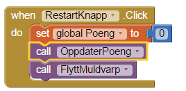

# Introduksjon {.intro}
I denne oppgaven skal vi lage et veldig enkelt spill med litt animasjon. Det som skal skje er at en muldvarp hopper rundt på spillbrettet og så prøver spilleren å trykke på muldvarpen før den hopper videre. Hvis spilleren klarer å treffe muldvarpen, får spilleren poeng og mobilen vil vibrere. Ved å trykke på restartknappen, starter spillet på nytt.
Vi skal nå lære litt om animasjon, events og prosedyrer.
Logg inn på App Inventor og lag et nytt prosjekt som heter `KlaskEnMuldvarp`

. 

# Steg 1: Gjøre klart spillbrettet {.activity}
Det første vi trenger er en 'Canvas' komponent som tegner selve spillbrettet. Dette vil være hvor muldvarpen hopper rundt på skjermen. 
Et canvas er bare en komponent som inneholder grafikk, den tegner ikke selv, men vi kan legge til streker, sirkler, tekst, firkanter og bilder på canvaset. 

## Sjekkliste {.check}

+ Last ned gresset vi vil ha i bakgrunnen [her](gress.png)
+ Gå til **Palette** og **Drawing and Animation**. Der velger du , og drar den over til skjermem i **Viewer**. Under **Components**, trykk på **Rename** og gi den navnet 'Spillbrettet'. Legg merke til at spillbrettet vises på skjermen.
+ Gå til **Properties** og sett høyden og bredden for spillbrettet:
* Trykk på Height og skriv inn 300 ved siden av pixels og trykk **OK**
* Trykk på Width og skriv inn 340 ved siden av pixels og trykk **OK**
* Gå til **BackgroundImage** og trykk på **None...**. Trykk **Upload File**. Trykk på **Velg Fil** og velg bildet av gresset du nettopp lastet ned. Trykk **OK**. Sjekk at gresset vises i firkanten øverst på skjermen.

# Steg 2: Legge til poengtelleren og restartknappen {.activity}
For å vite hvor mange poeng spilleren har, må vi legge til en tekst som oppdateres hver gang spilleren treffer muldvarpen. Restartknappen lar spilleren starte spillet på nytt. 

## Sjekkliste {.check}
+ Gå til **Palette** og **User Interface**. Der velger du , og drar den over til skjermem i **Viewer**. Under **Components**, trykk på **Rename** og gi den navnet 'PoengTekst'. Pass på at teksten vises under spillbrettet.
+ Gå til **Properties** og forandre verdien under **Text** til 'Poeng: 0' 
+ Trykk på Width, velg **Fill parent** og trykk **OK**
+ Gå til **Palette** og **User Interface**. Der velger du , og drar den over til skjermem i **Viewer**. Under **Components**, trykk på **Rename** og gi den navnet 'RestartKnapp'. Pass på at knappen vises under spillbrettet.
+ Gå til **Properties** og forandre verdien under **Text** til 'Restart' 

# Steg 3: Få mobilen til å vibrere {.activity}
For å få mobilen til å vibrere når spilleren får poeng, må vi legge til en lyd.

## Sjekkliste {.check}
+ Gå til **Palette** og **Media**. Der velger du , og drar den over til skjermem i **Viewer**. Under **Components**, trykk på **Rename** og gi den navnet 'Brrr'. 

# Steg 4: Timere og klokkekomponenter {.activity}
For at muldvarpen skal kunne hoppe rundt på brettet over tid, trenger vi å legge til en klokke. Klokken hjelper oss å jobbe med tid, for eksempel vite hvilken dato det er eller hva klokken er. Her skal vi bruke den til å fortelle spillet at det skal gjøre noe hvert halvsekund. 

## Sjekkliste {.check}
+ Gå til **Palette** og **Sensors**. Der velger du , og drar den over til skjermem i **Viewer**. Under **Components**, trykk på **Rename** og gi den navnet 'Klokken'. 
+ Gå til **Properties** og forandre verdien under **TimerInterval** til 500 
+ Pass på at  er valgt 

# Steg 5: Muldvarpen! {.activity}
Siste komponenten vi mangler nå er selve muldvarpen. For å få en muldvarp som beveger seg, må vi legge til en **ImageSprite**. En sprite er et bilde som kan bevege seg på skjermen inne i et canvas. Canvaset vårt er spillbrettet som vi la til først. 
Hver sprite har en fart (Speed), retning (Heading) og intervall (Interval). Disse sier hvor fort den beveger seg, i hvilken retning og hvor ofte. En sprite vet også når de blir trykket på. I spillet vårt, er farten satt til 0, så den vil ikke bevege seg selv. Istedet setter vi posisjonen ved hjelp av klokken.

## Sjekkliste {.check}
+ Gå til **Palette** og **Drawing and Animation**. Der velger du , og drar den over til skjermem i **Viewer**. Pass på at du drar den oppå spillbrettet. Under **Components**, trykk på **Rename** og gi den navnet 'Muldvarpen'. 
+ Last ned muldvarpbildet her [muldvarp](http://explore.appinventor.mit.edu/sites/all/files/ai2tutorials/moleMash/mole.png)
+ Gå til **Properties** og trykk på **None...** under **Picture**. Trykk **Upload File**. Trykk på **Velg Fil** og velg bildet du nettopp lastet ned. Trykk **OK**. Sjekk at muldvarpen har kommet opp på skjermen.

Skjermbildet ditt burde nå se slik ut:
.

# Steg 6: Få ting til å skje! {.activity}
Vi har nå lagt til alle delene i appen vår. Du kan teste den på mobilen din, men du vil se at ingenting skjer. 
For å få noe til å skje på skjermen må vi legge til logikk og dermed kode. 

Koden er den magiske biten som gir applikasjonen din liv. Helt enkelt forteller koden spillet hva det skal gjøre med alle tingene vi har puttet på skjermen. 
Vi skriver kode ved hjelp av klosser. Disse klossene er kommandoer som settes sammen og ber applikasjonen å gjøre ting, for eksempel tegne et bilde eller vise en tekst.

Vi skal nå lage prosedyrer til spillet. Dette er en samling av flere kommandoer som har et navn og er satt sammen før de kalles. 
Hvis du har en samling av klosser som trenger å bli kalt flere ganger i et program, kan du definere det som en prosedyre. 
Da trenger du ikke sette sammen samme klosser flere ganger og du kan kalle dem ved å legge inn en enkelt kloss. 

## Sjekkliste {.check}
+ Trykk på Blocks øverst i høyre hjørne.
+ Trykk på den lilla blokken som heter **Procedures**. Vi ser at det er to forskjellige prosedyrer vi kan legge til. **to procedure do** og **to procedure result**
+ Velg denne: . Trykk på procedure og gi den navnet 'FlyttMuldvarp'

Klossen FlyttMuldvarp har et område i midten som sier 'do'. Det er her vi putter inn blokkene som sier hva som skal skje når prosedyren kjører. 

Det vi vil at skal skje er:
1. Sette muldvarpens X posisjon til et tilfeldig sted på spillbrettet som er tilfeldig tall mellom 0 og 1 og forskjellen mellom spillbrettets bredde og muldvarpens bredde.
2. Sette muldvarpens Y posisjon til et tilfeldig sted på spillbrettet som er tilfeldig tall mellom 0 og 1 og forskjellen mellom spillbrettets høyde og muldvarpens høyde.

Du får verdien ved å bruke klossen for *random fraction* og gange denne med spillbrettets størrelse minus muldvarpens størrelse.

+ Gå til **Blocks** og se hva du får fram når du trykker på de forskjellige fargene. 
+ Klossene du trenger vil være under **Math**, og på muldvarpen og spillbrettet. 
+ Lag en prosedyre som flytter muldvarpen slik beskrevet.

Dette burde se slik ut:
.

Se hvordan klossene kobler sammen. Den første delen bruker Muldvarp.X til å sette muldvarpens horisontale posisjon. Verdien den får er resultatet man får når man ganger en tilfeldig verdi mellom 0 og 1 og resultatet man får når man tar spillbrettets bredde minus muldvarpens bredde.

Når vi har laget denne prosedyren, kan vi fortsette med å lage en variabel som holder styr på hvor mange poeng spilleren har. Denne kan vi kalle Poeng. 

Dette burde se slik ut:

Lag en prosedyre som du kaller OppdaterPoeng på samme måte som du lagde FlyttMuldvarp. Velg den lilla **Procedures* og velg en **to procedure do**
Denne prosedyren skal oppdatere tekstfeltet med poengene når poengene endres. 

Det vi vil at skal skje er:
1. PoengTeksten blir oppdatert med en tekst satt sammen av en tekst som sier 'Poeng: ' og hvor mange poeng spilleren har.

+ Legg til en kloss som setter verdien til PoengTekst sin **Text** verdi. Koble denne til do feltet i prosedyren.
+ Gå til rosa **Text** og ta ut en joinkloss som du kobler til den forrige klossen slik at den setter setter poengteksten. Denne vil gjøre at du legger sammen to tekster.
+ Ta ut en tekskloss under rosa **Text** og forandre den slik at den sier 'Poeng: ' og koble denne øverst i joinklossen slik at denne teksten kommer først.
+ Under 'Poeng: ' legger du til en kloss fra orange **Variables** som heter get, og forandrer den til get global Poeng. 

Dette burde se slik ut:
.

# Steg 7: Få tiden til å gå {.activity}
Neste steg er å få muldvarpen til å flytte seg. Dette er hvor vi skal bruke Klokken. 
Klokken har en timer, denne timeren gir beskjed hver gang det har gått like lang tid fra sist den sa ifra som vi satte i TimerInterval i klokken.
Derfor vil den kjøre et event hvert halvsekund, eller 500 millisekunder. Et event er en hendelse som kan skje i applikasjonen som ved for eksempel et tastetrykk eller som nå når en timer går.
For å få noe til å skje når et event kjører bruker vi en event handler. Denne sier hvilke blokker som skal kjøre, når et event kjøres.
Klokken vår har en kloss som er event handleren for timeren.

Denne event handleren heter *when Klokken.Timer do*

## Sjekkliste {.check}
+ Sett timeren til å kalle FlyttMuldvarp

Dette burde se slik ut:
.

# Steg 8: Klask muldvarpen! {.activity}
Den viktigste biten er å vite når noen trykker på muldvarpen, slik at vi vet når spilleren skal få poeng. Hvis dere husker fra når vi la til muldvarpen, så sa vi at sprites vet når de blir trykket på. 
Alt vi trenger å gjøre er å si hva som skal skje ved å bruke event handleren for dette på muldvarpen. 

Denne event handleren heter *when Muldvarpen.Touched do* og finnes på muldvarpen.

Det vi vil at skal skje er:
1. Poeng variabelen går opp med 1 poeng.
2. OppdaterPoeng blir kalt, slik at poengene opdaterer seg på skjermen
3. Mobilen vibrerer i 1/10 sekunder (100 millisekunder)
4. FlyttMuldvarp blir kalt slik at muldvarpen fortsetter spillet.

Dette burde se slik ut:
.

# Steg 9: Restart spillet {.activity}
Den siste biten vi trenger å få på plass nå er å kunne starte spillet på nytt når vi trykker på restartknappen. 
Knapper har et event som heter click som kjøres knappen trykkes på. 

Denne event handleren heter *when RestartKnapp.Click do* og finnes på restartknappen.

Det vi vil at skal skje når knappen trykkes på er:
1. Poeng variabelen går ned til 0.
2. Oppdater poengteksten
3. FlyttMuldvarp blir kalt slik at muldvarpen fortsetter spiller.

Dette burde se slik ut:
.
  

 
 
 

## Test  appen på mobiltelefonen {.flag}
Installer appen på mobilen din og prøv spillet.

Virker spillet slik du ville?

## Utfordring: Dine egne tilpasninger {.challenge}
Hvordan kan du lage spillet enda bedre?

Kan du gjøre spillet vanskeligere?

## Ting å prøve {.try}

Prøv å sette timeren til en lavere verdi. Hva skjer?
