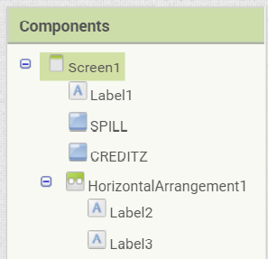

# Introduksjon {.intro}
Nå skal vi lage en app som heter `Ta ballen`. For å lage denne appen så forutsetter vi at vi vet hvordan
*MIT App Inventor* fungerer fra
[tidligere oppgavesett](http://kodeklubben.github.io/appinventor/introduksjon/introduksjon.html), og kan
utføre instruksjoner uten å få alt forklart i detalj. Denne appen går ut på at en ball spretter frem
og tilbake på skjermen, og du vinner ved å trykke på ballen med fingeren din. Dess kjappere du klarer
å treffe ballen, dess flere poeng får du. Dette er en ganske enkel app, men det er mulig å utvide
appen etter egne ønsker etterpå.

  

# Steg 1: Opprette spillskjerm {.activity}

Det første vi skal gjøre er å opprette en spillskjerm, og legge til en klokke og en ball.

## Sjekkliste {.check}

+ Starte nytt prosjekt og gi det navn `TaBallen`.

+ Du har nå kommet til en skjerm som heter `Screen1`. Lag en ny skjerm ved navn `Spill` ved å
  trykke på **Add Screen**.

+ Gå til **Drawing and Animation** i **Palette**-menyen og legg til **Canvas** og **Ball**.
  OBS! **Ball** må slippes inni **Canvas** på skjermen for at den skal bli lagt til.

+ Sett både `Height` og `Width` på **Canvas** til `Fill parent`.

+ Gå til **Sensors** i **Palette**-menyen og legg til **Clock**.

+ Til slutt kan du velge en passende farge og radius til ballen, samt farge til bakgrunnen.
  Et eksempel på hvordan det kan se ut er:

  

# Steg 2: Programmere spillet {.activity}

Nå skal vi programmere spillet. Dette gjør vi ved å opprette flere funksjoner for å sjekke tiden
og poengene i spillet når ballen blir trykket på. Vi må også bestemme hvordan ballen skal bevege
på seg i spillet.

## Sjekkliste {.check}

+ Nå er vi fortsatt på `Spill`-skjermen, og skal kode selve spillet. Trykk først på `Blocks` for å bytte
  til koding.

+ Det første vi må gjøre er å lage en ny variabel ved navn `Clock` som vi gir verdien `0`,
  slik at vi kan passe på tiden i spillet, og dermed også poengsummen.

+ Når vi lager et spill, så må vi ofte gjøre en del instillinger før selve spillet kan starte. Det må vi
  også gjøre her. Vi ønsker at ballen skal starte på en tilfeldig posisjon på skjermen, slik at det ikke
  blir så lett å ta den med en gang. Vi vil også at den skal bevege seg i en tilfeldig retning, og ha
  en tilfeldig fart. Vi ønsker også at vi skal få `10` sekunder på oss til å fange ballen før spillet er over,
  og at vi får ekstra masse poeng dersom vi klarer å ta ballen før tiden er ute. OBS! Timeren tar imot
  millisekunder, så `10` sekunder er det samme som `10000` millisekunder i koden. Koden for dette kan se slik ut:

  

+ For å sjekke om tiden er ute så trykker vi på **Clock1** og henter `when Clock1.Timer - do` og legger inn
  `close screen with value  result` og tallet `0`.

+ Vi må også passe på at ballen ikke spretter ut av skjermen, og det gjør vi ved å legge til
  `when Ball1.EdgeReached - do`. Inni denne blokken setter vi `call Ball1.Bounce - edge` og `get edge`.

+ Nå har vi kommet til det aller viktigste: hvordan vi kan vinne! Da ønsker vi at vi vinner ved å trykke på
  ballen kjappest mulig. Vi sa at tiden vi fikk er `10` sekunder, som igjen er `10000` millisekunder, slik som
  vist i bildet ovenfor. Vi skal da få `10000` poeng dersom vi klarer å ta ballen med en gang, også blir vi
  trukket `1` poeng for hvert millisekund som går. Det vil da se slik ut:

  

+ For å kunne gå tilbake til forsiden så legger vi inn en blokk som sier `when Spill.BackPressed - do`
  fra **Screen1**. Inne i denne blokken plasserer vi `open another screen  screenName` som er koblet
  med teksten `Screen1`.

+ Dersom du ønsker å endre på farten til ballen eller hvor lenge spillet skal vare så kan du fint
  gjøre det ved å endre på instillingene vi satt før spillet starter. Da er spillet klart, men vi
  har fremdeles noen ting vi må fikse før appen er helt ferdig.

# Steg 3: Designe menyen {.activity}

Nå vi starter appen, så kommer vi til en meny. Der skal vi vise poengsummen fra spillet,
og ha muligheten til å starte spillet på nytt.

## Sjekkliste {.check}

+ Gå tilbake til `Screen1` og `Designer`.

+ Legg til en **Label** øverst hvor du skriver `Ta ballen!`. La teksten være midtstilt og labelen fylle bredden.

+ Legg så til to knapper, **Button**, en med tekst `SPILL` og en ved navn `CREDITZ`. Gi også knappene de samme
  navnene som i teksten, slik at det vises under **Components**. La også knappene være midstilt og dekke
  bredden på skjermen.

+ Under **Layout** i **Palette**-menyen finner du **HorizontalArrangement**, som du legger til på skjermen.
  Inne i denne legger du til to nye labels. La den ene ha teksten `Rekord` og være plassert til venstre.
  La den andre være uten tekst, fylle bredden og plasser teksten til høyre. **Components** ser nå slik ut:

  

+ Til slutt fikser du på hvordan **Screen1** skal se ut. Legg gjerne til et bilde, endre bakgrunnsfarge,
  skriftstørrelse eller andre ting slik at den ser ut som du ønsker. Et eksempel på hvordan det kan se ut er:

  

# Steg 4: Programmere menyen {.activity}

Nå som menyen er designet ferdig, er vi nødt til å programmere den slik at noe skjer når vi trykker på knappene.

## Sjekkliste {.check}

+ Nå er vi fortsatt på `Screen1`-skjermen, men skal programmere meny-knappene våre. Trykk først på `Blocks`
  for å bytte til koding.

+ Først må vi lage en ny variabel ved navn `Score` som vi gir verdien `0`.

+ Så må vi sørge for at vi skifter skjerm når vi trykker på knappene. Trykk på **SPILL** og hent frem blokken som
  heter `When SPILL.Click - do`, og så hente frem blokken `open another screen  screenName` fra **Control** og
  fest på teksten `Spill`. Gjør så det samme for `Creditz`.

+ For å kunne avslutte appen så legger vi inn en blokk som sier `when Screen1.BackPressed - do` fra **SPILL**.
  Inne i denne blokken plasserer vi `close application`.

+ Så bestemmer vi poengsummen ved start ved `when Screen1.Initialize - do`, og `set Label3.Text to` knyttet
  til `get global Score`.

+ Til slutt skal vi lage en mer avansert blokk som sjekker om din nye poengsum er bedre enn tidligere poengsummer
  etter endt spill. Den blokken vil da se slik ut:

  

# Steg 5: Opprette krediteringskjerm {.activity}

Når vi har laget en app så er det litt gøy at det står hvem som har laget den,
og det skal vi nå lage en egen skjerm for å vise.

## Sjekkliste {.check}

+ Lag en ny skjerm ved navn "Creditz".

+ Legg til en **Label** hvor du skriver at `Denne appen er laget av ...`, etterfulgt av navnet ditt.
  Det kan også være passende å legge til et bilde, enten av deg selv eller noe annet kult.

+ For å kunne gå tilbake til forsiden så må vi bytte til `Blocks`, hvor vi legger inn en blokk som sier
`when Creditz.BackPressed - do` fra **Screen1**. Inne i denne blokken plasserer vi
`open another screen  screenName` som er koblet med `Screen1`.