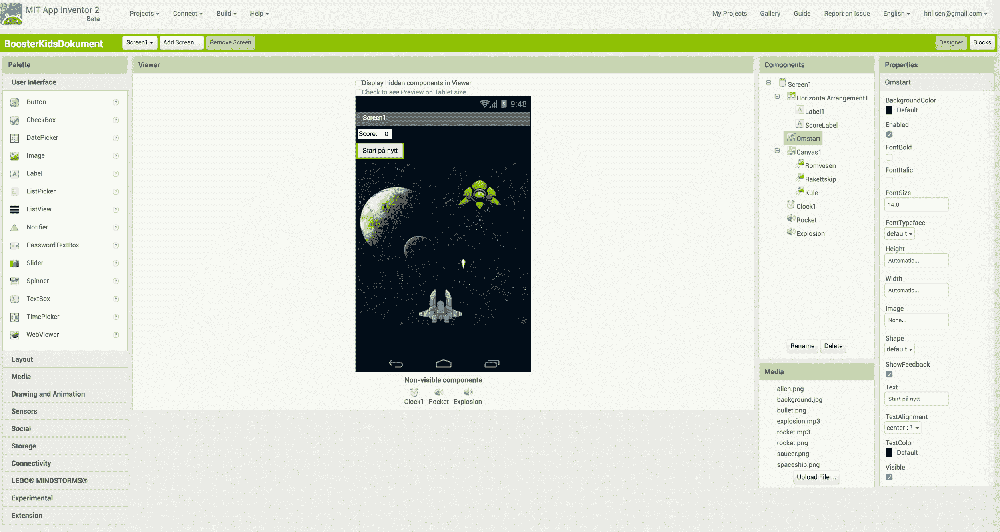

# Introduksjon {.intro}

I denne oppgaven skal vi lage et spill som heter Space Invaders, som er en enkel
utgave av det [klassiske spillet](https://youtu.be/MU4psw3ccUI?t=7). Spillet
handler om å styre et romskip som skal skyte ned en alien. Vi skal bruke
stoppeklokke, animasjoner og mye mer. Målet for appen er å skyte ned så mange
aliens som mulig.

# Steg 1: Komme i gang med App Inventor {.activity}

For å komme igang med App Inventor åpner vi nettsiden i Chrome
eller Firefox. OBS! App Inventor fungerer ikke i Internet Explorer.

## Sjekkliste {.check}

- [ ] Åpne [http://appinventor.mit.edu/](http://appinventor.mit.edu/).

- [ ] Trykk på "Create apps!" og logg inn med Google-kontoen din.

- [ ] Last ned de nødvendige figurene ved å høyreklikke på bildene under og
  lagre dem på datamaskinen din. Pass på å velge en mappe du enkelt finner igjen
  senere.

# Steg 2: La oss komme i gang med koding! {.activity}

*Vi starter med å designe grensesnittet for appen vår.*

Åpne "Designer" og legg til elementer slik at du får et grensesnitt du er
fornøyd med. Det kan for eksempel se ut som på bildet under:

## Sjekkliste {.check}

- [ ] __Canvas__ i gruppen __Drawing and Animations__ er lerretet vi skal ha
  figurene våre på. Gi det navnet `Canvas1`. Sett bredden (*width*) til `fill
  parent` og sett høyden (*height*) til `300`. Sett bakgrunnen (*background
  color*) til en farge du liker.

- [ ] Last opp romskipet, figuren vi skal styre i spillet. Gi figuren navnet
  `Romskip`. Sett `Y`-verdien til `230`, da blir romskipet plassert på bunnen av
  lerretet.

- [ ] Last opp romvesenet, figuren som er fienden i spillet. Gi figuren navnet
  `Alien`.

- [ ] Last opp kulen, figuren vi skyter med i spillet. Gi figuren navnet `Kule`.
  Sett `Y` til `20`.

- [ ] I gruppen __Sensors__ velg __Clock__ og gi den navnet `Clock1`. Denne skal
  vi bruke til å flytte på `Alien`. Sett `TimeInterval` til `3000`.

- [ ] I gruppen __Layout__ finner du __Horizontal Arrangement__, horisontal
  plassering. Denne boksen bruker vi til å holde orden på `Label1` og
  `ScoreLabel` som vi straks skal lage.

- [ ] I gruppen __User Interface__ finner du __Label__, merkelapp. Lag en
  merkelapp og gi den navnet `Label1`. Denne skal inneholde teksten `Poeng`, så
  skriv det i feltet `text`.

- [ ] Lag en ny merkelapp som heter `ScoreLabel`. Denne skal inneholde
  poengsummen. Sett `text` til `0`.

- [ ] I samme gruppe finner du __Button__, knapp. Vi trenger muligheten for å
  starte spillet om igjen. Gi den navnet `Omstart` og sett `text` til `Start
  på nytt` eller noe liknende.

Da er alt som skal vises på skjermen lagt inn i appen vår. Du kan prøve å starte
appen nå. Ser du alt du har lagt til på skjermen?

# Steg 3: Flytte på raketten {.check}

*Vi skal lage kode som lar oss flytte raketten fra side til side.*

For å programmere figurene må vi bytte til "Blocks". La oss begynne med å flytte
på raketten. Den skal bare bevege seg fra side til side, altså kun i
`X`-retning.

## Sjekkliste {.check}

- [ ] Finn `Romskip.Dragged` og legg den til på skjermen.

- [ ] For å oppdatere romskipets `X`-koordinat med en ny verdi sier vi rett og
  slett at posisjonen til romskipet skal være den nye `X`-koordinaten (altså dit
  romskipet har blitt dratt).

## Test spillet {.flag}

Når du har lagt inn kodesnutten kan du starte appen og se om du kan bevege på
romskipet fra side til side ved å flytte den med fingeren.

# Steg 4: Gjør klar kulen {.activity}

*Vi vil at kulen til romskipet skal være usynlig fram til den blir skutt fra
romskipet, og etter den har truffet et romvesen.*

Vi skal starte med å gjøre kulen usynlig. Så skal vi skyte den fra romskipet, og
den blir synlig. Dersom den treffer et romvesen skal kulen forsvinne og
poengsummen øke med `1`.

## Sjekkliste {.check}

- [ ] Finn `Screen1.initialize`. Når vi starter spillet vil vi at kulen skal
  være usynlig, så sett `Visible` (synlig) til `false` (usann).

  

- [ ] Finn `Romskip.Touched`. Når kulen blir skutt fra romskipet skal den bli
  synlig og gå rett opp på skjermen. For `Kule` må du sette `Visible` til
  `true`, `Speed` (fart) til for eksempel `15` og `Heading` (retning) til `90`.
  Her betyr `90` at kulen skal gå rett oppover.

  

- [ ] Til slutt må vi programmere hva som skal skje når vi treffer romvesenet.
  Vi bruker `Kule.CollidedWith` for å gjøre dette. Hva må `Visible` og
  `ScoreLabel.text` endres til?

  

## Test spillet {.flag}

Fungerer spillet?

Hvis du har gjort alt som det er beskrevet skal du få fyrt av én kule fra
romskipet. Men det skjer ikke noe etter at den første kulen er skutt. Vi må
derfor programmere at kulen flyttes tilbake til romskipet.

## Sjekkliste {.check}

- [ ] Finn `Kule.MoveTo` og flytt den til en passende plass.

- [ ] For å plassere kulen midt på romskipet må du bruke `X`-koordinaten
  `Romskip.X + Romskip.Width / 2`. Kulen kommer også ut fra fremste del av
  romskipet, så vi setter `Y`-koordinaten til `Romskip.Y - 20`.

  

Test spillet og se om du kan skyte flere kuler.

Du ser kanskje at om kulen bommer på romvesenet, så setter den seg fast i toppen
av skjermen til du skyter igjen? For å fikse dette må vi sjekke om vi er i
toppen på lerretet.

- [ ] Finn `Bullet.EdgeReached` for å gjemme kulen om den bommer.

  

# Steg 5: Start om igjen {.activity}

*Noen ganger er det greit å kunne starte spillet på nytt.*

Vi skal lage kode slik at når vi trykker på "Start på nytt"-knappen så setter vi
poengsummen tilbake til 0.

## Sjekkliste {.check}

- [ ] Dersom vi trykket på "Omstart"-knappen, `Omstart.Click`, skal poengsummen
  settes til `0`.

  

# Steg 6: La oss gjøre spillet vanskeligere {.activity}

*Vi skal gjøre spillet litt vanskeligere.*

Når en kule treffer romskipet skal det flytte på seg. Vi vil at det samme skal
skje dersom det går for lang tid uten at vi klarer å skyte det.

## Sjekkliste {.check}

- [ ] Endre på koden i `Bullet.CollidedWith` slik at romvesenet flytter seg til
  et tilfeldig sted på skjermen når det blir skutt.

  

- [ ] Funksjonen `Clock1.Timer` sier at det som står inni skal skje dersom tiden
  når den forhåndsbestemte tiden (husker du at vi satte `3000` tidligere?).

  

Da er vi ferdig med å programmere. Kos deg med spillet!

# Steg 7: Bonusoppgave! {.activity}

Prøv å videreutvikle spillet. Du kan for eksempel prøve noe av det følgende:

- [ ] Legge inn et [bakgrunnsbilde](.media/background.jpg).

- [ ] Legge til lyd når du skyter og/eller treffer (prøv
  [laser.mp3](./media/laser.mp3) og [explosion.mp3](./media/explosion.mp3)).

- [ ] Få romvesenet til å skyte tilbake
