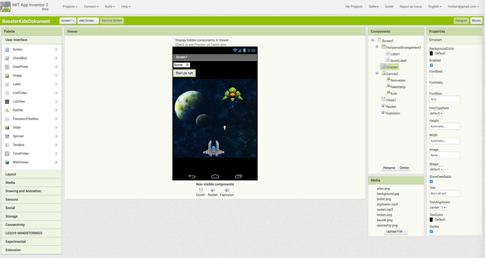
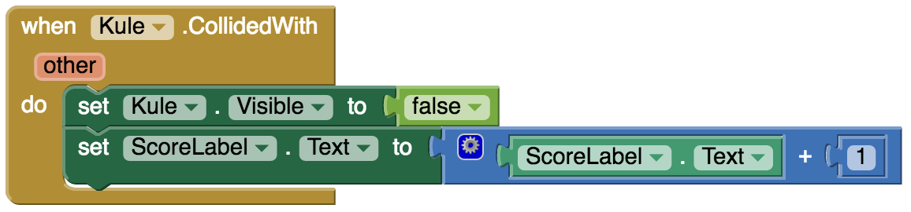
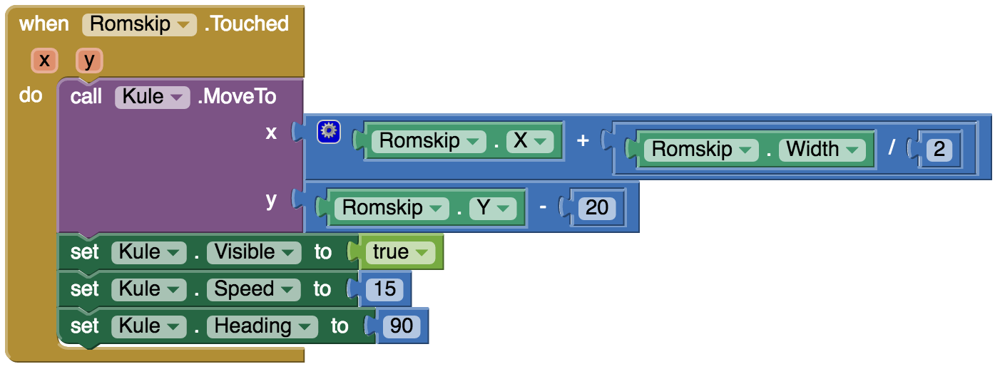

Oppgaven er laget av
[GDG Bergen](https://developers.google.com/groups/chapter/107292324435156848170/),
og tilpasset kodeklubbens format på oppgaver.

Hva skal vi lage?
=================

Vi skal lage et spill som heter Space Invaders, som er en enkel utgave
av det klassiske spillet (søk det opp på YouTube). Spillet handler om å
styre et romskip som skal skyte ned en alien. Vi skal bruke
stoppeklokke, animasjoner og mye mer. Målet for appen er å skyte ned så
mange aliens som mulig.

Praktisk informasjon for å komme i gang
=======================================

For å komme igang med App Inventor åpner vi
[http://appinventor.mit.edu/](http://appinventor.mit.edu/) i Chrome
eller Firefox. OBS! App Inventor fungerer ikke i Internet Explorer.
Trykk på “Create apps!” og logg inn med Google-kontoen din.

{width="6.265625546806649in"
height="4.121573709536308in"}

Ting vi trenger
===============

Vi trenger å laste ned alien, romskipet og kulen vi skal bruke. Link til
bildene finner du her:

[https://goo.gl/9oMczv](https://goo.gl/9oMczv)

{width="0.9427088801399826in"
height="0.7521609798775153in"}{width="0.9953127734033246in"
height="0.7656255468066492in"}{width="0.3020833333333333in"
height="0.6666666666666666in"}

La oss komme i gang med koding!
===============================

Vi skal først designe grensesnittet for appen vår. Dette gjør vi i
“Designer”. Når du er ferdig skal det ligne på bildet under.

{width="6.267716535433071in"
height="3.3333333333333335in"}

Du finner filene du trenger på Google Drive: `https://drive.google.com/drive/folders/0B06apr1fnjejQmdHakN0QWtQeTQ`

  **Type komponent**           **Gruppe**               **Hva kaller vi den**    **Hva gjør komponenten**                                                   **Innstillinger**
  ---------------------------- ------------------------ ------------------------ -------------------------------------------------------------------------- -----------------------------------------------------------------------------------------------------------------------------------------------------------
  **Canvas**                   Drawing and Animations   Canvas1                  Canvas er lerretet vi skal ha figurene våre på                             Forandre på bredden (**Width**) til “fill parent” og sette høyden (**Height**) til 300. Sett også bakgrunnen (**BackgroundColor**) til en farge du liker.
  **ImageSprite**              Drawing and Animations   Romskip                  Dette er romskipet vårt i spillet.                                         Last opp bilde og sett “**Picture**” til “**spaceship.png**”. Sett **Y** verdien til **230**. Dette vil plassere romskipet på bunnen av lerretet
  **ImageSprite**              Drawing and Animations   Alien                    Dette er alien’en vår i spillet.                                           Last opp bilde og sett “**Picture**” til “**alien.png**”
  **ImageSprite**              Drawing and Animations   Kule                     Dette er kulen vi skyter fra romskipet.                                    Last opp bilde og sett “**Picture**” til “**bullet.png**” og **Y** til **20**
  **Clock**                    Sensors                  Clock1                   Vi bruker denne klokken til å flytte på alien’en.                          Sett “**TimeInterval**” til **3000**
  **Horizontal Arrangement**   Layout                   Horizontal Arrangement   Vi bruker denne boksen for å holde orden på **Label1** og **ScoreLabel**   
  **Label**                    User Interface           Label1                   Denne boksen inneholder teksten “**Poeng**”                                Sett “**text**” til “**Poeng**”
  **Label**                    User Interface           ScoreLabel               Denne boksen inneholder poengsummen.                                       Sett “**text**” til 0
  **Button**                   User Interface           Omstart                  Denne knappen starter spillet på nytt                                      Sett “**text**” til “**Start på nytt**”

Da er alt som skal vises på skjermen lagt inn i appen vår. Du kan prøve
å starte appen nå.

Flytte på raketten
------------------

Nå bytter vi til “Blocks” for å få spillet til å virke. Først skal
spilleren flytte på raketten fra side til side. Det vil si at vi vil
bare flytte på raketten i X-aksen. Vi kan gjøre dette ved å bruke
Romskip.Dragged for å oppdatere posisjonen. Når romskipet blir flyttet
på oppdaterer vi romskipets X-koordinat med en ny verdi som blir den nye
plasseringen på X-aksen.

{width="6.267716535433071in"
height="1.4305555555555556in"}

Når du har lagt inn kodesnutten kan du starte appen og se om du kan
bevege på romskipet fra side til side ved å flytte den med fingeren.

Vi gjør kulen vår klar
----------------------

Det er flere egenskaper vi ønsker kulen til romskipet skal ha. Den skal
skytes fra romskipet og treffe alien’en. Den skal også være usynlig før
den blir skutt, og etter at den har truffet.

Vi begynner med å bruke Screen1.initialize. Når vi starter spillet kan
vi sette egenskapene på kulen til å være usynlig. Sett
**Visible**-egenskapen til “**false**”.

{width="4.578125546806649in"
height="1.0646806649168854in"}

Neste steg er å programmere kulen slik at den dukker opp igjen når den
blir skutt fra romskipet. Vi skal skyte kulen når vi trykker på
romskipet. Da starter vi med en Romskip.Touched. Når kulen blir skutt
fra romskipet må vi sette retningen kulen skal skytes (**Heading**),
sette den til synlig (**Visible**) og sette hastigheten (**Speed**) den
skal ha. Vi vil at kulen skal gå rett opp så da setter vi **Heading**
til **90**, **Visible** til “**true**” og **Speed** til “**15**”.

{width="4.713542213473316in"
height="2.2158344269466315in"}

Til slutt må vi programmere inn hva som skal skje når vi treffer
alien’en. Når kulen treffer alien’en vil vi at poengsummen skal økes med
1, og at kulen blir satt til usynlig igjen. Vi bruker derfor
Kule.ColliededWith for å gjøre dette.

{width="6.267716535433071in"
height="1.4583333333333333in"}

Om du starter spillet nå så vil du se at vi kan skyte med romskipet, men
det skjer ikke noe etter første skuddet er skutt. Vi må derfor
programmere inn at når du har skutt så flytter vi kulen tilbake til
romskipet. Dette kan vi bruke Bullet.MoveTo for å gjøre.

{width="6.267716535433071in"
height="2.3194444444444446in"}

Prøv spillet nå og se om du kan skyte flere kuler. Du ser kanskje at om
kulen bommer på alien’en så setter den seg fast i toppen på skjermen til
du skyter igjen. For å fikse dette må vi sjekke om vi er i toppen på
lerretet. Vi bruker
Bullet.EdgeReache{width="6.267716535433071in"
height="1.9861111111111112in"}

Lage en omstart-knapp for spillet
---------------------------------

Noen ganger er det greit å kunne starte spillet på nytt. Vi skal gjøre
det slik at når vi trykker på “**Start på nytt**”-knappen så setter vi
poengsummen tilbake til 0.

{width="5.140625546806649in"
height="1.1869553805774278in"}

La oss gjøre spillet vanskeligere
---------------------------------

Vi skal gjøre spillet mer utfordrende. Når en kule treffer alien’en så
flytter vi alien’en sin lokasjon på X-aksen.

{width="6.267716535433071in" height="1.375in"}

For å gjøre det enda mer vanskelig, så skal vi bruke en stoppeklokke til
å flytte posisjonen til alien’en. Når klokken går av så gjør vi det
samme som når alien’en blir truffet med en kule.

{width="6.267716535433071in"
height="0.7083333333333334in"}

Da er vi ferdig med å programmere. Kos deg med spillet!

Bonusoppgave!
=============

## Bakgrunnsbilde og lyd for skudd og eksplosjon

Relevanter filer finner du på Google Drive: `https://drive.google.com/drive/folders/0B06apr1fnjejV3NQQUtyc3huZFU`

Last ned bakgrunnen og lyder på linken under mappen *Bonusoppgaver.* Se
om du kan finne ut hvordan du får lagt de inn i spillet. Av lyder kan
for eksempel **rocket.mp3** brukes når skudd avfyres, og
**explosion.mp3** brukes når kulen treffer alien’en.

## Få romvesenet til å skyte tilbake
