# Introduksjon {.intro}
I denne oppgaven skal vi lage et veldig enkelt spill med litt animasjon. Det som skal skje er at en muldvarp hopper rundt på spillbrettet mens du prøver å trykke på muldvarpen før den hopper videre. Hvis du klarer å treffe muldvarpen får du poeng og mobilen vil vibrere. Om du trykker på restartknappen, starter spillet på nytt.

Vi skal nå lære litt om animasjon, hendelser og prosedyrer.

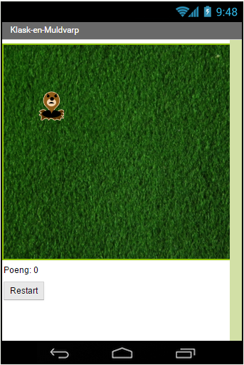

# Steg 1: Gjøre klart spillbrettet {.activity}
Det første vi trenger er en _Canvas_-komponent som tegner selve spillbrettet. Dette vil være området hvor muldvarpen hopper rundt på skjermen.
En canvas er bare en komponent som inneholder grafikk, den synes ikke selv, men vi kan legge til streker, sirkler, tekst, firkanter og bilder på canvasen.

## Sjekkliste {.check}

+ Logg inn på App Inventor og lag et nytt prosjekt som heter `KlaskEnMuldvarp`.

+ Last ned gresset vi vil ha i bakgrunnen fra lenken [gress.png](gress.png).

+ Gå til **Palette** og **Drawing and Animation**. Der velger du , og drar den over til skjermen i **Viewer**. Under **Components**, trykk på **Rename** og gi den navnet `Spillbrettet`. Legg merke til at spillbrettet vises på skjermen.

+ Gå til **Properties** og sett høyden og bredden for spillbrettet:

  Trykk på **Height** og skriv inn `300` ved siden av pixels og trykk **OK**.

  Trykk på **Width** og skriv inn `340` ved siden av pixels og trykk **OK**.

* Gå til **BackgroundImage** og trykk på **None...**. Trykk **Upload File**. Trykk på **Velg Fil** og velg bildet `gress.png` du nettopp lastet ned. Trykk **OK**. Sjekk at gresset vises i firkanten øverst på skjermen.

# Steg 2: Legge til poengtelleren og restartknappen {.activity}
For å vite hvor mange poeng spilleren har, må vi legge til en tekst som oppdateres hver gang spilleren treffer muldvarpen. Restartknappen lar spilleren starte spillet på nytt.

## Sjekkliste {.check}

+ Gå til **Palette** og **User Interface**. Der velger du 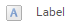, og drar den over til skjermen i **Viewer**. Under **Components**, trykk på **Rename** og gi den navnet `PoengTekst`. Pass på at teksten vises under spillbrettet.

+ Gå til **Properties** og forandre verdien under **Text** til `Poeng: 0`.

+ Trykk på **Width**, velg **Fill parent** og trykk **OK**.

+ Gå til **Palette** og **User Interface**. Der velger du , og drar den over til skjermen i **Viewer**. Under **Components**, trykk på **Rename** og gi den navnet 'RestartKnapp'. Pass på at knappen vises under spillbrettet.

+ Gå til **Properties** og forandre verdien under **Text** til `Start på nytt`.

# Steg 3: Få mobilen til å vibrere {.activity}
For å få mobilen til å vibrere når spilleren får poeng, må vi legge til en lyd.

## Sjekkliste {.check}

+ Gå til **Palette** og **Media**. Der velger du 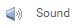, og drar den over til skjermen i **Viewer**. Under **Components**, trykk på **Rename** og gi den navnet `Brrr`.

# Steg 4: Ta tiden {.activity}
For at muldvarpen skal kunne hoppe rundt på brettet over tid, trenger vi å legge til en klokke. Klokken hjelper oss å jobbe med tid, for eksempel vite hvilken dato det er eller hva klokken er. Her skal vi bruke den til å fortelle spillet at det skal gjøre noe hvert halvsekund.

## Sjekkliste {.check}

+ Gå til **Palette** og **Sensors**. Der velger du 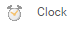, og drar den over til skjermen i **Viewer**. Under **Components**, trykk på **Rename** og gi den navnet `Klokken`.

+ Gå til **Properties** og forandre verdien under **TimerInterval** til `500`.

+ Pass på at 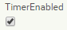 er krysset av.

# Steg 5: Muldvarpen! {.activity}
Den siste komponenten vi mangler nå er selve muldvarpen. For å få en muldvarp som beveger seg, må vi legge til en **ImageSprite**. En sprite er en figur som kan bevege seg på skjermen inne i en canvas. Canvasen vår er spillbrettet som vi la til helt først.

Hver figur har en fart (_Speed_), retning (_Heading_) og intervall (_Interval_). Disse sier hvor fort den beveger seg, i hvilken retning og hvor ofte. En figur vet også når den blir trykket på. I spillet vårt, er farten satt til 0, så den vil ikke bevege seg selv. Istedet setter vi posisjonen ved hjelp av klokken.

## Sjekkliste {.check}

+ Gå til **Palette** og **Drawing and Animation**. Der velger du , og drar den over til skjermen i **Viewer**. Pass på at du drar den oppå spillbrettet (gresset). Under **Components**, trykk på **Rename** og gi den navnet `Muldvarpen`.

+ Last ned muldvarpbildet fra lenken [mole.png](mole.png).

+ Gå til **Properties** og trykk på **None...** under **Picture**. Trykk **Upload File**. Trykk på **Velg Fil** og velg bildet du nettopp lastet ned. Trykk **OK**. Sjekk at muldvarpen har kommet opp på skjermen.

Skjermbildet ditt burde nå se slik ut:

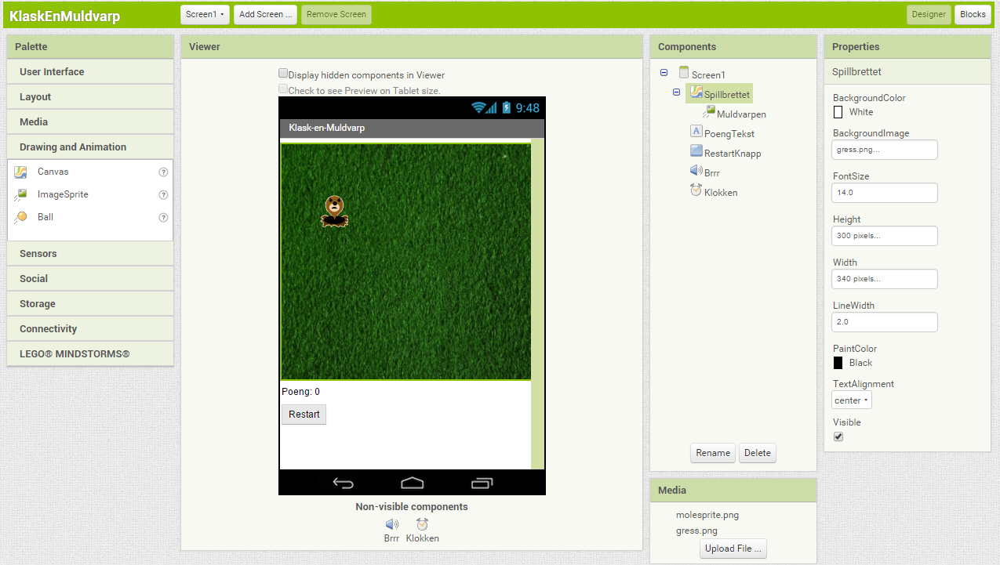

# Steg 6: Få ting til å skje! {.activity}
Vi har nå lagt til alle delene i appen vår. Du kan teste den på mobilen din, men du vil se at ingenting skjer. For å få noe til å skje på skjermen må vi legge til logikk, altså kode.

Koden er den magiske biten som gir applikasjonen din liv. Helt enkelt forteller koden spillet hva det skal gjøre med alle tingene vi har puttet på skjermen.
I AppInventor skriver vi kode ved hjelp av klosser. Disse klossene er kommandoer som settes sammen og ber applikasjonen å gjøre ting, for eksempel tegne et bilde eller vise en tekst.

Vi skal nå lage prosedyrer til spillet. Dette er en samling av flere kommandoer som har et navn og er satt sammen før de kalles.
Hvis du har en samling av klosser som trenger å bli kalt flere ganger i et program, kan du definere det som en prosedyre.
Da trenger du ikke sette sammen de samme klossene flere ganger. I stedet kan du kalle dem ved å legge inn en enkelt kloss.

## Sjekkliste {.check}

+ Trykk på Blocks øverst i høyre hjørne.

+ Trykk på den lilla knappen som heter **Procedures**. Vi ser at det er to forskjellige prosedyre-klosser vi kan legge til: **to procedure do** og **to procedure result**. Velg **to procedure do**:

  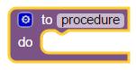

+ Trykk på `procedure` og gi den navnet `FlyttMuldvarp`.

Klossen `FlyttMuldvarp` har et område i midten som sier `do`. Det er her vi putter inn klossene som sier hva som skal skje når prosedyren kjører.

+ Vi vil nå plassere muldvarpen et tilfeldig sted på spillbrettet. Det gjør vi ved å sette muldvarpens X- og Y-posisjon til to forskjellige tilfeldige tall:

  Muldvarpens X-posisjon skal være et tilfeldig tall mellom 0 og bredden på spillbrettet. Vi passer på å trekke fra muldvarpens bredde slik at hele muldvarpen får plass på gresset.

  Muldvarpens Y-posisjon skal på samme måte være et tilfeldig tall mellom 0 og høyden på spillbrettet minus høyden på muldvarpen.

  Klossen `random fraction` gir et tilfeldig tall mellom 0 og 1. Vi kan derfor gange denne med spillbrettets størrelse minus muldvarpens størrelse for å sette posisjonen slik vi vil.

+ Gå til **Blocks** og se hva du får fram når du trykker på de forskjellige fargene.

+ Klossene du trenger vil være under **Math**, og på muldvarpen og spillbrettet.
+ Lag en prosedyre som flytter muldvarpen slik beskrevet.

  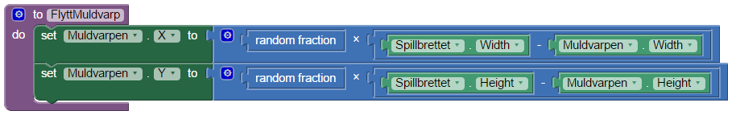

Se hvordan klossene kobler sammen. Den første delen bruker Muldvarp.X til å sette muldvarpens horisontale posisjon. Verdien den får er resultatet av å gange en tilfeldig verdi mellom 0 og 1 med resultatet av spillbrettets bredde minus muldvarpens bredde.

+ Lag en variabel som holder styr på hvor mange poeng spilleren har. Denne kan vi kalle `Poeng`.

  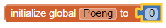

+ Lag en prosedyre som du kaller `OppdaterPoeng` på samme måte som du lagde `FlyttMuldvarp`. Velg den lilla **Procedures** og velg en **to procedure do**. Denne prosedyren skal oppdatere tekstfeltet med poengene når poengene endres.

Det vi vil at skal skje er PoengTeksten blir oppdatert med en tekst satt sammen av `Poeng: ` og hvor mange poeng spilleren har.

+ Legg til en kloss som setter verdien til PoengTekst sin **Text** verdi. Koble denne til `do` feltet i prosedyren.

+ Gå til rosa **Text** og ta ut en `join`-kloss som du kobler til den forrige klossen slik at den setter poengteksten. Denne vil gjøre at du legger sammen to tekster.

+ Ta ut en tekstkloss under rosa **Text** og forandre den slik at den sier `Poeng: ` og koble denne øverst i `join`-klossen slik at denne teksten kommer først. Pass på at du skriver et mellomrom etter kolonet.

+ Under `Poeng: ` legger du til en kloss fra orange **Variables** som heter `get`, og forandrer den til `get global Poeng`.

  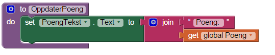

# Steg 7: Flytt muldvarpen etterhvert som tiden går {.activity}
Neste steg er å få muldvarpen til å flytte seg. Dette er hvor vi skal bruke Klokken.

Klokken har en timer, denne timeren gir beskjed med jevne mellomrom bestemt av hva vi satte i TimerInterval i klokken.
Derfor vil den sende en hendelse hvert halvsekund, eller 500 millisekunder. Hendelser er ting som kan skje i appen din som for eksempel et tastetrykk eller at en timer går som her.

For å få noe til å skje når en hendelse sendes bruker vi en _event handler_. Denne sier hvilke klosser som skal kjøre når en hendelse sendes. Klokken vår har en kloss som er _event handleren_ for timeren: **when Klokken.Timer do**.

## Sjekkliste {.check}
+ Sett timeren til å kalle `FlyttMuldvarp`:

  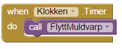

# Steg 8: Klask muldvarpen! {.activity}
Den viktigste biten er å vite når noen trykker på muldvarpen, slik at vi vet når spilleren skal få poeng. Hvis du husker fra tidligere så sa vi at figurer vet når de blir trykket på.
Alt vi trenger å gjøre er å fortelle hva som skal skje ved å bruke _event handleren_ for dette på muldvarpen. Denne hendelsen kalles **Touched**.

## Sjekkliste {.check}

+ Legg til **when Muldvarpen.Touched do**.

  Videre vil vi at:

  + Poengvariabelen økes med 1 poeng.
  + Mobilen vibrerer i 1/10 sekund (100 millisekunder).
  + `OppdaterPoeng` blir kalt slik at poengene opdaterer seg på skjermen.
  + `FlyttMuldvarp` blir kalt slik at muldvarpen fortsetter spillet.

  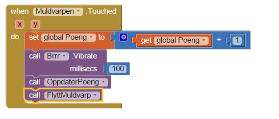

# Steg 9: Start spillet på nytt {.activity}
Den siste biten vi trenger å få på plass nå er å kunne starte spillet på nytt når vi trykker på restartknappen.
Knapper har en hendelse som heter **click** som sendes når knappen trykkes på.

## Sjekkliste {.check}

+ Legg til _event handleren_ **when RestartKnapp.Click do**, som finnes på restartknappen.

  Videre vil vi at når knappen trykkes skal:

  + Poengvariabelen gå ned til 0.
  + Poengteksten bli oppdatert.
  + `FlyttMuldvarp` bli kalt slik at muldvarpen fortsetter spillet.

  Dette kan se slik ut:

  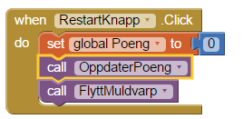

## Test  appen på mobiltelefonen {.flag}
Installer appen på mobilen din og prøv spillet.

Virker spillet slik du ville?

## Utfordring: Dine egne tilpasninger {.challenge}
Hvordan kan du lage spillet enda bedre?

Kan du gjøre spillet vanskeligere?

## Ting å prøve {.try}

Prøv å sette timeren til en lavere verdi. Hva skjer?
