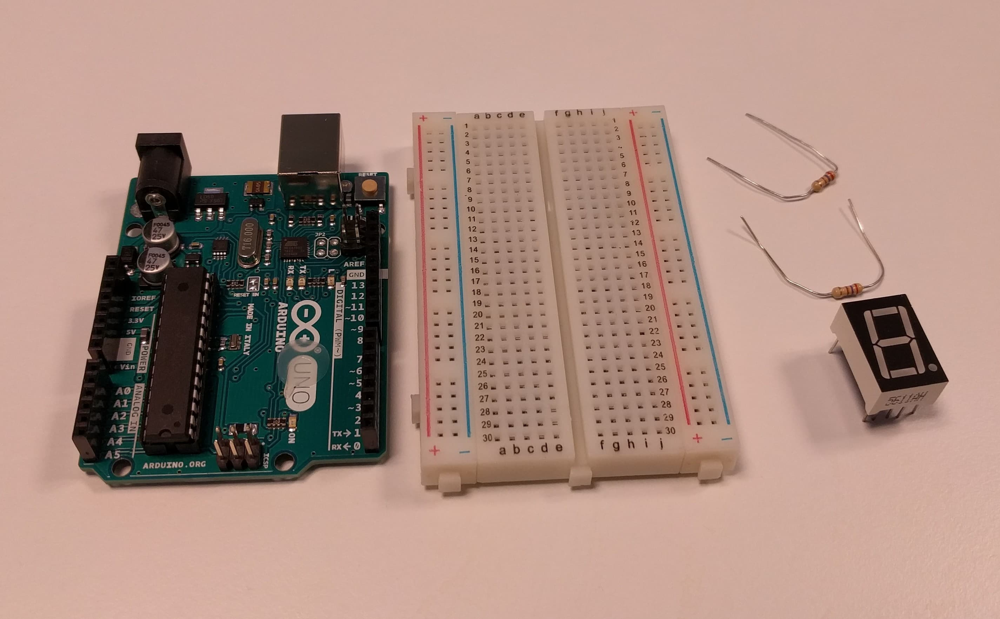

# Introduksjon {.intro}

La oss se på å få et display til å telle.


# Steg 1: Finn frem utstyr {.activity}

## Til denne oppgaven trenger du {.check}

- [ ] 1 Arduino Uno

- [ ] 1 breadboard

- [ ] 2 motstander 1k Ohm (Fargekode: brun-svart-rød-gull)

- [ ] 11 ledninger

- [ ] 1 7-segment display (med common type katode)




# Steg 2: Utforskning {.activity}

Før vi får displayet til å vise tall, er det nyttig å utforske displayet for å
se hvilke pinner som lyser opp hvilken del av displayet.

## Sjekkliste {.check}

- [ ] Motstand fra de to midterste pinnene på displayet.

- [ ] Ledning fra andre enden av motstandene til ground.

- [ ] Ledning fra pin 13 på Arduino til pinnen nederst til høyre på displayet.


```cpp
int pin = 13;

void setup() {
    pinMode(pin, OUTPUT);
}

void loop() {
    dititalWrite(pin, HIGH);
    delay(500);
    digitalWrite(pin, LOW);
    delay(500);
}
```

Flytt så rundt på ledningen som står i breadboardet for å se hvilke pinner på
displayet som får hvilken del av segmentet til å blinke.


# Steg 3: Få displayet til å telle oppover {.activity}

Før vi skriver kode for å få displayet til å telle oppover, er vi nødt til å
lage den fulle kretsen.


## Sjekkliste {.check}

- [ ] Motstand fra de to midterste pinnene på displayet.

- [ ] Ledning fra andre enden av motstandene til ground.

- [ ] Koble resten av ledningene som vist på bildet over.

## Skriv kode {.activity}

```cpp
void blank_ut_display() {
    for (int led = 6; led <= 13; ++led) {
        digitalWrite(led, LOW);
    }
}

void tegn_0() {
    blank_ut_display();
    digitalWrite(7, HIGH);
    digitalWrite(8, HIGH);
    digitalWrite(9, HIGH);
    digitalWrite(12, HIGH);
    digitalWrite(11, HIGH);
    digitalWrite(10, HIGH);
}

void tegn_1() {
    blank_ut_display();
    digitalWrite(9, HIGH);
    digitalWrite(12, HIGH);
}

void tegn_2() {
    blank_ut_display();
    digitalWrite(8, HIGH);
    digitalWrite(9, HIGH);
    digitalWrite(6, HIGH);
    digitalWrite(10, HIGH);
    digitalWrite(11, HIGH);
}

void tegn_3() {
    blank_ut_display();
    digitalWrite(8, HIGH);
    digitalWrite(9, HIGH);
    digitalWrite(6, HIGH);
    digitalWrite(12, HIGH);
    digitalWrite(11, HIGH);
}

void setup() {
    for (int led = 6; led <= 13; ++led) {
        pinMode(led, OUTPUT);
    }
    blank_ut_display();
}

void loop() {
    tegn_0();
    delay(500);
    tegn_1();
    delay(500);
    tegn_2();
    delay(500);
    tegn_3();
    delay(500);
}
```

### Om funksjoner {.protip}

I denne oppgaven har vi introdusert `void blank_ut_display()`, `void tegn_0()`,
`void tegn_1()`, `void tegn_2()` og `void tegn_3()`. Disse kaller vi
_funksjoner_, og er en måte å gruppere kode på. Når vi i `void loop()` sier
`tegn_0();` gjør vi et _funksjonskall_ til `void tegn_0()`, og koden inni den
funksjonen kjøres.

Hvis du ser på `void setup()` og `void loop()` er dette også funksjoner, hvor
`void setup()` kalles ved oppstart av programmet, og `void loop()` kalles på
nytt og på nytt.

### Utfordringer {.challenge}

- [ ] Klarer du å få displayet til å telle fra 0 til 9?

- [ ] Klarer du å få punktumet til å blinke mens vi teller?

- [ ] Klarer du å få punktumet til å blinke dobbelt så fort som vi teller?


# Steg 4: Bruk en knapp for å telle oppover {.activity}

## Til denne delen trenger du i tillegg {.sjekkliste}

+ 2 ledninger.

+ 1 trykkknapp.


Koble opp som vist på bildet over. Eneste forskjellen her er knappen.

## Endre kode {.activity}

```cpp
...

int tall = 0;
int knapp = 4;

void setup() {
    for (int led = 6; led <= 13; ++led) {
        pinMode(led, OUTPUT);
    }
    pinMode(knapp, INPUT_PULLUP);
    tegn_0();
}

void loop() {
    if (digitalRead(knapp) == LOW) {
        tall += 1;
        switch (tall) {
            case 1:
                tegn_1();
                break;
            case 2:
                tegn_2();
                break;
            case 3:
                tegn_3();
                break;
            default:
                tall = 0;
                tegn_0();
                break;
        }
        delay(300);
    }
}
```

### Om switch {.protip}

La oss introdusere begrepet *switch*:

Denne kan minne om en if, hvor <code>switch&nbsp;(tall)</code> sjekker verdien
av tall, og finner riktig verdi i `case` kallene under. Så når tallet er 2 vil
vi gå til `case 2:` og eksekvere koden under dette. `break` vil si at vi er
ferdige med casen.

Dersom en `case` mangler `break`, vil koden som er under kjøre. Altså neste
`case`. Dette kalles å _falle gjennom_, eller _fall through_ på engelsk. Dette
er en ganske vanlig feil, så om man faktisk mener at neste case skal kjøres,
legger man ofte på en kommentar:

```cpp
switch (tall) {
  case 0:
    kode_her();
    // fall gjennom
  case 1:
    mer_kode_her();
    break;
  default:
    ...
```

+ Dersom `tall == 0` vil koden i både `case 0` og `case 1` kjøres, altså faller
  den gjennom fra `case 0` til `case 1`.

+ Dersom `tall == 1` kjøres kun koden i `case 1`.

+ Dersom `tall != 0 && tall != 1` kjøres koden i default.

Hvis verdien av `tall` ikke matcher noen `case` linjene vil vi eksekvere koden i
`default`.

Så i vår kode, når `tall` er 4 vil vi treffe `default`, sette tall til 0 og så
tegne 0. Dette er grunnen til at vi begynner på igjen på 0 etter vi har telt til
3.

### Utfordringer {.challenge}

- [ ] Klarer du å utvide til å telle til '9'?

- [ ] Klarer du å hindre at vi "går rundt" i tellingen, slik at å trykke på
  knappen når du allerede er på '9' ikke gjør noe?

- [ ] Klarer du å få punktumet til å lyse når du trykker inn knappen?

- [ ] Klarer du å legge til en ekstra knapp som teller nedover, så én knapp
  teller oppover, og den andre nedover?
