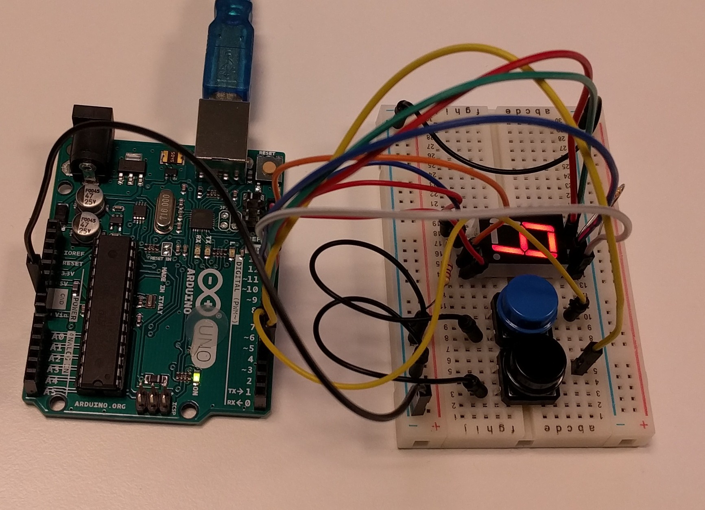
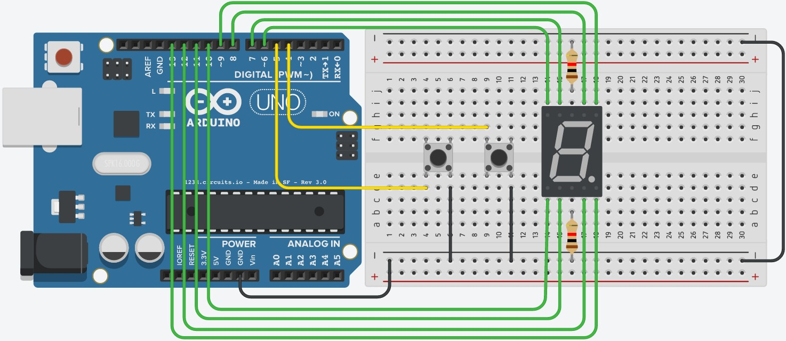

# Om oppgaven {.activity}

I denne oppgaven skal elevene få et display til å telle.

## Oppgaven passer til: {.check}

 __Fag__: Naturfag, Teknologi og Design, Teknologi og forskningslære

__Anbefalte trinn__: 5. trinn - VG3

__Tema__: Arduino, Kretser, Funksjoner, Switch

__Tidsbruk__: Dobbelttime

## Kompetansemål {.challenge}

- [ ] __Naturfag, 7. trinn:__ utforske, lage og programmere teknologiske systemer som består av deler som virker sammen

- [ ] __Teknologi og design, 10. trinn:__ velge og bruke ulike materialer og verktøy i arbeidet med prototyper for teknologiske produkt

- [ ] __Teknologi og design, 10. trinn:__ grunngi valg av design, materialer, verktøy og framgangsmåter, og reflektere over hvor trygge og bærekraftige valgene er

- [ ] __Teknologi og forskningslære X og 1, VG2:__ anvende kravspesifikasjon i arbeid med å utvikle og teste funksjonelle produkter og vurdere produktet opp mot kravspesifikasjonen

- [ ] __Teknologi og forskningslære 1, VG2:__ bruke og programmere mikrokontroller for å utvikle et produkt

## Forslag til læringsmål {.challenge}

- [ ] Elevene kan forklare hvordan et 7-Segment Display fungerer

- [ ] Elevene kan skrive program for en Arduino som bruker funksjoner, funksjonskall og switch statements

- [ ] Elevene kan videreføre teknikken for å utforske ukjente komponenter på egenhånd

## Forslag til vurderingskriterier {.challenge}

Oppgaven er grunnleggende, og kan ikke brukes alene for vurdering av kompetansemålet.

## Forutsetninger og utstyr {.challenge}

- [ ] __Forutsetninger__: Oppgaven er en introduksjon til Arduino, og krever ingen forkunnskaper eller erfaring. Det er en fordel å kunne litt engelsk.

- [ ] __Utstyr__:

  - [ ] 1 Arduino Uno

  - [ ] Datamaskin med Arduino software installert (Se _Eksterne ressurser_) og USB-kabel

  - [ ] 1 breadboard

  - [ ] 2 motstander 1k Ohm (Fargekode: brun-svart-rød-gull)

  - [ ] 11 ledninger

  - [ ] 1 7-segment display (med common type katode)

  

## Fremgangsmåte

Her kommer tips, erfaring og utfordringer til de ulike stegene i den faktiske
oppgaven. [Klikk her for å se oppgaveteksten.](../7_segment_display/7_segment_display.html){target=_blank}

### Merk

Denne oppgaven krever at elevene holder styr på en god del ledninger, og
sluttresultatet vil se noe kaotisk ut.




## Løsningsforslag

### Display som teller opp og ned med to knapper

Kobling:



Kode:

```cpp
void blank() {
  for (int led = 6; led <= 13; led++) {
    digitalWrite(led, LOW);
  }
}

void tegn_0() {
  blank();
  digitalWrite(7, HIGH);
  digitalWrite(8, HIGH);
  digitalWrite(9, HIGH);
  digitalWrite(12, HIGH);
  digitalWrite(11, HIGH);
  digitalWrite(10, HIGH);
}

void tegn_1() {
  blank();
  digitalWrite(9, HIGH);
  digitalWrite(12, HIGH);
}

void tegn_2() {
  blank();
  digitalWrite(8, HIGH);
  digitalWrite(9, HIGH);
  digitalWrite(6, HIGH);
  digitalWrite(10, HIGH);
  digitalWrite(11, HIGH);
}

void tegn_3() {
  blank();
  digitalWrite(8, HIGH);
  digitalWrite(9, HIGH);
  digitalWrite(6, HIGH);
  digitalWrite(12, HIGH);
  digitalWrite(11, HIGH);
}

void tegn_4() {
  blank();
  digitalWrite(7, HIGH);
  digitalWrite(6, HIGH);
  digitalWrite(9, HIGH);
  digitalWrite(12, HIGH);
}

void tegn_5() {
  blank();
  digitalWrite(8, HIGH);
  digitalWrite(7, HIGH);
  digitalWrite(6, HIGH);
  digitalWrite(12, HIGH);
  digitalWrite(11, HIGH);
}

void tegn_6() {
  blank();
  digitalWrite(8, HIGH);
  digitalWrite(7, HIGH);
  digitalWrite(10, HIGH);
  digitalWrite(11, HIGH);
  digitalWrite(12, HIGH);
  digitalWrite(6, HIGH);
}

void tegn_7() {
  blank();
  digitalWrite(8, HIGH);
  digitalWrite(9, HIGH);
  digitalWrite(12, HIGH);
}

void tegn_8() {
  blank();
  digitalWrite(8, HIGH);
  digitalWrite(7, HIGH);
  digitalWrite(6, HIGH);
  digitalWrite(12, HIGH);
  digitalWrite(10, HIGH);
  digitalWrite(11, HIGH);
  digitalWrite(9, HIGH);
}

void tegn_9() {
  blank();
  digitalWrite(8, HIGH);
  digitalWrite(7, HIGH);
  digitalWrite(6, HIGH);
  digitalWrite(9, HIGH);
  digitalWrite(12, HIGH);
}

int minus = 5;
int pluss = 4;
int tall = 0;

void setup() {
  for (int led = 6; led <= 13; led++) {
    pinMode(led, OUTPUT);
  }
  pinMode(pluss, INPUT_PULLUP);
  pinMode(minus, INPUT_PULLUP);
  tegn_0();
}

void oppdater() {
  switch (tall) {
    case 1:
      tegn_1();
      break;
    case 2:
      tegn_2();
      break;
    case 3:
      tegn_3();
      break;
    case 4:
      tegn_4();
      break;
    case 5:
      tegn_5();
      break;
    case 6:
      tegn_6();
      break;
    case 7:
      tegn_7();
      break;
    case 8:
      tegn_8();
      break;
    case 9:
      tegn_9();
      break;
    case 10:
      tall = 9;
      break;
    default:
      tegn_0();
      tall = 0;
      break;
  }
  digitalWrite(13, HIGH);
  delay(150);
  digitalWrite(13, LOW);
  delay(150);
}

void loop() {
  if (digitalRead(pluss) == LOW) {
    tall += 1;
    oppdater();
  }
  if (digitalRead(minus) == LOW) {
    tall -= 1;
    oppdater();
  }
}
```

## Variasjoner {.challenge}

- [ ]  _Vi har dessverre ikke noen variasjoner tilknyttet denne oppgaven enda._

## Eksterne ressurser {.challenge}
- [ ] Installasjonsinstruksjoner:

  + [Windows](https://arduino.cc/en/Guide/Windows)

  + [Mac OS X](https://arduino.cc/en/Guide/MacOSX)

  + [Linux](https://arduino.cc/en/Guide/Linux)
