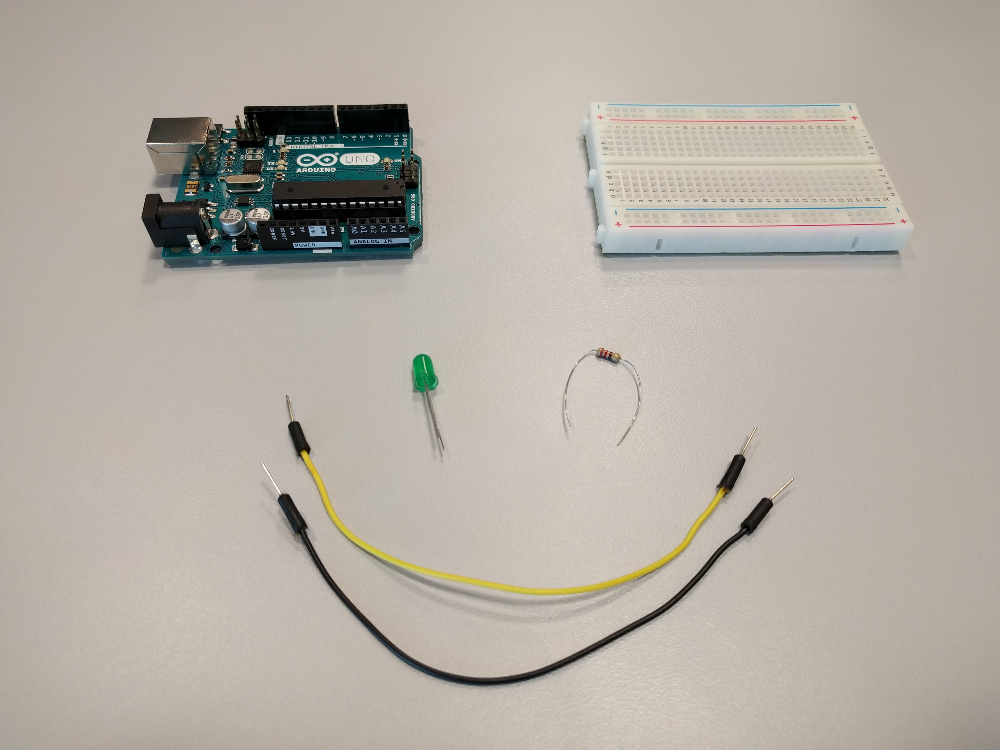
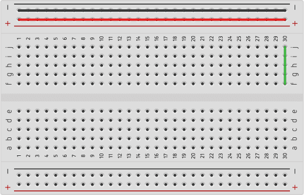
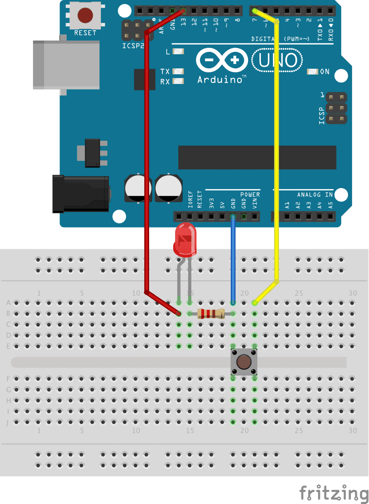

# Om oppgaven {.activity}

I denne oppgaven skal elevene programmere Arduinoen til å få et lys til å blinke.

## Oppgaven passer til: {.check}

 __Fag__: Naturfag, Teknologi og Design, Teknologi og forskningslære

__Anbefalte trinn__: 5. trinn - VG3

__Tema__: Arduino, Kretser, LED, Knapp

__Tidsbruk__: Dobbelttime

## Kompetansemål {.challenge}

- [ ] __Naturfag, 7. trinn:__ utforske, lage og programmere teknologiske systemer som består av deler som virker sammen

- [ ] __Teknologi og design, 10. trinn:__ velge og bruke ulike materialer og verktøy i arbeidet med prototyper for teknologiske produkt

- [ ] __Teknologi og design, 10. trinn:__ grunngi valg av design, materialer, verktøy og framgangsmåter, og reflektere over hvor trygge og bærekraftige valgene er

- [ ] __Teknologi og forskningslære X og 1, VG2:__ anvende kravspesifikasjon i arbeid med å utvikle og teste funksjonelle produkter og vurdere produktet opp mot kravspesifikasjonen

- [ ] __Teknologi og forskningslære 1, VG2:__ bruke og programmere mikrokontroller for å utvikle et produkt

## Forslag til læringsmål {.challenge}

- [ ] Elevene kan laste opp programmer til Arduino.

- [ ] Elevene kan skrive enkle program for Arduino, som inkluderer:

  + Grunnleggende kodeelementer på Arduino; `setup()`, `loop()` og `delay()`.

  + Grunnleggende programmeringskonsepter; Variabler, funksjonskall,
    kontrollflyt.

  + Sette verdi på digitale pinner.

  + Lese verdi fra digitale pinner.

- [ ] Elevene kan koble enkle kretser, som inkluderer:

  + Bruk av jord og sluttede kretser, herunder felles jording.

  + Enkle elektroniske komponenter.

  + Diode

  + Knapp

  + Motstand

## Forslag til vurderingskriterier {.challenge}

Oppgaven er grunnleggende, og kan ikke brukes alene for vurdering av kompetansemålet.

## Forutsetninger og utstyr {.challenge}

- [ ] __Forutsetninger__: Oppgaven er en introduksjon til Arduino, og krever ingen forkunnskaper eller erfaring. Det er en fordel å kunne litt engelsk.

- [ ] __Utstyr__:
  - [ ] 1 Arduino Uno

  - [ ] Datamaskin og USB-kabel

  - [ ] 2 ledninger

  - [ ] 1 LED

  - [ ] 1 breadboard

  - [ ] 1 motstand 220 Ohm (Fargekode: rød-rød-brun-gull)

  

## Fremgangsmåte

Her kommer tips, erfaring og utfordringer til de ulike stegene i den faktiske
oppgaven. [Klikk her for å se oppgaveteksten.](../blinkende_lysdiode/blinkende_lysdiode.html){target=_blank}

### Arduino

Arduino er en åpen plattform for prototyping av elektronikk. Arduino kan brukes
for å styre elektroniske komponenter som motorer og lys, samt få data fra
knapper, temperaturmålere, osv. Mer info kan finnes på
[arduino.cc](https://www.arduino.cc/en/Guide/Introduction).

### Breadboard

Et «breadboard» er et brett brukt for å forenkle prototyping.



Dette er et lite breadboard. Breadboardet er todelt, skilt av det lille
innhugget på tvers av hele brettet, og det er ingen koblinger mellom de to
delene. På radene med **+** og **-** går koblingene langs raden. På de
nummererte kolonnene går koblingene langs kolonnene. Mer informasjon kan finnes
på [Wikipedia](https://en.wikipedia.org/wiki/Breadboard).

### Lukket krets

En lukket krets er en krets der komponentene er sammenkoblet fra en positiv
spenning (+5 volt på arduinoens utganger) til en annen, lavere spenning (GND,
jord-koblingen på arduinoen). I en lukket krets vil strømmen gå fra den høyere
spenningen til den lavere gjennom alle komponentene, og så til den lavere
spenningen.

### Motstand

En motstand, også kalt resistor, er en elektronisk komponent som brukes til å
begrense hvor mye strøm som går gjennom en lukket krets. Det finnes mange måter
å forklare hvordan dette skjer, med Ohms lov som et naturlig stikkord for å
begynne å forstå detaljene. Dette er dog utenfor skopet til denne oppgaven. En
enkel forklaring kan være at hvor mye strøm som går i en lukket krets faller
proporsjonalt med hvor mye motstand kretsen har.

Det går helt fint an å bruke andre motstander enn 220 Ohm, men du bør ikke gå
lavere. Om du finner motstander på forskjellige størrelser kan det være morsomt
å eksperimentere med de forskjellige motstandene for å se hva det gjør med lyset
fra lysdioden. Ved 220 Ohm vil diodene lyse ganske sterkt, ved 1000 Ohm en god
del svakere, ved 10k mye svakere igjen. Om du finner motstander på 100k vil det
være vanskelig å se lyset.

### Jord, felles jord

Jord, markert GND på bl.a arduinoen, er en sammenkoblet serie med kabler og
punkter, som alle holder samme elektriske spenning. Hvis man har jord
tilgjengelig flere steder gjør dette det enkelt å lage sluttede kretser, som man
ser i steg 5 --- her har vi koblet GND til minus-skinnen på breadboardet, og
fører jord videre derfra.

### Kortslutninger (og litt om `INPUT_PULLUP`)

Når man kobler en pinne med spenning på direkte til jord, vil det kunne gå
ubegrenset med strøm fra denne. Dette kalles en kortslutning, og kan i mange
elektroniske sammenhenger føre til at komponenter blir ødelagte --- derfor
kobler vi gjerne til motstander for å redusere strømmen. Når vi kobler en diode
til vil denne gi veldig liten motstand, så derfor legger vi til en diode her for
å passe på at det ikke går så mye strøm at pinne 8 eller dioden blir skadet.

I steg 5 gjør vi dog noe som ikke stemmer helt med beskrivelsen over --- hver
gang noen trykker på knappen lages det en kortslutning fra pinne 7 til jord!
Dette går bra fordi de digitale portene kan settes opp til å bruke en intern
motstand, en «pullup-motstand» som gjør det trygt å kortslutte pinnen.

Mange av pinnene starter med `INPUT_PULLUP` som innstilling til vanlig. Dette er
en «tryggere» innstilling enn `INPUT` eller `OUTPUT`, men i denne innstillingen
kan det aldri gå mye strøm til eller fra pinnen. Hvor stor denne motstanden er
varierer litt, men er typisk minst 20.000 Ohm. Hvis du prøver å koble en diode
opp mot en pinne og glemmer å sette den til `OUTPUT`, vil du muligens se at det
kommer bittelitt lys ut.


## Løsningsforslag

### Kan du få lysdioden til å skrus på av et kort trykk på knappen?

```cpp
int led = 8; int knapp = 7; bool ledOn = false;
void setup() {
  pinMode(led, OUTPUT); pinMode(knapp, INPUT_PULLUP);
}

void loop() {
  if (digitalRead(knapp) == LOW) {
    if (ledOn) {
      ledOn = false; digitalWrite(led, LOW);
    } else {
      ledOn = true; digitalWrite(led, HIGH);
    } delay(250);
  } }
```

### Kan du få til det samme med å bruke kun 3 ledninger?




## Variasjoner {.challenge}

- [ ]  _Vi har dessverre ikke noen variasjoner tilknyttet denne oppgaven enda._

## Eksterne ressurser {.challenge}

- [ ] Installasjonsinstruksjoner

  + [Windows](https://arduino.cc/en/Guide/Windows)

  + [Mac OS X](https://arduino.cc/en/Guide/MacOSX)

  + [Linux](https://arduino.cc/en/Guide/Linux)
