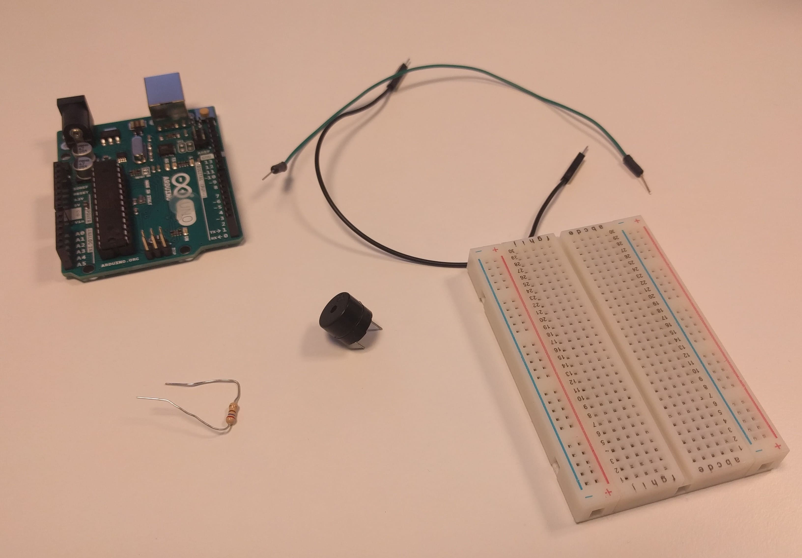

# Om oppgaven {.activity}

I denne oppgaven skal elevene programmere en Arduino til å spille av en lyd med en buzzer.

## Oppgaven passer til: {.check}

 __Fag__: Musikk, Naturfag, Teknologi og Design, Teknologi og forskningslære

__Anbefalte trinn__: 5. trinn - VG3

__Tema__: Arduino, Kretser, Buzzer, Lyd

__Tidsbruk__: Dobbelttime

## Kompetansemål {.challenge}

- [ ] __Naturfag, 7. trinn:__ utforske, lage og programmere teknologiske systemer som består av deler som virker sammen

- [ ] __Musikk, 10. trinn:__ skape og programmere musikalske forløp ved å eksperimentere med lyd fra ulike kilder

- [ ] __Teknologi og design, 10. trinn:__ velge og bruke ulike materialer og verktøy i arbeidet med prototyper for teknologiske produkt

- [ ] __Teknologi og design, 10. trinn:__ grunngi valg av design, materialer, verktøy og framgangsmåter, og reflektere over hvor trygge og bærekraftige valgene er

- [ ] __Teknologi og forskningslære X og 1, VG2:__ anvende kravspesifikasjon i arbeid med å utvikle og teste funksjonelle produkter og vurdere produktet opp mot kravspesifikasjonen

- [ ] __Teknologi og forskningslære 1, VG2:__ bruke og programmere mikrokontroller for å utvikle et produkt

## Forslag til læringsmål {.challenge}

- [ ] Elevene kan bruke en buzzer for å spille lyd.

- [ ] Elevene kan bruke en lysfølsom motstand.

- [ ] Elevene kan skrive program til Arduino som utnytter `tone`, `analogRead` og `map`.

## Forslag til vurderingskriterier {.challenge}

Oppgaven er grunnleggende, og kan ikke brukes alene for vurdering av kompetansemålet.

## Forutsetninger og utstyr {.challenge}

- [ ] __Forutsetninger__: Oppgaven er en introduksjon til Arduino, og krever ingen forkunnskaper eller erfaring. Det er en fordel å kunne litt engelsk.

- [ ] __Utstyr__:
  - [ ] 1 Arduino Uno

  - [ ] Datamaskin med Arduino software installert (se _Eksterne ressurser_) og USB-kabel

  - [ ] 1 breadboard

  - [ ] 2 ledninger

  - [ ] 1 buzzer

  - [ ] 1 motstand 270 Ohm (rød-lilla-brun-gull)

  <figure></figure>

## Fremgangsmåte

Her kommer tips, erfaring og utfordringer til de ulike stegene i den faktiske
oppgaven. [Klikk her for å se oppgaveteksten.](../buzzer/buzzer.html){target=_blank}

### Lysfølsom motstand

En lysfølsom motstand endrer motstanden sin basert på lyset den får inn. Jo
høyere lysstyrke den leser, jo lavere motstand yter den. Når vi bruker
`INPUT_PULLUP` setter vi en positiv spenning ut fra pinnen. Jo høyere motstand i
kretsen, jo høyere vil tallet vi leser ut være.

Dvs. at jo mer lys det er i rommet, jo lavere tall leser vi ut.

### PWM

PWM står for "Pulse With Modulation". PWM gjør at vi kan sende et "analogt"
signal på en digital pin. På en ikke-PWM pin vil en sende enten HIGH eller LOW
kontinuerlig, som vil si å enten sende 5v eller 0v, til en velger å sende det
motsatte. Det PWM gjør er å sende 5v i deler av en periode, for så å slå av
strømmen resten av perioden. Jo høyere verdi en setter utgangen til, jo større
del av perioden vil vi sende 5v.

Du kan lese mer om PWM på [Arduino sine
sider](https://www.arduino.cc/en/Tutorial/PWM).

### `analogWrite`

`analogWrite` bruker PWM for å kunne sende "analoge" signaler over en pin. Dette
lar oss blant annet styre lysstyrken på en lysdiode, hastigheten på en motor,
eller fargeintensiteten på en RGB diode.

En verdi på 0 vil sende 0v ut, en verdi på 255 vil sende 5v hele perioden.

### `analogRead`

`analogRead` er en digital utlesning av den analoge spenningen på en pinne.

### `tone`

`tone` spiller av en frekvens en PWM kapabel pin. Du kan få den til å spille av
en frekvens kontinuerlig med `tone(pin, frekvens)`, som så kan stoppes med
`noTone(pin)`. Du kan også generere en tone for en gitt tid med `tone(pin,
frekvens, millisekunder)`, som vil sende en tone i gitt antall millisekunder.

## Variasjoner {.challenge}

- [ ]  _Vi har dessverre ikke noen variasjoner tilknyttet denne oppgaven enda._

## Eksterne ressurser {.challenge}
- [ ] Installasjonsinstruksjoner:
  + [Windows](https://arduino.cc/en/Guide/Windows)

  + [Mac OS X](https://arduino.cc/en/Guide/MacOSX)

  + [Linux](https://arduino.cc/en/Guide/Linux)
