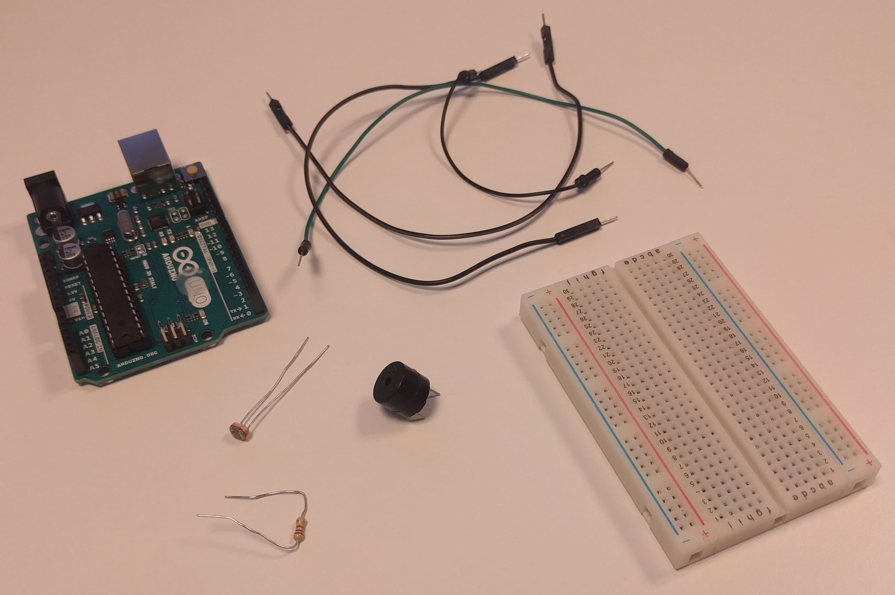

# Introduksjon {.intro}

Nå som vi har sett litt på hvordan vi kan kontrollere en lysdiode på
forskjellige måter ([Blinkende lysiode](../blinkende_lysiode/blinkende_lysiode.html){target=_blank} og [RGB-lysiode](../RGB_diode/RGB_diode.html){target=_blank}), kan vi gå over til å lage litt lyd!


# Steg 1: Finn frem utstyr {.activity}

Før vi kan begynne å lage kretsen og koden, er vi nødt til å finne frem alt vi
trenger. I denne oppgaven trenger vi i hovedsak en buzzer.

## Dette trenger du {.check}

- [ ] 1 Arduino Uno

- [ ] 1 breadboard

- [ ] 2 ledninger

- [ ] 1 buzzer

- [ ] 1 motstand 270 Ohm (rød-lilla-brun-gull)

<figure></figure>


# Steg 2: Lag kretsen {.activity}

Før vi kan begynne med programmeringen, så er vi nødt til å lage en krets. Hvis
du nå har funnet frem alt du trenger kan du følge instruksjonene og
illustrasjonen under.

<figure></figure>

## Sjekkliste {.check}

- [ ] Ledning fra GND på Arduinoen til den negative lederen på buzzeren

- [ ] Ledning fra 11~ på Arduinoen til motstand

- [ ] Motstand til den positive lederen på buzzeren.

## Porter merket med ~ {.protip}

Husker du hva "~" betyr? Det har seg slik at alle porter merket med "~" har en
spesiel funksjon kalt PWM. Dette står for "Pulse With Modulation" og kan blant
annet brukes for å spille lyder.


# Steg 3: Lag en tone {.activity}

*Nå skal vi lage vår første tone med Arduinoen.*

## Sjekkliste {.check}

- [ ] Åpne Arduino-programmet om det ikke allerede er åpent

- [ ] Arduino-programmet starter med denne koden:

  ```cpp
  void setup(){

  }

  void loop(){

  }
  ```

- [ ] Skriv denne koden:

  ```cpp
  int lyd = 11;

  void setup(){
    pinMode(lyd, OUTPUT);
  }

  void loop(){
    tone(lyd, 880);
  }
  ```

- [ ] Trykk på 
  for å laste opp koden. Denne sjekker først om koden er riktig, og så vil
  programmet ditt kjøre på arduinoen

- [ ] Lager den lyd?

### Virker det ikke? {.protip}

Hvis det ikke virker, så kan det hende at Arduino-programmet står på feil
__port__ og/eller __brett__. Da kan du sjekke disse to tingene:

+ Brett er satt riktig: __Tools -> Board -> Arduino/Genuino Uno__

+ Port er satt riktig:

  + Windows: __Tools -> Port -> COM1__ (kan være et annet tall)

  

  + Mac: __Tools -> Port ->/dev/tty.usbmodem262471__ (kan være et annet tall)

Hvis dette ikke fungerer, kan du prøve å lukke programmet og åpne det igjen.

### Utfordringer {.challenge}

- [ ] Hva skjer hvis du endrer tallet 880 til et annet?


# Steg 4: Bruk en lysfølsom motstand til å styre lyden {.activity}

Vi kan bruke en annen input for å styre lyden også. La oss se hvordan vi kan få
en lysfølsom motstand til å styre lyden. En lysfølsom motstand varierer
motstanden etter hvor mye lys den får inn. Finn frem alt du trenger og koble opp
slik som på diagrammet under og følg sjekklisten!

<figure></figure>

<figure></figure>

## Sjekkliste {.check}

- [ ] La alle de andre komponentene være som før

- [ ] Ledning fra en fot på lysfølsom motstanden til A5 på arduinoen

- [ ] Ledning fra fot på lysfølsom motstand til GND

- [ ] Skriv koden under:

```cpp
int lyd = 11;
int lys = A5;

void setup() {
  pinMode(lys, INPUT_PULLUP);
  pinMode(lyd, OUTPUT);
}

void loop() {
  int frekvens = analogRead(lys) * 3.2;
  tone(lyd, frekvens);
  delay(100);
}
```

Se der! Nå har du lært å lage litt lyd med Arduino!

### Utfordringer {.challenge}

Her er noen nøtter du kan prøve deg på ved å endre koden.

- [ ] Hva skjer hvis du endrer verdien til delay

- [ ] Kan du få en lysdiode til å lyse med forskjellig intensitet gitt
  forskjellige toner

- [ ] Klarer du å bruke knapper for å spille forksjellige toner?

### Map {.protip}

`map` tar en verdi, og endrer den fra et tall i et gitt område til et tall i et
annet. F. eks. vil

```cpp
int lysstyrke = analogRead(lys);
int verdi = map(lysstyrke, 15, 512, 100, 1500);
```

sette `verdi` til et tall mellom 100 og 1500, hvor en lysstyrke på 15 gir 100 og
en lysstyrke på 512 gir 1500.

### Utfording (Vanskelig) {.challenge}

- [ ] Kan du bytte ut `analogRead(lys)*3.2` til å bruke map?
