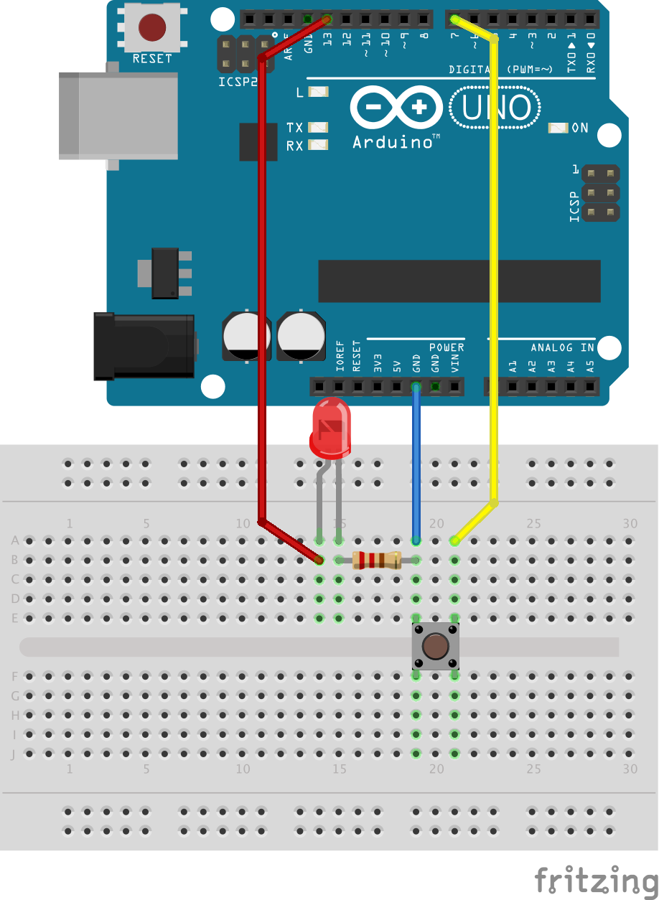

# Informasjon til veiledere


## Læringsmål

Oppgaven «Blinkende lysdiode» introduserer flere konsepter:

+ Hvordan laste opp programmer til Arduino.
+ Enkel programmering mot Arduino.
  + Grunnleggende kodeelementer på Arduino; ``setup()``, ``loop()`` og ``delay()``.
  + Grunnleggende programmeringskonsepter; Variabler, funksjonskall,
    kontrollflyt.
  + Sette verdi på digitale pinner.
  + Lese verdi fra digitale pinner.
+ Hvordan koble enkle kretser.
  + Bruk av jord og sluttede kretser, herunder felles jording.
  + Enkle elektroniske komponenter.
    + Diode
    + Knapp
    + Motstand


# Forklaringer

## Arduino

Arduino er en åpen plattform for prototyping av elektronikk. Arduino kan brukes
for å styre elektroniske komponenter som motorer og lys, samt få data fra knapper,
temperaturmålere, osv. Mer info kan finnes på [arduino.cc](https://www.arduino.cc/en/Guide/Introduction).

## Breadboard

Et «breadboard» er et brett brukt for å forenkle prototyping.


Dette er et lite breadboard. Breadboardet er todelt, skilt av det lille
innhugget på tvers av hele brettet, og det er ingen koblinger mellom de to
delene.  På radene med **+** og **-** går koblingene langs raden. På de
nummererte kolonnene går koblingene langs kolonnene. Mer informasjon kan finnes
på [Wikipedia](https://en.wikipedia.org/wiki/Breadboard).

## Lukket krets

En lukket krets er en krets der komponentene er sammenkoblet fra en positiv
spenning (+5 volt på arduinoens utganger) til en annen, lavere spenning (GND,
jord-koblingen på arduinoen). I en lukket krets vil strømmen gå fra den høyere
spenningen til den lavere gjennom alle komponentene, og så til den lavere
spenningen.

## Motstand

En motstand, også kalt resistor, er en elektronisk komponent som brukes til å
begrense hvor mye strøm som går gjennom en lukket krets. Det finnes mange måter
å forklare hvordan dette skjer, med Ohms lov som et naturlig stikkord for å
begynne å forstå detaljene. Dette er dog utenfor skopet til denne oppgaven. En
enkel forklaring kan være at hvor mye strøm som går i en lukket krets faller
proporsjonalt med hvor mye motstand kretsen har.

Det går helt fint an å bruke andre motstander enn 220 Ohm, men du bør ikke gå
lavere. Om du finner motstander på forskjellige størrelser kan det være morsomt
å eksperimentere med de forskjellige motstandene for å se hva det gjør med
lyset fra lysdioden. Ved 220 Ohm vil diodene lyse ganske sterkt, ved 1000 Ohm
en god del svakere, ved 10k mye svakere igjen. Om du finner motstander på 100k
vil det være vanskelig å se lyset.

## Jord, felles jord

Jord, markert GND på bl.a arduinoen, er en sammenkoblet serie med kabler og
punkter, som alle holder samme elektriske spenning. Hvis man har jord
tilgjengelig flere steder gjør dette det enkelt å lage sluttede kretser, som
man ser i steg 5 --- her har vi koblet GND til minus-skinnen på breadboardet,
og fører jord videre derfra.

## Kortslutninger (og litt om `INPUT_PULLUP`)

Når man kobler en pinne med spenning på direkte til jord, vil det kunne gå
ubegrenset med strøm fra denne. Dette kalles en kortslutning, og kan i mange
elektroniske sammenhenger føre til at komponenter blir ødelagte --- derfor
kobler vi gjerne til motstander for å redusere strømmen. Når vi kobler en diode
til vil denne gi veldig liten motstand, så derfor legger vi til en diode her
for å passe på at det ikke går så mye strøm at pinne 8 eller dioden blir
skadet.

I steg 5 gjør vi dog noe som ikke stemmer helt med beskrivelsen over --- hver
gang noen trykker på knappen lages det en kortslutning fra pinne 7 til jord!
Dette går bra fordi de digitale portene kan settes opp til å bruke en intern
motstand, en «pullup-motstand» som gjør det trygt å kortslutte pinnen.

Mange av pinnene starter med `INPUT_PULLUP` som innstilling til vanlig. Dette
er en «tryggere» innstilling enn `INPUT` eller `OUTPUT`, men i denne
innstillingen kan det aldri gå mye strøm til eller fra pinnen. Hvor stor denne
motstanden er varierer litt, men er typisk minst 20.000 Ohm. Hvis du prøver å
koble en diode opp mot en pinne og glemmer å sette den til `OUTPUT`, vil du
muligens se at det kommer bittelitt lys ut.


# Løsningsforslag

## Kan du få lysdioden til å skrus på av et kort trykk på knappen?

```cpp
int led = 8;
int knapp = 7;
bool ledOn = false;

void setup() {
  pinMode(led, OUTPUT);
  pinMode(knapp, INPUT_PULLUP);
}

void loop() {
  if (digitalRead(knapp) == LOW) {
    if (ledOn) {
      ledOn = false;
      digitalWrite(led, LOW);
    } else {
      ledOn = true;
      digitalWrite(led, HIGH);
    }
    delay(250);
  }
}
```

## Kan du få til det samme med å bruke kun 3 ledninger?



# Installasjonsinstruksjoner

+ [Windows](https://arduino.cc/en/Guide/Windows)
+ [Mac OS X](https://arduino.cc/en/Guide/MacOSX)
+ [Linux](https://arduino.cc/en/Guide/Linux)
