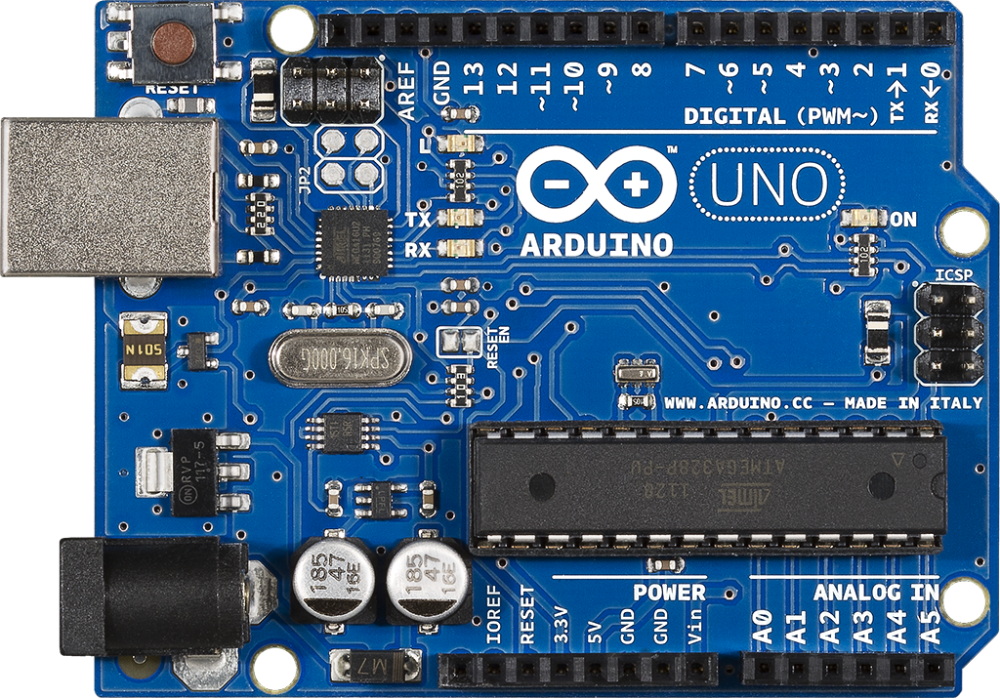

# Introduksjon {.intro}

__Arduino__ er en liten mikrokontroller som man kan programmere elektroniske
dingser og duppeditter. Ved hjelp av en arduino kan du sku av og på
lyset på rommet ditt når du åpner døre, den kan sende melding til
datamaskinen din hvis det blir kalt eller den kan vanne plantene
dine automatisk når du er borte. Det er kun fantasien som setter
grenser for hva en arduino kan gjøre!

Vi begynner med å lage en elektronisk krets slik at vi kan programmere
arduinoen til og få et lite lys til å blinke. Når vi har laget litt
enkle kretser og gjort litt enkel programmering så kan vi begynne
å lage elektronikk som kontrollerer et spill!

# Steg 1: Installere programvaren {.activity}

*Last ned og installer programvaren*

Det første vi må gjøre er å installere arduino programvaren. Dette
lar oss programmere arduinoen. For å installere arduino må man
laste det ned fra [Arduno.cc](https://www.arduino.cc/en/Main/Software).
Når den er ferdig lastet ned må man installere det. Er du usikker
på hvordan man gjør dette, bør du snakke med en veileder.
Etter at installasjonen er ferdig må du åpne programmet. 
Se etter ikonet under:

Så kan vi koble arduinoen til datamaskinen.

## Sjekkliste {.check}

+ Lastet ned arduino programvaren fra 
[Arduno.cc](https://www.arduino.cc/en/Main/Software).
+ Installert programmet.
+ Åpnet programmet og koblet arduinoen til datamasinen.

### TEST! {.protip}

# Steg 2: Studer arduino-brettet {.activity}

*La oss bli kjent med arduino-brettet.*
Under ser du et bilde av arduino-brettet som vi kommer
til å bruke fremover. Finn det frem og studer det!

## Sjekkliste {.check}

+ Finn frem arduino-brettet
+ Bli kjent med brettet

### Prøv selv {.try}
