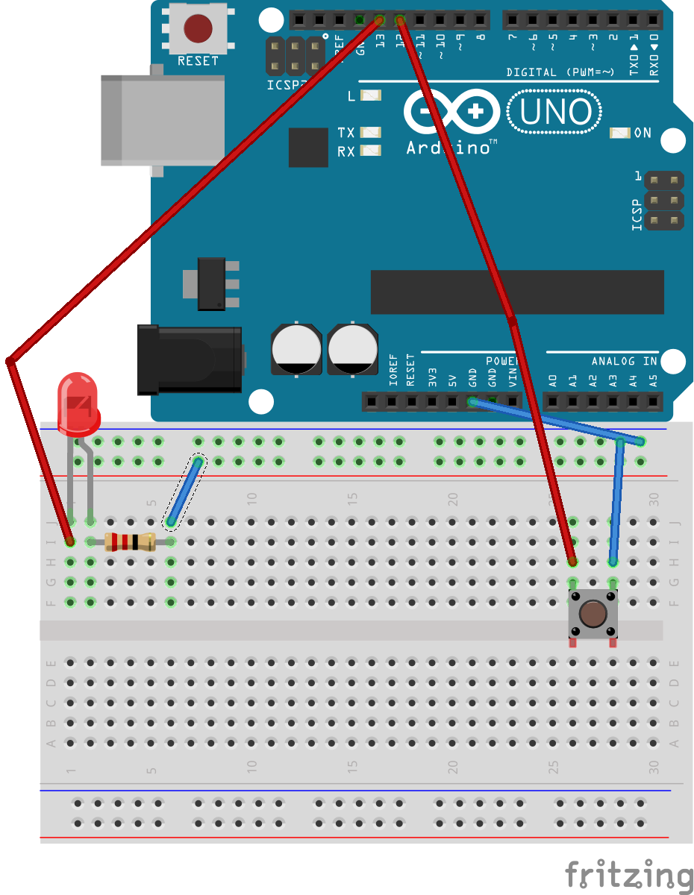

# Introduksjon {.intro}

__Arduino__ er en liten mikrokontroller som man kan programmere elektroniske
dingser og duppeditter. Ved hjelp av en Arduino kan du sku av og på
lyset på rommet ditt når du åpner døre, den kan sende melding til
datamaskinen din hvis det blir kalt eller den kan vanne plantene
dine automatisk når du er borte. Det er kun fantasien som setter
grenser for hva en Arduino kan gjøre!

Vi begynner med å lage en elektronisk krets slik at vi kan programmere
Arduinoen til å få et lite lys til å blinke. Når vi har laget noen 
enkle kretser og gjort litt enkel programmering så kan vi begynne
å lage elektronikk som kontrollerer et spill!

# Steg 1: Installere programvaren {.activity}

*Last ned og installer programvaren*

Det første vi må gjøre er å installere Arduino programvaren. Dette
lar oss programmere Arduinoen. For å installere Arduino må man
laste det ned fra [Arduno.cc](https://www.Arduino.cc/en/Main/Software).
Når den er ferdig lastet ned må man installere det. Er du usikker
på hvordan man gjør dette, bør du snakke med en veileder.
Etter at installasjonen er ferdig, må du åpne programmet. 
Se etter ikonet under:


Så kan vi koble Arduinoen til datamaskinen.


## Sjekkliste {.check}

+ Laste ned Arduino programvaren fra 
[Arduno.cc](https://www.arduino.cc/en/Main/Software).
+ Installer programmet.
+ Åpne programmet
+ Koble Arduinoen til datamasinen.

# Steg 2: Studer Arduino-brettet {.activity}

*La oss bli kjent med Arduino-brettet.*
Under ser du et bilde av Arduino-brettet som vi kommer
til å bruke fremover. Finn det frem og studer det!


## Sjekkliste {.check}

+ Finn frem Arduino-brettet
+ Bli kjent med brettet

# Steg 3: Lag en krets {.activity}

*Nå skal vi lage vår første krets på en Arduino.*
Finn frem noen ledninger, en LED og en motstand.
Først må vi koble Arduinoen til datamaskinen.
Etter det kobler vi opp LEDen som på bildet
under:


Legg merke til at ingenting vil skje!

## Sjekkliste {.check}

+ Finn en LED, noen ledninger og en 270 Ohm motstant.
+ Koble alt opp som på bildet.

### Slik har vi koblet {.protip}

Nå har vi koblet vår første __krets__. Hvis
du ser på hvordan vi har koblet, vil du se at
vi har laget en luket krets. Det vil si at vi
lar strømmen gå fra pluss (+) til minus (gnd).
Den porten (13) vi koblet den røde ledningen til
er en digital port. Denne porten kan du
programmere på datamaskinen din, slik at
for eksempel LEDen blinker. Dette er akkurat
som en __lysbryter__. Den fargerike klumpen er en motstand.
Denne gjør slik at vi ikke ødelegger lampen
vi har koblet med for mye strøm. Motstanden
er så koblet i minus (gnd).

# Steg 4: Skriv litt kode {.activity}

*Nå er det på tide at vi koder litt!*
Det første programmet vi skal lage vil gjøre
slik at LEDen blinker.

## Sjekkliste {.check}

+ Sørg for at Arduino-programmet er åpent
+ Sjekk om koden som er der ser ut som dette:
```cpp
void setup(){

}

void loop(){

}
```
+ Skriv denne koden:
```cpp
// Dette er porten vi har koblet LEDen til
int led = 13;

void setup(){
	// Her sier vi at LEDen skal være noe som skal gi ut noe (lys)
	pinMode(led, OUTPUT);
}

void loop(){
	// Her skrur vi LEDen på
	digitalWrite(led, HIGH);
	// Her lar vi den være på i 1 sekund 
	delay(1000);
	// Her skrur vi den av igjen
	digitalWrite(led, LOW);
}
```

### Prøv selv {.try}

Klarer du å endre utgangen fra 13 til 11 på Arduinoen
og få koden til til å gjøre det samme på utgang 11?

### Endre utgang i koden {.protip}

Noe av det første som står i koden er:
```cpp
int led = 13;
```
Dette er det vi gjør for å velge hvilken utgang lampen
skal være koblet til. Hver gang du skal legge til en
utgang eller inngang så må du bruke __int__ etterfulgt
av et navn du vil gi porten. Her har vi valgt å kalle 
den for __led__, men du kan kalle den det du vil. Vi gjør
dette fordi det ofte er enklere å huske enn nummeret.
Etter __=__ kommer det et tall, og dette tallet er det
samme som står på siden av den utgangen du koblet lampen
til. Vil du bruke utgang 9 for lampen skriver du:
```cpp
int led = 9;
```
Husk at du alltid må bruke __;__ på slutten av hver kode linje!

### Hva er *void setup()* og *void loop()*? {.protip}

Lurer du på hva *void setup()* og *void loop()* er?
*void setup()* er der du skriver koden som du kun vil skal kjøre
når du starter Arduinoen. For eksempel er det her vi sier om en port
skal være inngang eller utgang. *void loop()* kjører
etter *void setup()*, og repeteres evig. Hvis du lurte
på hvorfor lampen forsatte å skru seg av og på, selv om *void loop()*
har gått igjennom en gang, så er det fordi ardiuno-brettet starter på
det som står øverst i *void loop()* igjen.
Når den har kommet til slutten starter den på toppen
igjen og gjenntar alt enda en gang. Dette gjør den helt
du skru av Arduino-brettet.

# Steg 5: Legg til en knapp {.activity}

*Nå skal vi skru av og på lampen med en knapp!*
Vi har nå lært hvordan vi kan få en lampe til å blinke
ved hjelp av Arduinoen. Neste steg er derfor å skru
lampen av og på med en knapp!

## Sjekkliste {.check}

+ Finn noen ledninger og en knapp
+ Koble alt slik som på bildet under:



+ Skriv koden under:

```cpp
int led = 13;
int knapp = 12;

void setup(){
	// Her sier vi at LEDen skal være noe som skal gi ut noe (lys)
	pinMode(led, OUTPUT);
	// Her sier vi at knapp skal være noe som tar inn
	// informasjon (når du trykker på knappen)
	pinMode(knapp, INPUT_PULLUP);
}

void loop(){
	// Her sjekker vi om knappen er trykket eller ikke
	if(digitalRead(knapp) == LOW){
		//Hvis knappen er trykket skal lampen lyse
		digitalWrite(led, HIGH);
	} else {
		// Hvis knappen ikke er trykket, vil ikke lampen lyse
		digitalWrite(led, LOW);
	}
}
```
Se der! Nå har du lært å lage enkle kretser med Arduino!
