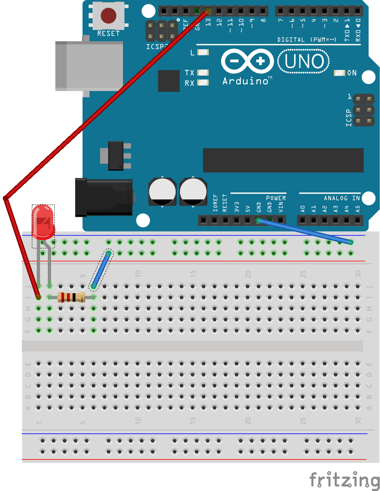

# Introduksjon {.intro}

__Arduino__ er en liten mikrokontroller som man kan programmere elektroniske
dingser og duppeditter. Ved hjelp av en arduino kan du sku av og på
lyset på rommet ditt når du åpner døre, den kan sende melding til
datamaskinen din hvis det blir kalt eller den kan vanne plantene
dine automatisk når du er borte. Det er kun fantasien som setter
grenser for hva en arduino kan gjøre!

Vi begynner med å lage en elektronisk krets slik at vi kan programmere
arduinoen til og få et lite lys til å blinke. Når vi har laget litt
enkle kretser og gjort litt enkel programmering så kan vi begynne
å lage elektronikk som kontrollerer et spill!

# Steg 1: Installere programvaren {.activity}

*Last ned og installer programvaren*

Det første vi må gjøre er å installere arduino programvaren. Dette
lar oss programmere arduinoen. For å installere arduino må man
laste det ned fra [Arduno.cc](https://www.arduino.cc/en/Main/Software).
Når den er ferdig lastet ned må man installere det. Er du usikker
på hvordan man gjør dette, bør du snakke med en veileder.
Etter at installasjonen er ferdig må du åpne programmet. 
Se etter ikonet under:


Så kan vi koble arduinoen til datamaskinen.


## Sjekkliste {.check}

+ Lastet ned arduino programvaren fra 
[Arduno.cc](https://www.arduino.cc/en/Main/Software).
+ Installert programmet.
+ Åpnet programmet og koblet arduinoen til datamasinen.

# Steg 2: Studer arduino-brettet {.activity}

*La oss bli kjent med arduino-brettet.*
Under ser du et bilde av arduino-brettet som vi kommer
til å bruke fremover. Finn det frem og studer det!


## Sjekkliste {.check}

+ Finn frem arduino-brettet
+ Bli kjent med brettet

## Steg 3: Lag en krets {.activity}

*Nå skal vi lage vår første krets på en arduino*
Finn frem noen ledninger, en LED og en motstand.
Først vil vi koble arduinoen til dataen.
Etter det kobler vi opp LEDen som på bildet
under:



Legg merke til at ingenting vil skje!

## Sjekkliste {.check}

+ Funnet en LED, ledninger og en 270 Ohm motstant.
+ Koblet alt opp som på bildet.

### Slik har vi koblet {.protip}

Nå har vi koblet vår første __krets__. Hvis
du ser på hvordan vi har koblet, vil du se at
vi har laget en luket krets. Det vil si at vi
lar strømmen gå fra pluss (+) til minus (gnd).
Den porten (13) vi koblet den røde ledningen til
er en digital port. Denne porten kan du
programmere på datamaskinen din, slik at den
for eksempel blinker. Akkurat som en __bryter__
Den fargerike klumpen er en motstand.
Denne gjør slik at vi ikke ødelegger lampen
vi har koblet med for mye strøm. Motstanden
er så koblet i minus (gnd).

## Steg 4: Skriv litt kode {.activity}

*Nå er det på tide at vi koder litt!*
Det første programmet vi lager vil gjøre
slik at den kretsen vi laget blinker lampen.

## Sjekkliste {.check}

+ Sørg for at arduino-programmet er åpent
+ Sjekk om koden som er der ser ut som dette:
```processing
void setup(){

}

void loop(){

}
```
+ Skriv denne koden:
```processing
// Dette er porten vi har koblet LEDen til
int led = 13;

void setup(){
	// Her sier vi at LEDen skal være noe som skal gi ut noe (lys)
	pinMode(led, OUTPUT);
}

void loop(){
	// Her skrur vi LEDen på
	digitalWrite(led, HIGH);
	// Her lar vi den være på i 1 sekund 
	delay(1000);
	// Her skrur vi den av igjen
	digitalWrite(led, LOW);
}
```

### Prøv selv {.try}
