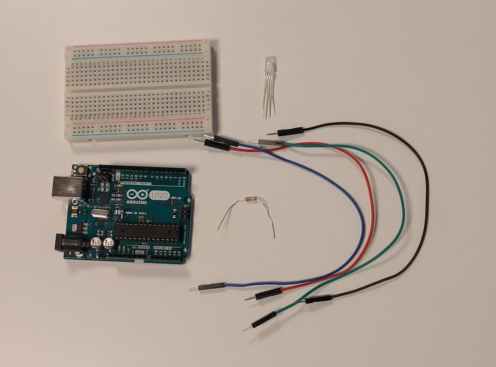

# Om oppgaven {.activity}

I denne oppgaven skal elevene få en RGB-lysdiode til å lyse.

## Oppgaven passer til: {.check}

 __Fag__: Naturfag, Teknologi og Design, Teknologi og forskningslære

__Anbefalte trinn__: 5. trinn - VG3

__Tema__: Arduino, Kretser, RGB-lysiode, Løkker

__Tidsbruk__: Dobbelttime

## Kompetansemål {.challenge}

- [ ] __Naturfag, 7. trinn:__ utforske, lage og programmere teknologiske systemer som består av deler som virker sammen

- [ ] __Teknologi og design, 10. trinn:__ velge og bruke ulike materialer og verktøy i arbeidet med prototyper for teknologiske produkt

- [ ] __Teknologi og design, 10. trinn:__ grunngi valg av design, materialer, verktøy og framgangsmåter, og reflektere over hvor trygge og bærekraftige valgene er

- [ ] __Teknologi og forskningslære X og 1, VG2:__ anvende kravspesifikasjon i arbeid med å utvikle og teste funksjonelle produkter og vurdere produktet opp mot kravspesifikasjonen

- [ ] __Teknologi og forskningslære 1, VG2:__ bruke og programmere mikrokontroller for å utvikle et produkt

## Forslag til læringsmål {.challenge}

- [ ] Elevene kan styre en RGB-lysdiode

- [ ] Elevene kan skrive program for en Arduino som bruker `for`- og `while`-løkker

## Forslag til vurderingskriterier {.challenge}

Oppgaven er grunnleggende, og kan ikke brukes alene for vurdering av kompetansemålet.

## Forutsetninger og utstyr {.challenge}

- [ ] __Forutsetninger__: Oppgaven er en introduksjon til Arduino, og krever ingen forkunnskaper eller erfaring. Det er en fordel å kunne litt engelsk.

- [ ] __Utstyr__:

  - [ ] 1 Arduino Uno

  - [ ] Datamaskin med Arduino software installert (Se _Eksterne ressurser_) og USB-kabel

  - [ ] 1 breadboard

  - [ ] 1 motstand 1k Ohm (Fargekode: brun-svart-rød-gull)

  - [ ] 4 ledninger

  - [ ] 1 RGB-lysdiode

  

## Fremgangsmåte

Her kommer tips, erfaring og utfordringer til de ulike stegene i den faktiske
oppgaven. [Klikk her for å se oppgaveteksten.](../rgb_diode/rgb_diode.html){target=_blank}

### Løsningsforslag for fargekombinasjonssykling {.activity}

```cpp
const auto roed_pinne = 9;
const auto groenn_pinne = 10;
const auto blaa_pinne = 11;

const auto roed_styrke = 255 * 0.7;
const auto groenn_styrke = 255 * 0.85;
const auto blaa_styrke = 255;

void setup() {
  for (auto led = 9; led <= 11; ++led) {
    pinMode(led, OUTPUT);
    digitalWrite(led, LOW);
  }
}

void loop() {
  for (auto roed = 0; roed <= 1; ++roed) {
    analogWrite(roed_pinne, roed * roed_styrke);

    for (auto groenn = 0; groenn <= 1; ++groenn) {
      analogWrite(groenn_pinne, groenn * groenn_styrke);

      for (auto blaa = 0; blaa <= 1; ++blaa) {
        analogWrite(blaa_pinne, blaa * blaa_styrke);
        delay(1000);
      }
    }
  }
}
```

## Kommentar {.protip}

Vi har testet dette med RGB-lysdioden som er med i kodegenet sin pakke. For å
kunne se blå og grønn mens rød hadde full intensitet måtte vi skalere
intensiteten til rød med 0.7. Det er også grunnen til at vi har skalert grønn
med 0.85, denne gangen for å kunne se blå.

Skaleringsfaktorene kan variere mellom lysdioder, så hvis disse faktorene ikke
fungerer må en prøve seg frem.

## Variasjoner {.challenge}

- [ ]  _Vi har dessverre ikke noen variasjoner tilknyttet denne oppgaven enda._

## Eksterne ressurser {.challenge}
- [ ] Installasjonsinstruksjoner:

  + [Windows](https://arduino.cc/en/Guide/Windows)

  + [Mac OS X](https://arduino.cc/en/Guide/MacOSX)

  + [Linux](https://arduino.cc/en/Guide/Linux)
