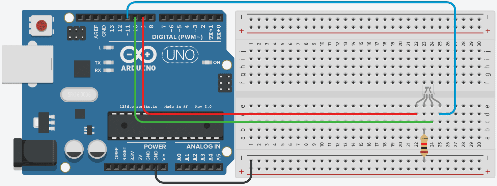

# Introduksjon {.intro}

I denne oppgaven skal vi se på å få en RGB-lysdiode til å lyse.

# Steg 1: Finn frem utstyr {.activity}

## Til denne oppgaven trenger du {.check}

- [ ] 1 Arduino Uno
- [ ] 1 breadboard
- [ ] 1 motstand 1k Ohm (Fargekode: brun-svart-rød-gull)
- [ ] 4 ledninger
- [ ] 1 RGB-lysdiode


# Steg 2: Oppkobling {.activity}



# Steg 3: Programmering {.activity}

```cpp
void clear() {
  auto led = 9;
  while (led <= 11) {
    digitalWrite(led, LOW);
    ++led;
  }
}

void setup() {
  auto led = 9;
  while (led <= 11) {
    pinMode(led, OUTPUT);
    ++led;
  }
  clear();
}

void loop() {
  auto led = 9;
  while (led <= 11) {
    clear();
    digitalWrite(led, HIGH);
    delay(1000);
    ++led;
  }
  digitalWrite(9, HIGH);
  digitalWrite(10, HIGH);
  digitalWrite(11, HIGH);
  delay(1000);
}
```

### `while`-løkker {.protip}

I denne kodesnutten ser du at vi bruker `while`. Dette er en løkke, og brukes for å kjøre samme kode gjentatte ganger.

`while` fungerer ved at koden repeteres så lenge uttrykket i parenteser er sant. Du kan tenke på det som en gjentagende `if`-test.

+ Som vi ser av koden starter `led` med verdien 9. Siden 9 er mindre en 11 er uttrykket sant, og vi kjører koden inne i
  løkka. På slutten av løkka skriver vi `++led`, som øker verdien av `led` til 10.
+ Deretter sjekker vi igjen om `led <= 11`. Siden 10 er mindre enn 11 går vi inn i løkka igjen, og kjører koden igjen. På slutten av løkka økes `led`
  på nytt, denne gangen til 11.
+ Når vi så tester `led <= 11` er `led` lik 11, som gjør at vi kjører koden enda en gang. På slutten av løkka øker vi nå `led` til 12.
+ Når vi til slutt sjekker om `led <= 11` er ikke lenger uttrykket sant, siden 12 er større enn 11. Derfor går vi ikke lenger inn i løkka, men fortsetter videre i funksjonen vi er i.


# `for`-løkker

I eksempelet over skriver vi veldig mange linjer kode for å lage en løkke. Først initialiserer vi en variabel, så har
vi en test som sjekker om vi skal kjøre koden i løkka, så endrer vi en variabel for å holde styr på når løkka skal
avslutte.

Dette er noe som gjøres veldig ofte, så for å skape mindre kode, og kode som er enklere å lese, har
vi `for`-løkker. `while`-løkkene vi har skrevet ovenfor kan enkelt skrives om til `for`-løkker slik:

```cpp
auto led = 9;
while (led <= 11) {
  <kode>
  ++led;
}
```
```cpp
for (auto led = 9; led <= 11; ++led) {
  <kode>
}
```

### Utfordring {.challenge}

- [ ] Klarer du å skrive om det første programmet i denne oppgaven til å bruke `for`-løkker istedenfor `while`-løkker?


# Nøstede løkker {.activity}

Løkker kan brukes inni hverandre.

```cpp
void loop() {
  for (auto led = 9; led <= 11; ++led) {
    clear();
    for (auto verdi = 0; verdi < 256; ++verdi) {
      analogWrite(led, verdi);
      delay(5);
    }
  }
}
```

Denne koden vil:

+ Slå av alle fargene
+ Gradvis øke lysintensitet på pinne 9 fra 0 til 255
+ Slå av alle fargene
+ Gradvis øke lysintensitet på pinne 10 fra 0 til 255
+ Slå av alle fargene
+ Gradvis øke lysintensitet på pinne 11 fra 0 til 255

Skriv inn koden og se selv hva den gjør.

### Utfordringer {.challenge}

- [ ] Kan du få lysdioden til å først øke så senke fargeintensiteten før den bytter farge? (`++i` øker i med 1, `--i` minker i
  med 1)
- [ ] Kan du få lysdioden til å sykle gjennom alle fargekombinasjonene?
 (blå, grønn, blå + grønn, rød, rød + blå, rød + grønn, rød + blå + grønn)
