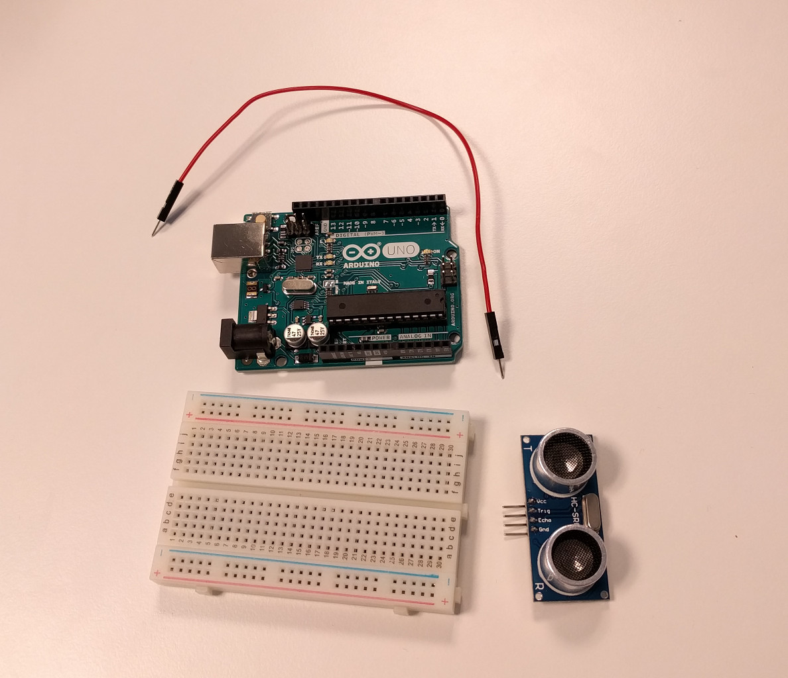

# Om oppgaven {.activity}

I denne oppgaven skal elevene se på bruken av en ultralydsensor.

## Oppgaven passer til: {.check}

 __Fag__: Naturfag, Teknologi og Design, Teknologi og forskningslære

__Anbefalte trinn__: 5. trinn - VG3

__Tema__: Andruino, Kretser, Ultralyd

__Tidsbruk__: Dobbelttime

## Kompetansemål {.challenge}

- [ ] __Naturfag, 7. trinn:__ utforske, lage og programmere teknologiske systemer som består av deler som virker sammen

- [ ] __Teknologi og design, 10. trinn:__ velge og bruke ulike materialer og verktøy i arbeidet med prototyper for teknologiske produkt

- [ ] __Teknologi og design, 10. trinn:__ grunngi valg av design, materialer, verktøy og framgangsmåter, og reflektere over hvor trygge og bærekraftige valgene er

- [ ] __Teknologi og forskningslære X og 1, VG2:__ anvende kravspesifikasjon i arbeid med å utvikle og teste funksjonelle produkter og vurdere produktet opp mot kravspesifikasjonen

- [ ] __Teknologi og forskningslære 1, VG2:__ bruke og programmere mikrokontroller for å utvikle et produkt

- [ ] __Teknologi og forskningslære X og 1, VG2:__ utforske analoge og digitale signal fra sensorer

## Forslag til læringsmål {.challenge}

- [ ] Elevene kan bruke en ultralydsensor.

- [ ] Elevene kan koble opp en seriellkonsoll.

## Forslag til vurderingskriterier {.challenge}

Oppgaven er grunnleggende, og kan ikke brukes alene for vurdering av kompetansemålet.

## Forutsetninger og utstyr {.challenge}

- [ ] __Forutsetninger__: Oppgaven er en introduksjon til Arduino, og krever ingen forkunnskaper eller erfaring. Det er en fordel å kunne litt engelsk.

- [ ] __Utstyr__:

  - [ ] 1 Arduino Uno

  - [ ] Datamaskin med Arduino software installert (Se _Eksterne ressurser_) og USB-kabel

  - [ ] 1 breadboard

  - [ ] 1 ultralydsensor

  - [ ] 6 ledninger

  

## Fremgangsmåte

Her kommer tips, erfaring og utfordringer til de ulike stegene i den faktiske
oppgaven. [Klikk her for å se oppgaveteksten.](../ultralydsensor/ultralydsensor.html){target=_blank}

### Koblingsskjema

Elevene skal allerede ha løst en del oppgaver før de begynner på denne, men
hittil alltid fått koblingsskjema utlevert. Denne oppgaven kan være en god
anledning til å la dem prøve å koble opp komponentene uten skjema. Det kan dog
være greit å ha et koblingsskjema eller tre i bakhånd for å dele ut:


### Hjelp til 7-segment-utfordringen

I oppgaven [7-Segment Display](../7_segment_display/7_segment_display.html){target=_blank} har
vi laget koden som kan vise et tall mellom 0 og 9 på et display. Koden under vil
bare skrive ut «Om du hadde hatt et display burde det vist tallet (tall)» om og
om igjen på seriellkonsollet.

```cpp
const auto ekko = 2; // Echo pin
const auto sender = 3; // Trig pin
const auto lydens_hastighet = 0.034029; // 340.29 m/s

void setup() {
  Serial.begin(9600);
  pinMode(ekko, INPUT);
  pinMode(sender, OUTPUT);

  digitalWrite(sender, LOW);
}

void loop() {
  digitalWrite(sender, HIGH);
  delayMicroseconds(5);
  digitalWrite(sender, LOW);

  auto tid = pulseIn(ekko);
  auto avstand = (tid * hastighet) / 2;

  auto syvsegment = map(avstand, 0, 127, 0, 9);
  Serial.print("Om du hadde hatt et display burde det vist tallet ");
  Serial.println(constrain(syvsegment, 0, 9));

  delay(100);
}
```

`map` vil lineært skalere `avstand` fra verdiområdet 0-127 til en verdi fra 0
til 9. En avstand på over 127 cm vil gi høyere verdier enn 9.

Tallet 127 cm er litt tilfeldig valgt som et tall som kan gi mening for å
oppdage gjenstander rundt pulten. Ultralydsensoren skal kunne «se» opp til 4
meter fremfor seg, men da må de være store og flate (f.eks. en vegg).

For formelen brukt i `map`, se referansen for hos
[arduino.cc](https://www.arduino.cc/reference/en/language/functions/math/map/){target=_blank}.
Dette kan være relevant om man vil vinkle denne oppgaven inn mot matematikk.

`constrain` vil her gjøre at alle verdier høyere enn 9 vil bli satt til 9.

## Variasjoner {.challenge}

- [ ]  _Vi har dessverre ikke noen variasjoner tilknyttet denne oppgaven enda._

## Eksterne ressurser {.challenge}

- [ ] Installasjonsinstruksjoner:

  + [Windows](https://arduino.cc/en/Guide/Windows){target=_blank}

  + [Mac OS X](https://arduino.cc/en/Guide/MacOSX){target=_blank}

  + [Linux](https://arduino.cc/en/Guide/Linux){target=_blank}
