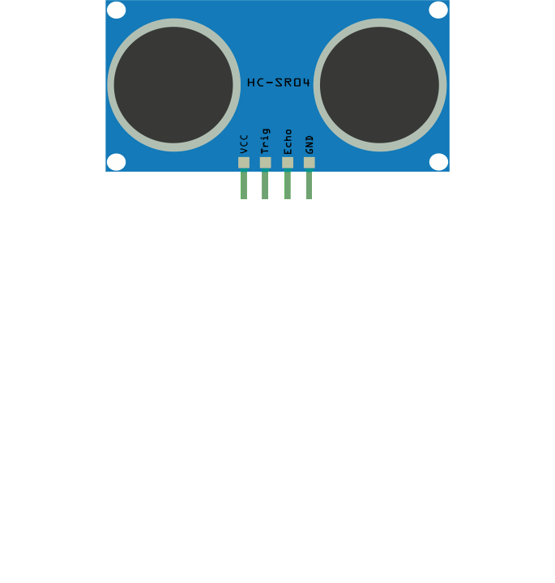
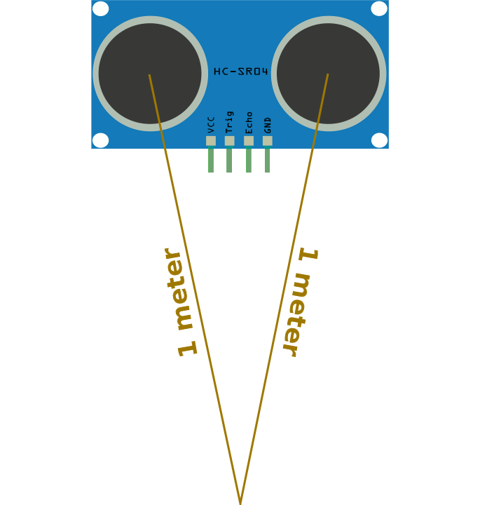
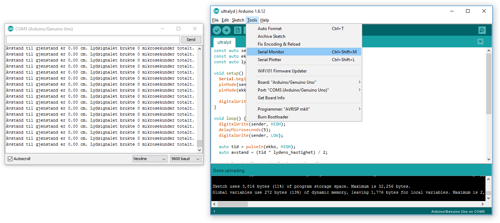

# Introduksjon {.intro}

I denne oppgaven skal vi se på bruken av en ultralydsensor.


# Litt om ultralydsensorer {.activity}

En ultralydsensor fungerer som mange andre ting som bruker ultralyd, f.eks.
ekkolodd og medisinske ultralydmaskiner: De sender en lyd ut, og lytter etter
hvor lang tid det tar før lyden kommer tilbake.

Dette er et eksempel på hvordan vi kan bruke matematikk og vår kjennskap til
fysikk til å beregne nyttige verdier. Hvis vi ser på denne animasjonen kan vi se
hva som skjer når ultralydsensoren sender et signal og får det tilbake.



Som du ser går lyden ut av sensoren i lydens hastighet, reiser bort til det
treffer en gjenstand, og kommer tilbake i lydens hastighet. I naturfag har vi
lært at lydens hastighet er ca. 340.29 m/s. Det gjør at vi kan beregne hvor
langt lyden har reist ved å måle tiden det tar før lyden kommer tilbake. Dette
bildet viser et praktisk eksempel:



Her reiser lyden frem, treffer noe, og kommer tilbake. Hvis vi her måler tiden
fra lyden sendes til den kommer tilbake, vil vi se at det tar ca. 0,0059
sekunder. Vi kan bruke dette tallet til å regne ut hvor langt det har reist:
`0,0059 s * 340 m/s = 2.001 m`. Lyden har altså reist 2 meter. Det vil si at
nærmeste gjenstand er `2.001 m / 2 = 1.0005 m` meter unna. Hvis sensoren peker
på noe stort og flatt vil du se at den kan være veldig presis!


# Steg 1: Finn frem utstyr {.activity}

## Til denne oppgaven trenger du {.check}

- [ ] 1 Arduino Uno

- [ ] 1 breadboard

- [ ] 1 ultralydsensor

- [ ] 6 ledninger


# Steg 2: Koble opp kretsen {.activity}

Hvis du ser på pinnene på ultralydsensoren vil du se at over de står det `Gnd`,
`Echo`, `Trig` og `Vcc`.

`Gnd` er jord, `Vcc` er 5V strøm, `Echo` og `Trig` er digitale pinner.

Koble opp kretsen. Snakk med veileder hvis du står fast og trenger hjelp, men
gjør et forsøk selv først.

## Skriv kode {.activity}

```cpp
const auto ekko = 2; // Echo pin
const auto sender = 3; // Trig pin
const auto lydens_hastighet = 0.034029; // 340.29 m/s

void setup() {
  Serial.begin(9600);
  pinMode(ekko, INPUT);
  pinMode(sender, OUTPUT);

  digitalWrite(sender, LOW);
}

void loop() {
  digitalWrite(sender, HIGH);
  delayMicroseconds(10);
  digitalWrite(sender, LOW);

  auto tid = pulseIn(ekko, HIGH);
  auto avstand = (tid * lydens_hastighet) / 2;

  Serial.print("Avstand til gjenstand er ");
  Serial.print(avstand);
  Serial.print(" cm. Lydsignalet brukte ");
  Serial.print(tid);
  Serial.println(" mikrosekunder totalt");

  delay(100);
}
```

Denne koden gjør akkurat det vi skrev om i introduksjonen. Den sender et lite
lydsignal (ved å skrive en liten puls til `sender`-pinnen) og venter på at
lydsignalet kommer tilbake (ved å kalle `pulseIn` på `ekko`-pinnen. Den kan da
gjøre akkurat det samme regnestykket som vi gjorde der, gange `tid` med
`hastighet` og dele på `2`.

Fordi `pulseIn` gir oss tiden i mikrosekunder (µs), som er en milliontedels
sekund, må vi dele på en 1.000.000, og fordi vi vil ha lengen i cm heller enn i
meter må vi gange med 100. For å slippe å gjøre dette hver gang har vi allerede
gjort det med variabelen `lydens_hastighet`. (340,29 m/s * 100 cm/m / 1.000.000
µs/s = 0,034029 cm/µs.)

## Seriellkonsoll {.protip}

For å kunne lese hva vi skriver ut må du se på det som kalles et seriellkonsoll.
`Serial.print` og `Serial.println` får arduinoen til å skrive til sin
seriellkonsoll, som kan leses fra en pc koblet til arduinoen med USB ledning.
`print` skriver ut tekst eller tall. `println` gjør akkurat det samme, og legger
så til en linjeskift slik at neste `print` eller `println` havner på en ny
linje.

For å åpne seriellkonsollet går du til __Tools -> Serial Monitor__



## Utfordring {.challenge}

- [ ] Klarer du å få en lysdiode til å lyse når noe er nærmere enn 20 cm?

- [ ] klarer du å få en lysdiode til å lyse sterkere jo nærmere noe er (husk
  `PWM`-pinner)?

## Utfordring (Vanskelig) {.challenge}

- [ ] Klarer du å få et 7-Segment Display til å si hvor nærme du er på en skala
  fra 0-9 (husk `map`-funksjonen og oppgaven [7-Segment
  Display](../7_segment_display/7_segment_display.html))?
