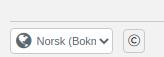

# Introduksjon {.intro}

## {.tip}
Dette dokumentet er rettet mot voksne kodeveiledere, for eksempel i anledning Kodetimen. Selve opplegget finner du ved å følge lenken under.
#

Dette er den klassiske "Kodetimen"-oppgaven fra code.org. Man gjennomgår de fleste grunnleggende konseptene i dataprogrammering, ved hjelp av spillfigurer fra Angry Birds, Plants vs. Zombies og istid.

Til hvert nye konsept man blir introdusert for, dukker det opp en video som forklarer logikken bak konseptet. Videoene er på engelsk, med norsk tekst.

Under kan du lese litt mer om de ulike konseptene du møter på i opplegget.

Når du er klar for å komme i gang, kan du [trykke her for å gå til oppgaven](https://studio.code.org/hoc/1){target=_blank}.

# Velkomstvideo {.activity}

[I denne videoen](https://youtu.be/bQilo5ecSX4){target=_blank} blir du kort introdusert for hva man kan gjøre med koding, og hva hensikten med oppgaven/spillet er. Det kan være greit å se den felles med klassen. Dersom elevene er rundt 4.-6. trinn, kan det være en fordel å stoppe videoen med jevne mellomrom og oversette/forklare hva som nettopp ble sagt.

# Code Studio: Layout {.activity}

Dette er en rask gjennomgang av hva som er hva i brukergrensesnittet til Code Studio.

Sånn ser hele grensesnittet i Code Studio ut. Under går vi gjennom del for del av grensesnittet

## Grensesnitt, del for del {.check}

- [ ] Nederst til venstre på skjermen finner du språkvalg. Av og til kan man få opp oppgaven på engelsk. Da skifter du til nors her. Har man nytilflyttede elever med annet språk enn norsk, kan de velge sitt språk her. I språkfag kan man velge å gjennomføre Kodetimen på tysk, spansk, fransk osv.

- [ ] Øverst på skjermen ser du fremdriften til elevene.

- [ ] På scenen foregår det som har blitt programmert. Her ser man også labyrinten som må løses for å klare oppgaven. Rett under scenen finner man "Kjør"-knappen som starter programmet når man er ferdig med kodingen.

- [ ] Rett under fremdriftsoversikten finner du instruksjonene til oppgaven som skal løses!

- [ ] I feltet midt på skjermen, finner vi alle tilgjengelige kodeklosser som trengs for å løse oppgaven. Vi kan kalle dette området for "verktøykassen"

- [ ] Arbeidsflaten er det store, hvite feltet som dominerer i grensesnittet. Her bygger man opp koden sin ved å dra blokker fra verktøykassa og sette dem sammen til algoritmer som forhåpentligvis løser oppgaven.

- [ ] Når du er klar for å komme i gang, kan du [trykke her for å gå til oppgaven](https://studio.code.org/hoc/1){target=_blank}.
