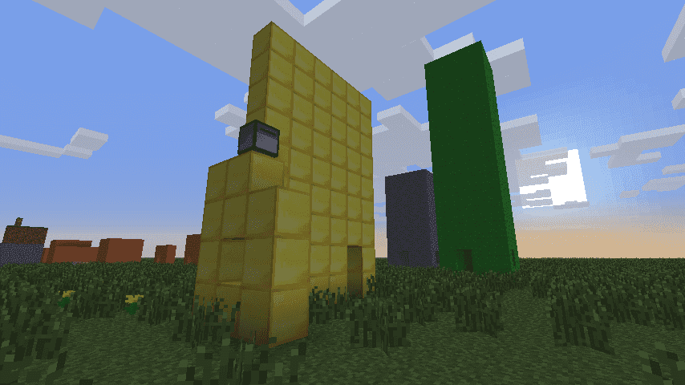
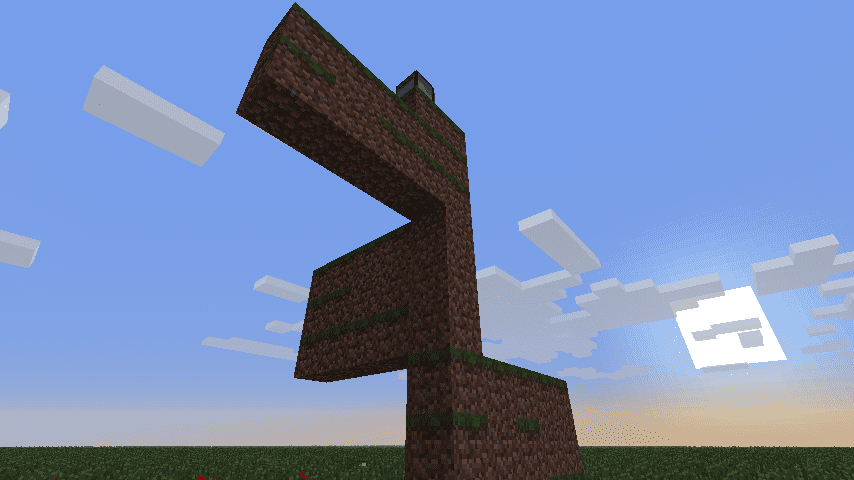
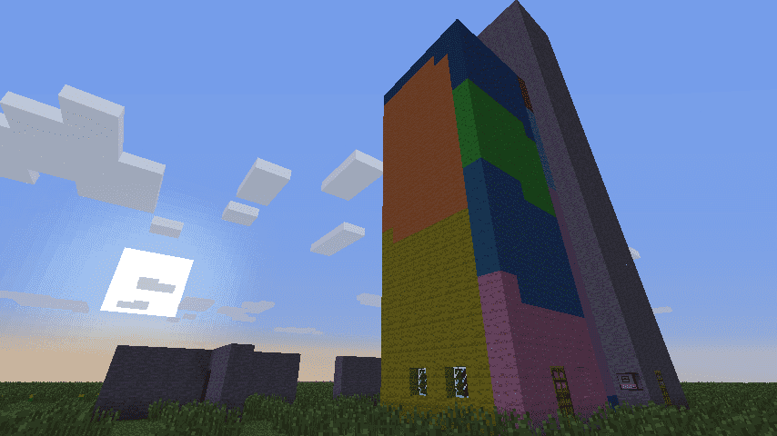

# Introduksjon {.intro}

I denne leksjonen vil vi se litt på hvordan vi kan få en robot til å
bygge et hus for oss. Underveis vil vi lære hvordan vi kan bruke
løkker og funksjoner for å gjenta ting som gjøres flere ganger.



# Steg 1: Prøv selv først {.activity}

Vi har tidligere lært om hvordan roboter behøver fuel for å kjøre og
byggemateriell for å bygge. Pass på at roboten din har nok fuel mens
du gjør oppgavene under.

Tidligere har vi sett hvordan vi bruker `turtle`-biblioteket for å få
roboter til å gjøre forskjellige ting. Spesielt bruker vi kommandoene

`turtle.forward()`, `turtle.back()`, `turtle.turnLeft()`,
`turtle.turnRight()`, `turtle.up()`, `turtle.down()`

for å flytte roboten. Videre kan vi bruke `turtle.place()` eller
`turtle.placeDown()` for å plassere ut en kloss, og vi har sett at vi
kan bruke `for`-løkker for å gjenta ting.

## Sjekkliste {.check}

+ Lag en robot, gi den fuel og legg en del byggemateriell i robotens
  inventory.

+ Lag et nytt program, `edit byggmitthus`, og skriv den følgende koden:

  ```lua
  for i = 1, 5 do
      turtle.back()
      turtle.place()
  end
  ```

  Kjør programmet. Bygger roboten en liten vegg av klosser?

### Prøv selv {.try}

Jobb videre med `bygghus`-programmet, og se om du klarer å utvide det
slik at roboten bygger et enkelt hus med fire vegger og tak. Bruk litt
tid på denne oppgaven slik at du får tenkt gjennom hva som kreves for
å bygge et enkelt hus.

Et par små tips:

+ Det er nok å bruke kommandoene vi har nevnt så langt.

+ Du vil helst bruke flere for-løkker. For at dette skal virke må du
  bruke forskjellige variabler, det vil si at du må bytte ut `i` men
  andre bokstaver eller variabelnavn i de andre løkkene du lager.

+ For å lage dør eller vinduer i huset ditt vil det enkleste være å
  bruke `if`-tester for å sjekke hvor på huset roboten bygger.

## Sjekkliste {.check}

+ Når du har laget et enkelt hus så vis det frem til de andre. Hvilke
  problemer fikk dere underveis?

  Ingen skriver programmer riktig første gangen, og det er veldig
  nyttig å diskutere både hvordan man løser en utfordring, og hvilke
  metoder som ikke virker.

I de neste stegene vil vi utvikle et mer avansert program for
husbyggeroboten vår. Underveis vil vi lære om noen nye kommandoer og
konsepter som gjør at programmet blir både kraftigere og enklere.

# Steg 2: Flyvende robot {.activity}

Et problem du kanskje allerede har oppdaget er at roboten innimellom
krasjer i ting, og derfor ender opp litt andre steder enn du hadde
tenkt. Et eksempel på dette er i den følgende koden, hvor meningen var
å bygge grunnmuren til et hus.

## Sjekkliste {.check}

+ Skriv programmet `grunnmur` med koden

  ```lua
  for i = 1, 4 do
      for j = 1, 5 do
          turtle.back()
          turtle.place()
      end
      turtle.turnLeft()
  end
  ```

  Lagre og kjør programmet? Ser du problemet?

+ På slutten av byggingen av grunnmuren krasjer roboten inn i muren vi
  allerede har bygd, slik at den ikke får bygd den siste klossen. En
  smart måte å unngå dette problemet på er å la roboten fly over
  bakken, mens den plasserer klosser under seg med
  `turtle.placeDown()`. Dette har den ekstra fordelen at vi kan la
  roboten gå fremover i stedet for bakover, som jo er mer logisk.

  Endre programmet som følger:

  ```lua
  turtle.up()                                   -- ny linje
  for j = 1, 4 do
      for i = 1, 5 do
          turtle.forward()                      -- endret linje
          turtle.placeDown()                    -- endret linje
      end
      turtle.turnLeft()
  end
  ```

  Når du kjører programmet nå klarer roboten å bygge hele firkanten
  uten å krasje! Vi vil bruke `turtle.placeDown()` i resten av denne
  leksjonen.

# Steg 3: Bygg en vegg {.activity}

Når vi skal skrive større programmer (som for eksempel et som bygger
et hus) er det lurt å prøve dele programmer i deloppgaver som er
relativt enkle. Da kan vi heller kode disse deloppgavene som typisk er
enklere enn hele det store programmet.

En naturlig deloppgave når vi skal bygge et hus er å bygge en vegg. La
oss starte med det! Husk å teste at robotprogrammet ditt virker
etterhvert som du skriver det inn.

## Sjekkliste {.check}

+ Lag et nytt program `bygghus`. Vi begynner med en enkel stripe:

  ```lua
  turtle.up()
  for i = 1, 5 do
      turtle.placeDown()
      turtle.forward()
  end
  ```

+ For å bygge en vegg vil vi bygge flere slike striper på toppen av
  hverandre. En enkel måte å gjøre dette på er å la roboten rygge
  tilbake med `turtle.back()` for å bygge neste stripe.

  ```lua
  for j = 1, 3 do                               -- ny linje
      turtle.up()
      for i = 1, 5 do
          turtle.placeDown()
          turtle.forward()
      end

      for i = 1, 5 do                           -- ny linje
          turtle.back()                         -- ny linje
      end                                       -- ny linje
  end                                           -- ny linje
  ```

+ Før vi fortsetter med programmet vårt vil vi også introdusere et par
  variabler som kan forklare hva tallene `3` og `5` betyr. Dette vil
  også gjøre det enklere for oss å endre størrelsen på veggen senere.

  ```lua
  local hoyde = 3                               -- ny linje
  local lengde = 5                              -- ny linje

  for j = 1, hoyde do                           -- endret linje
      turtle.up()
      for i = 1, lengde do                      -- endret linje
          turtle.placeDown()
          turtle.forward()
      end

      for i = 1, lengde do                      -- endret linje
          turtle.back()
      end
  end
  ```

  Legg merke til at vi skriver `hoyde` med `o` og ikke med
  `ø`. Siden ComputerCraft er et engelsk programmeringsspråk kan
  ikke variabler ha navn som inneholder de norske bokstavene æ, ø og
  å.

### Prøv selv {.try}

Prøv å endre verdiene av variablene `hoyde` og `lengde`. Gjør roboten
som du ber den om?

# Steg 4: Funksjoner {.activity}

Vi har nå lært roboten hvordan den lager en vegg. For at vi enkelt
skal kunne bruke dette senere vil vi definere som en funksjon. I
praksis betyr det at vi lærer roboten en ny kommando, som vi senere
kan bruke på samme måte som de innebygde kommandoene (som for eksempel
`turtle.forward()`).

## Sjekkliste {.check}

+ Vi definerer en funksjon ved hjelp av den innebygde kommandoen
  `function`.

  ```lua
  function byggVegg()                           -- ny linje
      local hoyde = 3
      local lengde = 5

      for j = 1, hoyde do
          turtle.up()
          for i = 1, lengde do
              turtle.placeDown()
              turtle.forward()
          end

          for i = 1, lengde do
              turtle.back()
          end
      end
  end                                           -- ny linje
  ```

+ Om du kjører programmet slik det er nå vil du se at roboten ikke
  gjør noenting. Det er fordi vi bare har *definert* funksjonen, det
  vil si vi har fortalt roboten hvordan den kan bygge en vegg. Vi har
  ikke sagt til roboten at den faktisk skal bygge veggen. Legg til den
  følgende linjen helt nederst i programmet ditt.

  ```lua
  byggVegg()
  ```

  Nå sier vi at roboten også skal bygge veggen.

+ En veldig nyttig ting med funksjoner er at vi kan la variablene være
  noe som heter parametre. I praksis betyr det at vi bestemmer verdien
  på variablene utenfor selve funksjonen. Endre programmet ditt slik
  at det ser ut som dette, pass på at du sletter de to linjene som
  pleide å gi verdi til `hoyde` og `lengde`.

  ```lua
  function byggVegg(hoyde, lengde)              -- endret linje
      for j = 1, hoyde do
          turtle.up()
          for i = 1, lengde do
              turtle.placeDown()
              turtle.forward()
          end

          for i = 1, lengde do
              turtle.back()
          end
      end
  end

  byggVegg(3, 5)                                -- endret linje
  ```

### Prøv selv {.try}

Endre tallene `3` og `5` i den siste linjen. Bygger roboten vegger av
forskjellig størrelse?

# Steg 5: Bygg et hus {.activity}

Nå som vi vet hvordan vi bygger en vegg er vi ikke veldig langt unna å
bygge et enkelt hus. La oss prøve å sette sammen fire vegger!

## Sjekkliste {.check}

+ Vi begynner enkelt. La oss prøve å bygge en vegg, snu roboten, bygge
  en ny vegg og så videre. Bytt ut den siste linjen `byggVegg(3, 5)` i
  programmet ditt med den følgende løkken:

  ```lua
  for i = 1, 4 do
      byggVegg(3, 5)
      turtle.turnLeft()
  end
  ```

  Hva skjer når du kjører programmet ditt?

  

+ Hmm ... det ble jo litt stilig, men et hus er det definitivt
  ikke. Problemet er at vi ikke har tenkt gjennom hvor roboten er
  etter at den er ferdig med å bygge en vegg.

  Vi burde legge til litt kode i `byggVegg()` slik at roboten er
  klar til å bygge neste vegg. Dette kan vi gjøre ved å gå nedover i
  stedet for bakover etter at vi har bygd ferdig veggen. Endre
  funksjonen `byggVegg` slik at den ser slik ut:

  ```lua
  function byggVegg(hoyde, lengde)
      for j = 1, hoyde do
          turtle.up()
          for i = 1, lengde do
              turtle.placeDown()
              turtle.forward()
          end

          if j < hoyde then                     -- ny linje
              for i = 1, lengde do
                  turtle.back()
              end
          end                                   -- ny linje
      end

      for j = 1, hoyde do                       -- ny linje
          turtle.down()                         -- ny linje
      end                                       -- ny linje
  end
  ```

+ Programmet vårt klarer nesten å bygge et hus av fire vegger. Men
  igjen får vi et lite problem med at roboten krasjer inn i ting den
  har bygd tidligere. Vi må rett og slett være litt mer forsiktige med
  at roboten ikke går mer enn den trenger.

  ```lua
  function byggVegg(hoyde, lengde)
      for j = 1, hoyde do
          turtle.up()
          for i = 1, lengde do
              turtle.placeDown()
              if i < lengde then                -- ny linje
                  turtle.forward()
              end                               -- ny linje
          end

          if j < hoyde then
              for i = 1, lengde - 1 do          -- endret linje
                  turtle.back()
              end
          end
      end

      turtle.forward()                          -- ny linje
      for j = 1, hoyde do
          turtle.down()
      end
  end
  ```

Nå har huset vårt fått fire vegger. Vi skal snart se på hvordan vi kan
bygge taket, men først skal vi se på hvordan vi kan passe på at
roboten har materiale å bygge med.

# Steg 6: Mer byggemateriale {.activity}

Et problem du helt sikkert har oppdaget nå, er at roboten stadig går
tom for byggemateriale. Selv om roboten har 16 slots for materiale,
vil den bare bruke en av dem. Ved hjelp av funksjonene
`getItemCount()`, `getSelectedSlot()` og `select()` i
`turtle`-biblioteket kan vi gjøre noe med dette.

## Sjekkliste {.check}

+ Vi vil nå lage en ny funksjon som sjekker at det er materiale
  tilgjengelig før den plasserer det ut. Nedenfor har vi byttet ut
  `turtle.placeDown()` med et kall på vår egen funksjon `plasser()`:

  ```lua
  function byggVegg(hoyde, lengde)
      for j = 1, hoyde do
          turtle.up()
          for i = 1, lengde do
              plasser()                         -- endret linje
              if i < lengde then
                  turtle.forward()
              end
          end

          if j < hoyde then
              for i = 1, lengde - 1 do
                  turtle.back()
              end
          end
      end

      turtle.forward()
      for j = 1, hoyde do
          turtle.down()
      end
  end

  function plasser()                            -- ny linje
      while turtle.getItemCount() == 0 do       -- ny linje
          slot = turtle.getSelectedSlot()       -- ny linje
          if slot < 16 then                     -- ny linje
              turtle.select(slot + 1)           -- ny linje
          else                                  -- ny linje
              turtle.select(1)                  -- ny linje
          end                                   -- ny linje
      end                                       -- ny linje

      turtle.placeDown()                        -- ny linje
  end                                           -- ny linje

  for i = 1, 4 do
      byggVegg(3, 5)
      turtle.turnLeft()
  end
  ```

  Les nøye gjennom den nye funksjonen `plasser()`. Skjønner du hva
  den gjør?

  Det siste funksjonen gjør er å plassere ut en kloss med
  `turtle.placeDown()`. Men før den plasserer ut klossen bruker vi
  `turtle.getItemCount()` til å sjekke om det finnes tilgjengelig
  byggemateriale. Hvis det er 0 klosser i sloten roboten bruker, går
  vi inn i `while`-løkken hvor vi velger en annen slot. Vi sjekker
  først hvilken slot roboten bruker med `turtle.getSelectedSlot()`.
  Hvis dette ikke er den siste sloten (slot 16), bruker vi
  `turtle.select()` til å velge den neste sloten. Hvis vi allerede
  er på den siste sloten velger vi heller den første.

+ Kjør programmet. Hva skjer når roboten går helt tom for
  byggemateriale? Den blir da bare stående å vente på at du skal fylle
  den opp med nytt materiale.

  

### Prøv selv {.try}

Nå som roboten bruker flere slotter kan du eksperimentere med å legge
forskjellig materiale i de forskjellige slottene. På den måten kan du
for eksempel få roboten til å bygge et fargerikt hus!

# Steg 7: Vi trenger et tak! {.activity}

Nå er det på tide å lære roboten hvordan den bygger tak på huset vårt!

## Sjekkliste {.check}

+ Før vi begynner å bygge taket vil vi flytte koden som bygger huset
  til en egen funksjon, på samme måte som vi gjorde med `byggVegg()`
  tidligere. Bytt den nederste løkken i koden din (den som faktisk
  bygger veggene dine) med den følgende koden:

  ```lua
  function byggHus(hoyde, bredde, dybde)
      byggVegg(hoyde, bredde - 1)
      turtle.turnLeft()
      byggVegg(hoyde, dybde - 1)
      turtle.turnLeft()
      byggVegg(hoyde, bredde - 1)
      turtle.turnLeft()
      byggVegg(hoyde, dybde - 1)
      turtle.turnLeft()
  end

  byggHus(3, 5, 4)
  ```

  Ser du hvorfor vi bruker `bredde - 1` i stedet for `bredde`? Sjekk
  at huset ditt får riktig størrelse med denne koden!

+ Nå kan vi lage en ny funksjon `byggTak()`. Legg først til denne
  linjen nederst i `byggHus()`-funksjonen din:

  ```lua
  byggTak(bredde, dybde)
  ```

+ Selve funksjonen for å bygge taket kan være ganske lik funksjonen
  for å bygge en vegg. Forskjellen er at der veggen står oppover, vil
  taket ligge flatt. Legg til funksjonen `byggTak` i koden din:

  ```lua
  function byggTak(bredde, dybde)
      turtle.up()
      for j = 1, dybde do
          for i = 1, bredde do
              plasser()
              turtle.forward()
          end

          for i = 1, bredde do
              turtle.back()
          end
          turtle.turnLeft()
          turtle.forward()
          turtle.turnRight()
      end
  end
  ```

# Steg 8: Dører og vinduer {.activity}

Da er vi nesten ferdig med programmet vårt. Det som mangler på at
dette ligner et skikkelig hus er dører og vinduer.

## Sjekkliste {.check}

+ Vi velger en relativt enkel løsning denne gangen, og lar roboten
  rett og slett lage hull der dørene og vinduene skal være. Siden vi
  ikke vil ha dører på alle veggene, og vil ha litt mulighet til å
  velge hvor vinduene skal være, lager vi to nye parametre til
  `byggVegg()`-funksjonen vår. Endre denne funksjonen som følger:

  ```lua
  function byggVegg(hoyde, lengde, dor, vindu)    -- endret linje
      for j = 1, hoyde do
          turtle.up()
          for i = 1, lengde do
              if not (j <= 2 and i == dor or      -- ny linje
                      j == 2 and i == vindu) then -- ny linje
                  plasser()
              end                                 -- ny linje
              if i < lengde then
                  turtle.forward()
              end
          end

          if j < hoyde then
              for i = 1, lengde - 1 do
                  turtle.back()
              end
          end
      end

      turtle.forward()
          for j = 1, hoyde do
              turtle.down()
      end
  end
  ```

  Med den nye `if`-testen lager vi en dør ved å ikke bygge de to
  nederste klossene, mens vinduene lages i høyde 2.

+ Vi må til slutt også endre koden i `byggHus()` som kaller
  `byggVegg()`:

  ```lua
  function byggHus(hoyde, bredde, dybde)
      byggVegg(hoyde, bredde - 1, 2, nil)
      turtle.turnLeft()
      byggVegg(hoyde, dybde - 1, nil, math.floor(dybde / 2))
      turtle.turnLeft()
      byggVegg(hoyde, bredde - 1, nil, bredde - 2)
      turtle.turnLeft()
      byggVegg(hoyde, dybde - 1, nil, 2)
      turtle.turnLeft()

      byggTak(bredde, dybde)
  end
  ```

  Legg merke til at vi bruker det spesielle ordet `nil` hvis vi ikke
  skal lage en dør eller et vindu på en gitt vegg. Skjønner du hvor
  vinduene på de forskjellige veggene plasseres?

# Steg 9: Forskjellige hus {.activity}

Vi har nå laget et program som gjør at roboten vår er en
husbyggerobot! Vi skal bare gjøre en ørliten forbedring før vi sier
oss helt ferdige!

Nå har vi kodet hvor stort huset skal være inn i den siste linjen i
programmet vårt, `byggHus(3, 5, 4)`. Det betyr at om vi vil bygge et
større eller mindre hus, må vi forandre på programmet. Dette er
tungvint. Det vil være bedre om vi kan fortelle hvor stort huset skal
være når vi starter programmet.

## Sjekkliste {.check}

+ Bytt ut linjen `byggHus(3, 5, 4)` med det følgende:

  ```lua
  local tArgs = { ... }
  if #tArgs ~= 3 then
      print('Skriv: bygghus <høyde> <bredde> <dybde>')
      print('F.eks. bygghus 3 5 4')
      return
  end

  byggHus(tonumber(tArgs[1]), tonumber(tArgs[2]),
          tonumber(tArgs[3]))
  ```

  Dette kan virke litt mystisk, og vi skal ikke forklare alt som
  skjer her nå. Vi vil komme tilbake til dette i senere leksjoner.

+ Om du prøver å kjøre programmet ditt ved å bare skrive `bygghus` nå
  vil du få en melding om at du også må oppgi høyde, bredde og dybde.
  Prøv for eksempel å skrive `bygghus 3 5 4` for å starte
  husbyggeroboten.
