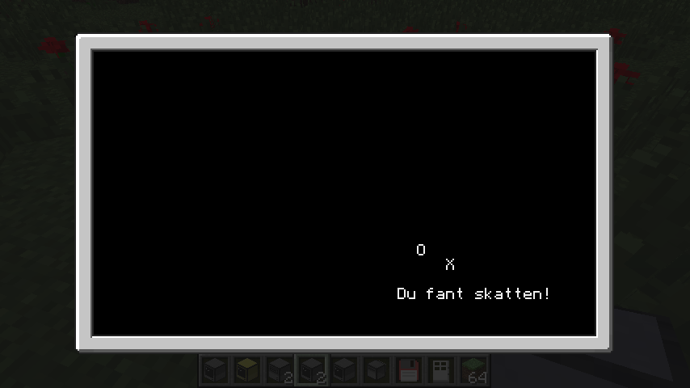
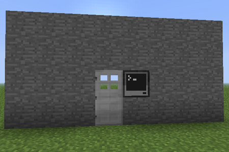
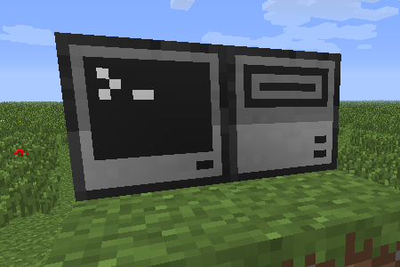
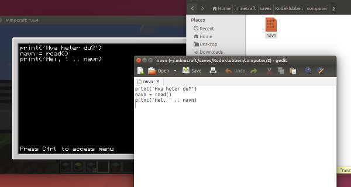

# Introduksjon {.intro}

I denne leksjonen skal vi se nærmere på hvordan datamaskinene bruker
såkalte hendelser for å reagere på ting som tastetrykk, museklikk og
så videre. Etterhvert vil vi bli enda bedre kjent med datamaskinene,
og lære hvordan vi flytter filer og programmer rundt omkring på en
datamaskin eller mellom forskjellige datamaskiner.



# Steg 1: Skattejakt {.activity}

Datamaskiner bruker noe som kalles hendelser for å registrere
tastetrykk, museklikk og så videre. Vi vil først se på hvordan vi kan
lage et enkelt spill hvor vi styrer en figur med piltastene.

## Sjekkliste {.check}

+ Start et nytt program ved å skrive `edit skattejakt`, skriv inn
  det følgende:

  ```lua
  local x = 20
  local y = 10

  term.clear()
  term.setCursorPos(x, y)
  print('O')
  ```

  Lagre og kjør programmet. Skjønner du hva det gjør? Prøv å
  forandre verdiene av `x` og `y` og kjør igjen.

+ Så langt skriver programmet bare ut en `O` på en gitt posisjon. Nå
  vil vi bruke hendelser for å kunne flytte denne figuren rundt på
  skjermen.

  For å vente på hendelser bruker vi `os.pullEvent()`. Vi vil
  spesielt vente på taste-hendelser. Disse hendelsene kalles `key` i
  ComputerCraft. Forandre programmet ditt som under:

  ```lua
  local x = 20
  local y = 10

  term.clear()
  term.setCursorPos(x, y)
  print('O')

  local hendelse, tast = os.pullEvent('key')    -- ny linje
  print(hendelse)                               -- ny linje
  print(tast)                                   -- ny linje
  ```

  Når du kjører programmet ditt nå blir programmet stående og vente
  til du trykker en tast. Deretter skrives teksten **key** samt et
  tall til skjermen. Teksten **key** betyr bare at det var en
  taste-hendelse som skjedde. Dette er ikke så veldig interessant
  for oss nå, men kan være nyttig i andre programmet om man lytter
  på flere forskjellige hendelser.

  Tallet vi fikk er derimot veldig viktig. Hver tast på tastaturet
  har sin egen tastekode. Prøv å kjøre programmet flere ganger, ser
  du at om du trykker samme tast får du samme tall tilbake. For
  eksempel er `A` alltid 30, mens `pil opp` alltid er 200.

+ Vi trenger heldigvis ikke huske disse kodene. Biblioteket `keys`
  kjenner alle disse, og gjør at vi kan skrive for eksempel `keys.q`
  for å representere `Q`-tasten. Endre programmet ditt igjen:

  ```lua
  local x = 20
  local y = 10

  term.clear()
  term.setCursorPos(x, y)
  print('O')

  local hendelse, tast = os.pullEvent('key')
  if tast == keys.q then                        -- ny linje
      print('Du trykket Q')                     -- ny linje
  else                                          -- ny linje
      print('Du trykket ikke Q')                -- ny linje
  end                                           -- ny linje
  ```

+ Vi kan nå lage en løkke hvor vi alltid sjekker hvilken tast som er
  trykket. Dersom tasten `Q` trykkes avslutter vi løkken med `break`.

  ```lua
  local x = 20
  local y = 10

  while true do                                 -- ny linje
      term.clear()
      term.setCursorPos(x, y)
      print('O')

      local hendelse, tast = os.pullEvent('key')
      if tast == keys.q then
          break                                 -- endret linje
      end
  end                                           -- ny linje
  ```

  Når du kjører dette programmet vil det tilsynelatende ikke skje
  noe før du trykker `Q`, siden det er den eneste hendelsen vi
  har kode som reagerer på.

+ Vi er nå klare til å sjekke om piltastene trykkes, og flytte figuren
  rundt på skjermen. For å gjøre dette trenger vi bare å endre
  verdiene av `x` og `y` avhengig av hvilken piltast som trykkes.

  ```lua
  local x = 20
  local y = 10

  while true do
      term.clear()
      term.setCursorPos(x, y)
      print('O')

      local hendelse, tast = os.pullEvent('key')
      if tast == keys.q then
          break
      end

      if tast == keys.right then                -- ny linje
          x = x + 1                             -- ny linje
      end                                       -- ny linje
  end
  ```

  Når du kjører dette programmet vil du se at du kan bruke `pil
  høyre` til å bevege figuren mot høyre.

### Prøv selv {.try}

De andre piltastene kan du programmere selv på samme måte. Du trenger
da å sammenligne med kodene `keys.left`, `keys.down` og
`keys.up`. Hvordan må du endre verdiene av `x` og `y`? Prøv deg frem!

## Sjekkliste {.check}

+ Til slutt vil vi legge til en skatt som figuren vår skal lete
  etter. Vi bruker tilfeldige tall for å bestemme hvor skatten skal
  ligge. Endre begynnelsen av programmet ditt som følger:

  ```lua
  local x = 20
  local y = 10
  local skattX = math.random(1, 50)             -- ny linje
  local skattY = math.random(1, 18)             -- ny linje

  while true do
      term.clear()
      term.setCursorPos(skattX, skattY)         -- ny linje
      print('X')                                -- ny linje
      term.setCursorPos(x, y)
      print('O')

      if x == skattX and y == skattY then       -- ny linje
          term.setCursorPos(1, 1)               -- ny linje
          print('Du fant skatten!')             -- ny linje
          break                                 -- ny linje
      end                                       -- ny linje

      local hendelse, tast = os.pullEvent('key')
      -- resten av programmet er som tidligere
  ```

  Prøv spillet! Fungerer det som du hadde trodd? Klarer du å kanskje
  legge til flere skatter?

### Prøv selv {.try}

Ved hjelp av `local maxX, maxY = term.getSize()` kan du finne
størrelsen på skjermen. Kan du bruke dette til å begrense figuren din
slik at den ikke kan gå av skjermen?

En litt utfordrende oppgave: Prøv å skriv et tilsvarende program til
en robot, men i stedet for at piltastene bare flytter en figur på
skjermen skal piltastene flytte roboten!

# Steg 2: Hvordan bevege seg rundt i filsystemet {.activity}

Datamaskiner organiserer informasjon i filer, og disse filene legges i
et filsystem. Dette filsystemet har du kanskje sett på en vanlig
datamaskin i programmene Windows Utforsker eller Finder på Mac. I
ComputerCraft bruker vi kommandolinjen for å se på filene. Vi skal her
se på noen enkle kommandoer for å kopiere og flytte filer.

## Sjekkliste {.check}

+ Lag en ny __Computer__, sett den ut og start den ved å høyre-klikke
  på den.

+ Kommandoen `dir` brukes for å se på innholdet i en katalog (dir er
  en forkortelse for *directory* som betyr *katalog*). Prøv den nå!
  Skriv `dir` og trykk enter.

  Datamaskinen svarer **rom** og **skattejakt**. Den første er en
  katalog som inneholder alle de innebygde programmene på
  datamaskinen (rom er en forkortelse for *Read Only Memory* som
  betyr *kun-lese-minne* eller *skrivebeskyttet minne*). Vi skal se
  mer på denne katalogen senere.

+ Når du bruker `dir` er det vanskelig å se forskjell på filer og
  kataloger. Til dette kan du bruke `type`. Prøv for eksempel å skriv
  `type skattejakt`. Datamaskinen vil da fortelle deg at
  **skattejakt** er en fil. Tilsvarende vil `type rom` fortelle deg at
  **rom** er en katalog.

+ Du kan lage egne kataloger om du vil, for å organisere filene dine
  bedre. Skriv `mkdir mine_programmer`. Kommandoen `mkdir` lager nye
  kataloger (mkdir er en forkortelse for *make directory* som betyr
  *lag katalog*). Du kan bekrefte at katalogen **mine_programmer** ble
  laget ved å skrive `dir` og `type mine_programmer`.

+ Kommandoen `move` flytter filer. Skriv `move skattejakt
  mine_programmer`.  Dette flytter filen **skattejakt** inn i
  katalogen **mine_programmer**. Hvis du nå skriver `dir` vil du se at
  **skattejakt** har blitt borte. For å sjekke at den ble flyttet
  riktig kan du skrive `dir mine_programmer`. Dette viser alle filene
  og katalogene som finnes inne i katalogen **mine_programmer**.

+ Vi kan også flytte oss rundt i filsystemet. Dette vil si at vi
  endrer hvilken katalog som er utgangspunktet vårt (for eksempel når
  vi skriver `dir`). Til dette bruker vi `cd` (cd er en forkortelse
  for *change directory* som betyr *endre katalog*). Skriv
  `cd mine_programmer`. Du vil se at det som står foran `>` endrer seg
  for å vise deg hvilken katalog du er i. Prøv også å skriv `dir` for å
  bekrefte at du er i samme katalogen som **skattejakt**.

  For å gå tilbake en katalog bruker du det spesielle navnet
  **..**. Skriv `cd ..`. Du vil nå komme tilbake til utgangspunktet.

### Prøv selv {.try}

Du har nå sett ganske mange kommandoer: `dir`, `edit`, `type`,
`mkdir`, `move` og `cd`. I tillegg finnes også `delete` som kan brukes
til å slette filer og kataloger, og `copy` som brukes på samme måte
som `move`, men som kopierer filer i stedet for å flytte dem.

Prøv å bruke disse kommandoene til å flytte deg litt rundt i
filsystemet, lag nye filer og kataloger, flytt dem rundt og så videre
inntil du er ganske komfortabel med hvordan filsystemet fungerer.

# Steg 3: Et bedre passord-program {.activity}

Vi har tidligere laget et passord-program. Dette passord-programmet
har et par svakheter.

1. Programmet må startes manuelt ved å skrive `passord` etter at
   datamaskinen er skrudd på.

2. I stedet for å skrive passordet kan man bare trykke `Ctrl-T` for å
   stoppe programmet, og se inni programmet for å finne det hemmelige
   passordet.

Vi skal her se på et par triks for å gjøre passord-programmet litt
tryggere.



## Sjekkliste {.check}

+ Om du ikke allerede har gjort det: Sett opp en datamaskin ved siden
  av en dør og legg inn passord-programmet datamaskinen, det vil si
  skriv `edit passord` og skriv inn følgende:

  ```lua
  local passord = 'kodeklubben'

  while true do
      term.clear()
      term.setCursorPos(1, 1)
      print('Hva er passordet?')
      svar = read('*')

      if svar == passord then
          redstone.setOutput('left', true)
          sleep(5)
          redstone.setOutput('left', false)
      end
  end
  ```

  Kjør programmet, og sjekk at det virker som det skal.

+ Når en datamaskin starter sjekker den først om det finnes et program
  som heter `startup` (*startup* betyr *oppstart*). Om den finner
  dette programmet kjøres dette før noe annet skjer. Det betyr at om
  vi kaller passord-programmet vårt for **startup** så vil det kjøre
  automatisk.

  Skriv `move passord startup`. Dette endre navnet på
  passord-programmet vårt. Vi kan nå starte datamaskinen på nytt ved
  å skrive `reboot`. Datamaskinen vil nå direkte spørre deg om
  passordet.

+ Trykk `Ctrl-T` for å stanse passord-programmet. At vi kan bruke
  `Ctrl-T` til å avslutte programmer er noe `os.pullEvent` gjør for
  oss automatisk uten at vi trenger å gjøre noe. Dersom vi ikke vil at
  dette skal være mulig kan vi bytte ut `os.pullEvent` med noe som
  heter `os.pullEventRaw`. Disse fungerer omtrent på samme måte, men
  den siste bryr seg ikke om `Ctrl-T`.

  Skriv `edit startup` og legg til en linje øverst i koden din:

  ```lua
  os.pullEvent = os.pullEventRaw                -- ny linje
  local passord = 'kodeklubben'

  while true do
      term.clear()
      term.setCursorPos(1, 1)
      print('Hva er passordet?')
      svar = read('*')

      if svar == passord then
          redstone.setOutput('left', true)
          sleep(5)
          redstone.setOutput('left', false)
      end
  end
  ```

+ Du kan nå starte datamaskinen på nytt igjen med `reboot`. Nå har du
  en datamaskin som bare spør om passord hele tiden!

  Vær litt forsiktig med dette siden det ikke er noen enkel måte å
  få datamaskinen til å gjøre noe annet enn å spørre om passord! Men
  det du lærer i de to neste stegene kan være nyttig.

# Steg 4: Bruk av diskettstasjoner {.activity}

Vi skal nå se hvordan vi kan bruke disketter og diskettstasjoner til å
flytte filer mellom forskjellige datamaskiner.



## Sjekkliste {.check}

+ Lag en **Disk Drive** (diskettstasjon) og plasser den inntil
  datamaskinen din. Hent også en **Floppy Disk** (diskett) fra
  inventory'et ditt (du kan velge hvilken farge som helst).

+ Åpne diskettstasjonen ved å høyre-klikke på den. Sett inn disketten
  ved å flytte den opp til den ledige slot'en øverst.

+ Start datamaskinen din ved å høyre-klikke på den. Skriv `dir`. Du
  vil se at det nå finnes en ny katalog som heter **disk**. Dette er
  disketten vi nettopp satte inn.

+ La oss lage et enkelt program. Skriv `edit navn` og skriv inn
  følgende:

  ```lua
  print('Hva heter du?')
  navn = read()
  print('Hei, ' .. navn)
  ```

  Test at programmet virker ved å skrive `navn`.

+ Vi kan nå kopiere dette programmet over til disketten ved å skrive
  `copy navn disk`.

+ Vi kan nå ta med oss dette programmet til en annen datamaskin:

  __1__: Steng datamaskinen.

  __2__: Åpne diskettstasjonen, og flytt disketten til inventory'et
  ditt.

  __3__: Lag en ny datamaskin, også denne med en diskettstasjon
  inntil seg.

  __4__: Sett disketten inn i den nye diskettstasjonen.

  __5__: Åpne den nye datamaskinen. Skriv `dir` og `dir disk` slik
  at du ser at programmet ditt er flyttet til den nye datamaskinen
  ved hjelp av disketten.

+ Vi kan nå kopiere programmet fra disketten til denne nye
  datamaskinen slik at vi kan ta med disketten videre og likevel bruke
  programmet. For å kopiere filen kan du skrive `copy disk/navn .`.
  Legg merke til at det skal være et `.` på slutten. Dette er et
  spesielt katalognavn som alltid betyr *denne katalogen*. Skriv
  tilslutt `dir` og `navn` for å bekrefte at programmet har blitt
  kopiert.

### Hva er en diskett? {.protip}

Disketter var en vanlig måte å lagre programmer og filer på fra de ble
introdusert på 1970-tallet og fram til tidlig 2000-tall. Disketter var
også den vanligste måten å overføre filer mellom forskjellige
datamaskiner på. I nyere tid har internett, samt USB minnepenner og
eksterne harddisker overtatt for diskettenes bruksområder.

Morsomt nok, lever likevel diskettene videre som det mest vanlige
symbolet for å lagre filer i forskjellige programmer.

# Steg 5: Skrive kode utenfor ComputerCraft {.activity}

Vi kan også se på og endre programmene våre utenfor Minecraft og
ComputerCraft. Dette kan være nyttig på flere måter.

__1__: Om vi ved et uhell ødelegger en datamaskin kan vi hente tilbake
programmene på den datamaskinen, og kopiere de til en annen
datamaskin.

__2__: Vi kan raskere kopiere filer mellom datamaskiner enn om vi
bruker disketter som vi lærte i forrige steg.

__3__: Programmet `edit` som vi bruker til å skrive programmer er ikke
så lett å skrive i. Det er enklere å bruke for eksempel Notepad eller
andre tekstprogrammer vi har installert.

Som du kanskje vet blir omtrent alle data i Minecraft lagret i en
*Minecraft*-katalog på datamaskinen din. For å finne denne kan du
gjøre følgende (utenfor Minecraft):

__Windows__: Under Windows finner du *Minecraft*-katalogen under
`%appdata%\.minecraft`. Søk etter `%appdata%` i en utforsker eller i
kjør-feltet etter å ha klikket start-knappen.

__Mac OS X__: Under Mac ligger *Minecraft*-katalogen i
`Library/Application Support/minecraft/` under hjemmekatalogen din. På
norsk heter `Library` `Bibliotek`.

__Linux__: På Linux finner du *Minecraft*-katalogen som en skjult
katalog `.minecraft` rett under hjemmekatalogen din.

Finn *Minecraft*-katalogen din i en filutforsker. Gå videre til
katalogen `saves`, deretter velger du navnet på den verden du spiller
nå, og til slutt katalogen `computer`. Denne katalogen inneholder
flere kataloger som bare har et tall som navn. Disse katalogene
representerer de forskjellige datamaskinene i spillet ditt. Du vil
også se en katalog som heter disk, som også har nummererte kataloger
inne i seg. Disse representerer diskettene i spillet ditt.



## Sjekkliste {.check}

+ Gå tilbake til Minecraft-spillet ditt. Åpne en datamaskin hvor du
  har lagret et program. Skriv `id` og trykk enter. Dette vil fortelle
  deg hvilket nummer denne datamaskinen er.

+ I filutforskeren kan du nå finne katalogen som representerer denne
  datamaskinen (se over). Åpne et av programmene i et tekstprogram som
  for eksempel Notepad. Gjør en liten endring i programmet ditt.

+ Gå tilbake til Minecraft igjen. Åpne det samme programmet med
  `edit`-kommandoen. Ser du endringen du nettopp gjorde?

+ I filutforskeren kan du også kopiere filer mellom forskjellige
  datamaskiner. Prøv å kopiere programmet du nettopp endret til en
  annen datamaskin. Finner du igjen dette programmet inne i Minecraft
  også?

### Flytt en datamaskin {.protip}

Om du oppdager at du må flytte en datamaskin må du være litt
forsiktig, siden om du bare ødelegger en datamaskin og setter ut en ny
er alle programmene borte. Du kan da bruke metoden i denne seksjonen
for å kopiere programmene tilbake, men det finnes en bedre måte.

Med kommandoen `label` kan vi gi en datamaskin navn. Prøv for eksempel
å skriv `label set snakker`. Dette gir denne datamaskinen navnet
**snakker**, du kan gi maskinen akkurat det navnet du vil. Om du nå
ødelegger maskinen vil du se at du kan plukke den opp igjen, og at den
da legger seg i inventory'et ditt med navnet **snakker**. Om du nå
setter ut maskinen igjen vil du se at alle programmene du har skrevet
fortsatt finnes på maskinen.

# Steg 6: De innebygde programmene {.activity}

Vi skal nå kikke raskt på katalogen **rom**. Dette er som nevnt
katalogen som inneholder de innebygde programmene på datamaskinen. Ved
hjelp av kommandoene vi har lært kan vi nå se hvordan disse
programmene er programmert, og til og med lage våre egne versjoner av
dem.

## Sjekkliste {.check}

+ Bruk `cd` kommandoen til å gå først til **rom**, deretter
  **programs** og til slutt til **fun**-katalogen. Bruk gjerne `dir`
  underveis for å se på hvilke andre filer og kataloger som finnes.

+ Denne **fun**-katalogen inneholder flere spill og programmer. La oss
  se på **hello** som er det enkleste programmet. Dette er en variant
  av **heisann** som vi skrev tidligere.

  Prøv først å kjøre programmet ved å skrive `hello`. Teksten
  **Hello World!** skrives til skjermen, ett tegn om gangen.

+ La oss se på koden til **hello**. Skriv `edit hello`. Du vil se det
  følgende:

  ```lua
  if term.isColour() then
      term.setTextColour( 2^math.random(0,15) )
  end
  textutils.slowPrint( "Hello World!" )
  term.setTextColour( colours.white )
  ```

  Ser du hvilken kodelinje det er som har ansvaret for å skrive
  teksten til skjermen?

+ Nå vil vi endre teksten **Hello World!** til noe annet. Men om du
  prøver å bare endre på teksten vil du oppdage at det ikke går
  an. Videre, om du trykker `Ctrl` vil du se at valget `Save` er
  borte. Dette er fordi vi ser på en fil som ligger i **rom**, det
  skrivebeskyttede minnet.

+ Hvis vi vil lage vår egen versjon av **hello** må vi først kopiere
  filen ut av **rom**. Skriv `copy hello ../../../`. Den litt mystiske
  rekken av `..` og `/` betyr at vi kopierer filen tre nivåer
  opp. Husk at `..` betydde at man går en katalog opp.

+ Nå vil vi flytte oss tilbake til utgangspunktet eller roten av
  filsystemet. Skriv `cd ..` tre ganger. Om du nå skriver `dir` skal
  du se filen **hello** i tillegg til **rom**.

+ Nå kan du skrive `edit hello` og endre teksten **Hello World!** til
  noe annet, kanskje den kan si **Hei** og deretter navnet ditt? Lagre
  og lukk filen, og skriv deretter `hello` for å se om du fikk det
  til.

### Resten av programmet {.protip}

Vi har så langt bare brydd oss om linje 4 i **hello**-programmet.
Skjønner du hva de andre linjene gjør?

Ut fra kommandoene `term.isColour()` og `term.setTextColour()` kan vi
kanskje gjette på at de har noe med tekstfargen å gjøre? Faktisk sier
de første tre linjene at dersom programmet kjøres på datamaskin som
har farger så skal tekstfargen settes til en tilfeldig farge. Den
siste linjen setter tekstfargen tilbake til hvit.

Om du vil se hvordan dette virker kan du prøve å lage en **Advanced
Computer**, og kjøre programmet `hello` på den.

### Prøv selv {.try}

Prøv å se på noen av de andre programmene du kjenner til, som for
eksempel `cd`, `go` eller `refuel`. Du må kanskje lete litt i
katalogstrukturen for å finne dem. Disse programmene er litt mer
kompliserte enn de vi har laget så langt. Prøv likevel å se om du
skjønner hva deler av koden gjør. Finner du for eksempel kodelinjen
som bytter katalog i `cd` eller linjen som rapporterer fuelnivået i
`refuel`?

# Steg 7: Andre typer datamaskiner {.activity}

Vi har så langt stort sett bare brukt vanlige datamaskiner,
**Computer**. Men om du ser i inventory'et ditt ser du at det finnes
flere andre typer datamaskiner, inkludert **Advanced Computer** og
**Pocket Computer**. Disse virker typisk ganske likt en vanlig
datamaskin, men har noen ekstra muligheter.

## Sjekkliste {.check}

+ Lag og start en **Advanced Computer**. De viktigste ekstra
  mulighetene på denne typen datamaskin er at den kan vise farger og
  du kan bruke musen.

+ La oss lage et enkelt tegneprogram. Skriv `edit tegne`, og skriv

  ```lua
  term.clear()

  while true do
      local hendelse, knapp, x, y = os.pullEvent('mouse_click')
      print('Du klikket ' .. knapp)
      print('Posisjon: x = ' .. x .. ', y = ' .. y)
  end
  ```

  Kjør programmet og prøv å klikk litt rundt omkring på skjermen.
  Bruk både venstre og høyre museknapp. Skjønner du hvordan
  museklikk-hendelser fungerer? Bruk `Ctrl-T` for å avslutte
  programmet.

+ La oss legge til litt kode som tegner på skjermen når du
  venstre-klikker. Vi kan også bruke høyre-klikk til å viske vekk det
  som er tegnet. Endre koden til

  ```lua
  term.clear()

  while true do
      local hendelse, knapp, x, y = os.pullEvent('mouse_click')
      term.setCursorPos(x, y)                   -- ny linje

      if knapp == 1 then                        -- ny linje
          print('#')                            -- ny linje
      end                                       -- ny linje

      if knapp == 2 then                        -- ny linje
          print(' ')                            -- ny linje
      end                                       -- ny linje
  end
  ```

### Prøv selv {.try}

Kan du legge til farger i tegneprogrammet? Se tilbake på
`hello`-programmet hvordan du kan bruke `term.setTextColour()` til å
endre farge. Kanskje du kan bruke talltastene til å endre farge?

Når du vil sjekke forskjellige typer hendelser, for eksempel både
museklikk og tastetrykk, er det best å bruke `os.pullEvent()` uten
navnet på en hendelse i parantes. Deretter kan du sjekke variabelen
`hendelse` for hvilken hendelse som faktisk skjedde.

Etterhvert som du tegner merker du at du må klikke hver gang du vil
tegne et punkt. Det ville vært bedre om man kunne bare klikket en
gang, og deretter dra musen rundt. Se på hendelsen `mouse_drag` og
prøv å forbedre programmet ditt.
