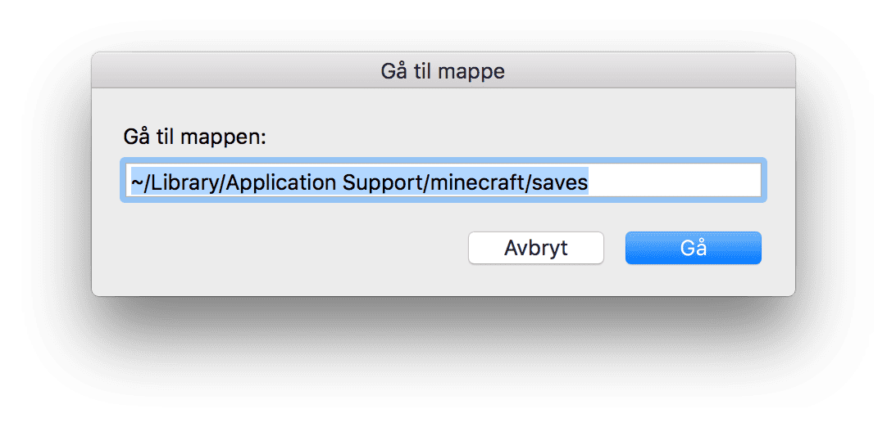
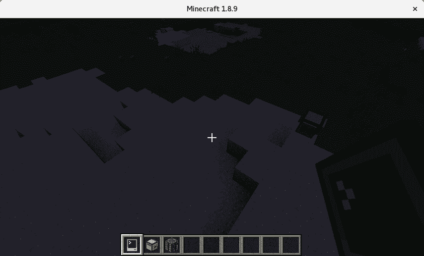

# Introduksjon {.intro}

I denne oppgaven skal vi fjernstyre en robot fra en annen datamaskin. Til dette
får vi bruk for både å hente tastetrykk fra brukeren, sende disse til en annen
datamaskin, og tolke disse som en kommando. For avanserte ComputerCraft-ere!


# Steg 1: Forberedelser {.activity}

Denne oppgaven bygger videre på andre oppgaver:

* [Send en beskjed over nettverk](../nettverk_send_beskjed/nettverk_send_beskjed.html) beskriver hvordan vi sender og mottar meldinger over `rednet`.
* [Hendelser -- Steg 1: Skattejakt](../hendelser/hendelser.html#steg-1-skattejakt) viser hvordan vi kan gjenkjenne hvilken tast brukeren har trykket på.
* [Bygg et Hus -- Steg 4: Funksjoner](../bygg_et_hus/bygg_et_hus.html#steg-4-funksjoner) forklarer hvordan vi kan skrive egne funksjoner.

Gå tilbake og kikk på disse to oppgavene hvis denne blir vanskelig.

## Redigere filer utenfor ComputerCraft {.tip}

`edit`-programmet i ComputerCraft fungerer fint med små programmer, men blir
tungvindt for store programmer. Det er for eksempel ikke lett å klippe og
lime kode. Nå skal vi lære hvordan vi redigerer ComputerCraft-filer *utenfor*
ComputerCraft.

Filene vi lager i ComputerCraft har forskjellig plassering på forskjellige
operativsystemer:

* Windows: `%AppData%\Roaming\.minecraft\saves\navn-på-din-save\computer\id`
* Linux: `~/.minecraft/saves/navn-på-din-save/computer/id`
* Mac: `~/Library/Application Support/.minecraft/saves/navn-på-din-save/computer/id`

Vil du redigere filen `hello` fra spillet "Kodeklubben 2016" på datamskin #3 på
Windows finner du den altså på `AppData\Roaming\.minecraft\saves\Kodeklubben 2016\computer\3\hello`.

## Finn filene på Mac
For å åpne filene på Mac kan du bruke Finder:
+ Åpne Finder fra menyen


+ Trykk på `Gå` og så `Gå til mappe`


+ Skriv inn filplasseringen (`~/Library/Application Support/.minecraft/saves/navn-på-din-save/computer/id`)



Her finnes programmene du har skrevet som egne filer. Åpne så programmet ditt
i en egen teksteditor:

* [Notepad++](https://notepad-plus-plus.org/) er god og enkel. Støtter Windows.
* [Github Atom](https://atom.io/) er noe mer avansert. Støtter Windows, Mac og
  Linux.

  Atom har en egen pakke for Lua-programmering. For å installere denne, gå til
  `Edit -> Preferences -> Install`, søk etter `lua` og installer pakken
  `language-lua`.

Gratulerer! Du kan nå klippe og lime kode mellom datamskiner. Eller vil du
flytte et prgram til en ny save?

## Skriv koden selv! {.tip}

Skriv koden du leser nå selv!

Du blir ikke vant med et programmeringsspråk uten å skrive kode selv. Når jeg
leser en guide på internett, bruker jeg ikke klipp-og-lim. I stedet leser jeg
et stykke kode, og skriver selv. Da leser jeg den grundigere, og får med meg
hvor det skal være kommaer, `end`, `then` og andre småting som Lua kan klage
på.

Og etter du har skrevet koden -- prøv litt fram og tilbake!

* Trenger jeg egentlig denne biten?
* Hva skjer om jeg fjerner denne setningen?
* Eller om jeg putter inn et annet tall her?

Programmering er lek! Ikke la noen fortelle deg noe annet!

# Steg 2: Tastetrykk på fjernkontroll {.activity}

Først programmerer vi kommandosentralen vår! Den må lytte etter tastetrykk,
oversette disse til kommandoer og sende til roboten.

## Sjekkliste {.check}

+ Vi bygger først kontroller. Craft en **Advanced Wireless Pocket Computer**.
  Denne kan vi bruke mens vi går rundt, og er ikke bundet til én plass.

## Filtyper {.tip}

Filer har ofte etternavn som sier filtypen.

* Lua programmer heter ofte `program.lua`

* Nettsider heter ofte `nettside.html`: Nettsider skrives i et språk som heter HTML

* `dokument.docx` er et Word-dokument

* Kjenner du til andre filtyper?

## Sjekkliste {.check}

+ Vi kaller kontroller-programmet vårt `remote.lua`

  ```
  edit remote.lua
  ```

+ La oss starte med å lese inn hva brukeren trykker på:

  ```lua
  function remoteMove()
    local action, keycode = os.pullEvent('key')
    if keycode == keys.w then
      return {"Go", "forward!"}
    elseif keycode == keys.a then
      return {"Denne", "må", "du", "fikse", "selv!"}
    else
      return {"Hjelp! Ukjent tast! Hva skal jeg gjøre???"}
    end
  end

  function main(  )
    print("Venter på kommando ...")
    rednet.open("back")  -- Hvor har du modemet ditt?
    while true do
      local command = remoteMove()
      print(unpack(command))
    end
  end

  main()
  ```

+ Prøv! Hva skjer når du trykker på `w`? Hva skjer når du trykker på noe annet?

+ Roboten vår skal gjerne kunne svinge og gå bakover i tillegg. Legg til
if-setninger dersom brukeren trykker på `a`, `s` eller `d`!

+ Roboten kan i tillegg fly opp og ned. I Minecraft brukes `space` for å fly
opp, og `shift` for å fly ned. Sjekk [ComputerCraft Wiki](http://www.computercraft.info/wiki/Keys_%28API%29) for hvordan du bruker
disse!

Nå kjenner vi igjen tastene for å bevege seg rundt. Neste steg er å sende disse
til roboten som skal bevege på seg.

# Steg 3: Kommandotabell {.activity}

Vi skal bruke en tabell til å lagre kommandoen vår. Lua kaller en tabell for
`table`, tabell på engelsk.

La oss først leke oss litt med en robot.

## Sjekkliste {.check}

+ Pass på at roboten har nok kull!

+ Åpne lua-tolkeren, og lag en tabell:

  ```
  > lua
  lua> tabell = {"hei", "på", "deg"}
  lua> print(tabell)
  lua> print(unpack(tabell))
  lua> print(tabell[1])
  lua> print(tabell[2])
  lua> print(tabell[3])
  ```

## Tabeller {.tip}

 * Prøver vi skrive ut en tabell alene, får vi *adressen* til tabellen

 * Unpack lar oss bruke tabellen i en funksjon:

   `print(unpack({1, 2}))` er det samme som `print(1, 2)`.

 * Vil vi ha ut et *element* fra tabellen, setter vi inn *indeksen* til
 elementet med firkantklammer: `tabell[2]`.

## Sjekkliste {.check}

Nå skal vi se på to måter å styre en robot på.

+ Start `CraftOS` på en robot, og kjør først kommandoen på "vanlig" vis:

  ```
  > go forward 5
  > turn left
  ```

... men vi vil da ikke løpe etter roboten og skrive inn nye kommandoer dagen
lang! La oss programmere dette.

+ Åpne lua-tolkeren og lag tabeller for kommandoene over:

  ```lua
  > lua
  lua> command1 = {"go", "forward", "5"}
  lua> command2 = {"turn", "left"}
  lua> shell.run(unpack(command1))  -- Hva gjør unpack? Kan du gjøre dette på noen annen måte?
  lua> shell.run(unpack(command2))
  ```

+ Hva gjør unpack? Hvordan kan vi bruke `shell.run()` til å gå frem *uten*
  `unpack()`?

## Nøtt {.try}

* Åpne et nytt program: `edit many.lua` (Du kan bruke en annen editor hvis du
  vil)

  ```lua
  cmd = {"go", "forward", "5"}
  ```

* Kan du lage en funksjon som kjører kommandoen `cmd` 2 ganger?

* Ekstra vanskelig: kan du lage en funksjon som kjører kommandoen i en tabell
  `n` ganger, der n sendes inn i funksjonen?

  Du kan starte med dette:

  ```lua
  function manyTimes( command, times )
    for i=1,times do
      -- Hva skal du gjøre mange ganger?
    end
  end

  command1 = {"go forward 5"}

  manyTimes(command1, 7)
  ```

## Sjekkliste {.check}

Nå skal vi endre på koden på fjernkontrollen vår så den faktisk sender
kommandoer til roboten. Hva er forskjellig fra koden over? Forklar til en annen
programmerer eller voksen! Hva gjør programmet nå forskjellig?

+ Åpne igjen filen `remote.lua` på kontrolleren

+ Endre koden til:

  ```lua
  workerId = 5  -- Hvilket nummer er din robot? Hvordan finner du nummeret?

  -- OBS: Ny fuksjon som inneholder deler av gamle remoteMove!
  function toMoveCommand(keycode)
    if keycode == keys.w then
      return {"go", "forward"}  -- OBS! Nå må disse matche kommandoer!
    elseif keycode == keys.a then
      return {"Denne", "må", "du", "fikse", "selv!"}
    else
      return nil
    end
  end

  -- ... og nye remoteMove sender nå kommandoen dit den skal!
  function remoteMove()
    local action, keycode = os.pullEvent('key')
    command = toMoveCommand(keycode)
    if command == nil then
      print("Unknown key: " .. keycode)
    else
      print("Sending ".. unpack(command))
      rednet.send(workerId, command)
    end
  end

  -- Denne er endret litt
  function main(  )
    print("Listening for move commands ...")
    rednet.open("back")
    while true do
    -- Her skal vi ikke lenger skrive ut, men flytte på roboten
      remoteMove()
    end
  end

  main()
  ```

# Steg 4: Motta kommando på robot {.activity}

Gratulerer! Du har nå bygd en fjernkontroll!

Hva skal vi bruke denne til, mon tro?

Noe å styre?

Jepp, jeg er helt enig. La oss gjøre det!

## Sjekkliste {.check}

+ Åpne `react.lua` på roboten

## Egne filer {.tip}

* Husker du hvordan vi finner filene på vår egen datamaskin, så vi kan bruke
  Notepad++ eller Atom? Se over!

* Hvis datamaskinen ikke har noen filer ennå, har den heller ikke noen mappe.
  Lag en tom fil i CraftOS for å få mappen til å dukke opp!

## Sjekkliste {.check}

+ Fyll så på med koden!

  ```lua
  function main()
    -- Hva sier pheripherals? Hvilken side er modemet på?
    rednet.open("left")
    while true do
      sender, message = rednet.receive(99999)
      print("Message from " .. sender .. " received: ")
      print(message)
      shell.run(unpack(message))
    end
  end

  main()
  ```

## `main()` {.tip}

Metoden `main()` er ofte inngangsporten til et program. I for eksempel Lua og
Python kan vi velge selv om vi vil ha en main-metode eller ikke. I andre språk
må main være med. Eksempler på programmeringsspråk vi *må* ha main i er C,
Java og Haskell.

## Sjekkliste {.check}

+ Hva brukes 99999 til?

+ Hvorfor bruker vi en `while`-løkke? Hva skjer om vi ikke har en while-løkke?

# Steg 5: Kjør robot! {.activity}

Gratulerer! Du har gjennomført en utfordrende programmeringsoppgave, og sendt
meningsfulle beskjeder over `rednet`! Vær stolt!

Nå skal vi prøve det selv!

## Sjekkliste {.check}

+ Start `react.lua` på din robot

+ Start `remote.lua` på din Portable Computer

+ Trykk `w` for å gå fremover!

+ Legg til andre kommandoer du savner!

  Forslag:

  * Angrip
  * Bygg blokk foran
  * Kjør `excavate 4` her du er

# Steg 6: Du vil ha mer? {.activity}

Du har spilt ComputerCraft *lenge* og begynner å få et utall forskjellige
roboter du må styre. Da er det kjekt å kunne kjøre andre kommandoer på roboten!

Programmet vi har skrevet for å motta og kjøre kommandoer, `react.lua` kan
kjøre andre kommandoer enn de vi har definert for å bevege seg rundt, for
eksempel `excavate` og `dance`.

+ Åpne kontrolleren

+ Endre følgende i `ssh.lua`:

  ```lua
  -- Starter jeg programmet sånn:
  -- > ssh.lua 5
  arguments = ...
  -- ... blir arguments = "5"
  remoteId = tonumber(arguments)
  -- ... og remoteId = 5!

  function pack(...)
    return arg
  end

  function remoteCommand()
    io.write("ssh@" .. remoteId .. "> ")
    local intputString = io.read()
    local commandTable = pack(intputString)
    print("Sending: ")
    print(unpack(commandTable))
    rednet.send(remoteId, commandTable)
  end

  function main(  )
    print("Listening for move commands ...")
    rednet.open("back")
    while true do
      remoteCommand()
    end
  end

  main()
  ```

+ Start `react.lua` på roboten

+ Start `ssh.lua` på kontrolleren

Fjernstyrt graverobot er nyttig! En graverobot kan craftes fra en annen turtle
med pickaxe på ledig side. Dette er hva min gjorde:


Graveroboten er klar til høyre i bildet.


Flytter den til der den skal begynne å grave ...


... Og der har den kommet et stykke på vei!
