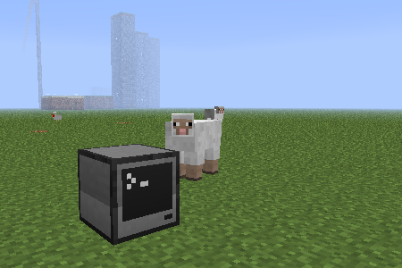
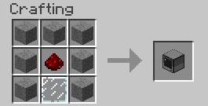
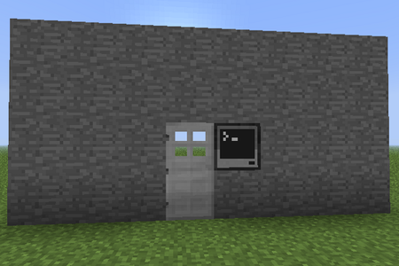

# Introduksjon {.intro}

Vi begynner med å bygge en enkel datamaskin. Etter å ha brukt litt tid
på å bli kjent med hvordan datamaskinen virker, bruker vi den til å
låse opp en dør ved hjelp av passord.



# Steg 1: Vår første datamaskin {.activity}

*Vi begynner med å lage en datamaskin.*

I utgangspunktet er det mye enklere å starte i *Creative Mode* når vi
skal lære å bruke datamaskinene, siden vi da slipper å bruke tid på å
samle materiale og slåss mot monstre. Vi vil derfor i fortsettelsen
anta at du er i *Creative Mode*, og kan plukke akkurat det du trenger
i inventory'et ditt.

Men først, for å vise at en datamaskin kan bygges på vanlig måte i
Minecraft:

## Sjekkliste {.check}

+ Trykk `E` for å åpne inventory'et ditt. Finn frem 7 __Stone__, 1
__Redstone__ og 1 __Glass pane__.
+ Åpne et __Crafting table__, og legg ut materialet slik:

  

+ Legg den nye datamaskinen i den nederste raden i inventory'et ditt,
slik at du kan ta den på hånden. Lukk inventory'et.
+ Bruk talltastene til å velge datamaskinen, og høyreklikk for å lage
en datamaskin.

I *Creative Mode* kan du også få tak i datamaskiner ved å trykke `E`,
deretter klikke `>` for å gå til neste side, og til slutt velge fanen
med datamaskinsymbolet.

### ComputerCraft datamaskiner {.protip}

Høyreklikk en datamaskin for å starte den opp. Den vil åpne en svart
skjerm med teksten `CraftOS` på toppen. Dette er
datamaskinens *kommandolinje*, og vi vil bruke den til å styre
datamaskinen med.

## Sjekkliste {.check}

+ Prøv å skriv `help` og trykk enter.

  Du får nå se noen tips om hvordan du kan finne ut mer om
  datamaskinen. For eksempel kan du skrive `programs` for å se en
  liste over hvilke programmer som er på datamaskinen, eller `help
  programming` for å få noen tips til hvordan man programmerer
  datamaskinen.

+ Skriv `programs` og trykk enter.

  Mange av disse programmene er enkle programmer som lar deg undersøke
  datamaskinen nærmere. Vi vil se på noen av dem i en senere leksjon.

# Steg 2: Vårt første program {.activity}

*Det er nå på tide at vi skriver vårt første program.*

Det er en lang tradisjon blant programmerere at det første programmet
de lager når de lærer et nytt språk skriver en trivelig melding til
skjermen. Vi følger den tradisjonen og begynner med et program som
heter `heiverden`.

## Sjekkliste {.check}

+ Start en datamaskin.
+ Skriv `edit heiverden` for å begynne å skrive på et nytt program som
heter `heiverden`.
+ I det nye vinduet, skriv

  ```lua
  print('Hei verden!')
  ```

  Etter at du har skrevet dette så trykker du på *Ctrl*-tasten og
  velger `Save`. Deretter trykker du *Ctrl* en gang til og velger
  `Exit`.

+ Vi har nå laget vårt første program. Prøv å skriv `programs` og du
vil se at `heiverden` er på listen over programmer.
+ For å kjøre programmet vi har laget, skriver vi `heiverden` og
trykker enter.

### Prøv selv {.try}

Klarer du å endre på programmet slik at det for eksempel sier hei til
deg, eller kanskje til de som sitter ved siden av deg?

Prøv å skriv `edit heiverden` en gang til. Da åpner programmet ditt
seg igjen, og du kan endre på det slik at det sier noe annet. Som
tidligere må du bruke *Ctrl*-tasten for å gå til menyen slik at du kan
lagre og avslutte endringene.

# Steg 3: Litt enkel matematikk {.activity}

*Vi skal nå bruke datamaskinen til å regne litt matematikk for oss, og
 kanskje til og med få den til å se hvor flinke vi er til å regne.*

Datamaskinene i ComputerCraft bruker et programmeringsspråk som heter
__Lua__. Dette er et ganske enkelt og fleksibelt språk som ofte brukes
inne i andre programmer. For eksempel kan også deler av Photoshop,
Wikipedia og World of Warcraft programmeres med Lua.

### Lua {.protip}

Lua ble opprinnelig laget i Brasil på begynnelsen av 1990-tallet. På
universitetet i Rio de Janeiro brukte de tidligere et språk som het
*Simple Object Language* (SOL). Ordet *lua* er portugisisk og betyr
*måne*, noe de syntes var et fint navn som passet sammen med SOL.

## Sjekkliste {.check}

Vi skal nå prøve å skrive noen kommandoer direkte i Lua. Dette er en
fin måte å teste enkle ting på.

+ Skriv `lua` og trykk enter. Dette starter en *Lua-tolker* som vil
utføre hver enkelt kommando du skriver med en gang.
+ Vi begynner med kommandoen fra det første programmet vårt. Skriv
`print('Hei verden!')` og trykk enter. Skjer det samme som tidligere?
+ Som de aller fleste programmeringsspråk er Lua glad i å regne. Skriv
`1 + 1` og trykk enter.

  Lua kjenner alle de vanlige matematikk-operasjonene. Prøv for
  eksempel `17 - 8`, `3 * 4` eller `22 / 7`. Kjenner du igjen hva
  hver av disse betyr?

+ Skriv `math.random(1, 10)` og trykk enter.

  Dette skriver ut et tilfeldig tall mellom 1 og 10. Dette er et
  eksempel på å kalle en *funksjon*, noe vi gjør ofte når vi
  programmerer. I dette tilfellet heter funksjonen `random` og den
  hører hjemme i `math`-*biblioteket*.

### Funksjoner {.protip}

Alle programmeringsspråk lar deg lage noe som kalles *funksjoner*.
Dette er en samling instruksjoner som utføres sammen slik at det blir
enklere å gjøre vanskelige ting. Lua kommer med innebygde funksjoner.
Vi har så langt sett `print` og `math.random` som eksempler på dette.
Senere vil vi også lære hvordan vi lager egne funksjoner.

## Sjekkliste {.check}

+ Trykk pil opp-tasten slik at du kan kjøre `math.random(1, 10)` en
gang til. Trykk enter. Gjør dette flere ganger. Får du forskjellige
tall tilbake?
+ Avslutt Lua-tolkeren ved å skrive `exit()` og trykk enter.

# Steg 4: En liten matteprøve {.activity}

*Vi skal nå bruke de tilfeldige tallene til å lage et enkelt
 spill. Underveis vil vi også lære litt om tester og løkker.*

## Sjekkliste {.check}

+ Start et nytt program ved å skrive `edit mattetest` og trykk enter.
+ Skriv inn følgende program

  ```lua
  local tall1 = math.random(2, 12)
  local tall2 = math.random(2, 12)
  print('Hva er ' .. tall1 .. ' ganger ' .. tall2 .. '?')
  ```

  Pass på at du skriver de to punktumene `..` riktig. Disse betyr at
  vi setter sammen tekst.

+ Lagre og avslutt editoren. Kjør programmet ved å skrive `mattetest`.

  Blir du spurt om svaret på et gangestykke? Spør den om et annet
  gangestykke om du kjører programmet en gang til? Hva skjer om du
  prøver å svare?

### Variabler {.protip}

Vi har sett det meste i programmet vårt tidligere. `math.random` lager
tilfeldige tall, og `print` skriver en melding til skjermen. Det nye
er at vi bruker *variabler* til å huske verdiene av de tilfeldige
tallene. Den første linjen sier at vi vil ha et tilfeldig tall mellom
2 og 12. Dette tilfeldige tallet husker vi så med en variabel som
heter `tall1`. Ordet `local` foran variabelen sier at vi bare skal
huske variabelen i dette programmet (lokalt).

## Sjekkliste {.check}

+ Vi skal nå jobbe videre med programmet. Skriv `edit mattetest`
igjen, og legg til en linje nederst i programmet.

  ```lua
  local tall1 = math.random(2, 12)
  local tall2 = math.random(2, 12)
  print('Hva er ' .. tall1 .. ' ganger ' .. tall2 .. '?')

  svar = read()                                 -- ny linje
  ```

  Lagre, avslutt, og kjør programmet på nytt. Får du lov til å svare
  nå? Funksjonen `read` brukes for å lese ting du skriver på
  tastaturet.

+ Det neste vi vil er at programmet skal sjekke om vi svarer
riktig. For å gjøre dette vil vi bruke noe som heter
`if`-tester. Disse kan teste om noe er sant, og vi vil bruke dem for å
sjekke om det er sant at svaret ditt er likt med det faktiske
svaret. Legg til en `if`-test nederst i programmet ditt slik som
dette:

  ```lua
  local tall1 = math.random(2, 12)
  local tall2 = math.random(2, 12)
  print('Hva er ' .. tall1 .. ' ganger ' .. tall2 .. '?')

  svar = read()

  if tonumber(svar) == tall1 * tall2 then  -- alle linjer herifra
      print('Ja, svaret er ' .. svar)      -- og ned er nye
  else
      print('Nei, det riktige svaret er ' .. tall1 * tall2)
  end
  ```

  Kjør programmet igjen. Hva skjer når du svarer riktig? Hva skjer
  når du svarer feil? Skjønner du hvorfor?

+ Det er kjedelig at vi hele tiden må starte programmet på nytt. Vi
lager derfor en løkke som kan spørre oss flere spørsmål hver gang vi
spiller. Her bruker vi en `for`-løkke som bare teller fra 1 til 5 for
å stille oss fem spørsmål.

  ```lua
  for i = 1, 5 do                               -- ny linje
      local tall1 = math.random(2, 12)
      local tall2 = math.random(2, 12)
      print('Hva er ' .. tall1 .. ' ganger ' .. tall2 .. '?')

      svar = read()

      if tonumber(svar) == tall1 * tall2 then
          print('Ja, svaret er ' .. svar)
      else
          print('Nei, det riktige svaret er ' .. tall1 * tall2)
      end
  end                                           -- ny linje
  ```

  Test programmet ditt igjen. Blir du spurt om fem gangestykker? Kan
  du forandre programmet slik at det spør om et annet antall
  gangestykker? Kan du bruke en variabel som sier hvor mange
  gangestykker programmet skal bruke?

+ Til slutt vil vi at programmet skal telle hvor mange riktige svar vi
klarer. For å gjøre dette bruker vi en ny variabel. Men denne gangen
vil vi endre verdien av variabelen etterhvert som svarer riktig.

  ```lua
  local ant_stykker = 5                         -- ny linje
  local ant_riktig  = 0                         -- ny linje

  for i = 1, ant_stykker do                     -- endret linje
      local tall1 = math.random(2, 12)
      local tall2 = math.random(2, 12)
      print('Hva er ' .. tall1 .. ' ganger ' .. tall2 .. '?')

      svar = read()

      if tonumber(svar) == tall1 * tall2 then
          print('Ja, svaret er ' .. svar)
          ant_riktig = ant_riktig + 1           -- ny linje
      else
          print('Nei, det riktige svaret er ' .. tall1 * tall2)
      end
  end
                                           -- ny linje nedenfor
  print('Du klarte ' .. ant_riktig .. ' av ' .. ant_stykker)
  ```

### Prøv selv {.try}

Kan du endre programmet slik at det spør om andre typer mattestykker?
For eksempel plusstykker, minusstykker eller delestykker?

For minusstykker, hvordan kan du lage tilfeldige `tall2` på en slik
måte at `tall2` aldri er større enn `tall1`?

For delestykker, hvordan kan du enkelt lage stykker som du vet går
opp, det vil si slik at svaret blir et helt tall?

Kan du bruke `math.random` og passende `if`-tester for å tilfeldig
velge hvilken type mattestykke det spørres om?

# Steg 5: Passordlås på en dør {.activity}

*Datamaskinene våre er jo en del av Minecraft. Vi skal nå se et enkelt
 eksempel på hvordan vi kan koble dem sammen med resten av
 Minecraft-verdenen rundt oss.*

## Sjekkliste {.check}

+ Gå ut av datamaskinen ved å trykke *Esc*-knappen.

+ Samle sammen litt __Stone__, en __Iron door__ og en __Computer__, og
lag en vegg hvor du setter inn en dør og med datamaskinen rett ved
siden av døren. Det skal se omtrent slik ut:

  

+ Start datamaskinen.
+ Lag et nytt program som heter `passord`:

  ```lua
  local passord = 'kodeklubben'

  while true do
      print('Hva er passordet?')
      svar = read()

      if svar == passord then
          print 'Riktig'
      else
          print 'Feil'
      end
  end
  ```

  Dette programmet ligner ganske mye på `mattetest`-programmet vi
  laget tidligere. Det er bare èn ny ting her som vi ikke har sett
  tidligere, nemlig en `while`-løkke. Slike løkker vil fortsette å
  gjøre ting om igjen så lenge noe er sant. I vårt tilfelle er dette
  *noe* verdien `true` som alltid er sann. Det betyr at vi har laget
  en *evig løkke*. Dette programmet vil fortsette å spørre oss om
  passordet for alltid!

+ Kjør programmet. Oppfører programmet seg slik du hadde trodd? Husker
du passordet?

### Avslutte programmer {.protip}

For å avslutte dette programmet holder du inne *Ctrl* og *T* samtidig
i cirka ett sekund. Da avbrytes programmet, og teksten `Terminated`
skrives på skjermen. Dette fungerer både her og i andre programmer.

## Sjekkliste {.check}

+ Vi vil at døren skal åpne seg når vi skriver riktig passord. Dette
kan vi gjøre ved å bruke __redstone__ som brukes for å overføre energi
i Minecraft. Endre programmet `passord` som følger:

  ```lua
  local passord = 'kodeklubben'

  while true do
      print('Hva er passordet?')
      svar = read()

      if svar == passord then
          redstone.setOutput('left', true)      -- endret linje
          sleep(5)                              -- endret linje
          redstone.setOutput('left', false)     -- endret linje
      end
  end
  ```

  Kjør programmet. Hva skjer nå når du skriver riktig passord?

  Funksjonen `setOutput` i `redstone`-biblioteket skrur av eller på
  litt *redstone*-energi som åpner døren. Her forteller `left`
  hvilken side av datamaskinen døren står på. Du kan også bruke for
  eksempel `right`, `top` eller `bottom`. Funksjonen `sleep` gjør at
  datamaskinen sover, det vil si gjør ingenting. I dette tilfellet
  sover datamaskinen i 5 sekunder, før energien skrus av igjen og
  døren lukker seg.

+ Før vi er helt fornøyde med dette programmet vil vi gjøre noen små
forbedringer. Først kaller vi to funksjoner fra `term`-biblioteket.
Den ene vil rense skjermen, mens den andre setter posisjonen hvor vi
skriver teksten til `(1, 1)` som betyr øverst til venstre. I tillegg
forteller vi `read` at vi ikke vil at passordet vi skriver inn skal
synes på skjermen, i stedet vil vi at `*`-tegn skal vises. Programmet
ser da slik ut:

  ```lua
  local passord = 'kodeklubben'

  while true do
      term.clear()                              -- ny linje
      term.setCursorPos(1, 1)                   -- ny linje
      print('Hva er passordet?')
      svar = read('*')                          -- endret linje

      if svar == passord then
          redstone.setOutput('left', true)
          sleep(5)
          redstone.setOutput('left', false)
      end
  end
  ```

Gratulerer, du har nå lært ganske mye om hvordan man programmerer
datamaskiner med ComputerCraft i Minecraft! Prøv gjerne å forandre
noen av programmene vi har laget. Kan du lage dem enda bedre?

### Prøv selv {.try}

Datamaskinene kan sende ut *redstone*-energi i alle retninger. Prøv å
koble en __Trap door__ til høyre side av datamaskinen ved hjelp av
litt *redstone wire*. Aktiver denne fellen hvis det skrives feil
passord!

Alle kan vi skrive feil passord innimellom. Det er kanskje bedre å
ikke aktivere fellen før noen svarer galt passord tre ganger på rad?
Innfør en variabel som teller hvor mange feil passord som er
skrevet. Aktiver fellen om tre gale passord skrives på rad.
