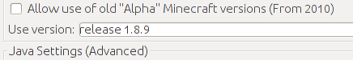
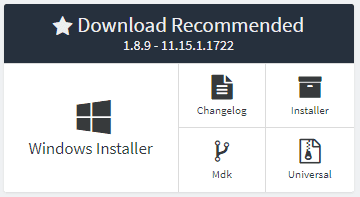
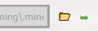

# Introduksjon {.intro}

[ComputerCraft](http://www.computercraft.info/) er en mod til
[Minecraft](https://minecraft.net/), som gir deg muligheten til å
bygge og programmere **datamaskiner** og **roboter** inne i
Minecraft-verdenen.

# Installering av ComputerCraft {.activity}

ComputerCraft er en mod til Minecraft, og krever derfor at Minecraft
allerede er installert på datamaskinen. Vi antar at du er kjent med og
har installert Minecraft.

ComputerCraft er typisk ikke tilgjengelig for siste versjon av
Minecraft. Legg derfor merke til hvilken versjon av Minecraft som
kreves (i eksemplene nedenfor kreves versjon 1.8.9, men dette kan
endre seg), og pass på at du installerer riktig versjon av Forge.

## Sjekkliste {.check}

+ Gå til
  [computercraft.info/download](http://www.computercraft.info/download/).
  Bla nedover på siden til du finner et avsnitt som heter **Download
  and installing**. Last ned ComputerCraft til datamaskinen din, og
  noter deg hvilken versjon av Minecraft denne er kompatibel med (for
  eksempel versjon 1.8.9). _Ikke_ prøv å kjør filen, vi skal kopiere
  den til riktig sted litt senere.

  

+ Start **Minecraft Launcher**. Sjekk om du har den riktige versjonen
  av Minecraft tilgjengelig. Hvis ikke kan du velge `New Profile` og i
  nedtrekksmenyen `Use Version` velger du riktig versjon. Gi profilen
  et navn (for eksempel versjonsnummeret) og klikk `Save
  Profile`. Klikk `Play` slik at denne versjonen blir lastet ned og
  startet opp. Avslutt spillet.

   <!-- Venstrejuster bildet -->

+ Før vi kan legge inn ComputerCraft må vi installere **Minecraft
  Forge**, som gir oss tilgang til å legge inn Mods. Gå til
  [files.minecraftforge.net](http://files.minecraftforge.net/) og velg
  den riktige Minecraft-versjonen i menyen som heter **Minecraft
  Versions** midt på skjermen. Pass på at riktig versjonsnummer vises
  under tittelen på toppen av skjermen.

  

  I boksen **Download Recommended** velger du `Installer`. Du kommer
  nå til en reklameside. **Vent** til nedtellingen øverst til høyre er
  ferdig. Klikk **deretter** på `Skip` og nedlastingen av en fil
  starter.

  

+ Kjør filen som ble lastet ned ved å dobbelklikke på den (om du blir
  spurt hvordan den skal kjøres kan du velge Java eller JDK). Velg
  `Install client` og klikk `OK`.

   <!-- Venstrejuster bildet -->

+ Start **Minecraft Launcher**. Det har nå dukket opp en ny profil som
  heter `Forge`. Velg denne og start spillet. Dette vil lage en
  `mods`-katalog i `Minecraft`-katalogen din. Du vil også se at det
  har dukket opp et nytt valg i hovedmenyen: `Mods`. Avslutt spillet
  igjen.

   <!-- Venstrejuster bildet -->

+ Finn `Minecraft`-katalogen din ved å starte **Minecraft
  Launcher**. Velg deretter `Edit Profile` og klikk knappen `Open Game
  Dir`. Dette åpner en filutforsker. Velg katalogen `mods`, og kopier
  **ComputerCraft**-filen vi lastet ned helt først inn i
  `mods`-katalogen. Klikk `Cancel` i `Edit Profile`-vinduet.

   <!-- Venstrejuster bildet -->

+ Nå er vi ferdige. I **Minecraft Launcher** kan du nå velge
  profilen `Forge` og klikke `Play`. Når du klikker `Mods` fra
  hovedmenyen skal du se at **ComputerCraft** er en av de tilgjengelige
  mods'ene.

## Minecraftkatalogen {.tip}

Minecraftkatalogen er nyttig å kjenne til. Som nevnt over kan du finne
den ved å klikke `Open Game Dir` fra `Edit Profile`-vinduet.
Alternativt kan du hente den frem selv som følger:

**Windows**: Under Windows finner du `Minecraft`-katalogen under
`%appdata%\.minecraft`. Søk etter `%appdata%` i en utforsker eller i
kjør-feltet etter å ha klikket start-knappen.

**Mac OS X**: Under Mac ligger `Minecraft`-katalogen i
`Library/Application Support/minecraft/` under hjemmekatalogen din. På
norsk heter `Library` `Bibliotek`.

**Linux**: På Linux finner du `Minecraft`-katalogen som en skjult
katalog `.minecraft` rett under hjemmekatalogen din.

# Kom i gang {.activity}

Vi er nå klare til å slå oss opp som programmerere i
Minecraft-verdenen. Mens vi utforsker datamaskinene er det enklest med
et rolig og enkelt spill:

## Sjekkliste {.check}

+ Velg `Singleplayer`, og klikk `Create New World`.

+ Gi verdenen din et navn, og sett `Game Mode` til `Creative`. Klikk
  `Create New World`.

+ Du kan nå lage din første datamaskin.  Trykk `E` for å gå til
  Inventory-listen. Øverst kan du nå velge å klikke `>` for å gå til
  neste side. Trykk deretter på datamaskin-symbolet (en grå
  kloss/skjerm), og gi deg selv en **Advanced Computer**.

+ Sett ut en **Advanced Computer** ved å høyre-klikke. Høyre-klikk så
  en gang til på datamaskinen du nettopp satte ut. En svart skjerm
  skal dukke opp, med teksten `CraftOS` og et versjonsnummer i øverste
  linje. Skriv `help` og trykk **enter** for å komme igang.

Gratulerer! Du har startet en datamaskin inne i Minecraft-verdenen. På
[kodeklubben.github.io](http://kodeklubben.github.io/computercraft/)
finner du oppgaver som viser deg hvordan du kan programmere den og
andre datamaskiner og roboter i ComputerCraft. Lykke til!

