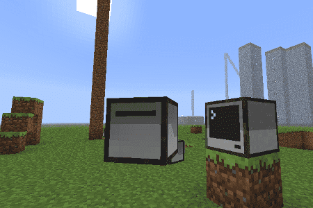
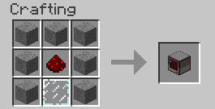
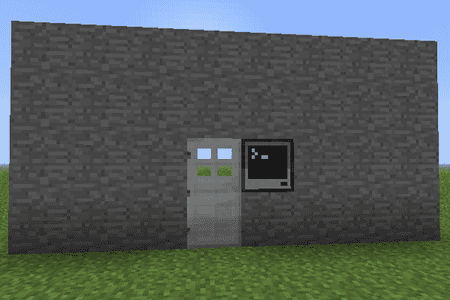
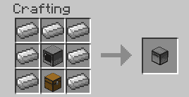
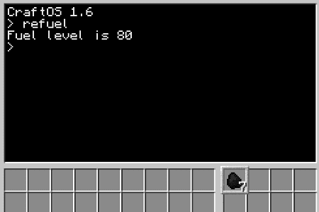
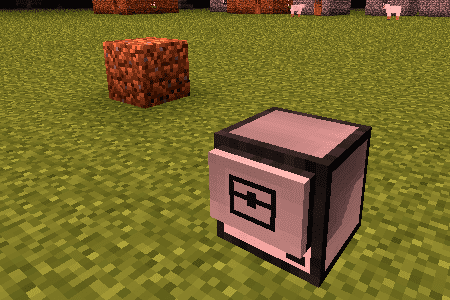
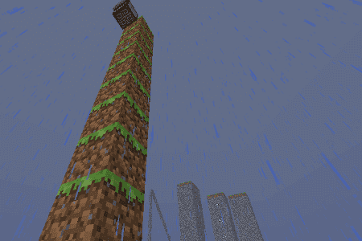
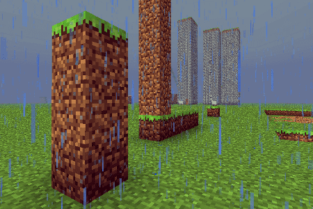
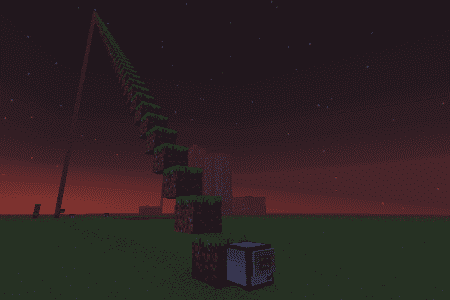

# Introduksjon {.intro}

__ComputerCraft__ er en mod til __Minecraft__, som gir deg muligheten
til å bygge og programmere __datamaskiner__ og __roboter__ inne i
Minecraft-verdenen.

Vi begynner med å bygge en enkel datamaskin. Etter å ha brukt litt tid
på å bli kjent med hvordan datamaskinen virker, bruker vi den til å
låse opp en dør ved hjelp av passord. Etter at vi har klart dette
begynner vi å se på datamaskiner som kan bevege seg, altså roboter!
Disse kan vi bruke til både å grave og bygge ting for oss.



# Steg 1: Vår første datamaskin {.activity}

*Vi begynner med å lage en datamaskin.*

I utgangspunktet er det mye enklere å starte i *Creative Mode* når vi
skal lære å bruke datamaskinene, siden vi da slipper å bruke tid på å
samle materiale og slåss mot monstre. Vi vil derfor i fortsettelsen
anta at du er i *Creative Mode*, og kan plukke akkurat det du trenger
i inventory'et ditt.

Men først, for å vise at en datamaskin kan bygges på vanlig måte i
Minecraft:

## Sjekkliste {.check}

- [ ] Trykk `E` for å åpne inventory'et ditt. Finn frem 7 __Stone__, 1
__Redstone__ og 1 __Glass pane__.
- [ ] Åpne et __Crafting table__, og legg ut materialet slik:

  

- [ ] Legg den nye datamaskinen i den nederste raden i inventory'et ditt,
slik at du kan ta den på hånden. Lukk inventory'et.
- [ ] Bruk talltastene til å velge datamaskinen, og høyreklikk for å lage
en datamaskin.

I *Creative Mode* kan du også få tak i datamaskiner ved å trykke `E`,
deretter klikke `>` for å gå til neste side, og til slutt velge fanen
med datamaskinsymbolet.

### ComputerCraft-datamaskiner {.protip}

Høyreklikk en datamaskin for å starte den opp. Den vil åpne en svart
skjerm med teksten `CraftOS` på toppen. Dette er
datamaskinens *kommandolinje*, og vi vil bruke den til å styre
datamaskinen med.

## Sjekkliste {.check}

- [ ] Prøv å skriv `help` og trykk enter.

  Du får nå se noen tips om hvordan du kan finne ut mer om
  datamaskinen. For eksempel kan du skrive `programs` for å se en
  liste over hvilke programmer som er på datamaskinen, eller `help
  programming` for å få noen tips til hvordan man programmerer
  datamaskinen.

- [ ] Skriv `programs` og trykk enter.

  Mange av disse programmene er enkle programmer som lar deg
  undersøke datamaskinen nærmere. Etter kurset kan du prøve å
  utforske flere av disse programmene.

# Steg 2: Vårt første program {.activity}

*Det er nå på tide at vi skriver vårt første program.*

Det er en lang tradisjon blant programmerere at det første programmet
de lager når de lærer et nytt språk skriver en trivelig melding til
skjermen. Vi følger den tradisjonen og begynner med et program som
heter `heiverden`.

## Sjekkliste {.check}

- [ ] Start en datamaskin.
- [ ] Skriv `edit heiverden` for å begynne å skrive på et nytt program som
heter `heiverden`.
- [ ] I det nye vinduet, skriv

  ```lua
  print('Hei verden!')
  ```

  Etter at du har skrevet dette så trykker du på *Ctrl*-tasten og
  velger `Save`. Deretter trykker du *Ctrl* en gang til og velger
  `Exit`.

- [ ] Vi har nå laget vårt første program. Prøv å skriv `programs` og du
vil se at `heiverden` er på listen over programmer.
- [ ] For å kjøre programmet vi har laget, skriver vi `heiverden` og
trykker enter.

### Prøv selv {.challenge}

Klarer du å endre på programmet slik at det for eksempel sier hei til
deg, eller kanskje til de som sitter ved siden av deg?

Prøv å skriv `edit heiverden` en gang til. Da åpner programmet ditt
seg igjen, og du kan endre på det slik at det sier noe annet. Som
tidligere må du bruke *Ctrl*-tasten for å gå til menyen slik at du kan
lagre og avslutte endringene.

# Steg 3: Datamaskiner og Redstone {.activity}

*Vi skal nå bruke datamaskinen til å åpne en dør for oss, og
 kanskje etterhvert legge på et passord på døren.*

Datamaskinene i ComputerCraft bruker et programmeringsspråk som heter
__Lua__. Dette er et ganske enkelt og fleksibelt språk som ofte brukes
inne i andre programmer. For eksempel kan også deler av Photoshop,
Wikipedia og World of Warcraft programmeres med Lua.

### Lua {.protip}

Lua ble opprinnelig laget i Brasil på begynnelsen av 1990-tallet. På
universitetet i Rio de Janeiro brukte de tidligere et språk som het
*Simple Object Language* (SOL). Ordet *lua* er portugisisk og betyr
*måne*, noe de syntes var et fint navn som passet sammen med SOL.

## Sjekkliste {.check}

Vi vil bruke __Redstone__ for å kontrollere døren. Redstone er et
materiale som kan overføre energi i Minecraft. La oss først sette opp
en datamaskin ved siden av en dør.

- [ ] Gå ut av datamaskinen ved å trykke `Esc`-knappen.

- [ ] Samle sammen litt __Stone__, en __Iron door__ og en __Computer__, og
lag en vegg hvor du setter inn en dør og med datamaskinen rett ved
siden av døren. Det skal se omtrent slik ut:

  

- [ ] Start datamaskinen.

Vi skal nå prøve å skrive noen kommandoer direkte i Lua. Dette er en
fin måte å teste enkle ting på.

- [ ] Skriv `lua` og trykk enter. Dette starter en *Lua-tolker* som vil
utføre hver enkelt kommando du skriver med en gang.

- [ ] Vi begynner med kommandoen fra det første programmet vårt. Skriv
`print('Hei verden!')` og trykk enter. Skjer det samme som tidligere?

- [ ] Som de aller fleste programmeringsspråk er Lua glad i å regne. Skriv
`1 + 1` og trykk enter.

  Lua kjenner alle de vanlige matematikk-operasjonene. Prøv for
  eksempel `17 - 8`, `3 * 4` eller `22 / 7`. Kjenner du igjen hva
  hver av disse betyr?

- [ ] Skriv `redstone.setOutput('left', true)` og trykk enter.

  Denne kommandoen skal åpne døren til venstre for datamaskinen.
  Her forteller `left` hvilken side av datamaskinen døren står
  på. Du kan også bruke for eksempel `right`, `top` eller `bottom`.

  Dette er et eksempel på å kalle en *funksjon*, noe vi gjør ofte
  når vi programmerer. I dette tilfellet heter funksjonen `setOutput`
  og den hører hjemme i `redstone`-*biblioteket*.

### Funksjoner {.protip}

Alle programmeringsspråk lar deg lage noe som kalles *funksjoner*.
Dette er en samling instruksjoner som utføres sammen slik at det blir
enklere å gjøre vanskelige ting. Lua kommer med innebygde funksjoner.
Vi har så langt sett `print` og `redstone.setOutput` som eksempler på
dette.  Det går også an å lage egne funksjoner.

## Sjekkliste {.check}

- [ ] Trykk pil opp-tasten slik at du kan endre
`redstone.setOutput('left', true)` til `redstone.setOutput('left',
false)`. Trykk enter. Nå lukker døren seg igjen fordi vi skrur av
*redstone*-energien.

- [ ] Avslutt Lua-tolkeren ved å skrive `exit()` og trykk enter.

# Steg 4: Passordlås på en dør {.activity}

*Vi skal nå bruke redstone-biblioteket til å lage en passordlås på
 døra. Underveis vil vi også lære litt om tester og løkker.*

## Sjekkliste {.check}

- [ ] Start et nytt program ved å skrive `edit passord` og trykk enter.
- [ ] Skriv inn følgende program nøyaktig slik det står

  ```lua
  local passord = 'kodeklubben'
  print('Passordet er ' .. passord .. '!')
  ```

  Pass på at du skriver de to punktumene `..` riktig. Disse betyr at
  vi setter sammen tekst.

- [ ] Lagre og avslutt editoren. Kjør programmet ved å skrive `passord`.

  Programmet forteller deg hva passordet er. Klarer du å endre
  passordet til noe annet? Kanskje til `ComputerCraft` eller til
  navnet ditt?

### Variabler {.protip}

Vi har nå laget en variabel. Variabelen `passord` husker hva passordet
skal være. På denne måten blir det enkelt å endre passordet
senere. Ordet `local` foran variabelen sier at vi bare skal huske
variabelen i dette programmet (lokalt).

## Sjekkliste {.check}

- [ ] Vi skal nå jobbe videre med programmet. Vi vil jo at datamaskinen
skal spørre oss om passordet, ikke fortelle oss hva det er. Skriv
`edit passord` igjen, og endre programmet slik at det blir seende ut
som følger:

  ```lua
  local passord = 'kodeklubben'
  print('Hva er passordet?')                    -- endret linje
  svar = read()                                 -- ny linje
  ```

  Lagre, avslutt, og kjør programmet på nytt. Nå vil programmet
  spørre deg om passordet. Skjer det noe når du svarer? Funksjonen
  `read` brukes for å lese ting du skriver på tastaturet, men
  programmet gjør foreløbig ingenting med svaret ditt.

- [ ] Det neste vi vil er derfor at programmet skal sjekke om du svarer
med riktig passord. For å gjøre dette vil vi bruke noe som heter
`if`-tester. Disse kan teste om noe er sant, og vi vil bruke dem for å
sjekke om det er sant at svaret ditt er likt med det faktiske
passordet. Legg til en `if`-test nederst i programmet ditt slik som
dette:

  ```lua
  local passord = 'kodeklubben'
  print('Hva er passordet?')
  svar = read()

  if svar == passord then                       -- ny linje
      print('Riktig, passordet er ' .. passord) -- ny linje
  else                                          -- ny linje
      print('Feil, passordet er ikke ' .. svar) -- ny linje
  end                                           -- ny linje
  ```

  Kjør programmet igjen. Hva skjer når du svarer riktig? Hva skjer
  når du svarer feil? Skjønner du hvorfor?

- [ ] Nå kan vi koble sammen passordet med `redstone`-kommandoene vi så
tidligere. La oss åpne døren hvis passordet er riktig. Etter 5
sekunder kan vi lukke døren igjen. Endre programmet slik:

  ```lua
  local passord = 'kodeklubben'
  print('Hva er passordet?')
  svar = read()

  if svar == passord then
      redstone.setOutput('left', true)          -- endret linje
      sleep(5)                                  -- endret linje
      redstone.setOutput('left', false)         -- endret linje
  end
  ```

  Kjør programmet. Hva skjer nå når du skriver riktig passord?

  Funksjonen `sleep` gjør at datamaskinen sover, det vil
  si gjør ingenting. I dette tilfellet sover datamaskinen i 5
  sekunder, før energien skrus av igjen og døren lukker seg.

- [ ] Det er kjedelig at vi hele tiden må starte programmet på nytt. Vi
lager derfor en løkke som kan spørre oss om passord igjen og igjen.

  ```lua
  local passord = 'kodeklubben'

  while true do                                 -- ny linje
      print('Hva er passordet?')
      svar = read()

      if svar == passord then
          redstone.setOutput('left', true)
          sleep(5)
          redstone.setOutput('left', false)
      end
  end                                           -- ny linje
  ```

  Det er bare èn ny ting her som vi ikke har sett tidligere, nemlig
  en `while`-løkke. Slike løkker vil fortsette å gjøre ting om igjen
  så lenge noe er sant. I vårt tilfelle er dette *noe* verdien
  `true` som alltid er sann. Det betyr at vi har laget en *evig
  løkke*. Dette programmet vil fortsette å spørre oss om passordet
  for alltid!

- [ ] Kjør programmet. Oppfører programmet seg slik du hadde trodd? Husker
du passordet?

### Avslutte programmer {.protip}

For å avslutte dette programmet holder du inne *Ctrl* og *T* samtidig i
cirka ett sekund. Da avbrytes programmet, og teksten `Terminated`
skrives på skjermen. Dette fungerer både her og i andre programmer.

## Sjekkliste {.check}

- [ ] Før vi er helt fornøyde med dette programmet vil vi gjøre noen små
forbedringer. Først kaller vi to funksjoner fra `term`-biblioteket.
Den ene vil rense skjermen, mens den andre setter posisjonen hvor vi
skriver teksten til `(1, 1)` som betyr øverst til venstre. I tillegg
forteller vi `read` at vi ikke vil at passordet vi skriver inn skal
synes på skjermen. I stedet vil vi at `*`-tegn skal vises. Programmet
ser da slik ut:

  ```lua
  local passord = 'kodeklubben'

  while true do
      term.clear()                              -- ny linje
      term.setCursorPos(1, 1)                   -- ny linje
      print('Hva er passordet?')
      svar = read('*')                          -- endret linje

      if svar == passord then
          redstone.setOutput('left', true)
          sleep(5)
          redstone.setOutput('left', false)
      end
  end
  ```

Gratulerer, du har allerede lært ganske mye om hvordan man programmerer
datamaskiner med ComputerCraft i Minecraft! Prøv gjerne å forandre
noen av programmene vi har laget. Kan du lage dem enda bedre?

# Steg 5: Vår første robot {.activity}

*Vi skal nå bli kjent med roboter og se noe av det de kan brukes til.*

En robot er en datamaskin som kan bevege seg. I ComputerCraft kan vi
også gi robotene forskjellige verktøy slik at de for eksempel kan
grave, bygge, slåss og så videre.

Vi begynner likevel med en helt enkel robot:

## Sjekkliste {.check}

- [ ] Åpne inventory'et ditt ved å trykke 'E'. Finn frem 7 __Iron Ingot__, 1
__Chest__ og 1 __Computer__.

- [ ] Start et __Crafting table__, og lag en robot slik:

  

- [ ] Legg den nye roboten i hånden din. Lukk inventory'et og lag en
robot.

I *Creative Mode* finner du også robotene ved å trykke `E`, deretter
`>` og til slutt velge fanen med datamaskinsymbolet. Robotene heter
__Turtle__ i ComputerCraft.

### Turtles {.protip}

Navnet __Turtle__ betyr *skilpadde* på norsk. Grunnen til at disse
robotene kalles skilpadder er historisk. For nesten 70 år siden bygde
William Grey Walter et par roboter som kunne bevege seg rundt. Disse
beveget seg ganske sakte, og var lave og skallformet. De fikk derfor
etterhvert kallenavnet skilpadder.

Senere ble måten disse skilpaddene beveget seg på (vi skal se hvordan
snart) tatt inn i forskjellige programmeringsspråk, spesielt som en
måte å tegne på. Språket *Logo* er nok det som er mest kjent for slik
skilpaddegrafikk, men nesten alle programmeringsspråk støtter dette i
dag, inkludert for eksempel *Scratch*, *Python* og *ComputerCraft*.

## Sjekkliste {.check}

På samme måte som med datamaskiner starter du roboter ved å
høyreklikke på dem. Dette vil starte kommandolinjen til roboten.

- [ ] Start en robot. Skriv `programs` og trykk enter.

  Dette viser hvilke programmer denne roboten kjenner til. Hvis du
  sammenligner med programmene en datamaskin kjenner til vil du se
  at det er mange av de samme programmene, men at roboten også kan
  noen ting som datamaskinen ikke kan.

- [ ] Kjør programmet `dance`.

  Roboten begynner nå å danse! Trykk *Esc*-knappen for å stenge
  kommandolinjen, slik at du ser roboten. Blir du imponert?

- [ ] Hvis du vil at roboten skal slutte å danse kan du høyreklikke på den
igjen. I kommandolinjen står det nå en liten tekst som sier at du kan
få roboten til å slutte å danse ved å trykke en knapp på tastaturet.

  Hvis du vil kan du også la roboten fortsette å danse. Lag i så
  fall en ny robot som du kan bruke i de neste oppgavene.

# Steg 6: Roboter og skilpadder {.activity}

*Vi vil nå se hvordan vi kan få robotene våre til å bevege seg rundt.*

Som nevnt i boksen *Turtles* ovenfor beveger vi robotene våre på en
måte som ligner slik noen spesielle skilpadderoboter ble kontrollert
for nesten 70 år siden. Dette gjør vi ved å bruke programmet `go` for
å bevege robotene rundt.

## Sjekkliste {.check}

- [ ] Kjør programmet `go forward` i kommandolinjen til en robot.

- [ ] Roboten sier at den er `Out of fuel`.

  Roboter bruker *fuel* for å bevege seg. De kan bruke stort sett
  samme materiale som en __Furnace__ som fuel, for eksempel er
  __Coal__ eller __Blaze Rod__ fine å bruke.

- [ ] Finn litt __Coal__ i inventory'et ditt. Høyreklikk på roboten. Legg
merke til at det er et inventory med 16 plasser (4 ganger 4) på høyre
side. Dette er robotens inventory. Flytt kullet over til roboten.

  

- [ ] Skriv `refuel` i kommandolinjen og trykk enter.

  Legg merke til at en kull blir borte fra robotens
  inventory. Roboten svarer også ved å fortelle om sin *fuel
  level*. Dette tallet forteller hvor langt roboten kan bevege seg
  før den går tom for fuel igjen.

- [ ] Gi roboten litt mer __Coal__ og skriv `refuel all`.

  Roboten vil nå spise opp alt kullet, og deretter rapportere at den
  er klar til å gå ganske så langt!

- [ ] Da prøver vi igjen: Kjør programmet `go forward`. Dette skal flytte
roboten forover ett steg.

  Flytter roboten din seg? Det kan være litt vanskelig å se hva som
  er fram og bak på en robot. Et triks kan være å tenke på den
  lange, smale sprekken som øynene til roboten. Altså at den siden
  med sprekken er foran.

- [ ] Vi kan få roboten til å flytte seg bakover ved å skrive `go back`.

### Finne hjelp {.protip}

Datamaskiner og roboter har et innebygd hjelpesystem. For å se hvordan
det virker kan du skrive `help` og trykke enter. Dette gir deg en rask
introduksjon til nyttige hjelpekommandoer. Legg merke til at du kan
skrive `help <program>` for å få hjelp om et spesielt program. Da må
du bytte ut `<program>` med navnet på programmet. For eksempel kan du
skrive `help go` for å finne hjelp om `go`-programmet.

Det finnes selvsagt også en del hjelp på Internett. Et bra sted å
starte er ComputerCraft Wiki'en: <http://computercraft.info/wiki/>.

## Sjekkliste {.check}

- [ ] For å få vite mer om hvordan roboten kan flytte seg kan vi skrive
`help go`.

  Dette viser oss at vi kan bruke `go forward`, `go back`, `go up`,
  `go down`, `go left` og `go right` for å flytte roboten rundt. I
  tillegg ser vi at vi kan bruke tall for at roboten skal flytte seg
  flere steg.

- [ ] Prøv `go up 2`, `go forward 10`, `go down` og lignende kommandoer.

  Hvordan kan vi få roboten til å bevege seg sidelengs?

- [ ] Det finnes ingen kommando som får roboten til å bevege seg
sidelengs. Kommandoene `go left` og `go right` bare snur roboten. For
å få roboten til å gå sidelengs må vi derfor først snu roboten, og
deretter bruke for eksempel `go forward`. Skriv `go left` og deretter
`go forward 3`.

- [ ] Vi kan også kombinere flere kommandoer i et kall. For eksempel vil
`go forward 3 left forward 4 up 2` gjøre at roboten først går fremover
3 steg, så snur den seg mot venstre, deretter går den 4 steg til før
den løfter seg 2 steg oppover.

- [ ] Lek litt mer med `go`-programmet til du skjønner hvordan du flytter
roboten rundt omkring. Dersom du synes `go left` og `go right` er litt
forvirrende siden roboten ikke går noe sted, kan du bruke `turn left`
og `turn right` i stedet.

  Hva skjer dersom du ber roboten gå gjennom bakken, gjennom en
  vegg, eller om du står i veien for roboten?

# Steg 7: Gruverobot {.activity}

*Hvis vi gir roboter de riktige verktøyene kan de grave, bygge og
 slåss for oss.*

Vi skal nå bruke en gruverobot som kan grave for oss.

## Sjekkliste {.check}

- [ ] Finn en gruverobot i inventory'et ditt ved å gå til datamaskinfanen
og plukke ut en __Mining Turtle__. Lag og start en gruverobot.

- [ ] Gi roboten litt __Coal__ og kjør `refuel all`.

- [ ] Vi skal nå bruke et program som heter `excavate`, dette betyr *grav
ut*. og vil be roboten om å grave ut et hull i bakken.

  Skriv `excavate 3` og trykk enter.

  Ta et steg tilbake og se på mens roboten graver. Roboten vil
  fortsette å grave til den går tom for fuel eller kommer til
  grunnfjellet, __Bedrock__.

- [ ] Hva tror du tallet `3` i kommandoen vi skrev over betyr? Skriv `help
excavate` for å se om du har rett.

- [ ] Høyreklikk på roboten slik at du ser inventory'et den har. Legg
merke til at den tar vare på alt den graver ut.

  Når roboten er ferdig å grave kommer den tilbake dit den
  startet. Der gir den fra seg alt materialet den har gravd ut slik
  at du kan plukke det opp om du vil.

- [ ] Lag flere gruveroboter som kan grave større eller mindre hull.

# Steg 8: Robotprogrammer {.activity}

*Vi skal nå lære hvordan vi kan kontrollere roboter i våre egne
 programmer.*

Når vi skriver egne programmer som styrer robotene bruker vi
kommandoer fra `turtle`-biblioteket.

## Sjekkliste {.check}

- [ ] Start en ny robot. Pass på at den har fått litt kull og blitt
`refuel`et.

- [ ] Vi begynner med å prøve å finne litt mer informasjon om
`turtle`-biblioteket. Skriv `help turtle`.

  Du får nå se en ganske lang liste med kommandoer som vi kan
  bruke. Vi vil vise frem noen av disse. Du kan senere teste alle
  sammen på egen hånd, og se om du skjønner hvordan de alle virker.

  For å komme ut av listen kan du for eksempel holde mellomromtasten
  nede en liten stund.

- [ ] For å gjøre enkle eksperimenter vil vi begynne med å skrive
kommandoene direkte i Lua-tolkeren. Skriv `lua` og trykk enter. Husk
at du skriver `exit()` for å gå ut av Lua-tolkeren og tilbake til
kommandolinjen.

- [ ] Vi begynner med de enkle flytte-kommandoene. Skriv
`turtle.forward()` og trykk enter. Flytter roboten seg forover?

  Husk at du kan trykke *Esc*-knappen for enklere å se hva roboten
  gjør. Høyreklikk på roboten for å komme tilbake til
  Lua-tolkeren.

- [ ] Prøv også de følgende kommandoene. Disse tilsvarer `go`-programmet,
og til sammen gir de oss muligheten til å flytte roboten dit vi vil ha
den:

  `turtle.forward()`, `turtle.back()`, `turtle.turnLeft()`,
  `turtle.turnRight()`, `turtle.up()`, `turtle.down()`.

### Prøv selv {.challenge}

Lag en liten kloss litt unna roboten din, omtrent som på bildet
under. Klarer du å bruke `turtle`-kommandoene over til å plassere
roboten på toppen av klossen?



# Steg 9: Up, up, up, and away ... {.activity}

*Kan vi klare å få roboten til å bygge for oss?*

Ett av poengene med roboter er at de kan gjøre arbeid for oss. I
Minecraft betyr det at vi vil at robotene for eksempel skal kunne
grave eller bygge.

## Sjekkliste {.check}

- [ ] Start en ny robot. Gi den fuel (og kjør `refuel`). Legg også noe
byggemateriale, for eksempel __Grass__, i den øverste venstre boksen i
robotens inventory.

- [ ] Pass på at det ikke er noe foran roboten, og skriv `turtle.place()`
inne i Lua-tolkeren.

  Bygde roboten en gresskloss foran seg? Da har du gjort alt
  riktig. Hvis dette ikke skjedde kan du sjekke

  __1__: at du har startet `lua`,

  __2__: at roboten har fuel,

  __3__: at roboten har byggemateriale,

  __4__: at det ikke står noe foran roboten (husk at den smale
  sprekken er øynene til roboten), og

  __5__: at boksen med byggemateriale i robotens inventory er
  merket, det vil si at den har en litt tykkere ramme rundt seg enn
  de andre boksene.

- [ ] Roboten kan også sjekke om den har noe foran seg: Skriv
`turtle.detect()`.

  Du skal få svaret `true` som betyr at roboten merker at den har
  noe foran seg.

- [ ] Prøv så `turtle.back()` etterfulgt av `turtle.detect()`.

  Siden roboten nå ikke har noe rett foran seg får du svaret
  `false`.

I Steg 10 skal vi se hvordan vi kan bruke `place()` og `detect()`
sammen for å lage en ganske smart byggerobot.

Men først, en ting vi kunne gjøre med `go` var å flytte roboten flere
steg ved å skrive et tall, for eksempel `go forward 3`. Det samme
fungerer ikke med `turtle`-biblioteket. I stedet må vi bruke løkker.

## Sjekkliste {.check}

- [ ] En enkel måte å gjøre noe et bestemt antall ganger er å bruke
`for`-løkker.

  Skriv

  ```lua
  for i = 1, 5 do turtle.back(); end
  ```

  i Lua-tolkeren. Flytter roboten din seg 5 steg bakover?

### `for`-løkker {.protip}

En `for`-løkke brukes ofte når vi vet hvor mange ganger vi vil gjøre
en bestemt ting. I eksempelet over så vi at roboten flyttet seg 5
ganger bakover. En nyttig ting er at vi også kan følge med på hvor i
løkken vi er, fordi `i` i koden over er en variabel. For eksempel kan
vi skrive

```lua
for i = 1, 5 do print(i); end
```

Dette vil skrive tallene 1, 2, 3, 4, 5 til skjermen på hver sin linje.

Vi kan også bruke andre variabelnavn enn `i`, og vi kan starte på
andre tall enn `1`:

```lua
for tall = 10, 20 do print(tall); end
```

## Sjekkliste {.check}

- [ ] Hvis vi vil kombinere flere kommandoer inne i en løkke i
Lua-tolkeren bruker vi semikolon, `;`.

  Prøv

  ```lua
  for i = 1, 5 do turtle.back(); turtle.place(); end
  ```

- [ ] Pass på at roboten din har mye byggemateriale, for eksempel 64
__Grass__, i den merkede boksen i inventory'et sitt.

- [ ] La oss bygge et høyt tårn!

  Skriv

  ```lua
  for i = 1, 60 do turtle.up(); turtle.place(); end
  ```

  

Oops! Vi glemte å fortelle roboten at den skulle komme ned når den
blir ferdig med å bygge. Hvordan skal vi få tak i den igjen?

# Steg 10: Bygg en trapp {.activity}

*Kan vi skrive et program som kan hjelpe oss å hente ned den forsvunne
 roboten?*

Når vi skal gjøre ting som er litt kompliserte er det som regel
enklere å skrive et program, i stedet for å bare gi enkeltkommandoer i
Lua-tolkeren. La oss prøve å lage et program som kan bygge en trapp
opp til toppen av det høye tårnet.

Før vi begynner på utfordringen det er å bygge en kjempehøy trapp, la
oss øve oss, og teste programmet på et mindre tårn.

## Sjekkliste {.check}

- [ ] Bygg et tårn som er tre klosser høyt. Dette kan du bygge enten med
en robot eller bare på egen hånd.

  

- [ ] Lag en ny robot inntil det lille tårnet du nettopp bygde. Gi den
fuel og byggematerialer. Pass på at den peker mot tårnet.

- [ ] Begynn et nytt program ved å skrive `edit byggTrapp`. Skriv inn
følgende:

  ```lua
  turtle.detect()
  ```

  Lagre og avslutt ved å bruke *Ctrl*-tasten.

- [ ] Kjør programmet ved å skrive `byggTrapp`. Dette programmet bygger
ingen trapp enda, det virker faktisk som om det ikke gjør noe som
helst. Det eneste som skjer er at roboten merker at den har en kloss
foran seg. Men vi har ikke fortalt den hva den skal gjøre etterpå.

  Vi kan bruke `turtle.detect()` til å finne toppen av tårnet.

- [ ] Endre på programmet ditt ved å skrive `edit byggTrapp` igjen. Vi
lager nå en løkke hvor roboten klatrer oppover så lenge den merker at
tårnet er høyere.

  ```lua
  while turtle.detect() do                      -- endret linje
      turtle.up()                               -- ny linje
  end                                           -- ny linje
  ```

  Lagre og kjør programmet ditt. Klatrer roboten til toppen av det
  lille tårnet?

- [ ] Vi har lært av feilen vi gjorde tidligere, så nå vil vi passe på at
roboten kommer ned igjen. La oss legge til en ny løkke i programmet,
slik at roboten klatrer ned. Denne gangen bruker vi kommandoen
`detectDown()`. Denne gjør det samme som `detect()`, bortsett fra at
den merker om roboten har en kloss under seg i stedet for foran seg.

  Utvid programmet ditt slik:

  ```lua
  while turtle.detect() do
      turtle.up()
  end

  while not turtle.detectDown() do              -- ny linje
      turtle.down()                             -- ny linje
  end                                           -- ny linje
  ```

  Vi sier at så lenge roboten *ikke* har en kloss under seg kan den
  ta et steg ned. Kommer roboten ned igjen når du kjører programmet?

- [ ] Nå er vi klar til å la roboten bygge selve trappen. Det gjør vi ved
å ta et steg tilbake i den andre løkken, og plassere ut en kloss.

  ```lua
  while turtle.detect() do
      turtle.up()
  end

  while not turtle.detectDown() do
      turtle.down()
      turtle.back()                             -- ny linje
      turtle.place()                            -- ny linje
  end
  ```

  Virker det? Lager roboten en trapp?

- [ ] Nå er vi klare for den store testen. Klarer vi å sende
trappebyggeroboten vår opp det høye tårnet?

  Pass på at roboten fortsatt har nok fuel, og fyll opp med
  byggemateriale. Kjør den bort til det høye tårnet, og la den `byggTrapp`!

  

Gratulerer! Du har nå programmert en robot! Legg merke til at siden
`byggTrapp`-programmet vårt bruker `detect`-kommandoer kan det bygge
trapper opp alle slags tårn og bratte fjellsider!

### Prøv selv {.challenge}

Vi har nå laget et program som kan bygge trapper oppover. Kan du lage
et program som kan grave trapper ned under bakken?

Lag et program som heter `gravTrapp`. For å gjøre dette trenger du en
__Mining Turtle__.

Se på kommandoene `turtle.dig()` og `turtle.digDown()`. Disse vil
grave henholdsvis foran og under roboten. `turtle.digUp()` kan også
være nyttig om du vil lage nok plass til at man kan gå ned i trappen.

For å vite hvor langt ned roboten skal grave, er det enkleste å bruke
en `for`-løkke. For eksempel kan du si at roboten skal grave 10 trinn
nedover.

Hvis du vil ha en utfordring kan du la roboten grave nedover til den
finner for eksempel grunnfjellet, __Bedrock__. For å gjøre dette kan
du legge en __Bedrock__ øverst til venstre i inventory'et til
roboten. Deretter kan du bruke `turtle.select(1)` og
`turtle.compareDown()` for å finne ut om roboten har kommet ned til
grunnfjellet.
