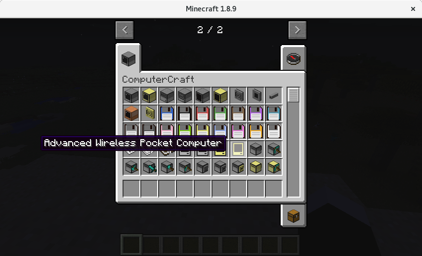
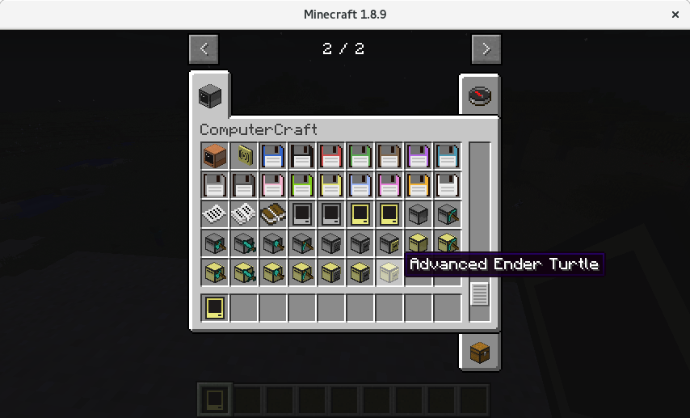
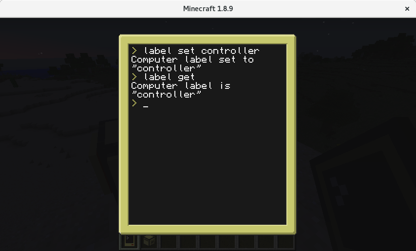

# Introduksjon {.intro}

Vi har tidligere kjørt kode på én og én datamaskin i ComputerCraft. Nå skal vi få flere datamaskiner til å snakke sammen.

# Steg 1: Maskinvaren vi trenger! {.activity}

Et modem var det vi i gamle dager brukte for å koble oss til internett. I ComputerCraft bruker vi modem for å koble oss til *Rednet* -- Internett for datamaskiner i Minecraft.

Siden trådløse datamaskiner er dyre, er det kjekt å bruke en *Creative-verden*.

+ Vi bygger en **Advanced Wireless Pocket Computer** og en **Advanced Ender Turtle**

  

  

+ Vi kaller tableten for *Controller* med `label set controller` og roboten for *Worker* med `label set Worker`.

  

### Server og klient {.tip}

At to datamaskiner skal snakke sammen er vanlig å programmere. Vi pleier å gi disse to roller: server og klient.

* **Serveren** venter pent på å få beskjed
* **Klienten** sender meldinger til serveren når den ønsker

Vet du om noen eksempler på servere og klienter?

### Rednet {.tip}

Vi skal bruke `rednet` til å la datamaskinene snakke sammen. For en kjapp oversikt over hva `rednet` kan gjøre, bruk kommandoen `help rednet`.

For mer detaljert informasjon, se på wikien til [ComputerCraft](http://computercraft.info/wiki/Rednet_%28API%29).

## Steg 2: Klar til å motta beskjed {.check}

Nå skal vi bruke *Controller* og *Worker* til å sende beskjeder. Siden kontrolleren aktivt skal sende beskjeder, blir *Controller* klienten vår, mens *Worker* er serveren.


+ Sjekk id og plassering av modem på *Worker*. Min *Worker* svarte følgende:

  ```
  > peripherals
  left (modem)
  > id
  This is computer #5
  This computer is labelled "Worker"
  ```

+ Start lua-tolkeren:

  ```
  > lua
  Interactive Lua prompt.
  call exit() to exit.
  lua>
  ```

+ Koble til `rednet` og vent på beskjed. Husker du hvor modemet var plassert?

  ```lua
  lua> rednet.open("left")
  lua> rednet.receive(100)
  ```

### Nøtt {.try}

Hva er tallet som går inn i `receive`-funksjonen? Hva skjer når du putter inn 1? 5? 10?

## Steg 3: Send beskjed

+ Sjekk plassering på modemet på kontrolleren og start lua-tolkeren. Hvor var modemet? Må du kalle `rednet.open("left")`, `rednet.open("right")` eller `rednet.open("back")`?

+ Hva var id-en til din *Worker*? Denne trenger vi når vi skal sende informasjon. Min var 5. Jeg bruker derfor 5 når jeg sender beskjeden min:

  ```lua
  rednet.send(5, "Hello, Worker! This is Controller speaking!")
  ```

## Test selv! {.flag}

* Ser du beskjeden du har sendt på *Worker*?
* Hva må du gjøre for å sende flere beskjeder etter hverandre?
* Worker viser et tall i tillegg til beskjeden du sendte. Hva er tallet?
