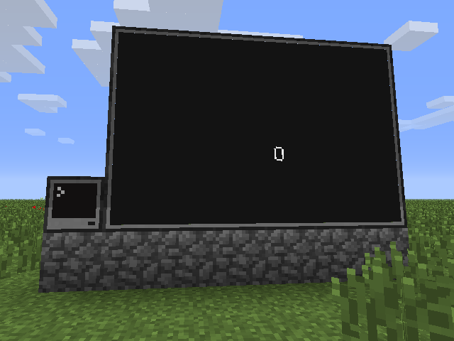
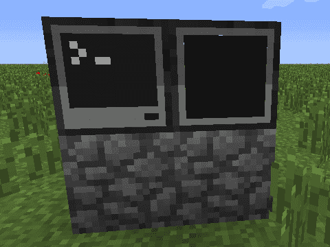
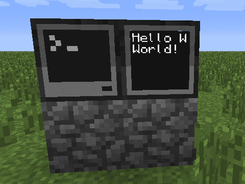
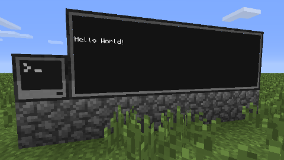
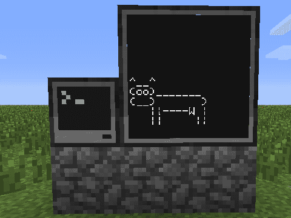
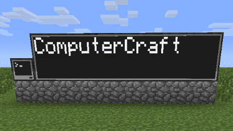

# Introduksjon {.intro}

Nå skal vi lære hvordan vi kan koble en skjerm til datamaskinen. Med
en ekstra skjerm kan vi bruke datamaskinen til å kommunisere med
verden rundt oss. Kanskje Minecraft-verden blir fyllt med store
reklamebannere?



# Steg 1: Koble en skjerm til datamaskinen {.activity}

La oss som vanlig begynne helt enkelt. La oss koble en skjerm til en
datamaskin og se om vi får til å skrive noe på skjermen.

## Sjekkliste {.check}

+ Bygg en **Computer**. Du kan også bruke en **Advanced Computer** om
  du foretrekker det.

+ Bygg så en **Monitor** inntil datamaskinen du nettopp bygget,
  omtrent som på bildet.

  

+ Start datamaskinen. Den enkleste måten å skrive noe til skjermen er
  ved hjelp av programmet `monitor`. Om du skriver `help monitor` vil
  du kunne lese at `monitor` kan kjøre andre programmer på en
  tilkoblet skjerm.

  La oss for eksempel prøve programmet `hello`. Dette er et enkelt
  program som vi såvidt har sett litt på tidligere. Det skriver bare
  teksten *Hello World!*. Kjør først programmet på datamaskinen:

  ```
  > hello
  Hello World!
  ```

  Nå kan vi prøve å få dette til å kjøre på skjermen. Med skjermen
  koblet til på høyre (*right*) side av datamaskinen (som på bildet
  over) skriver vi bare

  ```
  > monitor right hello
  ```

  Du kan nå trykke `Esc` for å gå ut av datamaskinen og se på
  skjermen. Står det *Hello World!*?

  

+ Kult! Da er vi igang med skjermene! Men - det ble jo veldig dårlig
  plass på den skjermen! Det er det heldigvis lett å gjøre noe med. Om
  du setter en **Monitor** ved siden av den du allerede har vil de to
  skjermene smelte sammen til en større skjerm. På denne måten kan du
  lage en stor skjerm! Prøv å kjør `hello`-programmet på den store
  skjermen.

  

+ Trikset med `monitor` fungerer selvsagt også med programmer vi
  skriver selv. La oss lage et enkelt program som vi kaller `ku`:

  ```lua
  print("^__^")
  print("(oo)_______")
  print("(__)       )")
  print("   ||----W |")
  print("   ||     ||")
  ```

  Det er ikke så farlig om din ku ikke ser ut akkurat som her. Du
  kan også gjerne tegne noe helt annet. Vi vil bare teste at også
  vårt eget program kan skrives på skjemen.

+ Nå kan vi kjøre programmet: `monitor right ku`.

  

## Cowsay {.protip}

Denne kuen er basert på et morsomt lite program som heter **Cowsay**,
og som ble laget av Tony Monroe på slutten av 1990-tallet. En
web-variant av programmet finnes nå på
[http://cowsay.morecode.org/](http://cowsay.morecode.org/).

# Steg 2: En annen metode {.activity}

I stedet for at vi bruker `monitor`-programmet for å skrive til
skjermen kan vi skrive direkte til skjermen i programmer vi selv
lager. Dette er ganske enkelt med et bibliotek som heter `peripheral`
(*peripheral* betyr i denne sammenhengen *tillegg*, altså skjermen er
et tillegg til datamaskinen).

## Sjekkliste {.check}

+ Lag et enkelt program som heter `skjerm` og ser slik ut:

  ```lua
  skjerm = peripheral.wrap("right")
  skjerm.write("Heisann!")
  ```

  Som vanlig kan du bytte ut *right* med for eksempel *left* eller
  *top* om du har plassert skjermen annerledes.

+ Kjør programmet ditt ved å skrive `skjerm`. Selv uten `monitor` skal
  programmet skrive til skjermen ved siden av datamaskinen.

+ I stedet for `peripheral.wrap` kan vi bruke `peripheral.find`. Da
  trenger vi ikke å spesifisere hvilken side av datamaskinen skjermen
  er på. Endre programmet ditt som følger:

  ```lua
  local skjerm = peripheral.find("monitor")     -- endret linje
  skjerm.write("Heisann!")
  ```

+ Vi kan også sjekke om det er noen skjerm koblet til. Dette gjør vi
  enkelt i en *if*-test:

  ```lua
  local skjerm = peripheral.find("monitor")

  if skjerm then                                -- ny linje
      skjerm.write("Heisann!")
  else                                          -- ny linje
      print("Ingen skjerm er koblet til")       -- ny linje
  end                                           -- ny linje
  ```

  Prøv å kjør dette nye programmet. Det kan hende du vil gjøre
  `monitor right clear` innimellom for å tømme skjermen. Prøv også å
  koble fra (ødelegge) skjermen. Får du melding om at ingen skjerm
  er koblet til når du prøver å kjøre programmet ditt?

# Steg 3: En ball faller over skjermen {.activity}

Vi skal nå begynne på en enkel animasjon som vi kan kjøre på skjermen.

## Sjekkliste {.check}

+ Lag et nytt program som heter `sprettball`. Det begynner ganske likt
  programmet vi jobbet med tidligere, så om du vil kan du kopiere det
  ved å skrive `copy skjerm sprettball`. Programmet `sprettball` skal
  se ut som følger:

  ```lua
  local skjerm = peripheral.find("monitor")

  if skjerm then
      skjerm.clear()
      skjerm.write("O")
  else
      print("Ingen skjerm er koblet til")
  end
  ```

  Dette skal tegne en ball øverst på skjermen.

+ Vi kan nå bruke en enkel *for*-løkke til å animere ballen. Endre
  koden din:

  ```lua
  local skjerm = peripheral.find("monitor")

  if skjerm then
      for rad = 1, 10 do                        -- ny linje
          skjerm.clear()
          skjerm.setCursorPos(3, rad)           -- ny linje
          skjerm.write("O")
          sleep(1)                              -- ny linje
      end                                       -- ny linje
  else
      print("Ingen skjerm er koblet til")
  end
  ```

  For at vi skal rekke å se at ballen flytter seg har vi lagt inn en
  `sleep`-kommando som bare venter litt (1-tallet betyr 1 sekund)
  mellom hver gang ballen flyttes.

+ Dette er ikke så spennende enda, men før vi lager noe mer avansert
  vil vi gjøre en liten omstrukturering av koden, som gjør det enklere
  for oss å holde oversikten senere. Vi flytter alt som har med
  animering av ballen inn i en egen funksjon `tegnBall`. Flytt
  kodelinjene rundt slik at de blir som dette:

  ```lua
  function tegnBall(skjerm)                     -- ny linje
      for rad = 1, 10 do                        -- flyttet linje
          skjerm.clear()                        -- flyttet linje
          skjerm.setCursorPos(3, rad)           -- flyttet linje
          skjerm.write("O")                     -- flyttet linje
          sleep(1)                              -- flyttet linje
      end                                       -- flyttet linje
  end                                           -- ny linje

  skjerm = peripheral.find("monitor")

  if skjerm then
      tegnBall(skjerm)                          -- ny linje
  else
      print("Ingen skjerm er koblet til")
  end
  ```

# Steg 4: Hvor stor er skjermen {.activity}

En liten utfordring med skjermer er at de kan ha forskjellig
størrelse. Hvis du for eksempel setter tre skjermer oppå hverandre
slik at du får en veldig høy skjerm vil ikke ballen i
`sprettball`-programmet ditt falle helt til bunnen av skjermen. Dette
kan vi løse ved å bruke funksjonen `getSize`.

## Sjekkliste {.check}

+ Funksjonen `getSize` forteller oss hvor bred og hvor høy skjermen
  er. Endre funksjonen `tegnBall` slik at ballen faller over hele
  skjermen:

  ```lua
  function tegnBall(skjerm)
      local bredde, hoyde = skjerm.getSize()    -- ny linje
      for rad = 1, hoyde do                     -- endret linje
          skjerm.clear()
          skjerm.setCursorPos(3, rad)
          skjerm.write("O")
          sleep(1)
      end
  end
  ```

+ Prøv å lag skjermen høyere eller lavere. Faller ballen hele veien
  ned når du kjører programmet ditt?

+ Klarer du å sentrere ballen, slik at den faller nedover midt på
  skjermen uansett hvor stor skjermen er? Prøv selv!

# Steg 5: Sprettball {.activity}

Nå vil vi få ballen til å oppføre seg mer som en sprettball. For å få
til dette vil vi innføre noen nye variabler. Vi vil la `X` og `Y`
betegne hvor ballen er, mens `fartX` og `fartY` forteller hvor fort
ballen flytter på seg.

## Sjekkliste {.check}

+ I tillegg til de nye variablene bytter vi ut *for*-løkken med en
  *while*-løkke. Denne gjør at ballen skal sprette for alltid. Husk at
  du bruker `Ctrl-T` for å avslutte programmet.

  ```lua
  function tegnBall(skjerm)
      local bredde, hoyde = skjerm.getSize()
      local X, Y = 1, 2                         -- ny linje
      local fartX, fartY = 1, 1                 -- ny linje

      while true do                             -- endret linje
          skjerm.clear()
          skjerm.setCursorPos(X, Y)             -- endret linje
          skjerm.write("O")
          sleep(1)

          X = X + fartX                         -- ny linje
          Y = Y + fartY                         -- ny linje
      end
  end
  ```

  Ballen vil nå bevege seg på skrå over skjermen. Ser du hvorfor?

+ Vi vil nå la ballen sprette når den treffer kanten. Dette gjør vi
  ved å "snu farten" når vi beveger oss ut av skjermen. Legg til et
  par tester nederst i funksjonen din:

  ```lua
  function tegnBall(skjerm)
      local bredde, hoyde = skjerm.getSize()
      local X, Y = 1, 2
      local fartX, fartY = 1, 1

      while true do
          skjerm.clear()
          skjerm.setCursorPos(X, Y)
          skjerm.write("O")
          sleep(1)

          X = X + fartX
          Y = Y + fartY

          if X <= 1 or X >= bredde then         -- ny linje
              fartX = -fartX                    -- ny linje
          end                                   -- ny linje
          if Y <= 1 or Y >= hoyde then          -- ny linje
              fartY = -fartY                    -- ny linje
          end                                   -- ny linje
      end
  end
  ```

  Spretter ballen tilbake når den treffer kanten av skjermen? Lag
  gjerne en ganske stor skjerm. Du kan også endre pausen mellom hver
  gang ballen flytter seg. For eksempel bytt ut `sleep(1)` med
  `sleep(0.1)`.

+ Tilslutt kan vi lage en mer naturlig sprettball-bevegelse ved å ta
  med en variabel for gravitasjon. Vi kan tenke at gravitasjonen gjør
  at ballen faller stadig raskere ned mot bakken, altså den øker
  `fartY`.

  ```lua
  function tegnBall(skjerm)
      local bredde, hoyde = skjerm.getSize()
      local X, Y = 1, 2
      local fartX, fartY = 1, 0                 -- endret linje
      local gravitasjon = 0.2                   -- ny linje

      while true do
          skjerm.clear()
          skjerm.setCursorPos(X, Y)
          skjerm.write("O")
          sleep(0.1)

          fartY = fartY + gravitasjon           -- ny linje
          X = X + fartX
          Y = Y + fartY

          if X <= 1 or X >= bredde then
              fartX = -fartX
          end
          if Y >= hoyde then                    -- endret linje
              fartY = -(fartY + gravitasjon)    -- endret linje
          end
      end
  end
  ```

  Vi endret også litt i sjekken om `Y` er slik at ballen skal
  sprette, siden gravitasjonen gjør at vi ikke trenger å sprette i
  taket lengre.

# Steg 6: Reklamebanner {.activity}

Vi tar nå en liten pause fra sprettballen vår for å se på hvordan vi
kan bruke skjermene til å lage enkle tekstplakater eller
reklamebannere.

## Sjekkliste {.check}

+ Lag et nytt program som du kaller `reklame`. Vi begynner helt enkelt
  med kommandoer du allerede kjenner:

  ```lua
  local skjerm = peripheral.find("monitor")

  if skjerm then
      skjerm.clear()
      skjerm.setCursorPos(1, 1)
      skjerm.write("ComputerCraft")
  else
      print("Ingen skjerm er koblet til")
  end
  ```

  Kjør programmet. Skriver det til skjermen som det skal?

+ Et problem hvis dette skal være et reklamebanner er at teksten er
  alt for liten! Du må jo nesten gå helt fram til skjermen for å kunne
  lese den.

  For skjermer kan vi bruke `setTextScale` for å endre
  tekststørrelsen.  Legg til linjen

  ```lua
  skjerm.setTextScale(3)
  ```

  rett før linjen `skjerm.clear()`, og kjør programmet ditt på nytt.
  Ble teksten større?

  

  Tallet `3` i `setTextScale(3)` indikererer størrelsen på
  teksten. Her kan vi bruke tall mellom 0.5 og 5, hvor 5 gir oss den
  største mulige teksten. Etter at vi har brukt `setTextScale` må vi
  bruke `clear` før tekststørrelsen blir oppdatert.

+ Prøv å endre verdien i `setTextScale`. Forandrer størrelsen på
  teksten seg? Hva skjer hvis du bruker et tall større enn 5? Eller
  mindre enn 0.5?

+ Vi vil nå la programmet selv bestemme tekststørrelsen. Siden vi vil
  at dette skal være en reklameplakat ønsker vi at teksten skal være
  så stor som mulig.

  En måte å gjøre dette på er å lage en løkke hvor vi tester alle
  tekststørrelsene fra størst til minst, helt til vi finner en
  størrelse hvor all teksten får plass på skjermen.

  Legg inn denne funksjonen øverst i `reklame`-koden:
  ```lua
  function brukStorTekst(skjerm, tekst)
      local lengde = #tekst

      for skala = 5, 0.5, -0.5 do
          skjerm.setTextScale(skala)
          skjerm.clear()
          bredde, hoyde = skjerm.getSize()
          if lengde <= bredde then
              break
          end
      end
  end
  ```

  Skjønner du hvordan denne koden fungerer? Vi bruker noen nye triks
  her som du kanskje ikke har sett før.

  Tegnet `#` brukes for å telle ting. For eksempel betyr `#tekst`
  rett og slett bare antall tegn i (lengden av) `tekst`. Dette må vi
  vite når vi senere skal sjekke om skjermen er stor nok.

  I *for*-løkken bruker vi tre tall i stedet for to som vanlig. Det
  siste tallet, i dette tilfellet -0.5 bestemmer hvor store steg vi
  tar i løkken. Siden vi her ville telle ned fra 5 til 0.5 må vi
  bruke et negativt steg.

  Til slutt, `break` sier at vi vil avslutte *for*-løkken før den
  egentlig er ferdig. Dermed avslutter vi letingen etter
  tekststørrelser når vi finner en som passer. Tidligere har vi
  brukt `break` for å for eksempel avslutte `skattejakt` når man
  fant skatten.

+ Nå vil vi bruke denne funksjonen for å sette tekststørrelsen. Prøv
  selv om du finner ut hvor og hvordan funksjonen bør kalles! Skal
  noen av de opprinnelige linjene slettes? Sjekk om programmet ditt
  virker ved å endre størrelsen på skjermen (bygg eller ødelegg noen
  enkeltskjermer) og kjøre det på nytt.

+ En ting du kanskje ser er at du må skrive teksten som skal stå på
  skjermen to ganger? Først for at `brukStorTekst` trenger den for å
  finne riktig størrelse på skjermen, og deretter for at
  `skjerm.write` skal skrive den til skjermen. Da er det lurt å i
  stedet lage en variabel. Med denne variabelen vil koden din (under
  funksjonen `brukStorTekst`) se omtrent slik ut:

  ```lua
  local tekst = "ComputerCraft"
  local skjerm = peripheral.find("monitor")

  if skjerm then
      brukStorTekst(skjerm, tekst)
      skjerm.setCursorPos(1, 1)
      skjerm.write(tekst)
  else
      print("Ingen skjerm er koblet til")
  end
  ```

### Prøv selv {.try}

Det er flere måter å gjøre `reklame`-programmet enda bedre på. Her er
to forslag:

Kan du midtstille teksten på skjermen? Du må da endre tallene i
`setCursorPos` ut ifra lengden på teksten og størrelsen på skjermen.

Om du endrer størrelsen på skjermen blir teksten borte. Vi kan heller
få teksten til å bli skrevet i ny og riktig størrelse når skjermen
blir endret. Du kan bruke `os.pullEvent` til å lytte på hendelser som
heter `monitor_resize` og skrive teksten på nytt når disse skjer.

# Steg 7: En skikkelig ticker! {.activity}

Dessverre er det en begrensning på hvor stor en skjerm kan være. Du
kan maksimalt sette sammen 8 x 6 skjermer til en stor skjerm. Dette
begrenser hvor lange tekster vi kan skrive, ihvertfall om vi vil bruke
stor og godt synlig tekst.

Et alternativ for lengre tekster er å bruke en ticker, hvor vi
animerer teksten slik at den ruller over skjermen.

# Sjekkliste {.check}

+ Lag et nytt program som heter `ticker`. Vi begynner programmet på en
  velkjent måte:

  ```lua
  local tekst = "Jeg er en lang tekst. Bytt meg gjerne ut!"
  local skjerm = peripheral.find("monitor")

  if skjerm then
      skjerm.setTextScale(5)
      skjerm.clear()

      skjerm.setCursorPos(1, 1)
      skjerm.write(tekst)
  else
      print("Ingen skjerm er koblet til")
  end
  ```

  Her setter vi bare størrelsen på teksten fast til `5`, siden vi
  vil bruke så stor tekst som mulig. Hva skjer når du kjører dette
  programmet?

+ I stedet for å prøve å skrive hele teksten til skjermen vil vi nå
  bare skrive så mye tekst som faktisk får plass. Da bruker vi igjen
  `skjerm.getSize()` for å finne ut hvor stor skjermen er. Videre vil
  vi bruke funksjonen `string.sub` i `string`-biblioteket (*sub* betyr
  i denne sammenhengen *del*, den brukes til å finne deltekster).

  ```lua
  local tekst = "Jeg er en lang tekst. Bytt meg gjerne ut!"
  local skjerm = peripheral.find("monitor")

  if skjerm then
      skjerm.setTextScale(5)
      skjerm.clear()
      local bredde, hoyde = skjerm.getSize()         -- ny linje

      local deltekst = string.sub(tekst, 1, bredde)  -- ny linje
      skjerm.setCursorPos(1, 1)
      skjerm.write(deltekst)                         -- endret linje
  else
      print("Ingen skjerm er koblet til")
  end
  ```

  I linjen `string.sub(tekst, 1, bredde)` sier vi at vi vil ta ut en
  deltekst fra `tekst` fra tegn nummer `1` til tegn nummer
  `bredde`. Prøv å endre på disse tallene for å se effekten, slik at
  du skjønner hvordan denne funksjonen virker.

+ Vi kan nå animere teksten ved hjelp av en *for*-løkke.

  ```lua
  local tekst = "Jeg er en lang tekst. Bytt meg gjerne ut!"
  local skjerm = peripheral.find("monitor")

  if skjerm then
      skjerm.setTextScale(5)
      skjerm.clear()
      local bredde, hoyde = skjerm.getSize()
      local lengde = #tekst                     -- ny linje

      for i = 0, lengde - bredde do             -- ny linje
          local deltekst = string.sub(tekst, i+1, i+bredde)
                                    -- deltekstlinjen er endret
          skjerm.setCursorPos(1, 1)
          skjerm.clear()                        -- ny linje
          skjerm.write(deltekst)
      end                                       -- ny linje
  else
      print("Ingen skjerm er koblet til")
  end
  ```

  Skjønner du hvordan tellevariabelen `i` virker? Enkelt sagt teller
  den hvor langt fra det første tegnet i teksten vi har kommet.

+ Kjør programmet. Ser du animasjonen? Hvis du bare ser slutten av
  teksten på skjermen er det fordi datamaskinen animerer for
  raskt. Prøv å legg inn en `sleep`-kommando nederst i
  *for*-løkken. Ble det bedre nå?

+ Hvis dette skal være en ticker som står og går vil vi at teksten
  skal rullere hele tiden, ikke bare en gang. Prøv også å lag en
  `while true do`-løkke rundt *for*-løkken. Gjentas animasjonen? Husk
  at du kan bruke `Ctrl-T` for å stoppe programmet ditt.

+ Når animasjonen kommer til slutten av teksten, bare hopper den rett
  til begynnelsen igjen. Dette ser ikke så bra ut. Vi kan forbedre
  dette ved å legge på litt luft før og etter teksten.

  Hvor mye luft vi legger på vil ideelt sett avhenge av hvor stor
  skjermen er. Til dette kan vi bruke `string.rep` som kan repetere
  tekststrenger. For eksempel er `string.rep("Hei", 4)` det samme
  som `HeiHeiHeiHei`. Vi kan legge på litt luft rundt teksten før vi
  begynner å animere den.

  ```lua
  local tekst = "Jeg er en lang tekst. Bytt meg gjerne ut!"
  local skjerm = peripheral.find("monitor")

  if skjerm then
      skjerm.setTextScale(5)
      skjerm.clear()
      local bredde, hoyde = skjerm.getSize()
      local luft = string.rep(" ", bredde)      -- ny linje
      tekst = luft .. tekst .. luft             -- ny linje

      local lengde = #tekst
      while true do
          for i = 0, lengde - bredde do
              local deltekst = string.sub(tekst, i+1, i+bredde)
              skjerm.setCursorPos(1, 1)
              skjerm.clear()
              skjerm.write(deltekst)
              sleep(0.2)
          end
      end
  else
      print("Ingen skjerm er koblet til")
  end
  ```

  Pass på at det er et mellomromstegn i `string.rep(" ", bredde)`.
