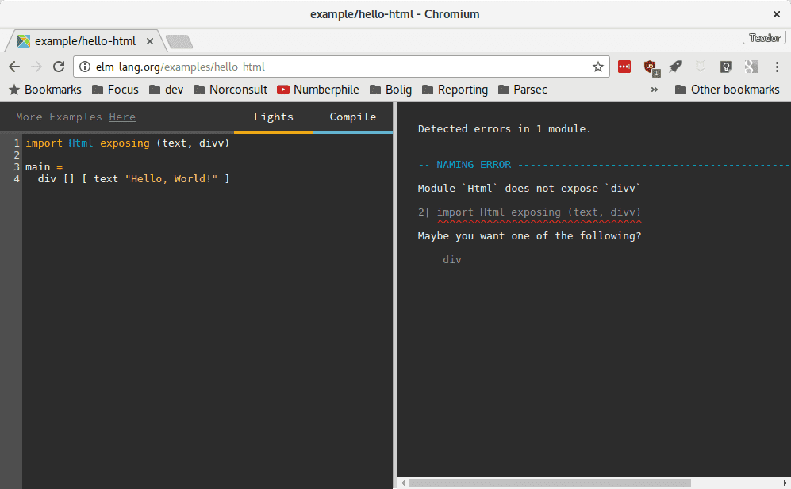

# Introduksjon {.intro}

Denne oppgaven er en lett omvisning til Elm. Vi skal se på hva Elm egentlig er
før vi laster ned og installerer en masse ting, så det eneste vi trenger er en
nettleser.

Elm kjører i nettleseren. I nettleseren viser vi fram ting med noe som heter
HTML. Det er viktig å forstå hva HTML er.
[Gjør oppgaven Hvor er HTML? Jeg ser den ikke!](../../web/hvor_er_html/hvor_er_html.html)
i Web-kurset først om du ikke har hørt om HTML før.

# Hei, verden! {.activity}

- [ ] Åpne nettsiden [Try Elm](http://elm-lang.org/try). Denne ser slik ut:

    

- [ ] Trykk på **Hello, World!** til høyre, så får vi se et enkelt Elm-program:

    

    Hmm! Det gjorde ikke så mye. Skrev kun ut "Hello, World!" La oss gjøre det
    litt mer spennende, og lære Elm norsk. Jeg heter Teodor, så jeg endrer
    programmet til følgende:

    ```elm
    import Html exposing (text)

    main =
      text "Hei, Teodor! Godt å se deg!"
    ```

    Hva heter du? Hva vil du programmet skal skrive ut til deg?

    Trykk `Compile` for å se!

# Dokumenter i HTML og Elm {.protip}

HTML og Elm bygger opp dokumenter som et **tre**. Det betyr at elementer kan
være inne i andre elementer. Eksempel:

* `div`
    * `h1`: Stor overskrift
    * `p`: Første avsnitt.
    * `p`: Andre avsnitt.

`div`-elementet inneholder tre elementer: `h1`, `p` og `p`.

Dette ser slik ut i HTML:

```html
<div>
  <h1>Stor overskrift</h1>
  <p>Første avsnitt.</p>
  <p>Andre avsnitt.</p>
</div>
```

og slik ut i Elm:

```elm
div []
  [ (h1 [] [text "Stor overskrift"])
  , (p [] [text "Første avsnitt."])
  , (p [] [text "Andre avsnitt."])
  ]
```

Vi kommer tilbake til hva `[]` betyr.

# Hva vil du lage? {.activity}

Tenk på hva du vil lage, og skriv svaret med Elm!

* Vil du lage webapplikasjon?
* Vil du lage spill?
* Hvem skal bruke appen/spillet ditt?

## Når noe går feil {.protip}

Obs! Elm sier ifra når du skriver noe Elm ikke skjønner. Hvis jeg skriver `div`
feil, får jeg en feilmelding:



Når noe ikke fungerer, les feilmeldingen og se om den kan hjelpe deg å rette
feilen!

* ``Module `Html` does not expose `divv` `` betyr at Html-modulen ikke
  inneholder noen funksjon som heter `divv`.
* `Maybe you want one of the following? div` foreslår å bruke `div` i stedet.
  Kanskje det var hva du mente?

# Hva har andre laget? {.activity}

Nå som du har tenkt litt på hva du vil lage, la oss se på hva andre har laget.

Åpne [elm-lang.org/try](http://elm-lang.org/try). Ser du eksemplene til høyre?

Oppdater siden for å få tilbake koden som den var før du begynte å redigere den.

- [ ] Åpne **Buttons**.
    - Kan du endre teksten på knappene til "Mer!" og "Mindre!"?
    - Kan du få pluss-knappen til å legge til 5 hver gang du trykker?
- [ ] Åpne **Clock**.
    - Kan du gjøre viseren kortere?
    - Kan du gjøre viseren rosa?

      Viseren har fra før av fargen `#023963`. En rosafarge kan være `#F0F`. Du
      kan finne andre farger med
      en [fargevelger](http://htmlcolorcodes.com/color-picker/). Vi har brukt
      **Hex**-koden til fargen.

Har du fått flere gode ideer til hva du vil gjøre?

- [ ] Oppdater Elm-dokumentet du lagde i stad med nye ideer!

# Jeg lurer på flere ting!

Elm har meget god dokumentasjon:

* Les i [guiden](https://guide.elm-lang.org/) når du vil lære noe nytt
* Søk i [referansen](http://package.elm-lang.org/) når du lurer på hva en
  funksjon gjør.
