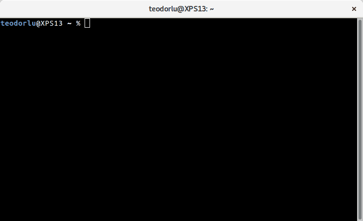

# Introduksjon {.intro}

Denne oppgaven innfører funksjoner, og viser hvordan vi kan skrive og test funksjoner i `elm repl`.

# Last ned Elm-plattformen {.activity}

Nå skal vi installere Elm på vår egen PC:

- [ ] Gå til [elm-lang.org/install](http://www.elm-lang.org/install) og last ned
  installasjonsfil til ditt operativsystem
- [ ] Klikk deg gjennom installasjonen

# Kommandolinjen {.protip}

Elm er et kommandolinjeprogram. Vi bruker Elm ved å skrive kommandoer. Hva
kommandolinjen heter er forskjellig fra operativsystem til operativsystem:

* Windows: CMD eller Command Prompt
* Mac: Terminal
* Linux: Terminal

Slik ser terminalen ut på Linux med vindusbehandleren Gnome:



# Kjør elm repl {.activity}

- [ ] Start kommandolinjen
- [ ] Kjør `elm repl` fra kommandolinjen

Prøv å gange sammen tall!

# Les-tolk-skriv-løkke {.protip}

REPL står for Read Eval Print Loop:

1. Les (Read) hva som kommer inn
2. Tolk (Eval) hva det betyr
3. Skriv (Print) ut svaret
4. ... og gjør klar for å kunne gjøre det på nytt (Loop)!

Eksempel på bruk:


# Utrykk i elm repl {.activity}

Artimetikk med Elm:

```elm
> 1 + 2
3 : number
> 6 * 7
42 : number
> 1000 - 1
999 : number
```

Skriver vi inn `1 + 2`, gir Elm tilbake `3 : number`. Svaret er `3`, som er et
tall (`number`).

- [ ] Regn ut 12345 * 6789 med Elm!
- [ ] Hva sier Elm når du prøver å dele på 0?

Vi bruker `=` til å binde verdier:

```elm
> x = 3
3 : number
> y = 4
4 : number
> z = x + y
7 : number
> largePrime = 67280421310721
67280421310721 : number
```

- [ ] Sett `birthYear` til året du er født
- [ ] Sett `currentYear` til året vi er i nå
- [ ] Hva blir `currentYear - birthYear`? Er det det samme som alderen din?
  Hvorfor/hvorfor ikke?

# Funksjoner {.protip}

* En funksjon sammenhengen mellom *input* og *output*:

Funksjonen `plus3` gir sammenhenger:
* `0` → `3`
* `7` → `10`

Funksjonen `double` gir sammenhenger:
* `-5` → `-10`
* `0` → `0`
* `15` → `30`

Dette er en elm-funksjon:

```elm
double x = x * 2
```

* `double` er funksjonsnavnet.
* `x` er navnet på verdien som kommer inn i funksjonen. Dette er funksjonens *parameter*.
* `x * 2` er resultatet til funksjonen.

# Funksjoner i elm repl {.activity}

La oss lage funksjonen `double`:

```elm
> double x = x * 2
<function> : number -> number
```

Elm forteller oss at `double` har type `number -> number` -- fra tall til tall.
Kan du se at `->` ser ut som en pil? `number -> number` skal se ut som `number`
→ `number`.

`double` forventer at vi putter inn tall, og lover å gi tall
tilbake.

```elm
> double -5
-10 : number
> double 0
0 : number
> double 15
30 : number
```

Vi bruker funksjonen ved å skrive funksjonsnavnet (`double`) etterfulgt av
argumentet (`5`).

- [ ] Hva er `double 123`?
- [ ] Hva er `double 7`?

`triple` er funksjonen som ganger med tre:

```elm
> triple 9
27 : number
> triple 100
300 : number
```

- [ ] Lag `triple`!
- [ ] Gir din `triple` det samme som min?

# Parametere og argumenter {.protip}

```elm
> double x = x * 2
<function> : number -> number
```

* En **parameter** er *navnet* vi gir verdiene som kommer inn funksjonen. `x` er en parameter.

```elm
> double 15
30 : number
```

* Et **argument** er *verdien* som kommer inn i funksjonen. `15` er et argument.
