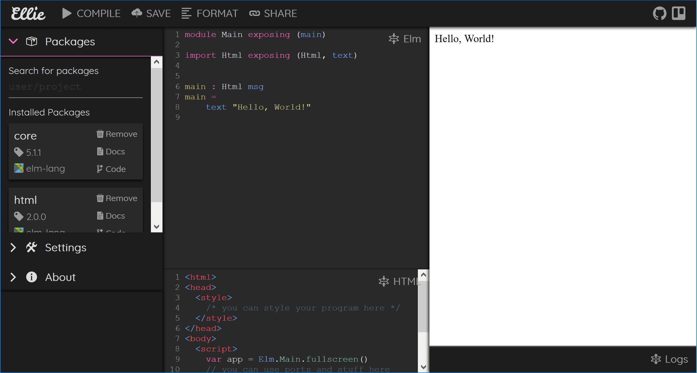

# Introduksjon {.intro}

Denne oppgaven innfører funksjoner, og viser hvordan vi kan skrive og teste
funksjoner i Ellie.


# Gjør deg kjent med Ellie {.activity}

Ellie er et online utviklermilø for Elm. Her kan du programmere Elm, uten at du
trenger å laste ned noe til pc'en din. Slik ser Ellie ut når du åpner den i en
web browser:



Nå skal vi gjøre oss kjent med Ellie.

- [ ] Gå til [https://ellie-app.com](https://ellie-app.com) Dette vil starte
  Ellie i nettleseren, med et enkelt Elm kodeeksempel.

- [ ] Klikk på *Compile*, for å kjøre koden som viser i den midterse delen av
  vinduet. Resultatet vil vise på høyre side.


# Lagre {.protip}

Du kan lagre prosjektene du jobber med i Ellie ved å klikke `Save`, eller `Fork`
om det er et Ellie prosjekt noen har delt med deg. Dette gir deg en unik link
til den nåværende versjonen av prosjektet. Du må selv ta vare på linken for å
kunne gå tilbake til prosjektet senere.


# Elm som en kalkulator {.activity}

Elm kan brukes som en kalkulator. Vi kan regne ut et tall og vise tallet som en
nettside. For å vise et enkelt tatt på en nettside:

```elm
module Main exposing (main)
import Html exposing (Html, text)

main = text (toString (9001))
```

Elm kan også regne!

```
module Main exposing (main)
import Html exposing (Html, text)

main = text (toString (100 + 9 * 9))
```

Siden Elm programmer kjører i en web side, må koden vår returnere noe som kan
vises av web browseren. Vi bruker her funksjonene `toString` og `text` til å
konvertere resultatet av utregningen vår til noe som kan vises i browseren.

- [ ] Gå til

      [https://ellie-app.com/HFJ7WyCctja1](https://ellie-app.com/HFJ7WyCctja1)

      for et eksempel utrykk.

- [ ] Kjør eksempelkoden.

- [ ] Bytt ut utrykket i koden med forskjellige utrykk hvor med `+`, `-`, `*`,
  og `/`.

Skriver vi inn `1 + 2`, viser resultatet `3` på høyre side. I praksis er det en
Html struktur vi har generert, med en text node som har verdien "3".

- [ ] Regn ut 12345 * 6789 med Elm!

- [ ] Hva sier Elm når du prøver å dele på 0?

Vi bruker `=` til å binde en verdi til et symbol. Det kan vi gjøre i et `let`
utrykk. Det består av to deler, en `let` del hvor vi binder en eller flere
verdier til symbolske navn, og en `in` del, hvor vi bruker verdiene i et utrykk.
Resultatet av dette utrykket blir returnert som verdien av hele `let` utrykket.

```elm
module Main exposing (main)
import Html exposing (Html, text)

main = text (toString math)

math =
    let
        x = 3
        y = 4
    in
        x + y
```

- [ ] Gå til

      [https://ellie-app.com/HFMtv2Gw2ma1](https://ellie-app.com/HFMtv2Gw2ma1)

      og kjør eksempelet.

- [ ] Prøv med forskjellige utrykk og bindinger.

- [ ] Sett `birthYear` til året du er født

- [ ] Sett `currentYear` til året vi er i nå

- [ ] Hva blir `currentYear - birthYear`? Er det det samme som alderen din?
  Hvorfor/hvorfor ikke?


# Funksjoner {.protip}

* En funksjon gir sammenhengen mellom *input* og *output*:

Funksjonen `plus3` gir sammenhenger:

* `0` → `3`

* `7` → `10`

Funksjonen `double` gir sammenhenger:

* `-5` → `-10`

* `0` → `0`

* `15` → `30`

Dette er en elm-funksjon:

```elm
double x = x * 2
```

* `double` er funksjonsnavnet.

* `x` er navnet på verdien som kommer inn i funksjonen. Dette er funksjonens
  *parameter*.

* `x * 2` er resultatet til funksjonen.


# Funksjoner i Ellie {.activity}

La oss lage funksjonen `double`:

```elm
module Main exposing (main)
import Html exposing (Html, text)

main = text (toString math)

math = double 2

double x = x * 2
```

Vi må fortsatt ha litt ekstra kode for å kunne vise resultatet av å kalle
funksjonen vår. Vi definerer `main` som en funksjon også, og det er denne som
blir kjørt når siden vår lastes.

I elm kan vi også fortelle kompilatoren vår hvilke typer *input* og *output* til
en funksjon har. Som regel vil Elm-kompilatoren selv finne ut av det, men om vi
legger til type informasjon kan kompilatoren sammenligne typene vi har sagt
funksjonen omhandler med hva den selv finner ut, og gi oss gode feilmeldinger
når det ikke stemmer overens.

Denne `double` funksjonen for eksempel, tar inn en `x` som er et tall, og
returnerer `x * 2` som er et nytt tall. Typen for tall i Elm heter `number` og
typen til funksjonen blir dermed `number -> number` -- fra tall til tall. Kan du
se at `->` ser ut som en pil? `number -> number` skal se ut som `number` →
`number`.

Vi kan legge til typeinformasjonen slik:

```elm
module Main exposing (main)
import Html exposing (Html, text)

double : number -> number
double x = x * 2

main = text <| toString <|
    double 4
```

Vi sier da at `double` er en funksjon som forventer at vi putter inn tall, og
lover å gi tall tilbake.

Vi bruker funksjonen ved å skrive funksjonsnavnet (`double`) etterfulgt av
argumentet. F.eks(`double 4`) for å kalle funksjonen med argumentet 4.

- [ ] Hva er `double 123`?

- [ ] Hva er `double 7`?

`triple` er funksjonen som ganger med tre:

* `triple 9` → `27`

* `triple 100` → `300`

- [ ] Lag `triple`!

- [ ] Gir din `triple` det samme som min?


# Parametere og argumenter {.protip}

```elm
double : number -> number
double x = x * 2
```

* En **parameter** er *navnet* vi gir verdiene som kommer inn funksjonen. `x` er
  en parameter.

```elm
double 15
```

* Et **argument** er *verdien* som kommer inn i funksjonen. `15` er et argument.
