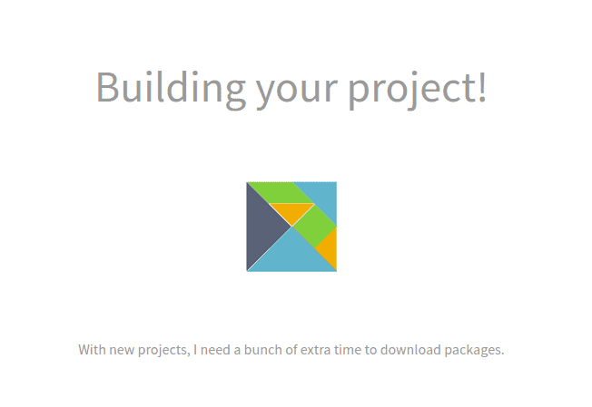

# Introduksjon {.intro}

Denne oppgaven innfører moduler, som lar oss bruke kode som andre har skrevet.
Når vi forstår moduler, er vi klare for `elm reactor`, som viser oss en
webapplikasjon vi har skrevet i vår egen fil.

Før du starter, må du ha gjennomført innstallasjonen
i [oppgave 2](../02_funksjoner_elm_repl/02_funksjoner_elm_repl.html).

# Lag din egen nettside! {.activity}

## Aktiviteter {.check}
- [ ] Åpne en **teksteditor**, for eksempel teksteditoren [Atom](http://atom.io), [Brackets](http://brackets.io/) eller [Notepad++](https://notepad-plus-plus.org/).
- [ ] Lag en ny fil.
- [ ] Fyll inn dette i filen:

```elm
import Html

main = Html.text "Hei, verden!"
```

- [ ] Lagre filen til filnavnet `hei.elm`.

For å se nettsiden i en nettleser, må vi først gjøre om nettsiden vår til HTML. HTML er språket som forteller en nettleser om hvordan en nettside skal se ut. Se [web-kurset](../../web/index.html) for å lære mer om HTML og nettsider.

- [ ] Om du har gjort [oppgave 2](../02_funksjoner_elm_repl/02_funksjoner_elm_repl.html), kan du nå åpne kommandolinjen og skrive inn ```elm reactor```:

```
elm-reactor 0.18.0
Listening on http://localhost:8000/
```

Det betyr at Elm venter på at du skal åpne http://localhost:8000/ i en nettleser. Finn så igjen filen `hei.elm`.


Første gang du åpner filen, vil du få opp dette vinduet:



Nå leser Elm gjennom filen din og gjør den om til vanlig HTML!

- [ ] Hvordan ser nettsiden din ut?
- [ ] La oss gjøre en endring.
  - Endre `"Hei, verden!"` til `"Hei, alle sammen!"`
  - Lagre filen
  - Last nettleseren på nytt.
  - Skjedde det noe?

## Ting du kan prøve {.challenge}
- [ ] For å åpne forskjellige programmer direkte fra nettsiden din, kan du skrive nettadressen slik: ```localhost:8000/hei.elm```. Bare bytt ut filnavnet!
- [ ] Hva skjer når du åpner ```hei.elm``` direkte i nettleseren?

# Når noe går galt {.activity}

Elm prøver så godt den kan å hjelpe oss å skrive korrekte programmer. Når vi har gjort noe rart, sier den ifra. Endre `oppgave1a.elm` til følgende:

```elm
import Html

main = Html.taxt "Hei, verden!"
```

Elm svarer følgende:

```
Cannot find variable `Html.taxt`.

3| main = Html.taxt "Hei, verden!"
          ^^^^^^^^^
`Html` does not expose `taxt`. Maybe you want one of the following?

    Html.text
```

Dette betyr:

- Jeg vet ikke hva `Html.taxt` betyr
- Du prøvde å bruke `Html.taxt` på linje 3
- Kanskje du mente å skrive `Html.text`?

# Del nettsiden opp i moduler {.activity}

- [ ] Lag en ny fil og kall den `Knapper.elm`

Denne filen er akkurat lik nettsiden vår i forrige oppgave. Men denne gangen vil vi at andre skal kunne bruke den på deres nettsider. Da må vi starte med å fortelle at denne filen skal være en *modul*.

- [ ] Skriv inn dette i starten av filen:
```elm
  module Knapper exposing (..)
```

Filen `Knapper.elm` inneholder nå en modul kalt `Knapper`!

- [ ] Prøv å åpne `localhost:8000/Knapper.elm`

Dette gir oss en feilmelding. Modulen vår inneholder ingenting ennå!

- [ ] Legg til en knapp i modulen:

```elm
  module Knapper exposing (..)
  import Html exposing (button, text)

  okKnapp = button [] [text "Ok!"]
```

`import Html exposing (button, text)` importerer *Html-modulen*, som gjør at vi kan bruke Html-elementer i modulen vår. Siden vi skal bruke elementene `button` for å lage en knapp og `text` for å legge tekst på knappen, må vi legge til `(button, text)` når vi importerer Html-modulen.

- [ ] Legg til den nye knappen i filen fra forrige oppgave

```elm
import Knapper

main = Knapper.okKnapp
```

På samme måte som vi importerer Html-elementer med `import Html`, kan vi importere våre egne elementer med `import Knapper`. `okKnapp` er en del av modulen `Knapper`, på samme måte som at `text` er en del av Html-modulen. Så vi kan skrive `Knapper.okKnapp` for å lage en okKnapp.

- [ ] Legg til en ekstra stilig knapp

```elm
  module Knapper exposing (..)
  import Html exposing (button, text)
  import Html.Attributes exposing (..)

  okKnapp = button [] [text "Ok!"]
  stiligKnapp = button [styling] [text "Stilig!"]

  styling =
    style
      [ ("border-radius", "100%")
      , ("padding", "10px")
      , ("font-size", "5em")
      , ("text-align", "center")
      , ("background", "red")
      , ("color", "blue")
      ]
```

- [ ] Bytt ut `okKnapp` med `stiligKnapp` og se hva som skjer
- [ ] Legg til flere egne knapper i modulen
