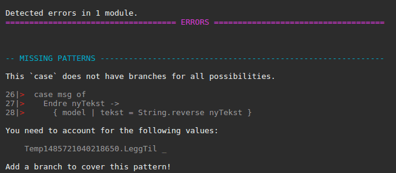
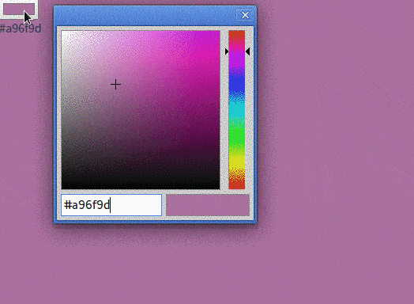

# Introduksjon {.intro}

Input-felter lar brukere skrive inn tekst, tall, datoer og så videre i nettsiden vår. Informasjonen vi får fra brukerne kan vi endre, skrive ut, og kombinere med annen informasjon.

# Hente tekst fra brukeren {.activity}

## Moduler og program {.check}

- [ ] Øverst i koden vår må vi si hvilke *moduler* vi skal bruke

```elm
import Html exposing (Html, Attribute, beginnerProgram, text, div, input, button)
import Html.Attributes exposing (..)
import Html.Events exposing (onInput, onClick)
import String
```

## Modell, meldinger og oppdatering {.check}

- [ ] Vi oppretter programmet vårt med en *modell* som inneholder data (`model`), et *brukergrensesnitt* hvor vi viser frem data (`view`) og en funksjon for *oppdatering* av data (`update`). Vi kommer tilbake til hvordan vi oppretter disse, skriv inn følgende i koden:

```elm
main =
  beginnerProgram { model = "", view = view, update = update }
```

- [ ] Så trenger vi å si hva slags *meldinger* (`Msg`) vi skal sende i programmet. Til å begynne med har vi bare én meldingstype, og det er meldingen som sendes når brukeren endrer teksten i input-feltet, her kaller vi den for `Endre`.

```elm
type Msg = Endre String
```

- [ ] Etter det må vi skrive hva som skal skje når teksten oppdateres med en *update*-funksjon:

```elm
update msg model =
  case msg of
    Endre tekst ->
      tekst
```

Nå hentes bare teksten inn, og sendes rett ut igjen. Det er kanskje litt rart, når funksjonen vår heter `Endre`? La oss endre teksten!

For å endre teksten, kan vi bruke innebygde funksjoner i `String`-modulen.

## Skriv ut teksten {.check}
- [ ] Til slutt må vi ha et sted som viser teksten, da bruker vi et *view*:

```elm
view model =
  div []
    [ input [ placeholder "Baklengstekst", onInput Endre ] []
    , div - [ ] [ text model ]
    ]
```

`input [ placeholder "Baklengstekst", onInput Endre ] []` er det som blir til et input-felt. Teksten etter `placeholder` sier hva som skal stå i feltet før brukeren skriver inn noe. `onInput` sier hva som skal skje når brukeren skriver inn tekst. I vårt tilfelle sender vi en `Endre`-melding som hentes inn i `update`-funksjonen. Når brukeren skriver inn "Teodor", sendes en melding av typen `Endre "Teodor"` inn i `update`-funksjonen.

Setter vi alle delene sammen, vil koden vår se slik ut:

```elm
import Html exposing (Html, Attribute, beginnerProgram, text, div, input)
import Html.Attributes exposing (..)
import Html.Events exposing (onInput)
import String


main =
  beginnerProgram { model = "", view = view, update = update }


-- UPDATE

type Msg = Endre String

update msg model =
  case msg of
    Endre tekst ->
      String.reverse tekst


-- VIEW

view model =
  div []
    [ input [ placeholder "Baklengstekst", onInput Endre ] []
    , div - [ ] [ text model ]
    ]
```
### Kommentarer {.protip}

I koden over har vi skrevet `-- UPDATE` og `-- VIEW`. Det har vi gjort for å gjøre koden mer strukturert og lesbar. Alle linjer som starter med to bindestreker (--) ignoreres i Elm. Dette er hva vi kaller kommentarer! Kommentarer er ment for menneskene som leser koden, enten deg selv eller de du samarbeider med.

# Lag en setning {.activity}

## Ny modell {.check}

Nå skal vi lagre en setning i tillegg til teksten som brukeren skriver inn. Da må vi endre *modellen* vår. Den nye modellen skal se slik ut:
```elm

-- MODEL
model =
  {
    tekst = ""
  , setning = ""
  }

```

Her kan vi se at modellen inneholder to tekster, som er tomme når man åpner nettsiden.

Oppdater også programmet slik at vi bruker den nye modellen:

```elm
main =
  beginnerProgram { model = model, view = view, update = update }
```

## Oppdater {.check}

Nå skal vi gjøre det mulig å lagre baklengstekstene i en setning med mellomrom mellom hvert ord. Da må vi endre `update` slik at den kan ta inn tekst og legge den til i `setning` i modellen vår:

```elm
-- UPDATE

type Msg = Endre String | LeggTil String

update msg model =
  case msg of
    Endre nyTekst ->
      { model | tekst = String.reverse nyTekst }
    LeggTil nyTekst ->
      { model | setning = model.setning ++ " " ++ nyTekst  }
```

`Msg` forteller oss hva slags input-meldinger vi kan ta imot fra nettsiden vår. Tidligere hadde vi bare `Endre`-funksjonen for når noen skriver inn tekst, nå har vi også `LeggTil`-funksjonen som gjør det mulig å legge til teksten i en setning.

Vi må også oppdatere `update` med hva som skal skje når den får inn melding av typen `LeggTil`. Om vi ikke gjør det, vil Elm gi beskjed:


## Ny knapp {.check}

Nå mangler vi bare en knapp for å legge til tekst i setningen:

```elm
-- VIEW

view model =
  div []
    [ input [ placeholder "Baklengstekst", onInput Endre ] []
    , button [ onClick (LeggTil model.tekst) ] [ text "Legg til" ]
    , div - [ ] [ text model.tekst ]
    , div - [ ] [ text model.setning ]
    ]
```

`onClick` bestemmer hva som skal skje når brukeren trykker på knappen. Her *kaller* vi funksjonen `LeggTil` og sender med teksten som ligger i modellen vi lagde tidligere.

Programmet vårt ser slik ut med den nye knappen:

```elm
import Html exposing (Html, Attribute, beginnerProgram, text, div, input, button)
import Html.Attributes exposing (..)
import Html.Events exposing (onInput, onClick)
import String


main =
  beginnerProgram { model = model, view = view, update = update }

-- MODEL
model =
  {
    tekst = ""
  , setning = ""
  }

-- UPDATE

type Msg = Endre String | LeggTil String

update msg model =
  case msg of
    Endre nyTekst ->
      { model | tekst = String.reverse nyTekst }
    LeggTil nyTekst ->
      { model | setning = model.setning ++ " " ++ nyTekst  }


-- VIEW

view model =
  div []
    [ input [ placeholder "Baklengstekst", onInput Endre ] []
    , button [ onClick (LeggTil model.tekst) ] [ text "Legg til" ]
    , div - [ ] [ text model.tekst ]
    , div - [ ] [ text model.setning ]
    ]
```

## Ting du kan prøve {.challenge}
- [ ] Utvid nettsiden med en knapp som snur alle ordene i setningen tilbake til rett vei
- [ ] Tekst kan manipuleres med mange forskjellige innebygde funksjoner som `String.repeat` (gjenta en tekst), `String.toUpper` (gjør alle BOKSTAVENE TIL STORE BOKSTAVER)
- [ ] Se full liste av hva man kan gjøre med tekst [i dokumentasjonen (på engelsk)](http://package.elm-lang.org/packages/elm-lang/core/5.1.1/String)

# Fargevelger {.activity}

Det finnes mange forskjellige type input-felter. Til nå har vi sett på tekst-input, men vi har også muligheten til å bare ta inn tall. I denne oppgaven skal vi lage en fargevelger. Farger på nettsider defineres som oftest i grader av rød, grønn og blå. Hver farge har en verdi fra 0 til 255.

Vi skal lagre tre verdier i modellen vår, rød, grønn og blå i feltene `rod`, `gronn` og `blaa`.

- [ ] Legg til det første feltet i modellen vår, `rod`:

```elm
import Html exposing (Html, Attribute, beginnerProgram, text, div, input)
import Html.Attributes exposing (..)
import Html.Events exposing (onInput)
import String

main =
  beginnerProgram { model = model, view = view, update = update }

-- MODEL
model =
  {
    rod = ""
  }
```

- [ ] Lagre rødstyrken fra en input, men begrens rekkevidden fra 0 til 255 med `Html.Attributes.min` og `Html.Attributes.max`:

```elm
input [ type_ "number", Html.Attributes.min "0", Html.Attributes.max "255" ] []
```

Vi trenger også å håndtere bruker-input, slik som i forrige oppgave

- [ ] Legg til koden som mangler:

```elm
import Html exposing (Html, Attribute, beginnerProgram, text, div, input)
import Html.Attributes exposing (..)
import Html.Events exposing (onInput)
import String

main =
  beginnerProgram { model = model, view = view, update = update }

-- MODEL
model =
  {
    rod = ""
  }

-- UPDATE

type Msg = EndreRod String

update msg model =
  case msg of


-- VIEW

view model =
  div [ style [("height", "100%"), ("background", "rgb(255, 255, 255)")] ]
    [ input [ type_ "number", Html.Attributes.min "0", Html.Attributes.max "255" ] []
    , div [] [ text model.rod ]
    ]
```

- [ ] Legg til input-felter for de to andre fargene, og meldingene `EndreGronn` og `EndreBlaa`
- [ ] Oppdater `rgb(255, 255, 255)` slik at den bruker verdiene for rød, grønn og blå fra modellen vår (hint: slå sammen tekst)
- [ ] Bytt ut number-input med `range`, og se hva som skjer!

## Innebygd fargevelger {.check}



Chrome, Edge, Firefox og Opera er nettlesere som kommer med innebygd fargevelger. Fargevelger er også en type input-felt.

- [ ] Lag en ny type input på nettsiden, som bruker fargevelger-type istedenfor `range` (hint: på engelsk er farge `color`)
- [ ] Bytt ut verdien for `background` med fargen fra fargevelgeren (husk å legge til fargen i modellen og i `update`)
