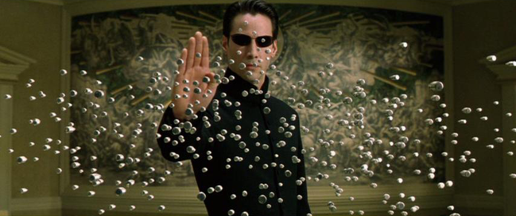

# Introduksjon {.intro}

Så langt har dere lært å _skrive egen kode_. Å lære å skrive kode krever mye
trening for å bli god.

Det er også viktig å kunne _lese_ kode. Da lurer vi på ting som

- Hvor finner jeg andres kode?
- Hvordan kjører jeg andres kode?
- Hvor begynner jeg når jeg skal finne ut hvordan ting henger sammen?
- Hva skjer om jeg endrer på _dette_?

Til dette bruker vi spillet Elm Joust, skrevet av Stefan Kreitmayer fra
Tyskland.

# Steg 1: Hvordan fungerer spillet? {.activity}

Før vi reprogrammerer spillet, skal vi ha det litt gøy, og finne ut hvordan det
henger sammen.

## Spill! {.check}

- [ ] Gå til [spillsiden til Elm Joust](http://kreitmayer.com/elm-joust/)
- [ ] Finn en partner å prøve spillet sammen med. Det er OK å være tre personer og
  bytte på hvilke to som spiller.
- [ ] Hvor mange serier må man vinne for å vinne et spill?

Har du spilt litt? Ti minutter er passe tid.

## Hvordan tegnes ballen? {.check}

Nå skal vi se på hvordan spillet er bygget opp.

- [ ] Start spillet
- [ ] Inspiser den ene ballen

## Hvordan inspisere? {.protip}

Oppgaven "Hvor er HTML? Jeg ser den ikke!" under Web-kategorien går gjennom
hvordan vi kan inspisere elementer på en nettside. Ta en titt her hvis du
trenger!

## Hvordan tegnes det andre? {.check}

Først skal vi se på selve spillet.

- [ ] Hva slags SVG-element er brukt til å tegne ballene?
- [ ] Hva slags SVG-element er brukt til å tegne plattformen?
- [ ] Hva slags SVG-element er brukt til å tegne stillingen?

Finn `svg`-taggen.

- [ ] Hva er `width` og `height`?

Gjør vinduet ditt større eller mindre.

- [ ] Hva er nå `width` og `height`?

## Svg i Elm og i nettleseren {.protip}

Som i Html ser Svg forskjellig ut i Elm og i Nettleseren.

Slik ser det ut i **Elm**:

```elm
circle
  [ cx "240"
  , cy "361.6"
  , r "28.799999999999997"
  , fill "rgba(255,255,255,.5)"
  ]
  - [ ]
```

Slik ser det ut i **Nettleseren**:

```html
<circle
  cx="240"
  cy="361.6"
  r="28.799999999999997"
  fill="rgba(255,255,255,.5)">
</circle>
```

# Steg 2: Last ned og kjør spillet lokalt {.activity}

Elm Joust er et større Elm-program enn programmene vi har skrevet til nå. Når vi
skriver store programmer, deler vi dem ofte i flere filer for å holde orden. Til
programmer skrevet i flere filer, holder ikke Try Elm, og vi må kjøre programmet
på egen PC.

## Last ned kildekoden {.check}

- [ ] Gå til https://github.com/teodorlu/elm-joust, og trykk på den grønne knappen
  **Clone or download**.

Du kan bruke `git` i stedet hvis du vil.

## Pakk ut kildekoden {.check}

- [ ] Høyreklikk på zip-filen du lastet ned og velg **Pakk ut...** eller liknende.

## Åpne kommandovindu i mappen der kildekoden ligger {.check}

- [ ] Gå til mappen der du pakket ut filene.
- [ ] Åpne et kommandovindu her.

  På **Windows** kan du holde inne Shift (pil opp for å lage store bokstaver),
  **høyreklikke** og velge **Åpne kommandovindu her** eller tilsvarende.

  På **Linux** kan ofte du **høyreklikke** og velge **Open in Terminal**.

## Bygg programmet {.check}

For små Elm-programmer bruker vi Elm Reactor for å bygge programmet mens vi
utvikler. Elm Joust er et større program, og vi må bruke et *byggscript*. Vi
bruker et *byggscript* til å ta Elm-kode og lage en nettside av den.

- [ ] Kjør byggscriptet ved å skrive `build.bat` eller `./build.sh` i
  kommandovinduet.

  På **Windows** heter byggscriptet `build.bat`.

  På **Mac** og **Linux** heter byggscriptet `build.sh`.

## Åpne spillet i nettleseren {.check}

Nå kan vi kjøre spillet.

- [ ] Åpne `index.html` i nettleseren.

Prøv spillet igjen!

- [ ] Fungerer det likt som i nettleseren?

## Om å bygge programmer fra kildekode {.protip}

Når vi utvikler programmer lager vi først kildekoden. Med kildekoden kan vi
bygge og teste programmet.

Vi tester programmet vårt for å se at det fungerer før vi sender det til andre.
Når vi bygger Elm Joust direkte fra kildekoden, får vi den _aller siste_
versjonen av programmet, som ikke alltid er grundig testet.

Å bygge programmer vi skal bruke fra kildekode er lærerikt, men kan være
vanskelig.


# Steg 3: Endre reglene {.activity}



_Neo liker også å endre reglene_

## Kontroller tyngdekraften {.check}

Et søk i kildekoden viser at funksjonen `gravity` er definert i `src/Update.elm`
på linje 202.

- [ ] Senk tyngdekraften. Hva gjør det med spillet? Liker du det?
- [ ] Øk tyngdekraften. Bedre? Mer kjedelig?

## Fysikk {.protip}

Reglene for hvordan objekter beveger seg heter **Fysikk**. Når du justerer
tyngdekraften i spillet, endrer du på _fysikken_ i spillet.

Andre fysikkregler:

- Når ballene treffer hverandre, spretter de tilbake i hver sin retning
- Du faller nedover
- Du kan kun hoppe når du står på bakken

Noen ting blir mer morsomme når vi ikke følger fysikken! I dette spillet kan vi
styre ballen _når den er i lufta_. Dette er svært vanskelig å få til, og fjerner
vi luften ("om vi er i _vakum_"), er det helt umulig!

## Endre fargene {.check}

Spillet slik det er nå er meget ... grått.

<!-- TODO image grey -->

Funksjonen `renderPlayer` er definert i `src/View.elm`, på linje 137. Ser du
kallet til Svg.circle?

- [ ] Bytt ut fyllfargen til sirkelen med fargerik farge!

  "#FF69B4" gir en skarp rosa. Du vil kanskje ha noe annet?

Men! Nå blir begge spillerene våre like rosa (eller en annen farge?). Dette
fikser vi ved å legge til en ny parameter på funksjonen vår.

Farger representeres som _Tekst_ i Elm, på engelsk **String**.

- [ ] Endre funksjonsdeklarasjonen til

  ```elm
  renderPlayer : (Int,Int) -> Player -> String -> Svg Msg
  renderPlayer (w,h) {position} color =
  ```

- [ ] Kjør byggscriptet. Hvorfor kompilerer ikke programmet?

  Hvor brukes funksjonen `renderPlayer`? Må vi fikse noe her?

  Når jeg søker etter `renderPlayer`, får jeg flere match: _linje 79_, _linje
  80_, _linje 99_, _linje 136_ og _linje 137_.

- [ ] Når du får koden til å kjøre, er fremdeles spillerene grå? Må vi endre på
  funksjonen `renderPlayer` også? Hvor settes fargen til sirkelen?

<!-- TODO image colorized :D -->

## Juster tiden {.check}

Et søk etter "time" finner funksjonen `steerAndGravity` i `src/Update.elm`.
Dette er signaturen til `steerAndGravity`:

```elm
steerAndGravity : Time -> Ui -> Player -> Player
steerAndGravity delta {pressedKeys} ({velocity} as player) =
```

Ah! `delta`, av type `Time`! Jeg gjetter at denne er tiden mellom hver gang
spillet oppdateres.

Hvor kaller vi `steerAndGravity`? Jeg fant disse to linjene:

```elm
          player1 = scene.player1 |> steerAndGravity delta ui
          player2 = scene.player2 |> steerAndGravity delta ui
```

- [ ] Skru opp farten på spillet -- få tiden til å gå fortere!

  Hint: juster `delta`.

- [ ] Sett forskjellig fart på de to spillerene. Er det fordel å ha rask tid eller
  sakte tid?

## Søke i kildekode {.protip}

Trykk `Control + F` i editoren din. Kommer det opp et søkefelt? Prøv å skriv i
det. Matcher det ordet du skriver i kildekoden?

Søk er veldig nyttig for å navigere rundt i kode som andre har skrevet. I din
egen kode kan du ofte huske litt av hvordan du har gjort ting. I andres kode er
det vanskelig å vite hvor ting ligger!

## Sprettball! {.check}

Når ballene treffer hverandre, må vi regne ut ny fart for begge ballene. Et søk
etter "collision" finner `handleCollisions` i `Update.elm`.

- [ ] Kan du få til ordentlig sprett i kollisjonene?

Hmm, spillet ville vært litt urettferdig om en ball var tung som en elefant, og
den andre kun var en liten tennisball.

- [ ] Kan du gjøre så spiller én er tung, og spiller to lett?

# Steg 4: gjett hvilken regel! {.activity}

Nå har du laget din helt egne versjon av Elm Joust.

- [ ] Finn en partner som du kan spille spillet ditt med.
- [ ] Klarer partneren din å gjette hvilke regler du har endret?
