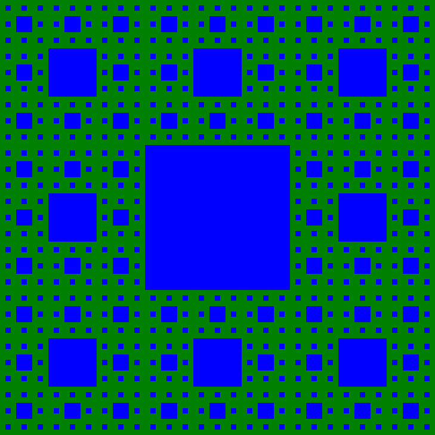

# Introduksjon {.intro}

En fraktal er en geometri med et mønster som gjentar seg selv inne i seg selv.
Høres ikke det rart ut? I denne oppgaven skal vi lage våre egne.

Her er Sierpinski-teppet, som er en fraktal:


# Steg 1: Hvordan fungerer Sierpinski? {.activity}

Fraktaler følger tre regler:

- **Startregelen** gir hvor vi skal starte. Med en firkant? En trekant? En
  strek?
- **Tegneregelen** gir hvordan vi skal tegne på nivået vi er. Fargelegge en bit
  av firkanten? Splitte en strek i to?
- **Rekursjonsregelen** deler opp figuren vår i mindre biter, som vi kjører på
  nytt i. Lager firkanten vi tegnet nye firkanter? Lager streken vi tegnet nye
  streker? Gjenta for hver strek.

## Sjekkliste {.check}

Gå til [Wikipedia-artikkelen](https://en.wikipedia.org/wiki/Sierpinski_carpet)
til Sierpinski-teppet. Se på animasjonen.

- [ ] Hvordan er teppet før det begynner å bli fargelagt? Dette er **startregelen**.
- [ ] Hva tegner vi i hver firkant? Dette er **tegneregelen**.
- [ ] Hvordan gjentas regelen? Dette er **rekursjonsregelen**.

Se på figurene under avsnittet **Process**. Ser du at noe gjentar seg?

# Steg 2: Tegne kvadrater med SVG {.activity}

Nå skal vi begynne å tegne kvadratene teppet:

<svg width="500" height="500" viewBox="0 0 27 27"><rect x="0" y="0" width="27" height="27" fill="blue"></rect><rect x="9" y="9" width="9" height="9" fill="green"></rect><rect x="3" y="3" width="3" height="3" fill="green"></rect><rect x="12" y="3" width="3" height="3" fill="green"></rect><rect x="21" y="3" width="3" height="3" fill="green"></rect><rect x="3" y="12" width="3" height="3" fill="green"></rect><rect x="21" y="12" width="3" height="3" fill="green"></rect><rect x="3" y="21" width="3" height="3" fill="green"></rect><rect x="12" y="21" width="3" height="3" fill="green"></rect><rect x="21" y="21" width="3" height="3" fill="green"></rect></svg>

Ett kvadrat kan vi tegne slik:

```elm
import Svg exposing (svg, rect)
import Svg.Attributes exposing (width, height, viewBox, fill, x, y, width, height)


main =
    svg
      [ width "500", height "500", viewBox "0 0 27 27" ]
      [ rect [ x "0", y "0", width "27", height "27", fill "blue" ] - [ ]
      , rect [ x "9", y "9", width "9", height "9", fill "green" ] - [ ]
      ]
```

<svg width="500" height="500" viewBox="0 0 27 27"><rect x="0" y="0" width="27" height="27" fill="blue"></rect><rect x="9" y="9" width="9" height="9" fill="green"></rect></svg>

## Sjekkliste {.check}

- [ ] Hvordan kan vi da tegne mange kvadrater?
- [ ] Hva bestemmer posisjonen til tallene?
- [ ] Hvor mange store grønne kvadrater har du tegnet?
- [ ] Hvor mange små grønne kvadrater har du tegnet?
- [ ] **Utvid koden til å tegne mange kvadrater**.

# Steg 3: Datastrukturer {.activity}

Kan du telle hvor mange kvadrater det finnes i Sierpinski-teppet? Ikke jeg
heller. Hmm, gidder vi da å skrive de maaaange linjene SVG for hånd? Nei, vi
programmerer!

Vi skal nå representere kvadrater med Records i Elm. Records lar oss lage _våre
egne typer_. Vi kommer til å lage en type for punkter og en type for kvadrater.

## Sjekkliste {.check}

Nå skal du få prøve å lese Elm sine egne læreressurser.

- [ ] Gå til [Elm-dokumentasjonen for records](http://elm-lang.org/docs/records).
  Finner du eksempelet for et punkt?

Vi legger til en liten snutt i programmet vårt:

```elm
import Html exposing (div, text, h1)

import Svg exposing (svg, rect)
import Svg.Attributes exposing (width, height, viewBox, fill, x, y, width, height)

myPoint =
    { x = 9
    , y = 3
    }

main =
    div []
      [ h1 [] [ text (toString myPoint) ]
      , svg
        [ width "500", height "500", viewBox "0 0 27 27" ]
        [ rect [ x "0", y "0", width "27", height "27", fill "blue" ] - [ ]
        , rect [ x "3", y "3", width "3", height "3", fill "green" ] - [ ]
        ]
      ]
```

Nå kan du endre `toString myPoint` for å skrive ut noe annet.

## Sjekkliste {.check}

- [ ] Skriv ut kun `x`-attributten til `myPoint`
- [ ] Lag et annet punkt, `yourPoint`. Velg koordinater og skriv ut dette i stedet.
- [ ] Lag et tredje punkt, `theirPoint`. Dette skal du lage _ut ifra `myPoint`_, men
  du skal bytte ut x-verdien med `0`. Se avsnittet **Updating Records** i guiden.

Nå skal vi ta steget videre og lage våre egne punkter.

**Husk!** Du kan bruke linjen `[ h1 [] [ text (toString yz) ]` til å teste
verdier.

- [ ] Les de to første eksemplene i avsnittet **Record types**.

Her finnes det allerede en `Point`-type vi kan bruke. Har du definert `myPoint`
og `yourPoint` på samme måte som det gjøres i guiden?

- [ ] Skriv inn `Point`-typen i programmet ditt
- [ ] Spesifiser at punktene dine skal være av typen `Point`:

  ```elm
  -- myPoint : Point betyr at myPoint skal være av type Point
  myPoint : Point
  myPoint = -- din tidligere løsning

  -- yourPoint : Point betyr at yourPoint skal være av type Point
  yourPoint : Point
  yourPoint = -- din tidligere løsning
  ```

Klager kompilatoren? Hvorfor/hvorfor ikke? Om den klager betyr det ikke at du
har gjort noe feil. Det bare at du og guiden lagde punkter på forskjellig måte.

- [ ] Utvid punktene dine med en z-verdi. Hva skjer når du kopilerer? Klarer du tyde
  feilmeldingen?
- [ ] Lag en ny type: `Point3D` som også har Z-verdi, og spesifiser at punktene dine
  skal være av denne typen:
  ```elm
  myPoint : Point3D
  -- ...
  ```

Dette får vi bruk for!

# Steg 4: Datastrukturer i datastrukturer {.activity}

I steg 3 bygget vi opp datastruktren `Point` fra to tall av typen `Float`.

Nå skal vi bruke får egen type, `Point`, til å bygge opp ett kvadrat.

## Desimaltall {.protip}

Obs! Her kommer det matte. Viktig for oss nå:

Kommatall i Elm har typen `Float`.

Dette har en forklaring:

Desimaltall i Elm har typen `Float`. Float er kort for _Floating point number_,
som på norsk er _flyttall_. Disse kalles flyttall fordi de har _flytende
presisjon_. Det betyr at vi kan ha et fast antall _siffer_ med nøyaktighet. Vi
kan også lage veldig store tall, som 1000 * 1000 * 1000 * 1000 * 10000

## Sjekkliste {.check}

- [ ] Hva må vi vite om et kvadrat for at vi skal kunne tegne det?
- [ ] Lag typen kvadrat: `type alias Square = -- ...`

Nå skal vi tegne kvadratet!

```elm
viewSquare square = -- ...
```

- [ ] Lag funksjonen `viewSquare`. Bruk `rect` fra SVG som du har brukt tidligere.

**Obs!** Når vi tegner kvadrater må vi bruke en farge. En måte å løse det på er
å ha en `color : String`-attributt på `Square`.

Her er hvordan jeg bruker min `viewSquare`:

```elm
start =
  { corner = { x = 0.0
             , y = 0.0
             }
  , width = 27.0
  , color = "blue"
  }

center =
  { corner = { x = 9.0
             , y = 9.0
             }
  , width = 9.0
  , color = "green"
  }


main =
    div []
      [ h1 [] [ text (toString start)
              , text (toString center)
              ]
      , svg
        [ width "500", height "500", viewBox "0 0 27 27" ]
        [ viewSquare start
        , viewSquare center
        ]
      ]
```

Dette blir seende slik ut på min PC:

<div>{ corner = { x = 0, y = 0 }, width = 27, color = "blue" }{ corner = { x = 9, y = 9 }, width = 9, color = "green" }<svg width="500" height="500" viewBox="0 0 27 27"><rect x="0" y="0" width="27" height="27" fill="blue"></rect><rect x="9" y="9" width="9" height="9" fill="green"></rect></svg></div>

Nå har vi **startregelen** i boks! Den er kvadratet `start`!

# Steg 5: Senterkvadrat og `let` {.activity}

Vi kan sette binde navn med `let`. Her binder vi `age` til alderen vi regner ut:

```elm
describeAge yearNow yearBorn =
  let age = yearNow - yearBorn
  in "The age is " ++ (toString age)
```

Vi kan binde flere navn som kan være avhengig av hverandre:

```elm
describeHalfAge yearNow yearBorn =
  let age = yearNow - yearBorn
      halfAge = age / 2
  in "Half the age is " ++ (toString halfAge)
```

## Sjekkliste {.check}

- [ ] Lag funksjonen `describeDoubleAge`. Hva skal denne gjøre?
- [ ] Les overskriften **Let expressions**
  i [syntaxguiden](http://elm-lang.org/docs/syntax). Her er det noen eksempler.
  Prøv selv!

Nå skal vi tilbake til fraktalene våre, vi skal lage den grønne firkanten i
sentrum. Denne gangen med kode!

- [ ] Lag funksjonen `centerSquare`. Denne skal ta inn et kvadrat og returnere
  kvadratet i sentrum av det forrige. Hvilken farge skal det ha?

Her er en start:

```elm
centerSquare : Square -> Square
centerSquare old =
    let x =
```

Du skal kunne bruke den slik:

```
> centerSquare
<function> : Utils.Square -> Utils.Square
> centerSquare start
{ color = "blue", width = 9, corner = { x = 9, y = 9 } } : Utils.Square
```

... hva må x-verdien være om det nye kvadratet skal være i sentrum av det forrige?

<svg width="500" height="500" viewBox="0 0 27 27"><rect x="0" y="0" width="27" height="27" fill="blue"></rect><rect x="9" y="9" width="9" height="9" fill="green"></rect></svg>

Får du til? Prøv selv først.

Slik ser min ut:

```elm
mkSquare color width corner =
    { color = color
    , width = width
    , corner = corner
    }

blueSquare = mkSquare "blue"

centerSquare : Square -> Square
centerSquare old =
    let x = old.corner.x + old.width/3
        y = old.corner.y + old.width/3
        w = old.width / 3
    in blueSquare w (mkPoint x y)
```

# Steg 6: Funksjoner fra `List` og `String` {.activity}

`List.map` kjører en funksjon på hvert element i en liste. Eksempel:

```
> add1 x = x + 1
<function> : number -> number
> List.map add1 [10, 20, 30]
[11,21,31] : List number
> times2 x = x * 2
<function> : number -> number
> List.map times2 [10, 20, 30]
[20,40,60] : List number
```

## Sjekkliste {.check}

- [ ] Les avnsitet om `List.map` i [dokumentasjonen til List](http://package.elm-lang.org/packages/elm-lang/core/latest/List#map).
- [ ] Bruk `List.map` til å lage listen `["1","2","3","4"]`

`List.range` kan lage en liste med tall. Eksempel:

```
> List.map toString (List.range 1 4)
["1","2","3","4"] : List String
> List.range 5 10
[5,6,7,8,9,10] : List Int
> List.range 0 3
[0,1,2,3] : List Int
```

- [ ] Les avsnittet om `List.range` i [dokumentasjonen til List](http://package.elm-lang.org/packages/elm-lang/core/latest/List#range)
- [ ] Bruk `List.map` og `List.range` til å lage denne store listen:

```elm
["0","1","2","3","4","5","6","7","8","9","10","11","12","13","14"
,"15","16","17","18","19","20","21","22","23","24","25","26","27"
,"28","29","30"]
```

Vi innfører enda en nyttig funksjon: `String.join`. Denne bygger opp tekst fra
en liste.

- [ ] Les dokumentasjonen til `String.join` i [dokumentasjonen til String](http://package.elm-lang.org/packages/elm-lang/core/latest/String#join)
- [ ] Lag funksjonen `sayTo`. Den skal kunne brukes slik:

```
> sayTo 10
"1 og 2 og 3 og 4 og 5 og 6 og 7 og 8 og 9 og 10" : String
> sayTo 3
"1 og 2 og 3" : String
```

Bra! Gi deg selv en klapp på skulderen.

# Steg 7: Kvadrater langs kanten {.activity}

Nå skal vi finne kvadratene langs kanten. Hvor mange blir det? Tell de røde:

<svg width="500" height="500" viewBox="0 0 27 27"><rect x="0" y="0" width="27" height="27" fill="blue"></rect><rect x="9" y="9" width="9" height="9" fill="green"></rect><rect x="3" y="3" width="3" height="3" fill="red"></rect><rect x="12" y="3" width="3" height="3" fill="red"></rect><rect x="21" y="3" width="3" height="3" fill="red"></rect><rect x="3" y="12" width="3" height="3" fill="red"></rect><rect x="21" y="12" width="3" height="3" fill="red"></rect><rect x="3" y="21" width="3" height="3" fill="red"></rect><rect x="12" y="21" width="3" height="3" fill="red"></rect><rect x="21" y="21" width="3" height="3" fill="red"></rect></svg>

**Obs!** Denne er en utfording. Ta deg god tid.

## Sjekkliste {.check}

- [ ] Lag funksjonen `borderSquares`. Denne skal vi kunne bruke slik:

```
> start
{ color = "green", width = 729, corner = { x = 0, y = 0 } } : Utils.Square
> borderSquares start
[{ color = "blue", width = 243, corner = { x = 0, y = 0 } }
,{ color = "blue", width = 243, corner = { x = 243, y = 0 } }
,{ color = "blue", width = 243, corner = { x = 486, y = 0 } }
,{ color = "blue", width = 243, corner = { x = 0, y = 243 } }
,{ color = "blue", width = 243, corner = { x = 486, y = 243 } }
,{ color = "blue", width = 243, corner = { x = 0, y = 486 } }
,{ color = "blue", width = 243, corner = { x = 243, y = 486 } }
,{ color = "blue", width = 243, corner = { x = 486, y = 486 } }]
    : List Utils.Square
```

Får du til? Prøv selv først.

Slik ser min ut:

```elm
borderSquares : Square -> List Square
borderSquares old =
    let additions = [ (0,0) -- First row
                    , (1,0)
                    , (2,0)
                    , (0,1) -- Second row
                    , (2,1)
                    , (0,2) -- Third row
                    , (1,2)
                    , (2,2)
                    ]
        w = old.width / 3
        mkBorderSquare (fx,fy) =
            let x = old.corner.x + w*fx
                y = old.corner.y + w*fy
            in blueSquare w (mkPoint x y)
    in List.map mkBorderSquare additions
```

# Stopp! Hva var det vi skulle igjen? {.activity}

**Nivå 1** har vi klart:

<svg width="100%" viewBox="0 0 729 729"><rect x="0" y="0" width="729" height="729" fill="green"></rect><rect x="243" y="243" width="243" height="243" fill="blue"></rect></svg>

**Nivå 2** har vi også klart når vi har gjort Steg 7:

<svg width="100%" viewBox="0 0 729 729"><rect x="0" y="0" width="729" height="729" fill="green"></rect><rect x="243" y="243" width="243" height="243" fill="blue"></rect><rect x="81" y="81" width="81" height="81" fill="blue"></rect><rect x="324" y="81" width="81" height="81" fill="blue"></rect><rect x="567" y="81" width="81" height="81" fill="blue"></rect><rect x="81" y="324" width="81" height="81" fill="blue"></rect><rect x="567" y="324" width="81" height="81" fill="blue"></rect><rect x="81" y="567" width="81" height="81" fill="blue"></rect><rect x="324" y="567" width="81" height="81" fill="blue"></rect><rect x="567" y="567" width="81" height="81" fill="blue"></rect></svg>

Men videre blir det vanskeligere. Hvordan skal vi få til steg 3 og steg 4 på en elegant måte?

**Nivå 3**:

<p>
  
</p>

**Nivå 4**:

<p>
  
</p>

Først lager vi én firkant. Så vil vi lage de åtte små firkanene som følger denne
ene. Så vil vi for hver av de åtte nye gjøre det samme! Da får vi 8*8=64 nye små
firkanter. Så vil vi _igjen_ for hver av de 64 nye firkantene tegne åtte nye
firkanter.

I nivå 1 lager vi **1** ny firkant.

I nivå 2 lager vi **8** nye firkanter.

I nivå 3 lager vi **8 * 8 = 64** nye firkanter.

Bruk `elm repl` til å regne ut disse:

- [ ] Hvor mange nye firkanter lager vi i nivå **4**?
- [ ] Hvor mange nye firkanter lager vi i nivå **5**?
- [ ] Hvor mange nye firkanter lager vi i nivå **6**?

Klarer du å se et mønster?

- [ ] Hvor mange nye firkanter lager vi i nivå **x**?

# Steg 8: `concat` og `map` {.activity}

Vi skal trene litt før vi går videre.

## Sjekkliste {.check}

- [ ] Lag filen Tall.elm. Legg inn dette i toppen:

  ```elm
  module Tall exposing (..)

  hei = "Hei!"
  ```

- [ ] Start `elm repl` fra kommandovindu i samme mappe

- [ ] Importer alle funksjonene fra `Tall.elm` fra `elm repl`:

  ```text
  ---- elm-repl 0.18.0 -----------------------------------------------------------
  :help for help, :exit to exit, more at <https://github.com/elm-lang/elm-repl>
  --------------------------------------------------------------------------------
  > import Tall exposing (..)
  > hei
  "Hei!" : String
  ```

**Får du til? Bra!**

Nå skal vi prøve oss på et problem fra matematikken:

_Er det mulig å liste opp alle desimaltall mellom 0 og 1?_

... gitt at vi har uendelig god tid. Hmm! La oss prøve, men begrense oss på
antall desimaler i starten.

Dette kunne vært første steg:

```text
0.0
0.1
0.2
0.3
0.4
0.5
0.6
0.7
0.8
0.9
```

## Sjekkliste {.check}

- [ ] Lag `sifre` for å spare på 0-9:

  ```elm
  > sifre
  ["0","1","2","3","4","5","6","7","8","9"] : List String
  ```

Prøv selv først!

Her er hva jeg gjorde:

```elm
sifre =
    let nullTilNi = List.range 0 9
    in List.map toString nullTilNi
```

- [ ] Lag `ettSifferBak` som tar inn starten på tallet og legger på sifrene 0-9
  på slutten:

  ```elm
  > ettSifferBak
  <function> : String -> List String
  > ettSifferBak "0."
  ["0.0","0.1","0.2","0.3","0.4","0.5","0.6","0.7","0.8","0.9"] : List String
  > ettSifferBak "tull"
  ["tull0","tull1","tull2","tull3","tull4","tull5","tull6","tull7","tull8","tull9"]
      : List String
  ```

Slik gjorde jeg det:

```elm
ettSifferBak start =
    let begynnMedStart slutt = start ++ slutt
    in List.map begynnMedStart sifre
```

Nå kommer trikset for å gå dypere: For hver mulige begynnelse må vi lage alle
løsninger, og slå sammen disse.

- [ ] Lag `sifreAvLengde` som tar inn hvor mange sifre som skal legges på og
  begynnelsen, og gir tilbake alle mulighetene.

```elm
> sifreAvLengde 0 ""
[""] : List String
> sifreAvLengde 0 "0."
["0."] : List String
> sifreAvLengde 1 "0."
["0.0","0.1","0.2","0.3","0.4","0.5","0.6","0.7","0.8","0.9"] : List String
> sifreAvLengde 1 "1."
["1.0","1.1","1.2","1.3","1.4","1.5","1.6","1.7","1.8","1.9"] : List String
> sifreAvLengde 2 "0."
["0.00","0.01","0.02","0.03","0.04","0.05","0.06","0.07","0.08","0.09","0.10","0.11","0.12","0.13","0.14","0.15","0.16","0.17","0.18","0.19","0.20","0.21","0.22","0.23","0.24","0.25","0.26","0.27","0.28","0.29","0.30","0.31","0.32","0.33","0.34","0.35","0.36","0.37","0.38","0.39","0.40","0.41","0.42","0.43","0.44","0.45","0.46","0.47","0.48","0.49","0.50","0.51","0.52","0.53","0.54","0.55","0.56","0.57","0.58","0.59","0.60","0.61","0.62","0.63","0.64","0.65","0.66","0.67","0.68","0.69","0.70","0.71","0.72","0.73","0.74","0.75","0.76","0.77","0.78","0.79","0.80","0.81","0.82","0.83","0.84","0.85","0.86","0.87","0.88","0.89","0.90","0.91","0.92","0.93","0.94","0.95","0.96","0.97","0.98","0.99"]
    : List String
```

Slik gjorde jeg det:

```elm
sifreAvLengde n start =
    if n == 0
    -- Hvis vi ikke vil ha flere tall, gir vi tilbake kun hva vi har.
    then [start]
    else
        let
            -- Liste over alle de nye startene for neste nivå
            starter = ettSifferBak start

            -- Funksjon som tar inn en start og lager alle sluttene.
            -- Hvorfor bruker vi n-1? Hva skjer om vi bruker n i stedet?
            fortsett nyStart = sifreAvLengde (n-1) nyStart

            -- Lager listene med fortsettelser for 0, 1, 2, ..., i hver sin liste
            fortsettelser = List.map fortsett starter

        -- Slår sammen fortsettelsene i én liste
        in List.concat fortsettelser
```

- [ ] Bruk `sifreAvLengde` til å lage `desimaler`:

```elm
> desimaler 0
["0."] : List String
> desimaler 1
["0.0","0.1","0.2","0.3","0.4","0.5","0.6","0.7","0.8","0.9"] : List String
> desimaler 2
["0.00","0.01","0.02","0.03","0.04","0.05","0.06","0.07","0.08","0.09","0.10","0.11","0.12","0.13","0.14","0.15","0.16","0.17","0.18","0.19","0.20","0.21","0.22","0.23","0.24","0.25","0.26","0.27","0.28","0.29","0.30","0.31","0.32","0.33","0.34","0.35","0.36","0.37","0.38","0.39","0.40","0.41","0.42","0.43","0.44","0.45","0.46","0.47","0.48","0.49","0.50","0.51","0.52","0.53","0.54","0.55","0.56","0.57","0.58","0.59","0.60","0.61","0.62","0.63","0.64","0.65","0.66","0.67","0.68","0.69","0.70","0.71","0.72","0.73","0.74","0.75","0.76","0.77","0.78","0.79","0.80","0.81","0.82","0.83","0.84","0.85","0.86","0.87","0.88","0.89","0.90","0.91","0.92","0.93","0.94","0.95","0.96","0.97","0.98","0.99"]
    : List String
```

I `sifreAvLengde` lagde vi først alle resultatene i hver sin liste med
`List.map`, før vi slo listene sammen med `List.concat`. Her har vi skrevet om
koden litt:

```elm
sifreAvLengde n start =
    if n == 0
    -- Hvis vi ikke vil ha flere tall, gir vi tilbake kun hva vi har.
    then [start]
    else
        let
            -- Liste over alle de nye startene for neste nivå
            starter = ettSifferBak start

            -- Funksjon som tar inn en start og lager alle sluttene.
            -- Hvorfor bruker vi n-1? Hva skjer om vi bruker n i stedet?
            fortsett nyStart = sifreAvLengde (n-1) nyStart

        -- Slår sammen fortsettelsene i én liste
        in List.concat (List.map fortsett starter)
```

`List.concat (List.map funksjon liste)` er noe vi ser ofte. Derfor finnes
funksjonen `concatMap` som kjører `List.concat` på resultatet av en `List.map`.
Da kan vi korte ned litt til:


```elm
sifreAvLengde n start =
    if n == 0
    -- Hvis vi ikke vil ha flere tall, gir vi tilbake kun hva vi har.
    then [start]
    else
        let
            -- Liste over alle de nye startene for neste nivå
            starter = ettSifferBak start

            -- Funksjon som tar inn en start og lager alle sluttene.
            -- Hvorfor bruker vi n-1? Hva skjer om vi bruker n i stedet?
            fortsett nyStart = sifreAvLengde (n-1) nyStart

        -- Slår sammen fortsettelsene i én liste
        in List.concatMap fortsett starter
```

- [ ] Hvor lange tall kan du skrive ut før PC-en din begynner å gå tregt?

- [ ] Hvor mange desimaltall finner du da?

Hint: 0.0-0.9 blir 10 tall. 0.00 til 0.99 blir ...? Hva med 0.00000 til 0.99999?

## Har du hørt om `++`? {.protip}

`++` kan slå sammen tekst:

```elm
> "Hei " ++ "på deg"
"Hei på deg" : String
```

`++` kan også slå sammen lister:

```elm
> [1,2,3] ++ [4,5,6]
[1,2,3,4,5,6] : List number
```

# Steg 9: Så mange nivåer vi vil! {.activity} #

Nå skal vi bruke teknikken fra Steg 8 til å komme til bunns i fraktalen vår.

## Sjekkliste {.check}

- [ ] Lag `generateCenterSquares`. Denne skal kunne fungere slik:

```text
---- elm-repl 0.18.0 -----------------------------------------------------------
 :help for help, :exit to exit, more at <https://github.com/elm-lang/elm-repl>
--------------------------------------------------------------------------------
> import Main exposing (..)
> start
{ color = "green", width = 729, corner = { x = 0, y = 0 } } : Main.Square
> generateCenterSquares 0 start
[] : List Main.Square
> generateCenterSquares 1 start
[{ color = "blue", width = 243, corner = { x = 243, y = 243 } }]
    : List Main.Square
> generateCenterSquares 2 start
[ { color = "blue", width = 243, corner = { x = 243, y = 243 } },
  { color = "blue", width = 81, corner = { x = 81, y = 81 } },
  { color = "blue", width = 81, corner = { x = 324, y = 81 } },
  { color = "blue", width = 81, corner = { x = 567, y = 81 } },
  { color = "blue", width = 81, corner = { x = 81, y = 324 } },
  { color = "blue", width = 81, corner = { x = 567, y = 324 } },
  { color = "blue", width = 81, corner = { x = 81, y = 567 } },
  { color = "blue", width = 81, corner = { x = 324, y = 567 } },
  { color = "blue", width = 81, corner = { x = 567, y = 567 } }
]
    : List Main.Square
```

Gikk det greit? Her er slik jeg gjorde det, og hvordan jeg bruker
`generateCenterSquares` i `main`:

```elm
generateCenterSquares : number -> Square -> List Square
generateCenterSquares level source =
    if level == 0 then []
    else let children = List.concatMap (generateCenterSquares (level - 1)) (borderSquares source)
         in [centerSquare source] ++ children


main =
    svg
      [ width "100%", viewBox "0 0 729 729" ]
      ( [viewSquare start] ++
            List.map viewSquare (generateCenterSquares 3 start)
      )
```
