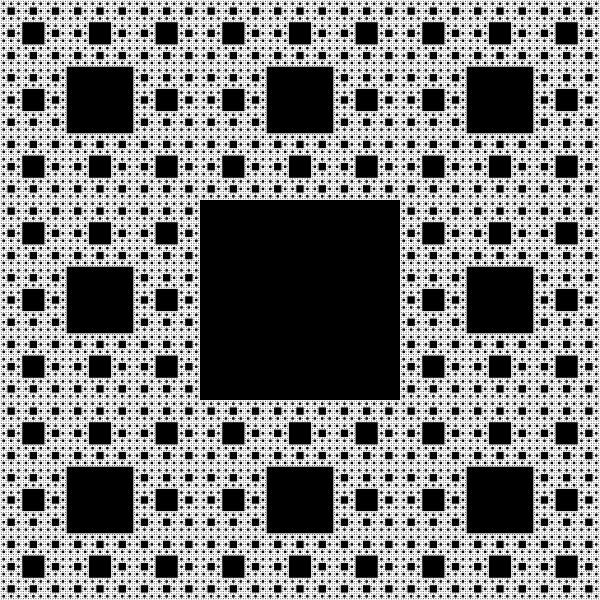

# Om oppgaven {.activity}

En fraktal er en geometri med et mønster som gjentar seg selv inne i seg selv.
Høres ikke det rart ut? I denne oppgaven skal vi lage våre egne.

Her er Sierpinski-teppet, som er en fraktal:

## Oppgaven passer til: {.check}

 __Fag__: Programmering, IT1, Kunst og håndtverk, Matematikk

__Anbefalte trinn__: 8.trinn - VG3

__Tema__: Sierpinski, Fraktaler, Mønster

__Tidsbruk__: En dobbeltime

## Kompetansemål {.challenge}

- [ ] __Programmering, 10.trinn__: utvikle og feilsøke dataprogram som løser
      definerte problemer, inkludert kontrollering eller simulering av fysiske
      objekter

- [ ] __Programmering, 10.trinn__: bruke grunnleggende prinsipper i
      programmering, slik som variabler, løkker, vilkår og funksjoner, og
      reflektere over bruken av disse

- [ ] __IT1, VG2__: lage og bruke egne og andres funksjoner med og uten
      parametre og returverdier

- [ ] __IT1, VG2__: lese, strukturere, analysere og kommentere programkode

- [ ] __Kunst og håndtverk, 7.trinn__: bruke programmering til å skape
      interaktivitet og visuelle uttrykk

- [ ] __Kunst og håndtverk, 10.trinn__: visualisere form ved hjelp av
      frihåndstegninger, arbeidstegninger, modeller og digitale verktøy

- [ ] __Matematikk, 9.trinn__: beskrive, forklare og presentere strukturer og
      utviklinger i geometriske mønster og i tallmønster

- [ ] __Matematikk R2, VG3__: utforske rekursive sammenhenger ved å bruke
      programmering og presentere egne framgangsmåter

- [ ] __Matematikk S2, VG3__: utforske rekursive sammenhenger ved å bruke
      programmering og presentere egne framgangsmåter

## Forslag til læringsmål {.challenge}

- [ ] Elevene kan lese, forstå og endre programkode som er skrevet av andre.

- [ ] Elevene kan bruke funksjoner for å effektivisere koden sin.

- [ ] Elevene kan gjennom programkoden sin implementere rekursjon.

- [ ] Elevene kan forklare hovedprinsippene bak Sierpinski-teppet.

- [ ] Elevene kan kommentere hva de ulike delene av programkoden gjør.

## Forslag til vurderingskriterier {.challenge}

- [ ] Eleven viser middels måloppnåelse ved å fullføre oppgaven.

- [ ] Eleven viser høy måloppnåelse ved å videreutvikle egen kode basert på
      oppgaven.

## Forutsetninger og utstyr {.challenge}

- [ ] __Forutsetninger__: Elevene burde ha grunnleggende kunnskap i HTML.

- [ ] __Utstyr__: Datamaskin med tilgang på internett, og en teksteditor
      ([Atom](http://atom.io), [Brackets](http://brackets.io/) eller
      [Notepad++](https://notepad-plus-plus.org/).)

## Fremgangsmåte

Her kommer tips, erfaring og utfordringer til de ulike stegene i den faktiske
oppgaven.
[Klikk her for å se oppgaveteksten.](../10_fraktaler/10_fraktaler.html){target=_blank}

_Vi har dessverre ikke noen tips, erfaringer eller utfordringer tilknyttet denne
oppgaven enda._

## Variasjoner {.challenge}

- [ ]  _Vi har dessverre ikke noen variasjoner tilknyttet denne oppgaven enda._

## Eksterne ressurser {.challenge}

- [ ] Foreløpig ingen eksterne ressurser ...
