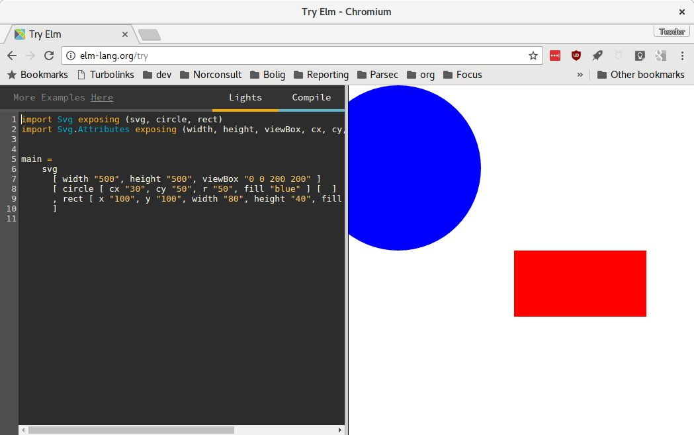
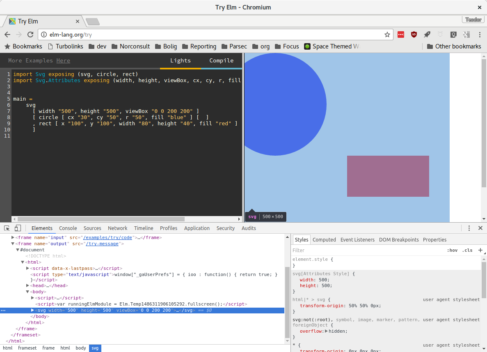
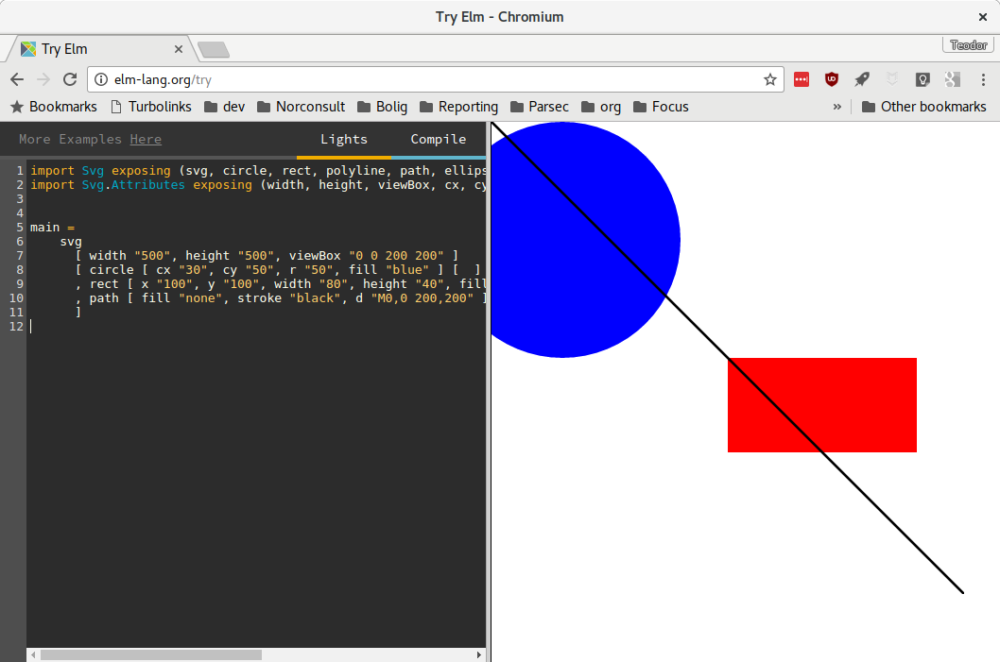
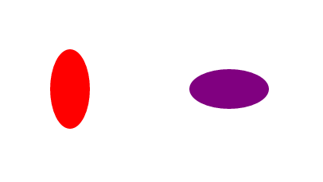

# Introduksjon {.intro}

I denne oppagaven skal vi lære hvordan vi kan tegne med Elm.

Her er noen vanlige elementer i webprogrammering:

- **HTML**: Struktur.
    - "Dette er en overskrift"
    - "Dette er et avsnitt"
    - "Dette er en liste"m
- **CSS**: Utseende.
    - "Slik skal en overskrift se ut"
    - "Slik skal et avsnitt se ut"
    - "Slik skal en liste se ut"
- **Elm** eller **Javascript**: Logikk
    - "Dette skjer når jeg trykker på denne knappen"
    - "Når jeg skriver i dette feltet, ser jeg at det andre forandrer seg"

Vi skal nå bruke SVG for å tegne:

- **SVG**: Tegning
    - "Dette er en sirkel"
    - "Sirkelen har sentrum i punktet (3,4)"
    - "Sirkelen har bredde (diameter) 100"

Jeg kommer til å vise eksempler med **Try Elm**. Hvis du vil kjøre nettsiden lokalt,
er det helt greit.

# Steg 1: sirkel og rektangel {.activity}

Vi prøver først litt med [Try Elm](http://elm-lang.org/try).

- Lim inn dette i kodefeltet:

```elm
import Svg exposing (svg, circle, rect)
import Svg.Attributes exposing (width, height, viewBox, cx, cy, r, fill, x, y, width, height)


main =
    svg
      [ width "500", height "500", viewBox "0 0 200 200" ]
      [ circle [ cx "30", cy "50", r "50", fill "blue" ] [  ]
      , rect [ x "100", y "100", width "80", height "40", fill "red" ] [ ]
      ]
```

Da skal du se noe slikt:



La oss plukke koden fra hverandre.

## Jeg kjører lokalt, og får feil! {.check}

Hvis du prøver å kjøre lokalt, får du denne beskjeden fra Elm:

```text
Starting downloads...

  ● elm-lang/html 2.0.0
  ● elm-lang/virtual-dom 2.0.4
  ● elm-lang/core 5.1.1

Packages configured successfully!
I cannot find module 'Svg'.

Module 'Main' is trying to import it.

Potential problems could be:
  * Misspelled the module name
  * Need to add a source directory or new dependency to elm-package.json
```

Da må vi installere pakken `svg`.

- Åpne et kommandovindu i **samme mappe som du har lagret Elm-programmet ditt**

  Hvis jeg har en mappe på skrivebordet mitt som heter Elm, skal jeg se
  følgende: `C:\Users\teodor\Desktop\Elm> `

- Kjør `elm package install elm-lang/svg`

- Start `elm reactor` på nytt.

Fungerer det nå?

## Importere moduler {.check}

Tidligere har vi brukt pakken **Html** og importert funksjoner som `p` for
avsnitt og `h1` for overskrifter.

```elm
import Svg exposing (svg, circle, rect)
import Svg.Attributes exposing (width, height, viewBox, cx, cy, r, fill, x, y, width, height)
```

Nå bruker vi pakken **Svg** og importerer funksjoner som `circle` for sirkel og
`rect` for rektangler.

- Trykk på `circle`. Ser du teksten `Docs: Svg.circle` som dukket opp over?
  `Svg.circle` er en link til dokumentasjonen! Trykk på denne.
- Stemmer eksempelet for `circle` med koden vår? Hva er forskjellig?

Rect er det ikke (per 2017) noe eksempel for.

- Gå
  til
  [Mozilla sin dokumentasjon for SVG-elementet `rect`](https://developer.mozilla.org/en-US/docs/Web/SVG/Element/rect).
  Hva står det under **Specific attributes**? Bruker vi noen av disse?

- Finner du `path` i dokumentasjonen til Elm?

## SVG-boksen {.check}

Det første vi gjør er å lage oss en passe stor boks vi kan tegne i.

```elm
main =
    svg
      [ width "500", height "500", viewBox "0 0 200 200" ]
      -- Resten tar vi etterpå
```

`width "500"` sier at vi skal bruke 500 pixler i bredden.

`height "500"` sier at vi skal bruke 500 pixler i høyden.

- Sjekk at du får en 500x500 px boks i nettleseren din. Slik ser det ut når jeg
  sjekker:
  
  

`viewBox "0 0 200 200"` definerer koordinatsystemet vårt: x er fra 0 til 200 og
y er fra 0 til 200.

- Inspiser sirkelen. Hvor mange pixler tar sirkelen?
- Inspiser rektangelet. Hvor stort er dette?

Jeg har satt et koordinatsystem med "bredde" 200 til å passe til 500 pixler på
skjermen. En 20x20 firkant blir 50px x 50 px stor på skjermen.

Vi bruker gjerne koordinatsystem fra 0 til 100, fordi det er lett å forholde seg
til.

## Elementer i SVG {.check}

Nå har vi sagt at vi vil bruke koordinater mellom 0 og 200 til å tegne på
nettsiden vår. Nå kan vi bruke disse til å tegne:

```elm
      [ circle [ cx "30", cy "50", r "50", fill "blue" ] [  ]
      , rect [ x "100", y "100", width "80", height "40", fill "red" ] [ ] 
```

Vi tar `circle` først:

| Atributt      | Verdi         | Forklaring                      |
| ------------- | ------------- | -----                           |
| `cx`          | "30"          | Sentrum ligger i x=30           |
| `cy`          | "50"          | Sentrum ligger i y=50           |
| `r`           | "50"          | Sirkelens radius er 50          |
| `fill`        | "blue"        | Sirkelen er fylt med fargen blå |

Obs! `(0,0)` er øverst til venstre, og `(200,200)` er nederst til høyre. Tenk at
vi starter å lese i `(0,0)`:

```
(0,0) ---- (100, 0) ---- (200, 0) ---→ x
  |                                
(0, 100)   (100, 100)    (200, 100)
  |                                
(0, 200)   (100, 200)    (200, 200)
  |
  ↓
  y
```

Din tur!

- Gjør sirkelen grønn
- Sett sentrum for sirkelen til "helt i midten". Hvis koordinatsystemet er fra 0
  til 200, hva er i midten?
- Hva skjer om du tegner sirkelen utenfor koordinatsystemet?

Så er det `rect` sin tur:

| Atributt      | Verdi         | Forklaring                         |
| ------------- | ------------- | -----                              |
| `x`           | "100"         | Begynn å tegne rektangelet i x=100 |
| `y`           | "100"         | ... og y=100.                      |
| `width`       | "80"          | Bredden er 80                      |
| `height`      | "40"          | Høyden er 40                       |
| `fill`        | "red"         | Og fyllfargen er rød.              |

Din tur!

- Lag en firkant som fyller hele koordinatsystemet!
- Gjør den svart.

Nå ser du ikke sirkelen i det hele tatt.

- Bytt rekkefølgen på sirkelen og rektangelet:

  ```elm
  -- fra noe sånt:
      [ circle -- ...
      , rect -- ...
      ]
  
  -- til noe sånt:
      [ rect -- ...
      , circle -- ...
      ]
  ```
  
- Ser du noe nå? Hva kommer øverst?

# Steg 2: kurver {.activity}

En kurve ("path" på engelsk), er en rett eller myk strek mellom flere punkter. Vi
kan tegne både rette kurver og myke kurver.

En linje går mellom *to* punkter. Vi skal ha noe som går mellom *mange* punkter!

## Importere funksjoner for å tegne kurve {.check}

- Importer `path` fra **Svg**, og `stroke` og `d` fra **Svg.Attributes**. Husker
  du hvordan du importerer moduler?

## Hvordan å importere funksjoner fra moduler {.protip}

I Elm bygger vi opp funksjoner. Vi kan importere en modul, og bruke funksjoner
fra modulen:

```elm
import Html

main = Html.text "Hello!"
```

Vi kan også importere funksjoner direkte fra en modul:

```elm
import Html exposing (text)

main = text "Hello!"
```

For å importere mange funksjoner fra samme modul, legger vi komma mellom
funksjonene:

```elm
import Html exposing (text, h1, p, ul, li)
-- ...
```

## Tegne skråstrek {.check}
  
- Legg til en skrå strek gjennom bildet:
  
  ```elm
  [circle [ -- ...
  , rect [ -- ...
  , path [ fill "none", stroke "black", d "M0,0 200,200" ] []
  ```

Min ser nå slik ut:




# Steg 3: tegne smiley {.activity}

Nå skal vi lage et smilefjes!

Det er lurt å begynne på nytt i dette steget. Da kan du åpne en ny fane med
**Try Elm** eller lage en ny elm-fil.

Pass på at du får med deg funksjonene du trenger når du gjør oppgavene under!

Vi starter med å lage oss et koordinatsystem der x og y er mellom 0 og 100.

## Sirkler {.check}

```elm
main =
    svg
      [ width "500", height "500", viewBox "0 0 100 100" ]
      [ -- Ingen elementer ennå!
      ]
```

Så fyller vi dette med en stor, gul sirkel.

```elm
main =
    svg
      [ width "500", height "500", viewBox "0 0 100 100" ]
      [ circle [ cx "5", cy "5", r "5", fill "yellow" ] [ ]
      ]
```

Ånei! Den var ikke stor!

- Endre sentrum (`cx` og `cy`) så sirkelen er i midten.
- Endre radius (`r`) på sirkelen så sirkelen blir stor! Hvor stor kan du gjøre
  den uten at den kuttes av i kantene?

## Bezierkurver {.protip}

Bezierkurve! Det var et rart navn.

Vi bruker ofte bezierkurver når vi vil ha en *myk* kurve. Det finnes
forskjellige typer bezierkurver:

| Navn på norsk    | Navn på engelsk     | Nøkkel | Forklaring                               |
|------------------|---------------------|--------|------------------------------------------|
| Lineær kurve     | **L**inear curve    | L      | Rett strek mellom to punkter ("linje")   |
| Kvadratisk kurve | **Q**uadratic curve | Q      | Myk strek mellom tre punkter ("kvadrat") |
| Kubisk kurve     | **C**ubic curve     | C      | Myk strek mellom fire punkter ("kube")   |

## En munn som bezierkurve {.check}

- Gå til https://www.jasondavies.com/animated-bezier/
- Du kan dra i punktene. Klarer du å lage en munn?

Her er en `path` med bezierkurve i Elm:

```elm
path [ fill "none", stroke "black", d "M20,60 C 40,50 60,50 80,60 " ] []
```

I strengen `"M20,60 C 40,50 60,50 80,60 "` dukker det opp to mystiske variabler.
`C` står for "Cubic", og `M` står for "Move to"; begynn her.

Ånei! Det ble et surt fjes!

- Kan du gjøre munnen bli igjen?
- Hva skjer om du bytter ut `C` med `L` eller `Q`?

## Ellipser {.protip}

Her er to ellipser:



En sirkel har lik høyde og bredde. En ellipse kan være flat eller tynn; den kan
ha forskjellig radius i x- og y-retning.

Her er Elm-koden som lager den røde ellipsen:

```elm
ellipse [ cx "30", cy "40", rx "5", ry "10", fill "red" ] [ ]
```

Og denne lager den lilla ellipsen:

```elm
ellipse [ cx "70", cy "40", rx "10", ry "5", fill "purple" ] [ ]
```

Du finner `ellipse` i **Svg**, og `cx` og `cy` i **Svg.Attributes**.

## Øyne som ellipser {.check}

- Lag en ellipse for venstre øye
- Lag en ellipse for høydre øye. Hva er forskjellen mellom høyre og venstre øye?

Her er sånn min ble seende ut:


- Hva skjer om du fyller en bezierkurve med en farge?

  `path [ fill "red", stroke "black", d "M20,60 C 40,80 60,80 80,60 " ] []`

- Hva skjer om du legger på `stroke` på den gule sirkelen?

  `circle [ cx "50", cy "50", r "50", stroke "black", fill "yellow" ] [ ]`

# Svg inne i et Html-dokument {.activity}

Det går an å skrive Svg inne i et Html-dokument. Her er et eksempel:

```elm
import Svg exposing (svg, circle, rect)
import Svg.Attributes exposing (width, height, viewBox, cx, cy, r, fill, x, y, width, height)
import Html exposing (text, div, h1, p)


main =
  div []
    [ h1 [] [text "Mine figurer!"]
    , svg
        [ width "500", height "500", viewBox "0 0 200 200" ]
        [ circle [ cx "30", cy "50", r "50", fill "blue" ] [  ]
        , rect [ x "100", y "100", width "80", height "40", fill "red" ] [ ]
        ]
     , p [] [text "Her har jeg tegnet en firkant og en sirkel!"]
     ]

```

## Tegne på din egen nettside {.check}

- Gå tilbake til en av de tidligere oppgavene du har gjort. Vil du legge til en
  tegning noe sted?
