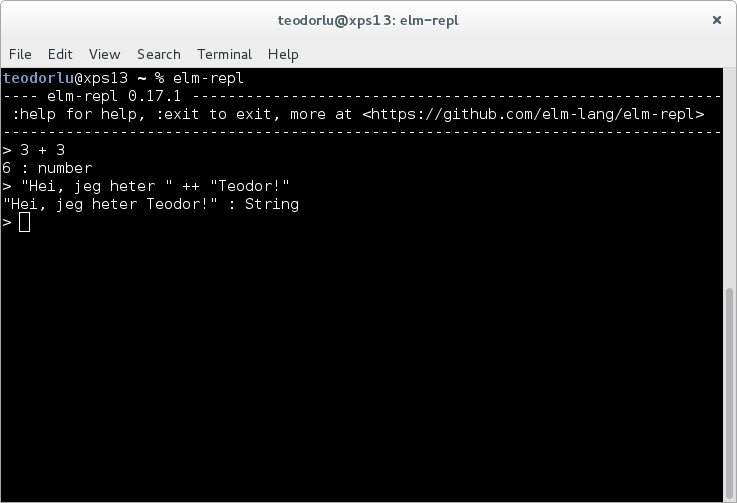

# Introduksjon {.intro}

Denne oppgaven viser hvordan vi lager HTML i Elm, og starter fra grunnen av. Vi går gjennom å laste ned Elm, å kjøre Elm kode og behandling av filer. Så viser vi hvordan vi kan vise HTML med Elm.

# Hvordan å vise ting i nettleseren: HTML {.protip}

Webapplikasjoner viser ting i HTML. HTML kan vi skrive for hånd, eller _generere_ fra en applikasjon. Det er uansett viktig at vi vet hva HTML er.

Før du begir deg ut på denne oppgaven bør du vite hva HTML er, og hvordan du kan utforske HTML på en eksisterende nettside. Gjør oppgaven **Hvor er HTML? Jeg ser den ikke!** før du går videre.

# Hei, verden! {.activity}

Vi kan programmere enkle programmer direkte i nettleseren. Gå til [elm-lang.org/try](http://www.elm-lang.org/try). Skriv kode til venstre, og trykk `Compile` for å se hva koden gjør.

Vi skal først vise tekst. Skriv inn følgende i kodeboksen til venstre og trykk `Compile`:

```elm
import Html

main = Html.text "Hei, verden!"
```

Ser du "Hei, verden!" til høyre? Gratulerer! Du har skrevet ditt første Elm-program!

## Dette er hva som skjer: {.protip}

Først leter Elm etter en funksjon som heter `main` for å lage nettsiden.

Modulen `Html` inneholder funksjoner for å lage HTML i nettleseren.

Funksjonen `text` fra `Html` gir ut vanlig tekst. Vi bruker denne som `Html.text`.

## Nå er det din tur! {.check}

- Se i dokumenttreet. Finner du HTML-koden som hvor det står `Hei, verden!` eller noe annet du har skrevet?
- Prøv de andre eksemplene på [elm-lang.org/try](http://www.elm-lang.org/try). Finner du noen du liker? Inspirasjon til noe du vil lage selv?

# Kjøre Elm på egen PC {.activity}

* Gå til [elm-lang.org/install](http://www.elm-lang.org/install)
* Last ned installasjonsfil til egen PC og kjør denne

Elm inkluderer fire programmer:

`elm repl` lar deg skrive korte Elm-uttrykk og evaluere. Denne er fin til å teste ut hva funksjoner gjør.

`elm reactor` lar deg se webapplikasjonen du lager mens du lager denne.

`elm make` lar deg bygge store webapplikasjoner.

`elm package` lar deg installere Elm-kode andre har skrevet.

Vi fokuserer på `elm repl` og `elm reactor`. Du kjører disse programmene fra et kommandovindu: `cmd` i Windows eller en terminal i Linux eller Windows ved å skrive `elm repl` eller `elm reactor` i kommandovinduet:



Trykk `Ctrl-C` en eller to ganger for å avslutte `elm repl` eller `elm reactor`.

# Operatorer i Elm {.activity}

Start `elm repl`. Vi kan bruke plus, gange, dele og minus:

```elm
teodorlu@xps13 ~ % elm repl
---- elm-repl 0.17.1 -----------------------------------------------------------
 :help for help, :exit to exit, more at <https://github.com/elm-lang/elm-repl>
--------------------------------------------------------------------------------
> 1 + 1
2 : number
> 2 * 3
6 : number
> 10 / 2
5 : Float
> 10 / 3
3.3333333333333335 : Float
>  10 - 2
8 : number
```

## Prøv selv! {.check}

- Regn ut `101 * 9`
- Regn ut `9001 - 9002`
- Jens, Ola og Per har vært utkledningstur til Halloween, og har fått 12 sjokoladebiter. Hvor mange sjokoladebiter får de hver? Regn ut med Elm!

Vi kan binde verdier:

```elm
> x = 42
42 : number
> y = 1337
1337 : number
> x * y
56154 : number
> y - x
1295 : number
> x > y
False : Bool
```

Vi kan også slå sammen tekst:
```elm
> "Hei, verden!" ++ " Hvem er du?"
"Hei, verden! Hvem er du?" : String
> beskjed = "Hei på deg, din sopp!"
"Hei på deg, din sopp!" : String
```

Vi slår sammen lister på samme måte som tekst:
```elm
> [1,2,3]
[1,2,3] : List number
> [1,2,3] ++ [4,5,6]
[1,2,3,4,5,6] : List number
> 0 :: [1,2,3]
[0,1,2,3] : List number
> 0 :: 1 :: 2 :: 3 :: []
[0,1,2,3] : List number
```

## Prøv selv! {.check}

- Bind `intro` til "Hei, jeg heter "
- Bind `navn` til navnet ditt
- Lag en beskjed der du slår sammen `intro` og `navn` med operatoren `++`!

# Funksjoner i Elm

Start `elm repl` igjen om du har lukket den.

Funksjoner i Elm skriver vi slik:
```elm
> plus1 x = x + 1
<function> : number -> number
> plus2 tall = tall + 2
<function> : number -> number
```

Og vi kaller funksjonene slik:
```elm
> plus1 10
11 : number
> plus1 2
3 : number
> plus2 100
102 : number
```

Funksjonen `plus1` har typen `number -> number` fordi vi bruker pluss (`+`) i funksjonen. Vi kan ikke kalle `plus1` med tekst:
```
> plus1 "Teodor"
-- TYPE MISMATCH --------------------------------------------- repl-temp-000.elm

The argument to function `plus1` is causing a mismatch.

3|   plus1 "Teodor"
           ^^^^^^^^
Function `plus1` is expecting the argument to be:

    number

But it is:

    String
```

## Prøv selv! {.check}

- Lag funksjonen `minus3`:

  ```elm
  > minus3 10
  7 : number
  ```

- Lag funksjonen `over9000`:

  ```elm
  > over9000 3
  False : Bool
  > over9000 8999
  False : Bool
  > over9000 9000
  False : Bool
  > over9000 9001
  True : Bool
  > over9000 42424242
  True : Bool
  ```

# Skriv egen Elm-funksjon og test {.activity}

TODO TODO TODO TODO TODO TODO
- En modul er en ...
- Én fil inneholder én modul
- Slik lager vi en ny fil i Atom
- Slik importerer vi en fil i `elm repl`
- Slik importerer vi en fil inn i en annen fil

# Elm-program på egen PC {.activity}

- Lag filen `oppgave1a.elm`, og fyll inn:

```elm
import Html

main = Html.text "Hei, verden!"
```

- Start `elm reactor` i kommandovindu.

Du skal nå se følgende:
```
elm-reactor 0.17.1
Listening on http://localhost:8000/
```
Det betyr at Elm venter på at du skal åpne `http://localhost:8000/` i en nettleser. Finn så filen `oppgave1a.elm`.

- Ser du det samme som da du prøvde direkte i nettleseren?
- La oss gjøre en endring.
  - Endre `"Hei, verden!"` til `"Hei, alle sammen!"`
  - Lagre filen
  - Last nettleseren på nytt.
- Skjedde det noe?

# Når noe går galt {.activity}

Elm prøver så godt den kan å hjelpe oss å skrive korrekte programmer. Når vi har gjort noe rart, sier den ifra. Endre `oppgave1a.elm` til følgende:

```elm
import Html

main = Html.taxt "Hei, verden!"
```

Elm svarer følgende:

```
Cannot find variable `Html.taxt`.

3| main = Html.taxt "Hei, verden!"
          ^^^^^^^^^
`Html` does not expose `taxt`. Maybe you want one of the following?

    Html.text
```

Dette betyr:

- Jeg vet ikke hva `Html.taxt` betyr
- Du prøvde å bruke `Html.taxt` på linje 3
- Kanskje du mente å skrive `Html.text`?

# Overskift og avsnitt {.activity}

Nå skal vi gjøre forskjell på en overskrift og et avsnitt. Lagre følgende i `oppgave1b.elm`:

```elm
import Html

main = Html.div []
        [ Html.h1 [] [Html.text "Teodors nettside"]
        , Html.p [] [Html.text "Teodor er 25 år."]
        ]
```

`Html.div`, `Html.h1` og `Html.p` er alle funksjoner som lager HTML. La oss finne ut hva de vil ha.

La spørre `elm repl`.

```
> import Html
> Html.h1
<function> : List (Html.Attribute a) -> List (Html.Html a) -> Html.Html a
```

`Html.h1` er en funksjon som lager overskrifter. Den tar inn attrbutter og annen Html. Attributter er for eksempel farge. Disse bruker vi ikke ennå. Annen Html kan være ren tekst. I vårt tilfelle har vi her brukt `Html.text "Teodors nettside"`, som lager Html av teksten "Teodors nettside".

```
> Html.p
<function> : List (Html.Attribute a) -> List (Html.Html a) -> Html.Html a
```

`Html.p` er en funksjon som lager avsnitt. Legger du merke til at den kan ta inn flere HTML-elementer? Dette lar oss legge til ting som tekst med annen stil i samme avsnitt.

* Legg til en ny overskrift og et nytt avsnitt som sier noe om deg.
